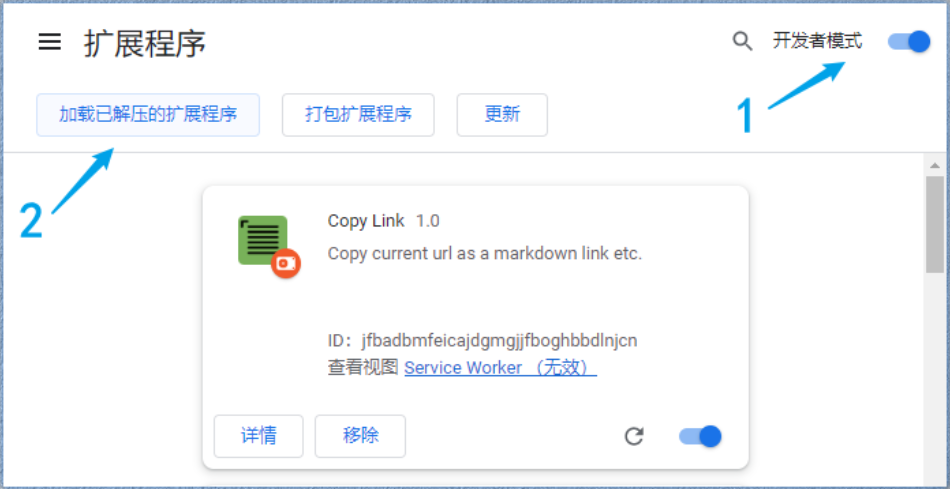
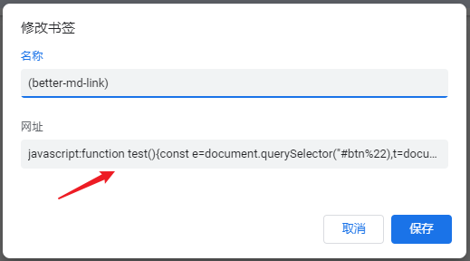
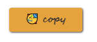
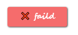

感谢小伙伴 Whatacold 的创意 [A Bookmarklet for Copying a Link as an Org-mode Link - whatacold's space - whatacold.io](https://whatacold.io/blog/2022-08-08-org-link-bookmarklet/) ，可以方便地复制当前页面的地址并格式化 `.md` 链接格式，当然，也可以格式化成 `.org` 链接格式。

<!--more-->

## * 配置链接类型

在源码中的 `copy.js` 中，2 ~ 10 行，你可以看到如下代码片段。

```js
let md = `[${(document.title || document.location.hostname)}](${document.location.href})`
let org = `[[${document.location.href}][${(document.title || document.location.hostname)}]]`

// -----------------------------------------------------------
// 🛠️ 链接类型设置
// org - org mode link, eg. [[https://ovirgo.com/ship/][Ship]]
// md  - markdown link, eg. [Ship](https://ovirgo.com/ship/)
let type = md
// -----------------------------------------------------------
```

这里，我们提供了 `.md` 和 `.org` 两种文件的链接格式，并通过 `type` 来设置它。此处，默认 `type` 为 `md` ，如果，你经常编辑的是 `.org` 文件，只需要把 `type` 设为 `org` 即可。

为什么我们这里不提供一个直接在插件设置中的配置选项？

首先，通常情况下，频繁地切换编辑 `.org` 和 `.md` 文件的场景很少，它们有各自的粘性用户；其次，尽可能的减少操作步骤，不想赋予插件图标过多的功能交互；最后，因为是本地导入，你完全可以拷贝一份文件夹，分别配置，导入成两个插件。

## 快速使用

### 浏览器插件方式

[loveminimal/copy-link: A browser extension to copy current url as a markdown link etc.](https://github.com/loveminimal/copy-link)

  

下载 [Copy Link 📥](https://github.com/loveminimal/copy-link/archive/refs/heads/master.zip) 到本地，解压缩后，打开浏览器的‘扩展程序’，打开开发者模式，加载已解压的扩展程序，选择你解压后的文件夹，即可添加插件到浏览器。

点击图标，或使用 `Ctrl + B` 即可使用该功能。

### 标签方式

在浏览器的‘书签管理器’中添加新书签，内容如下图所示：

  

以下为压缩并添加前缀之后的代码，复制粘贴至上图剪头处即可。

```
javascript:function copy(){const e=document.querySelector("#btn"),t=document.querySelector("#ipt"),o=document.querySelector("#cont");t.select(),document.execCommand("copy")?(document.execCommand("copy"),console.log("copy success"),e.innerText="🎉 success",e.style.background="#67c23a",e.style.color="#fff"):(console.log("copy failed"),e.innerText="❌ faild",e.style.background="#f56c6c",e.style.color="#fff"),setTimeout(()=>{document.body.removeChild(o)},1500)}!function(){let e="["+(document.title||document.location.hostname)+"]("+document.location.href+")",t=document.createElement("div");t.id="btn",t.innerText="🥳 copy",t.style="background: #e6a23c; box-shadow: 1px 1px 3px #333; width: 120px; height: 40px; text-align: center; line-height: 40px; border-radius: 4px; color: #333; cursor: pointer; font-weight: 700; font-family: segoe script, courier new;font-size: 16px;",t.addEventListener("click",copy);let o=document.createElement("input");o.value=e,o.id="ipt",o.style="opacity: 0;",o.select();let c=document.createElement("div");c.id="cont",c.style="position: fixed; right: 32px; top: 16px; width: 100px;z-index: 10000;",c.appendChild(t),c.appendChild(o),document.body.appendChild(c)}();
```

完成后，点击标签后，会在当前网页左上角弹出复制按钮；



  

点击复制后，按钮会更新状态及样式，并在 1.5s 自动消失。

当然，也可能失败，但希望你永远都不会看到它。

## 源码解析

请访问 [copy-link/copy.js at master · loveminimal/copy-link/copy.js](https://github.com/loveminimal/copy-link/blob/master/copy.js) 。

**📌 结语**

Just for fun 🎉
