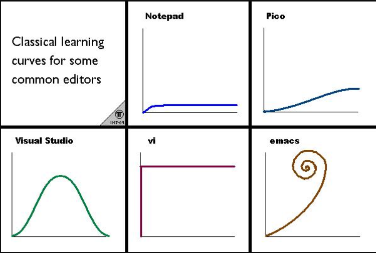

> 哎，这让人费解的强迫症……

博客没写几篇，博客系统倒是折腾了不少，哎，有点本末倒置了，希望这次是最后一次啦（不可能的），单开一篇碎碎念一下前前后后的那些事儿。

<!--more-->

## “史前”

最初使用的“日志”系统就是 QQ 空间了 😅（我是没有用过人人网的），那个时候一个与众不同的空间装扮是不少人心心念的。陆陆续续用了好多年，就是个情绪收集器，“为赋新词”强说的愁。随着 QQ 的废弃，一时冲动就清空了所有内容，不时想起，难免有些遗憾，我的青春啊（冲动是魔鬼~~）。

后来新浪博客可谓是红红火火，也不知道现在还有几个人用，反正我是连账号都不记得了。

## 第三方博客平台

CSDN 用的很少，界面太 Low 了，广告一大堆，不过这个平台的 SEO 做的真的不错，随便搜点什么，它的词条都排在很前面。感觉不少人直接把它当成备忘录用了，君不见，多少博客内容就只一个链接。

博客园相对前者来说就清爽了很多，而且在一定程度上支持 DIY ，可以添加不同的 CSS 模式，申请之后还可以加入 JS 脚本。里面的内容也不错，至少不会是一两句话就自成一篇。

简书最初的时候是个小可爱，简约美观，编辑内容的时候提供了两种模式，富文本和 Markdown 模式，色调也柔和。只不过它的 Markdown 解析引擎有点差劲，表现力不那么好。

……

第三方博客平台对博客内容的审核有时让人很困扰，AI 不够智能。像是 WordPress 之类的，生态是丰富，但也是折腾，而且编辑内容的体验让人不敢恭维。

## 静态博客

Markdown 是一种轻量级的标记语言，语法简单，书写清爽，表现力也还可以，用的范围挺广。许多静态博客生成器都只支持 Markdown 的内容解析，如 Jekyll 和 Hexo。Hugo 也支持 Markdown，但它同时还支持 Org Mode 。

Org Mode 是 Emacs 编辑器中的一个插件，它拥有更加强大的表现力和直观性，配合 Emacs 简直是纯文本编辑的无双利器。但是，成就它的同样也会束缚它，只有在 Emacs 中才能发挥出它最大的威力。我知道有不少人都是为了 Org Mode 才开始接触并学习了 Emacs 。

不得不说，Emacs 的曲线还挺卷。

Jekyll 在国内的网络环境下不是很友好，Gem 不加镜像是真的慢（Pass），虽然也没少折腾，但最初的时候真的是让人心累。Hexo 就很好了，它基于 NodeJS ，生态丰富完善，除了速度不如 Hugo （但我们真的需要那么快的编译速度吗？），其他方面都让人很满意。使用了 Hexo 挺长一段时间，甚至还写了一个主题 [hexo-theme-zero](https://github.com/loveminimal/hexo-theme-zero)。鉴于对 Emacs 的一往情深，当时的博客内容都是用 Org Mode 写的，配合自制的一个 Emacs 插件，把写好的 Org Mode 转成 Markdown 输出到 Hexo 进行解析生成。很繁琐是吧，听着就繁琐。

后来，在阅读 Org Mode 文档的时候，发现了 `ox-publish` 这个功能，突然间感觉新世界的大门打开了。当时的念头是，如果可以借助这个功能直接从 Org Mode 生成页面，不就不需要繁琐的格式转换了嘛，当然后来我了解到已经有不少人已经对这个功能的增强和封装。在实现自定义封装的过程中，我参考和借鉴了不少别人的封装，具体实现 [init-site.el](https://github.com/loveminimal/emacs.d/blob/master/lisp/init-site.el)，在这里主要实现了几个常用的功能，如文件保存的时候自动编译当前文件，配合一个 `simple-httpd` 实现当前文件实时预览，其他如删除当前文件对应的 html 文件，同时删除当前文件及其对应的 html 文件等等。配合第三方的 `live-server` ，封装并写一了一个简单的 `bat` 命令脚本，双击快速启动服务器，并开启浏览器本地开发。好吧，当时还做了一个视频 [闲聊一种使用 org mode 生成静态博客的方式](https://www.bilibili.com/video/BV1C7411F7EX/)，尬 🤪 。

如此，使用了有一段时间，也算是满足了个人对于博客的几点要求，如图片尺寸自定义大小等。它同样也有让人不爽的地方，就是慢，比 Hexo 还慢，可怜的 Elisp 。人性总是不安分的，有时候只是需要一个理由。在 Hugo 经过了一段时间迭代之后 ，我又再次迁移到了它，先通览了一遍官方文档，看得我“飘飘然”。在经过了一周多的折腾之后，总算是有了个阶段性的稳定（主要自己给自己整得很疲惫，呵，处女座），[hugo-theme-virgo](https://github.com/loveminimal/hugo-theme-virgo) 终于完工了，当然还制作了一个很随意的视频 [virgo](https://www.bilibili.com/video/BV15f4y1Z73a?share_source=copy_web)。

这次应该能持续比较长的时间，大部分刚需功能在 Hugo Template 的帮助下都得以很快实现，最初的念头是好的，想着写一个朴素的主题就好。但你知道，这东西一旦开始，就停不来了，你会不断地想要重构它，增加一些功能。总之，就是事前“很会”，事后“很累”，自己折腾自己。目前终归是告一段落了，本地搜索，文章归档，同时具备朴素和炫酷、亮暗切换两种模式。Hugo 原生支持 Org Mode，这非常好，我对它做了一些小小的增强，很爽。迫使我做出迁移的原因在于 Windows 下的 Emacs 问题多多，对中文字符的渲染尤其让人不爽。当下，对 VScode 进行了适当程度的“调教”，无论是书写 Org Mode 还是书写 Markdown ，都到了差强人意的地步。

呼，都不知道这些碎碎念有什么用，碎碎念能有什么用呢？

好了，牢骚也发的差不多了，以后要减少无用的折腾，把时间和精力用在更有益的地方 😂，比如深入学习、写博客等等。
