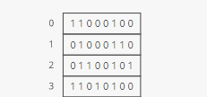
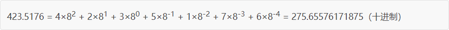
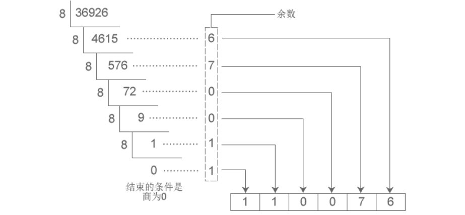
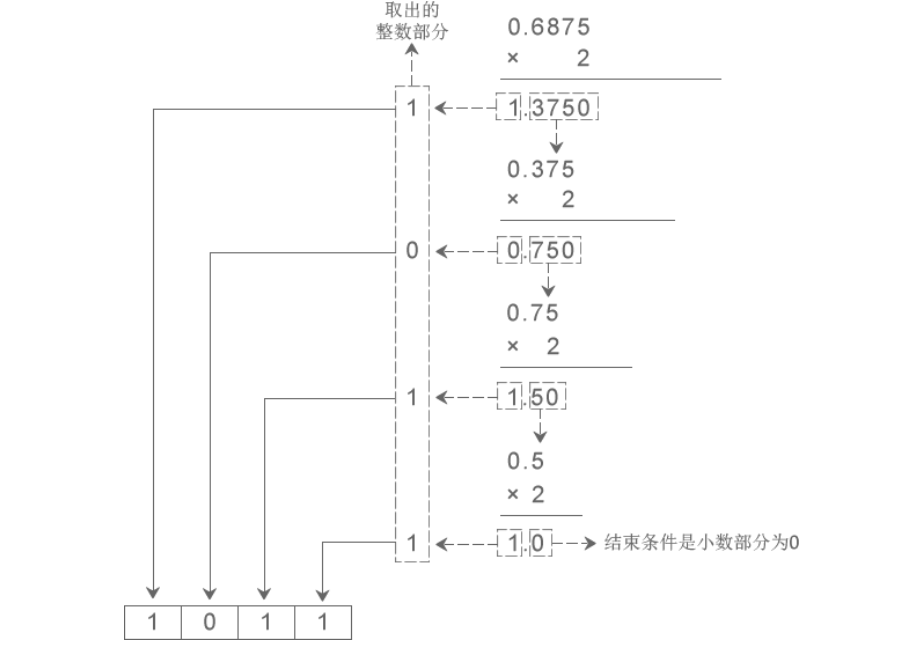
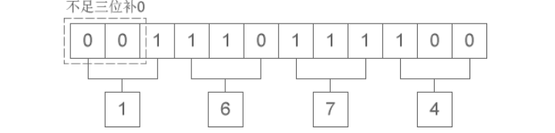
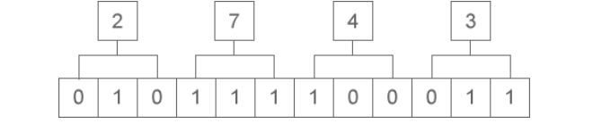
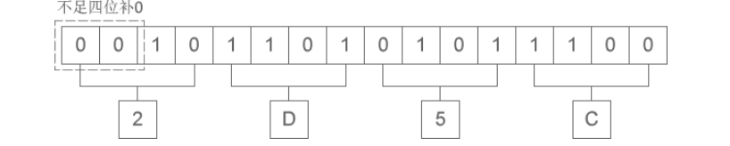
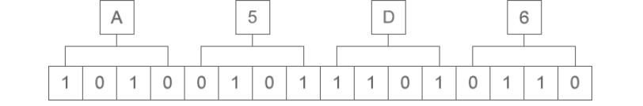

👉 推荐一个不错的网站 - [C 语言中文网](http://c.biancheng.net/) 

<!--more-->

## 关于进制

在计算机内部，数据都是以二进制的形式存储的。

  

 **进制是什么？**

 进制（system of numeration），是人为定义的带进位的计数方法。对于任何一种进制（如 X 进制），就表示每一位上的数运算时都是逢 X 进一位。比如，我们常用的十进制，基数为 10，数码由 `0-9` 组成，计数规律逢十进一。

> 人类天然选择了十进制，思考一下这是为什么？

同理，二进制的基数为 2，数码由 `0-1` 组成，计数规律逢二进一。八进制的基数为 8，数码由 `0~7` 组成，计数规律逢八进一。十六进制的基数为 16，数码由 `0~9A~F` 组成，计数规律逢十六进一。

## 进制转换

### N 进制转十进制

二进制、八进制和十六进制向十进制转换都非常简单，就是 **“按权相加”**。所谓“权”，即“位权”。

假设当前数字是 N 进制，那么：
- 对于整数部分，从右往左看，第 i 位的位权等于 Ni-1 ；
- 对于小数部分，恰好相反，要从左往右看，第 j 位的位权为 N-j

  

  

然而，将十进制转换为其它进制时比较复杂，整数部分和小数部分的算法不一样。

### 十进制转 N 进制

十进制整数转换为 N 进制整数采用 **“除 N 取余，逆序排列”** 法。如下图：

  

十进制数字  36926 转换成八进制的结果为 110076 。

十进制小数转换成 N 进制小数采用 **“乘 N 取整，顺序排列”** 法。如下图：

  

十进制小数 0.6875 转换成二进制小数的结果为 0.1011 。

### 二进制和八进制、十六进制的转换

从上文，我们知道，以十进制为中转，可以完成所有进制的转换。但由于某种必然，将二进制转换为八进制和十六进制时有更加简洁的方法。

**1. 二进制整数和八进制整数之间的转换**

二进制整数转换为八进制整数时，每三位二进制数字转换为一位八进制数字，运算的顺序从低位向高位依次进行，高位不足三位用零补齐。

  

二进制整数 1110111100 转换为八进制的结果为 1674 。

八进制整数转换为二进制整数时，思路是相反的，每一位八进制数字转换为三位二进制数字，运算的顺序也是从低位向高位依次进行。

  

八进制整数 2743 转换为二进制的结果为 10111100011。

**2. 二进制整数和十六进制整数之间的转换**

二进制整数转换为十六进制整数时，每四位二进制数字转换为一位十六进制数字，运算的顺序是从低位向高位依次进行，高位不足四位用零补齐。

  

二进制整数 10 1101 0101 1100 转换为十六进制的结果为 2D5C。

十六进制整数转换为二进制整数时，思路是相反的，每一位十六进制数字转换为四位二进制数字，运算的顺序也是从低位向高位依次进行。

  

十六进制整数 A5D6 转换为二进制的结果为 1010 0101 1101 0110。

> 实际工作中，二进制、八进制、十六进制之间几乎不会涉及小数的转换，八进制和十六进制之间也极少直接转换。

## 数据存储

计算机要处理的信息是多种多样的，如数字、文字、符号、图形、视音频等，这些信息在人们的眼里是不同的。但对于计算机来说，它们在内存中都是一样的，皆 **以二进制的形式来表示** 。

在运行时，数据和指令都要载入到内存中才可以。内存依托于内存条，后者是一个非常精密的部件，包含了上亿个电子元器件。这些元器件，实际上就是电路，依据电路电压的不同（断电 0V、通电5V）状态，表示为 `0` 和 `1` 。

看，物理世界与数字世界连接了。🧲 以此为基点，我们可以模拟整个宇宙了。

一个元器件为 1 bit ，表现力太小了，一般情况下，我们将 8 个元器件看做一个单位 （8 bit = 1 byte），这样每个单位就有 28 = 256 种表示。

> 答前所问，人类天然选择了十进制，计算机则天然选择了二进制，因为人类有十根手指，而计算机只有两种状态。（可以如此认为 😸）

计算机以二进制的形式来存储数据，它只认识 0 和 1 两个数字，我们在屏幕上看到的文字，在存储之前都被转换成了二进制，在显示时也要根据二进制找到对应的字符。

可想而知，特定的文字必然对应着固定的二进制，否则在转换时将发生混乱。那么， **怎样将文字与二进制对应起来呢？**

这就需要有一套规范，计算机公司和软件开发者都必须遵守，这样的一套规范就称为字符集（Character Set）或者字符编码（Character Encoding）。

我们将在 [字符集和字符编码](../charset-and-character-encoding/) 中认识它们。

## 参考链接

- http://c.biancheng.net/view/1724.html
- https://www.interviewcake.com/article/python/data-structures-coding-interview?course=fc1&section=algorithmic-thinking