`> 近来要开发一个手写板程序，顺便来系统回顾一下 Canvas 这个东东……`

🔔 本篇摘录自 [《学习 HTML5 Canvas 这一篇文章就够了》](https://www.runoob.com/w3cnote/html5-canvas-intro.html) ，写的真不错。

`<canvas>` 是 HTML5 新增的一个可以使用脚本（通常为 JavaScript）在其中绘制图像的 HTML 元素。

  

`> 上图就是使用 canvas 绘制出来的`

 Canvas 是由 HTML 代码配合高度和宽度属性而定义出的可绘制区域。JavaScript 代码可以访问该区域，类似于其他通用的二维 API，通过一套完整的绘图函数来动态生成图形。

<!--more-->

 ## 基本使用

**1. `<canvas>` 元素**

 ```html
<canvas id="tutorial" width="300" height="300"></canvas>
 ```

`<canvas>` 标签只有两个可选的属性 `width` 和 `height` ，如果省略，则默认 `width` 为 300 ，`height` 为 150 ，单位是 `px` 。也可以使用 CSS 属性来设置宽高，但是如宽高属性和初始比例不一致，会出现扭曲（强烈不推荐 ❌）。

**2. 渲染上下文 Context**

`<canvas>` 会创建一个固定大小的画布，会公开一个或多个渲染上下文（`画笔`），使用渲染上下文来绘制和处理要展示的内容。

​我们重点研究 2D 渲染上下文。如何获取它呢？

```js
var canvas = document.getElementById('tutorial');
if(!canvas.getContext) return;	    // 检测支持性
var ctx = canvas.getContext("2d");	// 获得 2D 上下文对象
```

## 绘制形状

**1. 栅格（grid）和坐标空间**

​如下图所示，canvas 元素默认被网格所覆盖。通常来说网格中的一个单元相当于 canvas 元素中的一像素。栅格的起点为左上角，坐标为 `(0,0)` 。所有元素的位置都相对于原点来定位。所以图中蓝色方形左上角的坐标为距离左边（X 轴）x 像素，距离上边（Y 轴）y 像素，坐标为 `(x,y)`。

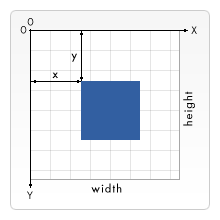  

​后面我们会涉及到坐标原点的平移、网格的旋转以及缩放等。

**2. 绘制矩形**

`<canvas>` 只支持一种原生的图形绘制：矩形。

`> 所有其他图形都至少需要生成一种路径 (path)。`

Canvas 提供了有三种方法绘制矩形：

```
// 绘制一个填充的矩形
1. fillRect(x, y, width, height)

// 绘制一个矩形的边框
2. strokeRect(x, y, width, height)

// 清除指定的矩形区域，然后这块区域会变的完全透明
3. clearRect(x, y, widh, height)
```

这 3 个方法具有相同的参数。其中， `x, y` 指矩形左上角的坐标， `width, height` 指绘制的矩形的宽高。

上 🌰 ，如下：

```js
function draw(){
    var canvas = document.getElementById('tutorial');
    if(!canvas.getContext) return;
    var ctx = canvas.getContext("2d");
    ctx.fillRect(10, 10, 100, 50);	    //绘制矩形，填充的默认颜色为黑色
    ctx.strokeRect(10, 70, 100, 50);	//绘制矩形边框
	ctx.clearRect(15, 15, 50, 25);
    
}
draw();
```

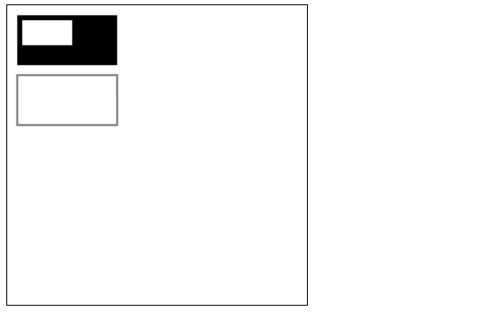  

## 绘制路径

图形的基本元素是路径。

路径是通过不同颜色和宽度的线段或曲线相连形成的不同形状的点的集合。

**一个路径，甚至一个子路径，都是闭合的。**

使用路径绘制图形需要一些额外的步骤：

- 创建路径起始点；
- 调用绘制方法去绘制出路径；
- 把路径封闭；
- 一旦路径生成，通过描边或填充路径区域来渲染图形。

下面是需要用到的方法：

```
beginPath()
- 新建一条路径，路径一旦创建成功，图形绘制命令被指向到路径上生成路径

moveTo(x, y)
- 把画笔移动到指定的坐标 (x, y)，相当于设置路径的起始点坐标

lineTo(x, y)
- 添加一个新点，然后创建从该点到画面中最后指定点的线条

closePath()
- 闭合路径之后，图形绘制命令又重新指向到上下文中

stroke()
- 通过线条来绘制图形轮廓

fill()
- 通过填充路径的内容区域生成实心的图形
```

**1. 绘制线段**

```js
function draw(){
    var canvas = document.getElementById('tutorial');
    if (!canvas.getContext) return;
    var ctx = canvas.getContext("2d");

    ctx.beginPath();		// 新建一条 path
    ctx.moveTo(50, 50);		// 把画笔移动到指定的坐标
    ctx.lineTo(200, 50);	// 绘制一条从当前位置到指定坐标 (200, 50) 的直线
    // 闭合路径
	// 会拉一条从当前点到 path 起始点的直线，
	// 如果当前点与起始点重合，则什么都不做
    ctx.closePath();
    ctx.stroke(); 			//绘制路径
}
draw();
```

**2. 绘制三角形边框**

```js
function draw(){
    var canvas = document.getElementById('tutorial');
    if (!canvas.getContext) return;
    var ctx = canvas.getContext("2d");
    ctx.beginPath();
    ctx.moveTo(50, 50);
    ctx.lineTo(200, 50);
    ctx.lineTo(200, 200);
  	ctx.closePath();	//虽然我们只绘制了两条线段，但是 closePath 会自动闭合，仍然是一个 3 角形
    ctx.stroke();		//描边，stroke 不会自动 closePath()
}
draw();
```

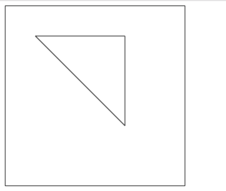  

**3. 填充三角形**

```js
function draw(){
    var canvas = document.getElementById('tutorial');
    if (!canvas.getContext) return;
    var ctx = canvas.getContext("2d");
    ctx.beginPath();
    ctx.moveTo(50, 50);
    ctx.lineTo(200, 50);
    ctx.lineTo(200, 200);
   
    ctx.fill();	//填充闭合区域，如果 path 没有闭合，则 fill() 会自动闭合路径。
}
draw();
```

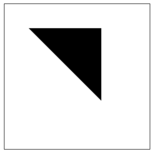  

**4. 绘制圆弧**

有两个方法可以绘制圆弧：

```
1. arc(x, y, r, startAngle, endAngle, anticlockwise)

- 以 (x, y) 为圆心，以 r 为半径，从 startAngle 弧度开始到 endAngle 弧度结束，
- anticlosewise 是布尔值，true 表示逆时针，false 表示顺时针（默认是顺时针）

* 这里的度数都是弧度，0 弧度是指 x 轴正向
* radias = (Math.PI/180)*degrees    // 角度转换成弧度

2. arcTo(x1, y1, x2, y2, radius)

- 根据给定的控制点和半径画一段圆弧，最后再以直线连接两个控制点

* 这个方法可以这样理解，绘制的弧形是由两条切线所决定
* - 第 1 条切线：起始点和控制点 1 决定的直线
* - 第 2 条切线：控制点 1 和控制点 2 决定的直线
* - ​其实绘制的圆弧就是与这两条直线相切的圆弧
```

来看几个示例 🍩

```js
function draw(){
    var canvas = document.getElementById('tutorial');
    if (!canvas.getContext) return;
    var ctx = canvas.getContext("2d");
    ctx.beginPath();
    ctx.arc(50, 50, 40, 0, Math.PI / 2, false);
    ctx.stroke();

    ctx.beginPath();
    ctx.arc(150, 50, 40, 0, -Math.PI / 2, true);
    ctx.closePath();
    ctx.stroke();

    ctx.beginPath();
    ctx.arc(50, 150, 40, -Math.PI / 2, Math.PI / 2, false);
    ctx.fill();

    ctx.beginPath();
    ctx.arc(150, 150, 40, 0, Math.PI, false);
    ctx.fill();

}
draw();
```

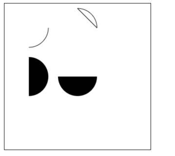  

再来看一下关于 `arcTo` 的方法示例如下：

```js
function draw(){
    var canvas = document.getElementById('tutorial');
    if (!canvas.getContext) return;
    var ctx = canvas.getContext("2d");
    ctx.beginPath();
    ctx.moveTo(50, 50);
  	//参数 1、2：控制点 1 坐标   参数 3、4：控制点 2 坐标  参数 5：圆弧半径
    ctx.arcTo(200, 50, 200, 200, 100);
    ctx.lineTo(200, 200)
    ctx.stroke();
    
    ctx.beginPath();
    ctx.rect(50, 50, 10, 10);
    ctx.rect(200, 50, 10, 10)
    ctx.rect(200, 200, 10, 10)
    ctx.fill()
}
draw();
```

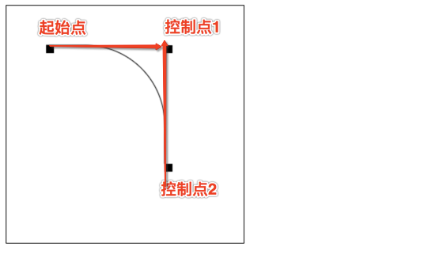  

**5. 绘制贝塞尔曲线**

贝塞尔曲线 (Bézier curve)，又称贝兹曲线或贝济埃曲线，是应用于二维图形应用程序的数学曲线。

一般的矢量图形软件通过它来精确画出曲线，贝兹曲线由线段与节点组成，节点是可拖动的支点，线段像可伸缩的皮筋，我们在绘图工具上看到的钢笔工具就是来做这种矢量曲线的。

贝塞尔曲线是计算机图形学中相当重要的参数曲线，在一些比较成熟的位图软件中也有贝塞尔曲线工具如 PhotoShop 等。在 Flash4 中还没有完整的曲线工具，而在 Flash5 里面已经提供出贝塞尔曲线工具。

贝塞尔曲线于 1962，由法国工程师皮埃尔·贝塞尔（Pierre Bézier）所广泛发表，他运用贝塞尔曲线来为汽车的主体进行设计。贝塞尔曲线最初由 Paul de Casteljau 于 1959 年运用 de Casteljau 演算法开发，以稳定数值的方法求出贝兹曲线。

*_一次贝塞尔曲线其实是一条直线* 


*_二次贝塞尔曲线* 


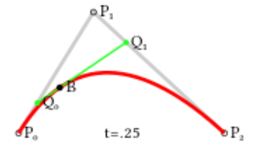  

*_三次贝塞尔曲线* 


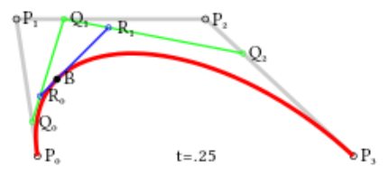  

好的，我们已初步了解了 *-贝塞尔曲线* 是什么东东，那么如何绘制它呢？

```
// 二次贝塞尔曲线
quadraticCurveTo(cp1x, cp1y, x, y)

- 参数 1 和 2：控制点坐标
- 参数 3 和 4：结束点坐标

// 三次贝塞尔曲线
bezierCurveTo(cp1x, cp1y, cp2x, cp2y, x, y)

- ​ 参数 1 和 2：控制点 1 的坐标
- ​ 参数 3 和 4：控制点 2 的坐标
- ​ 参数 5 和 6：结束点的坐标

```

像下面这样：

```js
function draw(){
    var canvas = document.getElementById('tutorial');
    if (!canvas.getContext) return;
    var ctx = canvas.getContext("2d");
    ctx.beginPath();
    ctx.moveTo(10, 200);        // 起始点
    var cp1x = 40, cp1y = 100;  // 控制点
    var x = 200, y = 200;       // 结束点
    //绘制二次贝塞尔曲线
    ctx.quadraticCurveTo(cp1x, cp1y, x, y);
    ctx.stroke();
    
    ctx.beginPath();
    ctx.rect(10, 200, 10, 10);
    ctx.rect(cp1x, cp1y, 10, 10);
    ctx.rect(x, y, 10, 10);
    ctx.fill();

    
    ctx.beginPath();
    ctx.moveTo(40, 200);        // 起始点
    var cp1x = 20, cp1y = 100;  // 控制点 1
    var cp2x = 100, cp2y = 120; // 控制点 2
    var x = 200, y = 200;       // 结束点
    //绘制三次贝塞尔曲线
    ctx.bezierCurveTo(cp1x, cp1y, cp2x, cp2y, x, y);
    ctx.stroke();
 
    ctx.beginPath();
    ctx.rect(40, 200, 10, 10);
    ctx.rect(cp1x, cp1y, 10, 10);
    ctx.rect(cp2x, cp2y, 10, 10);
    ctx.rect(x, y, 10, 10);
    ctx.fill();
}
draw();
```

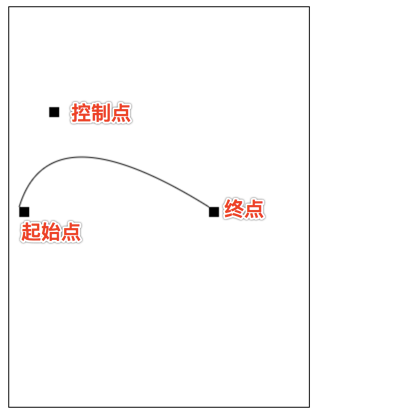  

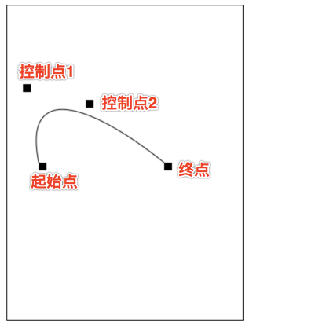  

## 添加样式和颜色

​在前面的绘制矩形章节中，只用到了默认的线条和颜色。

​如果想要给图形上色，有两个重要的属性可以做到：

```
1. fillStyle = color        // 设置图形的填充颜色
2. strokeStyle = color      // 设置图形轮廓的颜色

备注：
- color 可以是表示 css 颜色值的字符串、渐变对象或者图案对象
- 默认情况下，线条和填充颜色都是黑色
- 一旦您设置了 strokeStyle 或者 fillStyle 的值，那么这个新值就会成为新绘制的图形的默认值，
- 如果你要给每个图形上不同的颜色，你需要重新设置 fillStyle 或 strokeStyle 的值
```

**1. fillStyle**

```js
function draw(){
    var canvas = document.getElementById('tutorial');
    if (!canvas.getContext) return;
    var ctx = canvas.getContext("2d");
    for (var i = 0; i < 6; i++){
        for (var j = 0; j < 6; j++){
        ctx.fillStyle = 'rgb(' + 
            Math.floor(255 - 42.5 * i) + ',' +
            Math.floor(255 - 42.5 * j) + 
            ',0)';
        ctx.fillRect(j * 50, i * 50, 50, 50);
        }
    }
}
draw();
```

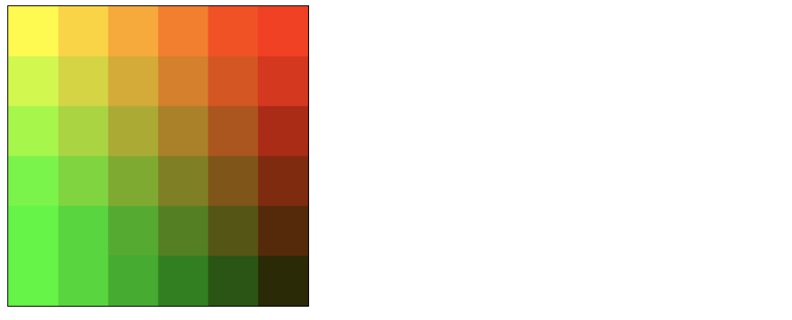  

**2. strokeStyle**

```js
function draw(){
    var canvas = document.getElementById('tutorial');
    if (!canvas.getContext) return;
    var ctx = canvas.getContext("2d");
    for (var i = 0; i < 6; i++){
        for (var j = 0; j < 6; j++){
            ctx.strokeStyle = `rgb(
                ${randomInt(0, 255)},
                ${randomInt(0, 255)}
            )`;
            ctx.strokeRect(j * 50, i * 50, 40, 40);
        }
    }
}
draw();
/**
 * 返回随机的 [from, to] 之间的整数（包括 from，也包括 to)
 */
function randomInt(from, to){
    return parseInt(Math.random() * (to - from + 1) + from);
}
```

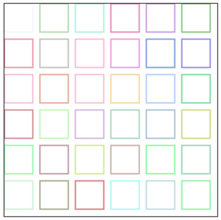  

**3. Transparency （透明度）**

```
globalAlpha = transparencyValue

- 这个属性影响到 canvas 里所有图形的透明度
- 有效的值范围是 0.0 （完全透明）到 1.0（完全不透明），默认是 1.0
- globalAlpha 属性在需要绘制大量拥有相同透明度的图形时候相当高效，
- 不过，我认为使用 rgba() 设置透明度更加好一些
```

**4. line style**

*_1. 线宽* 

```
lineWidth = value

关于 value ：
- 只能是正值，默认是 1.0
- 起始点和终点的连线为中心，上下各占线宽的一半
```

```js
ctx.beginPath();
ctx.moveTo(10, 10);
ctx.lineTo(100, 10);
ctx.lineWidth = 10;
ctx.stroke();

ctx.beginPath();
ctx.moveTo(110, 10);
ctx.lineTo(160, 10)
ctx.lineWidth = 20;
ctx.stroke()
```

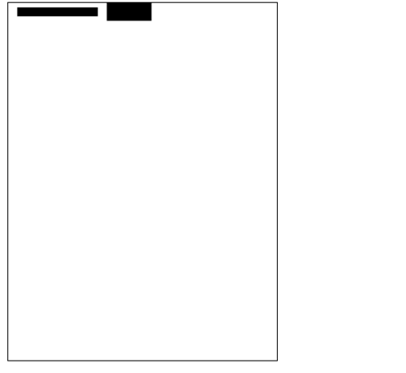  

*_2. 线条末端样式* 

```
lineCap = type

关于 type ：
- butt：线段末端以方形结束
- round：线段末端以圆形结束
- square：线段末端以方形结束，但是增加了一个宽度和线段相同，高度是线段厚度一半的矩形区域
```

```js
var lineCaps = ["butt", "round", "square"];

for (var i = 0; i < 3; i++){
    ctx.beginPath();
    ctx.moveTo(20 + 30 * i, 30);
    ctx.lineTo(20 + 30 * i, 100);
    ctx.lineWidth = 20;
    ctx.lineCap = lineCaps[i];
    ctx.stroke();
}

ctx.beginPath();
ctx.moveTo(0, 30);
ctx.lineTo(300, 30);

ctx.moveTo(0, 100);
ctx.lineTo(300, 100)

ctx.strokeStyle = "red";
ctx.lineWidth = 1;
ctx.stroke();
```

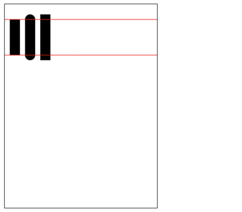  

*_3. 同一个 path 内，设定线条与线条间接合处的样式* 

```
lineJoin = type

关于 type ：
- round ：通过填充一个额外的，圆心在相连部分末端的扇形，绘制拐角的形状。 圆角的半径是线段的宽度
- bevel ：在相连部分的末端填充一个额外的以三角形为底的区域， 每个部分都有各自独立的矩形拐角
- miter（默认） ：通过延伸相连部分的外边缘，使其相交于一点，形成一个额外的菱形区域
```

```js
function draw(){
    var canvas = document.getElementById('tutorial');
    if (!canvas.getContext) return;
    var ctx = canvas.getContext("2d");

    var lineJoin = ['round', 'bevel', 'miter'];
    ctx.lineWidth = 20;

    for (var i = 0; i < lineJoin.length; i++){
        ctx.lineJoin = lineJoin[i];
        ctx.beginPath();
        ctx.moveTo(50, 50 + i * 50);
        ctx.lineTo(100, 100 + i * 50);
        ctx.lineTo(150, 50 + i * 50);
        ctx.lineTo(200, 100 + i * 50);
        ctx.lineTo(250, 50 + i * 50);
        ctx.stroke();
    }

}
draw();
```

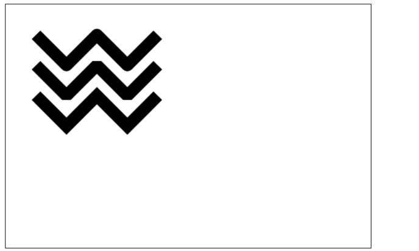  

**4. 虚线**

用 `setLineDash` 方法和 `lineDashOffset` 属性来制定虚线样式，如下：

- `setLineDash` 方法接受一个数组，来指定线段与间隙的交替；
- `lineDashOffset` 属性设置起始偏移量。

```js
function draw(){
    var canvas = document.getElementById('tutorial');
    if (!canvas.getContext) return;
    var ctx = canvas.getContext("2d");
    
    ctx.setLineDash([20, 5]);  // [实线长度，间隙长度]
    ctx.lineDashOffset = -0;
    ctx.strokeRect(50, 50, 210, 210);
}
draw();

// ​getLineDash(): 返回一个包含当前虚线样式，长度为非负偶数的数组
```

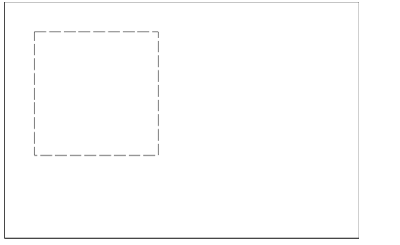  

## 绘制文本

canvas 提供了两种方法来渲染文本：
```
fillText(text, x, y [, maxWidth])
- 在指定的 (x,y) 位置填充指定的文本，绘制的最大宽度是可选的

strokeText(text, x, y [, maxWidth])
- 在指定的 (x,y) 位置绘制文本边框，绘制的最大宽度是可选的
```

```js
var ctx;
function draw(){
    var canvas = document.getElementById('tutorial');
    if (!canvas.getContext) return;
    ctx = canvas.getContext("2d");
    ctx.font = "100px sans-serif"
    ctx.fillText("天若有情", 10, 100);
    ctx.strokeText("天若有情", 10, 200)
}
draw();
```

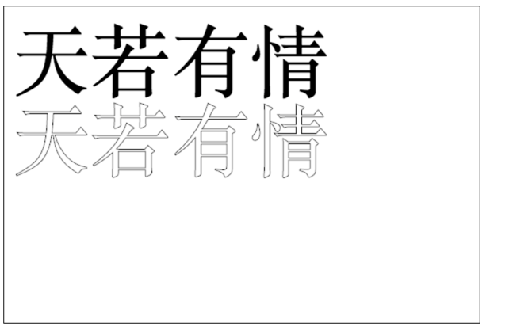  

我们都可以给文本添加哪些样式呢？

```
1. 绘制文本的样式
font = value
- 这个字符串使用和 CSS font 属性相同的语法
- 默认的字体是 10px sans-serif

2. 文本对齐选项
textAlign = value
- 可选的值包括：start, end, left, right or center
- 默认值是 start。

3. 基线对齐选项
textBaseline = value
- 可选的值包括：top, hanging, middle, alphabetic, ideographic, bottom
- 默认值是 alphabetic

4. 文本方向
direction = value
- 可能的值包括：ltr, rtl, inherit
- 默认值是 inherit
```

## 绘制图片

我们也可以在 canvas 上直接绘制图片。

**1. 由零开始创建图片**

```js
var img = new Image();      // 创建 img 元素
img.src = 'myImage.png';    // 设置图片源地址

img.onload = function(){
    // 参数 1：要绘制的 img  
    // 参数 2、3：绘制的 img 在 canvas 中的坐标
    ctx.drawImage(img, 0, 0)
}

// 关于 onload
// - 考虑到图片是从网络加载，如果 drawImage 的时候图片还没有完全加载完成，则什么都不做，个别浏览器会抛异常，
// - 所以我们应该保证在 img 绘制完成之后再 drawImage
```

**2. 绘制 img 标签元素中的图片**

`img` 可以 `new` 也可以来源于我们页面的 `` 标签。

```html
<br>
<canvas id="tutorial" width="600" height="400"></canvas>
<script type="text/javascript">
    function draw(){
        var canvas = document.getElementById('tutorial');
        if (!canvas.getContext) return;
        var ctx = canvas.getContext("2d");
        var img = document.querySelector("img");
        ctx.drawImage(img, 0, 0);
    }
    document.querySelector("img").onclick = function (){
        draw();
    }

</script>

```

  

`> 上图就是页面中的  标签`

  

**3. 缩放图片**

`drawImage()` 也可以再添加两个参数：

```
drawImage(image, x, y, width, height)
- width 和 height，这两个参数用来控制 当像 canvas 画入时应该缩放的大小
```

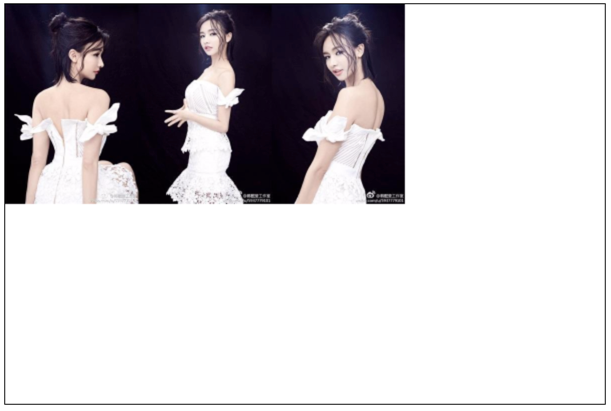  

**4. 切片**

```
drawImage(image, sx, sy, sWidth, sHeight, dx, dy, dWidth, dHeight)

- 第一个参数和其它的是相同的，都是一个图像或者另一个 canvas 的引用

其他 8 个参数：
- 前 4 个是定义图像源的切片位置和大小
- 后 4 个则是定义切片的目标显示位置和大小
```

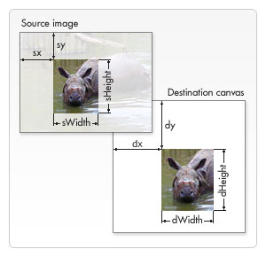  

## 状态的保存和恢复

Canvas 的状态就是当前画面应用的所有样式和变形的一个快照，状态的保存和恢复是绘制复杂图形时必不可少的操作。`save()` 和 `restore()` 方法是用来保存和恢复 canvas 状态的，都没有参数。

**1. `save()`**

Canvas 状态存储在栈中，每当 `save()` 方法被调用后，当前的状态就被推送到栈中保存。

`> Canvas 都有哪些状态呢？`

一个绘画状态包括：
- 当前应用的变形（即移动，旋转和缩放）；
- `strokeStyle, fillStyle, globalAlpha, lineWidth, lineCap, lineJoin, miterLimit, shadowOffsetX, shadowOffsetY, shadowBlur, shadowColor, globalCompositeOperation` 的值；
- 当前的裁切路径（clipping path）。

可以调用任意多次 save 方法（类似数组的 `push()`）。

**2. `restore()`**

每一次调用 restore 方法，上一个保存的状态就从栈中弹出，所有设定都恢复（类似数组的 `pop()`）。

上个例子吧 🍩

```js
var ctx;
function draw(){
    var canvas = document.getElementById('tutorial');
    if (!canvas.getContext) return;
    var ctx = canvas.getContext("2d");

    ctx.fillRect(0, 0, 150, 150);   // 使用默认设置绘制一个矩形
    ctx.save();                     // 保存默认状态

    ctx.fillStyle = 'red'           // 在原有配置基础上对颜色做改变
    ctx.fillRect(15, 15, 120, 120); // 使用新的设置绘制一个矩形

    ctx.save();                     // 保存当前状态
    ctx.fillStyle = '#FFF'          // 再次改变颜色配置
    ctx.fillRect(30, 30, 90, 90);   // 使用新的配置绘制一个矩形

    ctx.restore();                  // 重新加载之前的颜色状态
    ctx.fillRect(45, 45, 60, 60);   // 使用上一次的配置绘制一个矩形

    ctx.restore();                  // 加载默认颜色配置
    ctx.fillRect(60, 60, 30, 30);   // 使用加载的配置绘制一个矩形
}
draw();
```

## 变形

**1. translate**

```
translate(x, y)

- 用来移动 canvas 的原点到指定的位置
- 接受两个参数，x 是左右偏移量，y 是上下偏移量
```

  

`> ​注意：translate 移动的是 canvas 的坐标原点（坐标变换）。`

在做变形之前先保存状态是一个良好的习惯。大多数情况下，调用 `restore()` 方法比手动恢复原先的状态要简单得多。又如果你是在一个循环中做位移但没有保存和恢复 canvas 的状态，很可能到最后会发现怎么有些东西不见了，那是因为它很可能已经超出 canvas 范围以外了。

```js
var ctx;
function draw(){
    var canvas = document.getElementById('tutorial1');
    if (!canvas.getContext) return;
    var ctx = canvas.getContext("2d");
    ctx.save();                     //保存坐原点平移之前的状态
    ctx.translate(100, 100);
    ctx.strokeRect(0, 0, 100, 100);
    ctx.restore();                  //恢复到最初状态
    ctx.translate(220, 220);
    ctx.fillRect(0, 0, 100, 100)
}
draw();
```

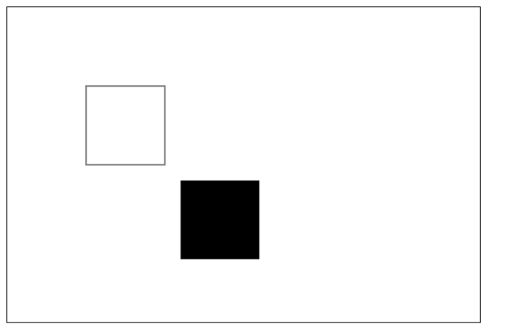  

**2. rotate**

```
rotate(angle)

- 旋转坐标轴， 旋转的中心是坐标原点
- 这个方法只接受一个参数：旋转的角度 (angle)，它是顺时针方向的，以弧度为单位的值
```

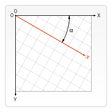  

```js
var ctx;
function draw(){
    var canvas = document.getElementById('tutorial1');
    if (!canvas.getContext) return;
    var ctx = canvas.getContext("2d");
    
    ctx.fillStyle = "red";
    ctx.save();
    
    ctx.translate(100, 100);
    ctx.rotate(Math.PI / 180 * 45);
    ctx.fillStyle = "blue";
    ctx.fillRect(0, 0, 100, 100);
    ctx.restore();
    
    ctx.save();
    ctx.translate(0, 0);
    ctx.fillRect(0, 0, 50, 50)
    ctx.restore();
}
draw();
```

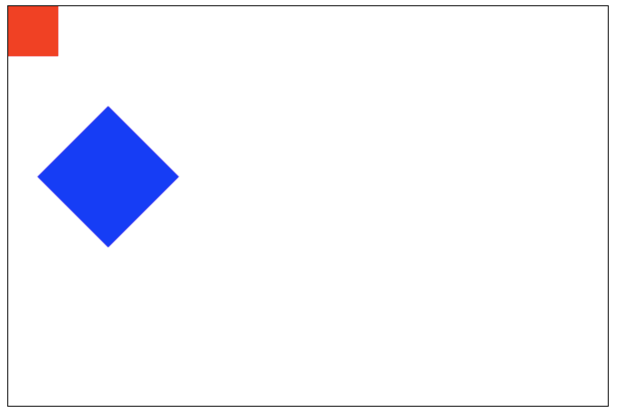  

**3. scale**

我们用它来增减图形在 canvas 中的像素数目，对形状，位图进行缩小或者放大。

```
scale(x, y)

- scale 方法接受两个参数。x,y 分别是横轴和纵轴的缩放因子，它们都必须是正值
- 值比 1.0 小表示缩 小，比 1.0 大则表示放大，值为 1.0 时什么效果都没有
```

默认情况下，canvas 的 1 单位就是 1 个像素。举例说，如果我们设置缩放因子是 0.5，1 个单位就变成对应 0.5 个像素，这样绘制出来的形状就会是原先的一半。同理，设置为 2.0 时，1 个单位就对应变成了 2 像素，绘制的结果就是图形放大了 2 倍。

**4. transform（变形矩阵）**

```
transform(a, b, c, d, e, f)

- a (m11): Horizontal scaling.
- b (m12): Horizontal skewing.
- c (m21):​ Vertical skewing.
- d (m22):​ Vertical scaling.
- e (dx):​ Horizontal moving.
- f (dy):​ Vertical moving.
```

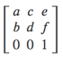  

```js
var ctx;
function draw(){
    var canvas = document.getElementById('tutorial1');
    if (!canvas.getContext) return;
    var ctx = canvas.getContext("2d");
    ctx.transform(1, 1, 0, 1, 0, 0);
    ctx.fillRect(0, 0, 100, 100);
}
draw();
```

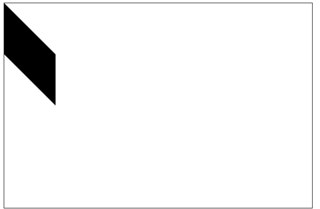  

## 合成

在前面的所有例子中、，我们总是将一个图形画在另一个之上，对于其他更多的情况，仅仅这样是远远不够的。比如，对合成的图形来说，绘制顺序会有限制。不过，我们可以利用 `globalCompositeOperation` 属性来改变这种状况。

```
globalCompositeOperation = type

其中 type 值有 13 个，如下：
- source-over （默认值）, source-in, source-out, source-atop
- destination-over, destination-in, destination-out, destination-atop
- lighter, darken, lighten
- xor, copy
```

下面我们分别来看一下这些值的表示。

**1. source-over**

```js
var ctx;
function draw(){
    var canvas = document.getElementById('tutorial1');
    if (!canvas.getContext) return;
    var ctx = canvas.getContext("2d");
 
    ctx.fillStyle = "blue";
    ctx.fillRect(0, 0, 200, 200);
 
    ctx.globalCompositeOperation = "source-over"; //全局合成操作
    ctx.fillStyle = "red";
    ctx.fillRect(100, 100, 200, 200);
}
draw();
```

注：下面的展示中，蓝色是原有的，红色是新的。

这是默认设置，新图像会覆盖在原有图像。

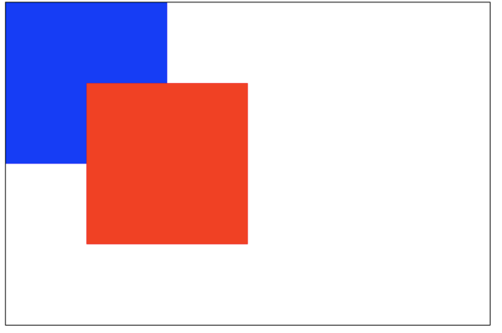  

**2. source-in**

仅仅会出现新图像与原来图像重叠的部分，其他区域都变成透明的。（包括其他的老图像区域也会透明）

  

**3. source-out**

仅仅显示新图像与老图像没有重叠的部分，其余部分全部透明。（老图像也不显示）

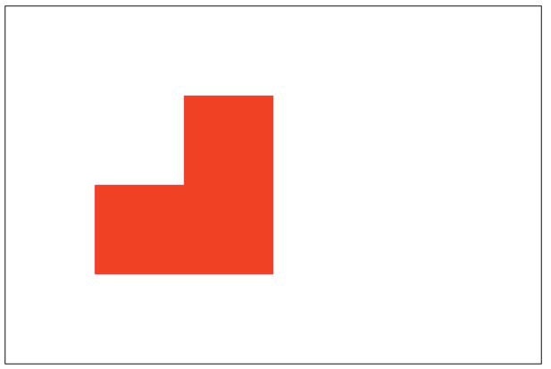  

**4. source-atop**

新图像仅仅显示与老图像重叠区域。（老图像仍然可以显示）

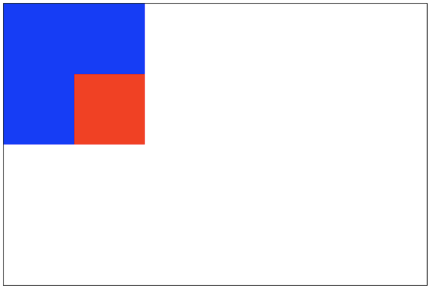  

**5. destination-over**

新图像会在老图像的下面。

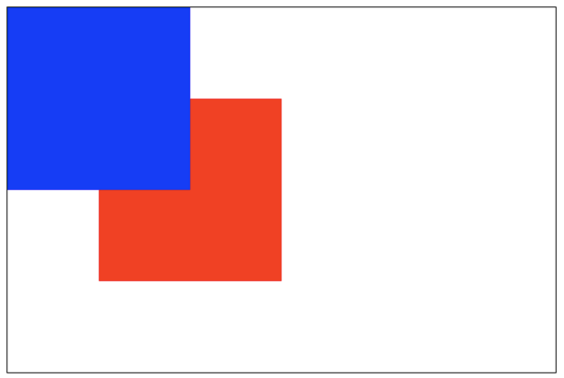  

**6. destination-in**

仅仅新老图像重叠部分的老图像被显示，其他区域全部透明。

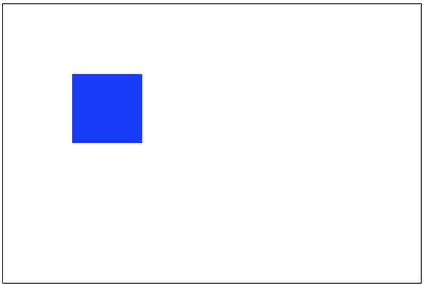  

**7. destination-out**

仅仅老图像与新图像没有重叠的部分。 （注意显示的是老图像的部分区域）

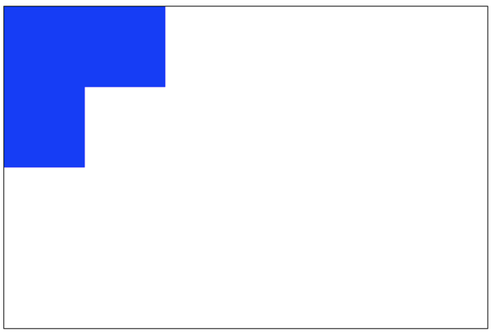  

**8. destination-atop**

老图像仅仅仅仅显示重叠部分，新图像会显示在老图像的下面。

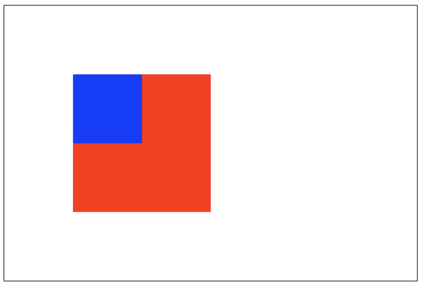  

**9. lighter**

新老图像都显示，但是重叠区域的颜色做加处理。

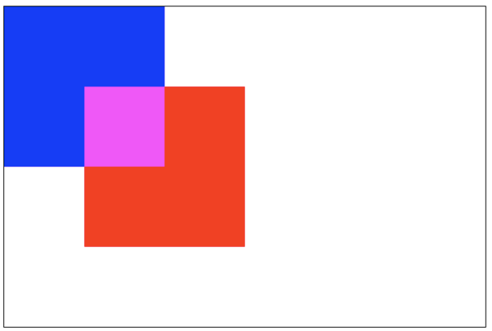  

**10. darken**

保留重叠部分最黑的像素。（每个颜色位进行比较，得到最小的）

```
blue: #0000ff
red:  #ff0000

// 所以重叠部分的颜色：#000000
```

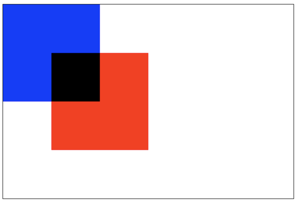  

**11. lighten**

保证重叠部分最量的像素。（每个颜色位进行比较，得到最大的）

```
blue: #0000ff
red:  #ff0000

// 所以重叠部分的颜色：#ff00ff
```

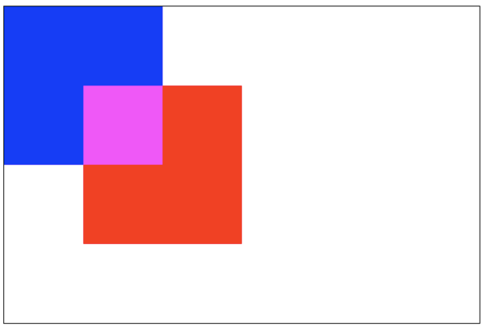  

**12. xor**

重叠部分会变成透明。

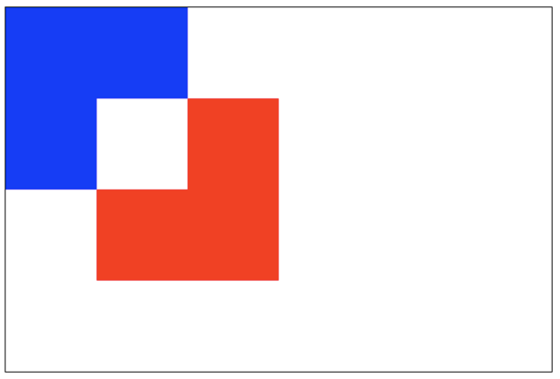  

**13. copy**

只有新图像会被保留，其余的全部被清除（边透明）。

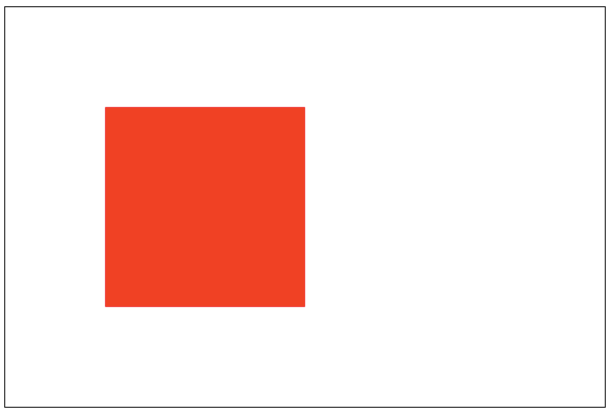  

## 裁剪路径

```
clip()

- 把已经创建的路径转换成裁剪路径
```

裁剪路径的作用是遮罩。只显示裁剪路径内的区域，裁剪路径外的区域会被隐藏。

注意：`clip()` 只能遮罩在这个方法 *-调用之后* 绘制的图像，如果是 `clip()` 方法调用之前绘制的图像，则无法实现遮罩。

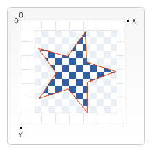  

```js
var ctx;
function draw(){
    var canvas = document.getElementById('tutorial1');
    if (!canvas.getContext) return;
    var ctx = canvas.getContext("2d");
 
    ctx.beginPath();
    ctx.arc(20,20, 100, 0, Math.PI * 2);
    ctx.clip();
 
    ctx.fillStyle = "pink";
    ctx.fillRect(20, 20, 100,100);
}
draw();
```

## 动画

动画的基本步骤：
1. 清空 canvas 再绘制每一帧动画之前，需要清空所有。清空所有最简单的做法就是 `clearRect()` 方法；
2. 保存 canvas 状态 如果在绘制的过程中会更改 canvas 的状态（颜色、移动了坐标原点等）, 又在绘制每一帧时都是原始状态的话，则最好保存下 canvas 的状态；
3. 绘制动画图形这一步才是真正的绘制动画帧；
4. 恢复 canvas 状态如果你前面保存了 canvas 状态，则应该在绘制完成一帧之后恢复 canvas 状态。

**控制动画**

我们可用通过 canvas 的方法或者自定义的方法把图像绘制到 canvas 上。正常情况，我们能看到绘制的结果是在脚本执行结束之后。例如，我们不可能在一个 for 循环内部完成动画。

也就是，为了执行动画，我们需要一些可以定时执行重绘的方法。

一般用到下面三个方法：

1. `setInterval()`
2. `setTimeout()` 
3. `requestAnimationFrame()`

```js
let sun;
let earth;
let moon;
let ctx;

init();

function init() {
    sun = new Image();
    earth = new Image();
    moon = new Image();
    sun.src = "sun.png";
    earth.src = "earth.png";
    moon.src = "moon.png";

    let canvas = document.querySelector("#solar");
    ctx = canvas.getContext("2d");

    sun.onload = function (){
        draw()
    }
}

function draw() {
    ctx.clearRect(0, 0, 300, 300);  // 清空所有内容
    // 绘制太阳
    ctx.drawImage(sun, 0, 0, 300, 300);

    ctx.save();
    ctx.translate(150, 150);

    //绘制 earth 轨道
    ctx.beginPath();
    ctx.strokeStyle = "rgba(255,255,0,0.5)";
    ctx.arc(0, 0, 100, 0, 2 * Math.PI)
    ctx.stroke()

    let time = new Date();
    //绘制地球
    ctx.rotate(
        2 * Math.PI / 60 * time.getSeconds() + 
        2 * Math.PI / 60000 * time.getMilliseconds()
    );
    ctx.translate(100, 0);
    ctx.drawImage(earth, -12, -12);

    //绘制月球轨道
    ctx.beginPath();
    ctx.strokeStyle = "rgba(255,255,255,.3)";
    ctx.arc(0, 0, 40, 0, 2 * Math.PI);
    ctx.stroke();

    //绘制月球
    ctx.rotate(
        2 * Math.PI / 6 * time.getSeconds() + 
        2 * Math.PI / 6000 * time.getMilliseconds()
    );
    ctx.translate(40, 0);
    ctx.drawImage(moon, -3.5, -3.5);
    ctx.restore();

    requestAnimationFrame(draw);
}

```


Emm... 不错，再来一个吧 🍪

```js
// <canvas id="solar" width="300" height="300"></canvas>

init();

function init(){
    let canvas = document.querySelector("#solar");
    let ctx = canvas.getContext("2d");
    draw(ctx);
}

function draw(ctx){
    requestAnimationFrame(function step(){
        drawDial(ctx); //绘制表盘
        drawAllHands(ctx); //绘制时分秒针
        requestAnimationFrame(step);
    });
}
/*绘制时分秒针*/
function drawAllHands(ctx){
    let time = new Date();

    let s = time.getSeconds();
    let m = time.getMinutes();
    let h = time.getHours();
    
    let pi = Math.PI;
    let secondAngle = pi / 180 * 6 * s;                     //计算出来 s 针的弧度
    let minuteAngle = pi / 180 * 6 * m + secondAngle / 60;  //计算出来分针的弧度
    let hourAngle = pi / 180 * 30 * h + minuteAngle / 12;   //计算出来时针的弧度

    drawHand(hourAngle, 60, 6, "red", ctx);                 //绘制时针
    drawHand(minuteAngle, 106, 4, "green", ctx);            //绘制分针
    drawHand(secondAngle, 129, 2, "blue", ctx);             //绘制秒针
}
/*绘制时针、或分针、或秒针
    * 参数 1：要绘制的针的角度
    * 参数 2：要绘制的针的长度
    * 参数 3：要绘制的针的宽度
    * 参数 4：要绘制的针的颜色
    * 参数 4：ctx
    * */
function drawHand(angle, len, width, color, ctx){
    ctx.save();
    ctx.translate(150, 150);                //把坐标轴的远点平移到原来的中心
    ctx.rotate(-Math.PI / 2 + angle);       //旋转坐标轴。 x 轴就是针的角度
    ctx.beginPath();
    ctx.moveTo(-4, 0);
    ctx.lineTo(len, 0);                     // 沿着 x 轴绘制针
    ctx.lineWidth = width;
    ctx.strokeStyle = color;
    ctx.lineCap = "round";
    ctx.stroke();
    ctx.closePath();
    ctx.restore();
}

/*绘制表盘*/
function drawDial(ctx){
    let pi = Math.PI;
    
    ctx.clearRect(0, 0, 300, 300);          //清除所有内容
    ctx.save();

    ctx.translate(150, 150);                //一定坐标原点到原来的中心
    ctx.beginPath();
    ctx.arc(0, 0, 148, 0, 2 * pi);          //绘制圆周
    ctx.stroke();
    ctx.closePath();

    for (let i = 0; i < 60; i++){           //绘制刻度。
        ctx.save();
        ctx.rotate(-pi / 2 + i * pi / 30);  //旋转坐标轴。坐标轴 x 的正方形从 向上开始算起
        ctx.beginPath();
        ctx.moveTo(110, 0);
        ctx.lineTo(140, 0);
        ctx.lineWidth = i % 5 ? 2 : 4;
        ctx.strokeStyle = i % 5 ? "blue" : "red";
        ctx.stroke();
        ctx.closePath();
        ctx.restore();
    }
    ctx.restore();
}
```


## 结语

Canvas 画布的功能还是挺强大的，Go Go Go!