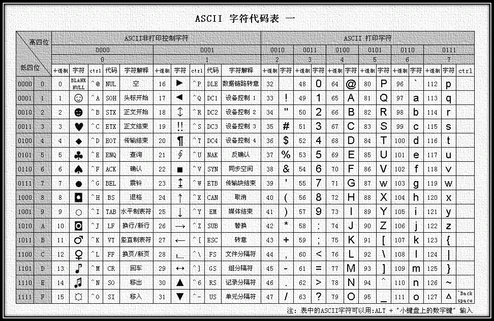
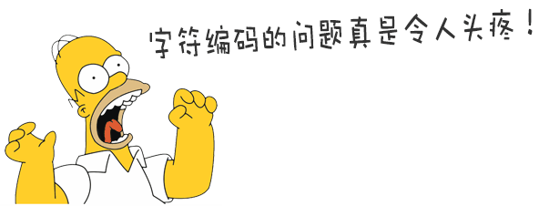
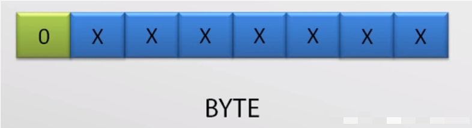
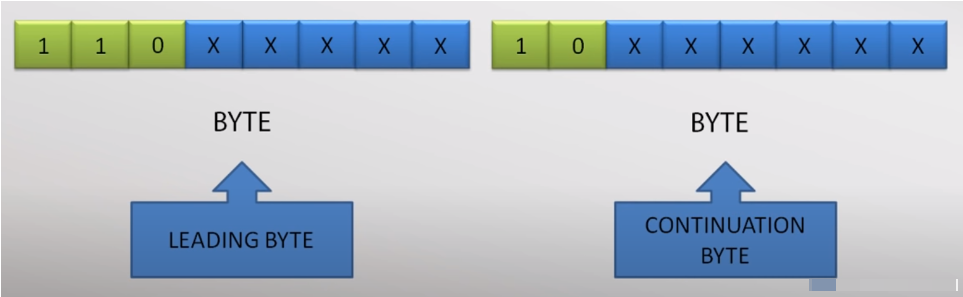
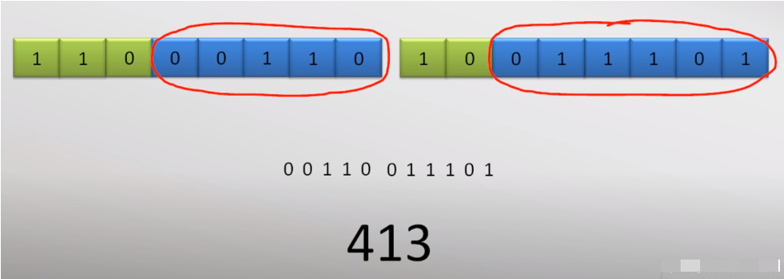
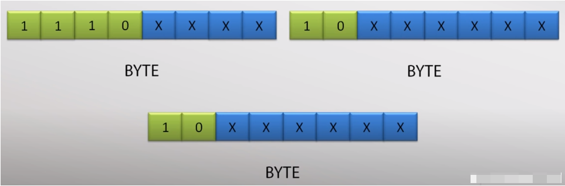
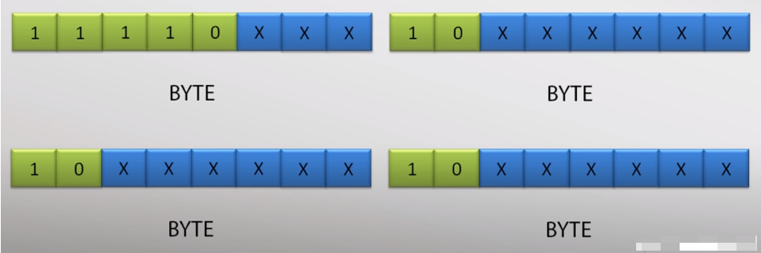
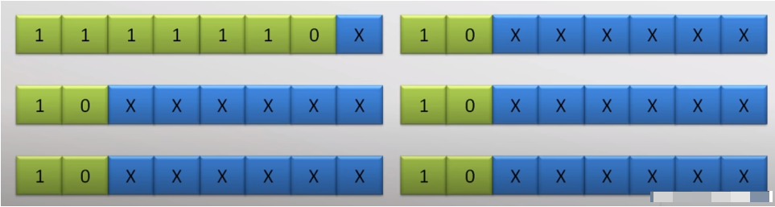
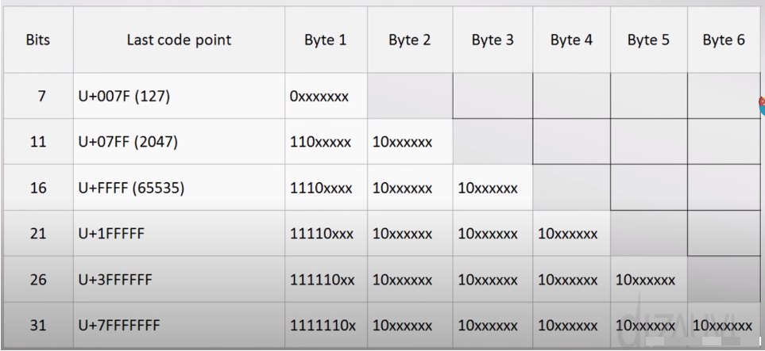

字符是什么？字母、汉字、标点符号、控制字符、假名……

计算机中储存的信息都是二进制数表示的，我们在屏幕上看到的英文、汉字等字符都是二进制转换之后的结果。按照何种规则将字符存储在计算机中，如 `a` 用什么表示，称为“编码”；反之，将存储在计算机中的二进制数解析显示出来，称为“解码”。

*=可以这样说，人类可读的即为“解”，计算机可读的即为“编”。*

<!--more-->

> 严格来说，字符集和字符编码不是一个概念，字符集定义了字符和二进制的对应关系，为字符分配了唯一的编号，而字符编码规定了如何将字符的编号存储到计算机中。

也就是说，字符编码是依赖于字符集的，就像代码中的接口实现依赖于接口一样；一个字符集可以有多个编码实现，就像一个接口可以有多个实现类一样。如下图所示：

  

为什么要严格区分字符集与字符编码这两个概念呢？

在早期，字符集与字符编码是一对一的，但随着时间的发展，出现了一对多的情形，即一种字符集可能有了多种编码实现。如上图所示，Unicode 字符集就有 UTF-8、UTF-16、UTF-32 多种编码方式。

如果你想要了解更多关于字符集及字符编码相关的历史，可以阅读 [该文档](https://www.runoob.com/w3cnote/charset-encoding.html) 。

## 常用字符集 & 编码

知道了字符、字符集及字符编码的基本概念，哪到底都有什么字符集及其编码规则呢 ❓

### ASCII

ASCII（American Standard Code for Information Interchange，美国信息交换标准代码），是基于拉丁字母的一套电脑编码系统，主要用于显示现代英语（<small>ASCII</small>）和其他西欧语言 (<small>EASCII，基于 ASCII 的扩展</small>)。它由 ANSI（American National Standard Insitute，美国国家标准学会）制定的，是一种标准的 **单字节字符编码方案** 。

好吧，还是缩写好用 😅……

单字节？1 个字节 包含 8 位，也就是最多编码 256 个字符喽。事实上，基础的 ASCII 只使用了 7 位，共 128 个字符，后续的 EASCII 扩展为了表示更多欧洲常用字符，才使用了第 8 位。

下图为基础版的 ASCII ：

  

### GB* 系

256 种表示？在汉字面前微不足道！不够用啊！！！

其实对于汉字的个数并没有个准确的数字，不完全统计汉字大约有十万个左右。根据 1988 年颁布的《现代汉语常用字表》，在我们日常生活中常用的汉字有 2500 个，次常用的汉字有 1000 个。

一个字节不够用？那就再加一个，216 = 65536 种表示，勉强基本够用了……

前后经历了，GB2312 → GBK → GB18030 ，具体细节请自行查阅哦。你可能还见过 Big5 ，它是繁体中文常用的汉字字符标准。

> GBK 并非国标，是微软搞出来的在 GB13000（国标过渡版）基础上扩展的（<small>编码方式不同，emm...</small>），最初实现于 Windows95 简体中文版。

### Unicode

全世界有上百种语言，各国有各国的标准，会冲突的！！！多语言混合的文本中，就成了“一锅粥”，乱码了……

  

有没有一种字符集，收录了世界上所有的字符，统一编码呢 ❓ 有，**Unicode** ！

Unicode 编码系统为表达任意语言的任意字符而设计，它使用 4 字节数来表达每个字母、符号，或者表意文字。

> 4 个字节，232 = 4,294,967,296 种表示，遇到外星人 📡 也够用了……

UTF-32 就是用 4 个字体，UTF-16 用的是 2 个字节，那 ~~UTF-8 就是 1 个字节了？~~ 不，UTF-8 是变长的（可变长度字符编码）。

  

就左边这们大佬（肯·汤普森）搞出来的，他还做了 B 语言，基于 B 语言的 Unix ，C 语言，后又用 C 语言重新编写了 Unix ，现在又搞了个 Golang …… 右边这位好基友（丹尼斯·里奇）也是个神，Unix 和 C 语言的共同创始人。  
谢祖师爷……歇歇吧，卷不动了…… 😱

为什么我们需要 UTF-8 呢？如果用 UTF-16（最常用的 Unicode 标准），如果你写的都全部是英文的话，使用它编码就需要多出一倍的存储空间，在存储和传输上就十分不划算。

硬盘不贵，带宽贵啊！

本着节约的精神，可变长编码的 UTF-8 诞生了，它把一个 Unicode 字符根据不同的字符大小编码成 1~6 个字节，常用的英文字母被编码成 1 个字节（<small>ASCII 的超集</small>），汉字通常是 3 个字节，只有很生僻的字符才会被编码成 4~6 个字节。

实际上，现在计算机系统通用的字符编码工作方式：**在计算机内存中，统一使用 Unicode 编码（UTF-16），当需要保存到硬盘或者需要传输的时候，就转换为 UTF-8 编码。**

用记事本编辑的时候，从文件读取的 UTF-8 字符被转换为 Unicode 字符到内存里，编辑完成后，保存的时候再把 Unicode 转换为 UTF-8 保存到文件：

  

  

浏览网页的时候，服务器会把动态生成的 Unicode 内容转换为 UTF-8 再传输到浏览器。

**互联网工程工作小组（IETF）要求所有互联网协议都必须支持 UTF-8 编码。**

### UTF-8 的实现原理

上文，我们知道 UTF-8 是可变长度编码，那么在解码时，如何知道当前字符占用几个字节呢？**通过解析第一个字节获取信息。**

**1 个字节**

如果第一个字节的最高位是 `0` ，那么表示当前字符占一个字节，如下：

  

这里也可以看出 UTF-8 是完全兼容 ASCII 码的，因为 ASCII 码的最高位也是 0 。

**2 个字节**

如果第一个字节的最高位是 `110` ，那么表示这个字符占 2 个字节，第二个字节的最高 2 位是 `10` ，如下：

  

蓝色部分的数字组合在一起，就是实际的码位值。假如，要表示的字符，其码位值为 413 （对应填制为 00110011101 ），其表示就如下：

  

**3 个字节**

如果第一个字节的最高位是 `1110`，那么第 2 和第 3 个字节的最高位是 `10` ，如下：

  

**4 个字节**

原理同上，只是第一个字节的最高位是 `11110` ，如下 ：

  

**6 个字节**

  

不同字节对应的码位范围如下图，左侧 Bits 栏表示用于表示码位的 bit 数，如 4 个字节，其中有 21 位用于表示码位，即上图中的蓝色部分 。

  

不难看出，UTF-8 的产生是循序渐进的， 其拥有很高的灵活性，而且可以进行扩展，能够表示的字符范围很大。

## 结语

> 一切都是在发展的，一切都是在改善的，有时候，只要一点奇思妙想，就会让世界变得更加美好。

## 参考链接

- https://blog.csdn.net/weixin_44198965/article/details/93125017
- https://zhuanlan.zhihu.com/p/260192496
- https://www.runoob.com/w3cnote/charset-encoding.html
- https://www.liaoxuefeng.com/wiki/1016959663602400/1017075323632896
- https://blog.csdn.net/whahu1989/article/details/118314154