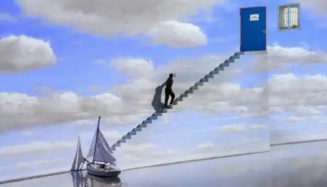

# 先看下下面这幅图
-   

- 你能猜出这部影片的名字吗？
- 是的，她就是《楚门的世界》
- 第一次看这部影片时应该是好多年前了
- 说实话当时并没有给我留下多么深的印象
- 只是觉得片子还不错
- 但当我前天再一次翻出来看完后
- 却有了和之前完全不同的感受

# 影片看完后我的思考
- 这部影片引发了我对父母与孩子关系的深思。在片中，总导演形象化地扮演了父母的角色，他们承担着我们从出生到成长的全过程，影响着我们与朋友、婚姻甚至离婚等事物的观念形成。他们会说“不”来限制我们接触许多事物。然而，当楚门达到30岁时，他用尽全力与这种设定进行抗争，最终成功地走出了父母创造的世界，即使外面的世界与墙内的世界也许并没有太大区别。

# 我自己的育儿理念
- 我在教育孩子时秉持着“无险之事皆可体验”的育儿理念，积极地引导孩子尝试一切没有生命危险的新事物。我们一起培养植物、养鱼、垂钓、共同逛街等等，尽可能地让他接触各种不同的经历。同时，我也做好了将来孩子长大后独立离开的准备，仿佛楚门一样走向另一个世界。在照料孩子的过程中，我力求给予他必要的关怀，但又不过分控制，尊重他的选择和意见，并为他提供坚实的后盾支持。我希望孩子在具备自主面对世界的能力之前，在我为他营造的小世界里不会感到像楚门所经历的那种过度受控制和乏味的感觉。

# 用电影结尾的话来结尾吧
- In case i don't see you.Good afternoon,good evening,And good night.