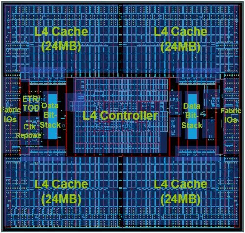
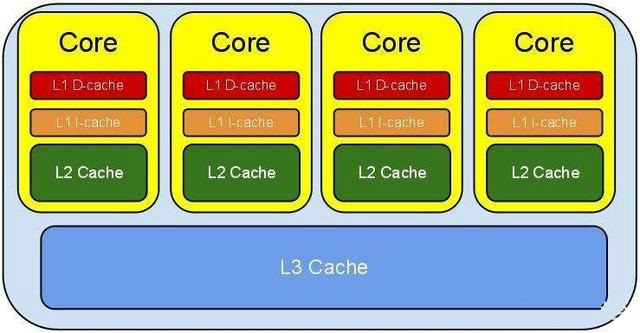
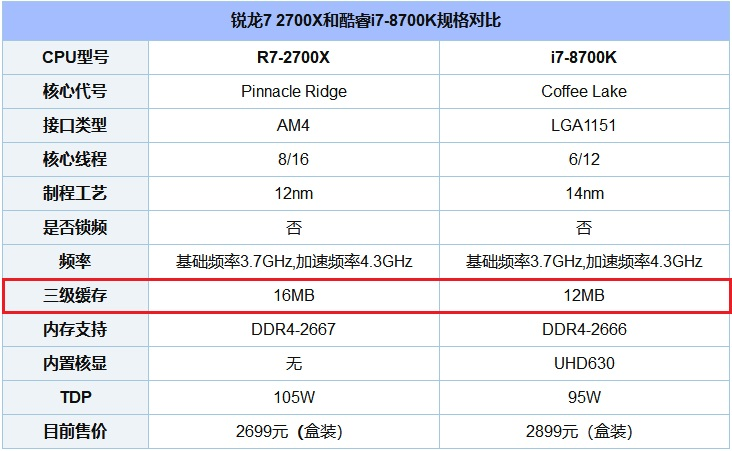

> 转载自 https://www.jb51.net/hardware/cpu/610074.html

我们知道，CPU 性能是主要由 CPU 构架、核心线程数量、主频、缓存等诸多因素共同决定，而“缓存”是很多网友容易忽视的一个地方。那么，CPU 缓存是什么？在电脑 CPU 中，一二三级缓存究竟谁对 CPU 性能影响最重要呢？

<!--more-->

## CPU 缓存是什么

CPU 缓存（Cache Memory）是位于 CPU 与内存之间的临时存储器，它的容量比内存小的多但是交换速度却比内存要快得多。CPU 高速缓存的出现主要是为了解决 CPU 运算速度与内存读写速度不匹配的矛盾，因为 CPU 运算速度要比内存读写速度快很多，这样会使 CPU 花费很长时间等待数据到来或把数据写入内存。在缓存中的数据是内存中的一小部分，但这一小部分是短时间内 CPU 即将访问的，当 CPU 调用大量数据时，就可先缓存中调用，从而加快读取速度。

  

`> CPU 缓存`

缓存大小是 CPU 的重要指标之一，而且缓存的结构和大小对 CPU 速度的影响非常大，CPU 内缓存的运行频率极高，一般是和处理器同频运作，工作效率远远大于系统内存和硬盘。实际工作时，CPU 往往需要重复读取同样的数据块，而缓存容量的增大，可以大幅度提升 CPU 内部读取数据的命中率，而不用再到内存或者硬盘上寻找，以此提高系统性能。但是从 CPU 芯片面积和成本的因素来考虑，缓存都很小。

  

`> CPU 缓存设计示意图`

按照数据读取顺序和与 CPU 结合的紧密程度，CPU 缓存可以分为一级缓存，二级缓存，如今主流 CPU 还有三级缓存，甚至有些 CPU 还有四级缓存。每一级缓存中所储存的全部数据都是下一级缓存的一部分，这三种缓存的技术难度和制造成本是相对递减的，所以其容量也是相对递增的。

为什么 CPU 会有 L1、L2、L3 这样的缓存设计？主要是因为现在的处理器太快了，而从内存中读取数据实在太慢（一个是因为内存本身速度不够，另一个是因为它离 CPU 太远了，总的来说需要让 CPU 等待几十甚至几百个时钟周期），这个时候为了保证 CPU 的速度，就需要延迟更小速度更快的内存提供帮助，而这就是缓存，如下图所示。

  

当 CPU 要读取一个数据时，首先从一级缓存中查找，如果没有找到再从二级缓存中查找，如果还是没有就从三级缓存或内存中查找。一般来说，每级缓存的命中率大概都在 80%左右，也就是说全部数据量的 80%都可以在一级缓存中找到，只剩下 20%的总数据量才需要从二级缓存、三级缓存或内存中读取，由此可见一级缓存是整个 CPU 缓存架构中最为重要的部分。

## CPU 的一二三级缓存哪个最重要

一般来说，每级缓存的命中率大概都在 80%左右，也就是说全部数据量的 80%都可以在一级缓存中找到，只剩下 20%的总数据量才需要从二级缓存、三级缓存或内存中读取，由此可见一级缓存是整个 CPU 缓存架构中最为重要的部分。

但是，现在 CPU 的一级缓存几乎都一样，容量都比较小，多为 64K，因此如今的 CPU 基本很少提一级缓存，主要是大家都一样，虽然最重要，但却不值得一提。

二级缓存，对 CPU 是很重要的，不过很多朋友会发现，如今很多 Intel 的 CPU 也都不怎么提二级缓存，只标注三级缓存。而 AMD 的不少新 CPU 也多为标注三级缓存为主，二级缓存只有部分型号会标注，比如 AMD 锐龙 5 2600X 提供 3M 三级缓存和 16M 三级缓存，R7 2700X 则也只有 16M 三级缓存。而 Intel 酷睿 i3 8100 则只有 6M 三级缓存，高端的 i7 8700K 则只标注 12MB。

  

因此，在目前的新款 CPU 中，二级缓存的重要性在减弱，三级缓存则成为重点。

现代 CPU 的高速缓存体系结构是非常复杂的，其中包括硬件预取和数据转发，以便能提供最佳的高速缓存命中机会，有些 CPU 甚至还加入了 L4 缓存。

以上就是电脑 CPU 一二三级缓存的知识科普。对于普通电脑用户来说，只要知道 CPU 缓存是决定 CPU 性能的因素之一，普通用户对 CPU 缓存并不太敏感，游戏玩家更为在意的 CPU 核心数、主频等因素，而对于一些 3D 制图、视频渲染用户来说，比较考验 CPU 综合性能，这个时候大缓存会显得更优势。
