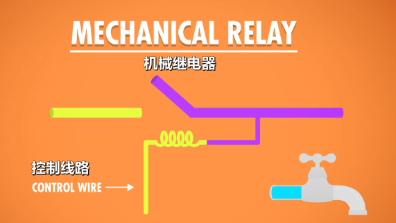
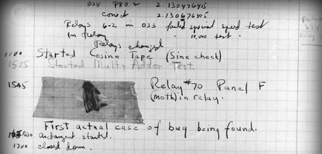
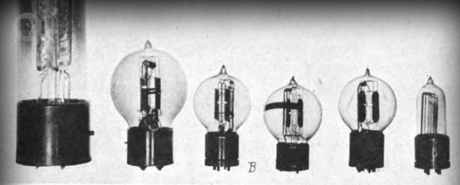
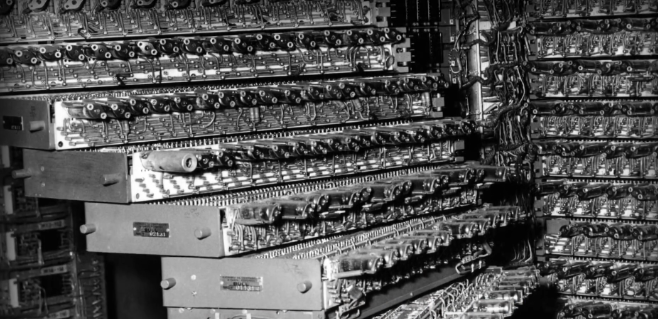
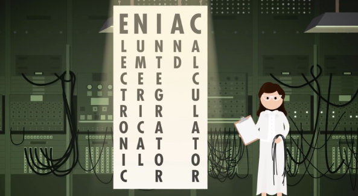
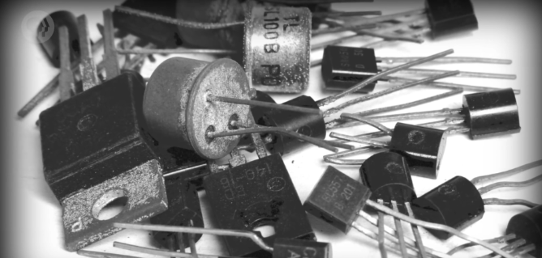
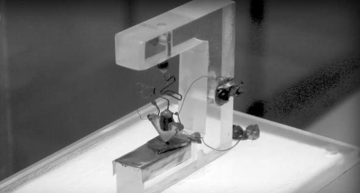

i.e. Electronic Computing

上集讲到 20 世纪初，当时的早期计算设备都针对特定用途，比如制表机（tabulating machines），大大推进了政府和企业。它们帮助，甚至代替了人工。然而人类社会的规模在以前所未有的速度增长，20 世纪上半叶，世界人口几乎翻倍。一战动员 7 千万人，二战 1 亿多人。全球贸易和运输更加紧密，工程和科学的复杂度也达到新高。我们甚至开始考虑造访其他行星，复杂度的增高导致数据量暴增，人们需要更多自动化，更强的计算能力。

  

很快，柜子大小的计算机变成房间大小，维护费用高，而且容易出错，而正是这些机器为未来的创新打下基础。

<!--more-->

## 继电器

最大的机电计算机之一是`哈佛马克一号`，IBM 在 1944 完成建造，给二战同盟国建造的。它有 76 万 5 千个组件，300 万个连接点和 500 英里长的导线。为了保持内部机械装置同步，它有一个 50 英尺的传动轴，由一个 5 马力的电机驱动，这台机器最早的用途之一 是给"曼哈顿计划"跑模拟。

  

这台机器的大脑是 **"继电器"（relays）**，继电器是：用电控制的机械开关。继电器里，有根"控制线路"，控制电路是开还是关。"控制线路"连着一个线圈，当电流流过线圈，线圈产生电磁场，吸引金属臂，从而闭合电路。你可以把继电器想成水龙头，把控制线路想成水龙头把，打开水龙头，水会流出来，关闭水龙头，水就没有了。继电器是一样的，只不过控制的是电子而不是水。这个控制电路可以连到其他电路，比如马达，马达让计数齿轮 +1，就像上集中 Hollerith 的制表机一样。

*=电磁原理…… 另外，看，最初的开始就是为了 **‘控制连通’** ，区分开关，划分阴阳。* 

不幸的是，继电器内的机械臂有质量，因此无法快速开关。 

1940 年代一个好的继电器 1 秒能翻转 50 次，看起来好像很快，但还不够快，不足以解决复杂的大问题。哈佛马克一号，1 秒能做 3 次加法或减法运算，一次乘法要花 6 秒，除法要花 15 秒。更复杂的操作，比如三角函数，可能要一分钟以上。

除了速度慢，另一个限制是齿轮磨损。

任何会动的机械都会随时间磨损，有些部件会完全损坏，有些则是变黏，变慢，变得不可靠，并且随着继电器数量增加，故障概率也会增加。哈佛马克一号有大约 3500 个继电器，哪怕假设继电器的使用寿命是 10 年，也意味着平均每天得换一个故障继电器！这个问题很严重，因为有些重要运算要运行好几天，而且还有更多其他问题要考虑。

这些巨大，黑色，温暖的机器也会吸引昆虫 🦟。

  

`> Ha, Bug...`

1947 年 9 月，哈佛马克 2 型的操作员从故障继电器中，拔出一只死虫。Grace Hopper（这位我们以后还会提到）曾说，"从那时起，每当电脑出了问题，我们就说它出了 bug（虫子）"，这就是术语 "bug" 的来源。

显然，如果想进一步提高计算能力，我们需要更快更可靠的东西，来替代继电器。幸运的是，替代品已经存在了！

## 真空管

在 1904 年，英国物理学家 "约翰·安布罗斯·弗莱明"，开发了一种新的电子组件，叫 **"热电子管"**。把两个电极（electrodes）装在一个气密的玻璃灯泡里，这是世上第一个真空管（vacuum tube）。其中一个电极可以加热，从而发射电子（electrons），这叫 "热电子发射"。另一个电极会吸引电子，形成"电龙头"的电流，但只有带正电才行。如果带负电荷或中性电荷，电子就没办法被吸引，越过真空区域，因此没有电流。

电流只能单向流动的电子部件叫 **"二极管"（diode）**，但我们需要的是，一个能**开关电流**的东西。

*=⚡️ 控制联通！控制联通！控制联通！* 

幸运的是，不久之后在 1906 年，美国发明家 "李·德富雷斯特"，他在"弗莱明"设计的两个电极之间，加入了第三个 "控制" 电极，向"控制"电极施加正电荷，它会允许电子流动，但如果施加负电荷，它会阻止电子流动。因此通过控制线路，可以断开或闭合电路，和继电器的功能一样。

  

`> 真空管 `

但重要的是，真空管内没有会动的组件，这意味着更少的磨损。更重要的是，每秒可以开闭数千次。因此这些 **"三极真空管"**（triode vacuum tubes）成为了无线电，长途电话以及其他电子设备的基础，持续了接近半个世纪。我应该提到，真空管不是完美的，它们有点脆弱，并且像灯泡一样会烧坏，但比起机械继电器是一次巨大进步。

起初，真空管非常昂贵，收音机一般只用一个，但计算机可能要上百甚至上千个电气开关。但到了 1940 年代，它的成本和可靠性得到改进，可以用在计算机里，至少有钱人负担得起，比如政府。

这标志着计算机从机电转向电子。

**💭 我们来进入思想泡泡**

第一个大规模使用真空管的计算机是 "巨人 1 号"，由工程师 Tommy Flowers 设计，完工于 1943 年 12 月。巨人 1 号 在英国的"布莱切利园", 用于破解纳粹通信，听起来可能有点熟，因为 2 年前 阿兰·图灵（他经常被称为"计算机科学之父"）也在"布莱切利园"做了台机电装置，叫 "Bombe"，这台机器的设计目的是破解纳粹"英格码"通讯加密设备，但 Bombe 严格来说不算计算机。我们之后会讨论"阿兰·图灵"的贡献。总之，巨人 1 号有 1600 个真空管，总共造了 10 台巨人计算机，来帮助破解密码。巨人被认为是第一个可编程的电子计算机，编程的方法是把几百根电线插入插板（plugboards），有点像老电话交换机，这是为了让计算机执行正确操作。虽然"可编程"（programmable） ，但还是要配置它。

  

`> ENIAC - 世上第一个真正的通用、可编程的电子计算机`

电子数值积分计算机 "ENIAC"几年后在 1946 年，在"宾夕法尼亚大学"完成建造，设计者是 John Mauchly 和 J. Presper Eckert，这是世上第一个真正的通用，可编程，电子计算机。ENIAC 每秒可执行 5000 次十位数加减法，比前辈快了很多倍，它运作了十年。据估计，它完成的运算，比全人类加起来还多。因为真空管很多，所以故障很常见，ENIAC 运行半天左右就会出一次故障。

**谢了 思想泡泡**

到 1950 年代，真空管计算机都达到了极限。美国空军的 AN/FSQ-7 计算机于 1955 年完成，是 "SAGE" 防空计算机系统的一部分，之后的视频还会提到。

为了降低成本和大小，同时提高可靠性和速度，我们需要一种新的电子开关。

## 晶体管

1947 年，贝尔实验室科学家 John Bardeen，Walter Brattain，William Shockley，发明了 **晶体管（transistor）**，一个全新的计算机时代诞生了！

  

晶体管的物理学相当复杂，牵扯到量子力学（quantum mechanics），所以我们只讲基础。晶体管就像之前提过的"继电器"或"真空管"，它是一个开关，可以用控制线路来控制开或关。晶体管有两个电极，电极之间有一种材料隔开它们，这种材料有时候导电，有时候不导电，这叫`"半导体"`（semiconductor）。控制线连到一个 "门"（gate）电极，通过改变 "门" 的电荷。我们可以控制半导体材料的导电性，来允许或不允许电流流动，就像之前的水龙头比喻。

  

`> 第一个晶体管`

贝尔实验室（Bell Labs）的第一个晶体管就展示了巨大的潜力，每秒可以开关 10,000 次，而且，比起玻璃制成小心易碎的真空管，**晶体管是固态的**。晶体管可以远远小于继电器或真空管，导致更小更便宜的计算机，比如 1957 年发布的 IBM 608 - 第一个完全用晶体管，而且消费者也可以买到的计算机，它有 3000 个晶体管，每秒执行 4500 次加法，每秒能执行 80 次左右的乘除法。IBM 很快把所有产品都转向了晶体管，把晶体管计算机带入办公室，最终引入家庭，如今，计算机里的晶体管小于 50 纳米，而一张纸的厚度大概是 10 万纳米。晶体管不仅小，还超级快 - 每秒可以切换上百万次，并且能工作几十年。

很多晶体管和半导体的开发在"圣克拉拉谷"，这个地方在加州，位于"旧金山"和"圣荷西"之间，而生产半导体最常见的材料是 "硅"，所以这个地区被称为 "硅谷"。甚至 William Shockley 都搬了过去，创立了"肖克利半导体"，里面的员工后来成立了"仙童半导体"，这里面的员工后来创立了英特尔 - 当今世界上最大的计算机芯片制造商。

好了，我们从"继电器"到"真空管"到"晶体管"，我们可以让电路开闭得非常非常快，但我们是如何用晶体管做计算的？我们没有马达和齿轮啊？

*=开关的过程，就是阴阳转换的过程，信息变化的过程！* 

我们接下来几集会讲，感谢观看，下周见。
