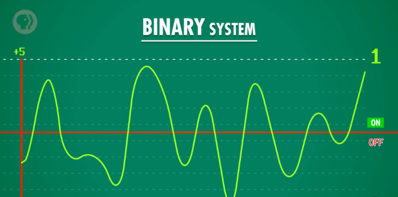
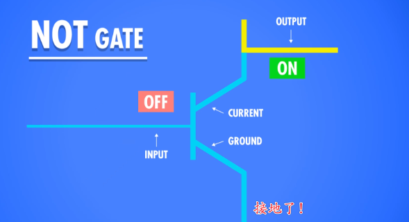
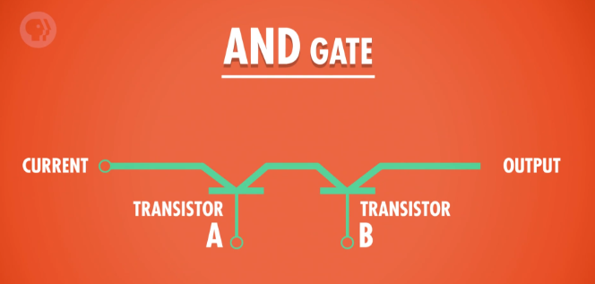
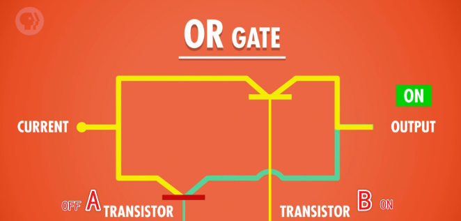
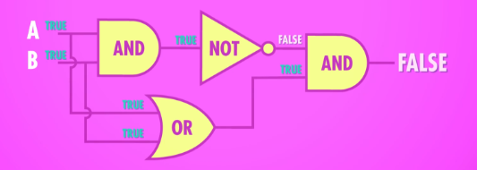

i.e. boolean-logic-and-logic-gates

今天我们开始"抽象"（abstraction）的旅程！不用管底层细节，把精力用来构建更复杂的系统。

上集，我们谈了计算机最早是机电设备（electromechanical），一般用十进制（decimal）计数，比如用齿轮数来代表十进制， 再到晶体管计算机。

幸运的是，**只用 `‘开/关’` 两种状态也可以代表信息**，这叫`二进制`，意思是"用两种状态表示"，就像自行车有两个轮，双足动物有两条腿。你可能觉得两种状态不多，你是对的！但如果只需要表示 `true` 和 `false`，两个值就够了。电路闭合，电流流过，代表 "真"；电路断开，无电流流过，代表"假"。二进制也可以写成 `1` 和 `0` 而不是 `true` 和 `false`，只是不同的表达方式罢了。

<!--more-->

我们下集（episode）会讲更多细节。

晶体管的确可以不只是开/关，还可以让不同大小的电流通过。一些早期电子计算机是三进制的，有 3 种状态，甚至五进制，5 种状态。问题是，状态越多，越难区分信号。如果手机快没电了或者附近有电噪音，因为有人在用微波炉（microwave），信号可能会混在一起。.. 而每秒百万次变化的晶体管会让这个问题变得更糟！所以我们把两种信号尽可能分开，只用"开"和"关"两种状态，可以尽可能减少这类问题。

  

`> ON & OFF`

计算机用二进制的另一个原因是，有一整个数学分支存在，专门处理"真"和"假"。它已经解决了所有法则和运算 - 叫"布尔代数"（Boolean Algebra）！

乔治·布尔（George Boole）是布尔二字的由来，是一位 19 世纪自学成才的英国数学家，他有兴趣用数学式子扩展亚里士多德基于哲学的逻辑方法，布尔用逻辑方程系统而正式的证明真理 (truth)。他在 1847 年的第一本书"逻辑的数学分析"中介绍过，在"常规"代数里 - 你在高中学的那种 - 变量的值是数字，可以进行加法或乘法之类的操作，但在布尔代数中，变量的值是 `true` 和 `false`，能进行逻辑操作。

## 布尔逻辑

布尔代数中有三个基本操作：NOT, AND 和 OR 。这些操作非常有用，我们一个个来看：

*=布尔逻辑的本质是什么呢？很简单，一个或若干个输入（真或假），经过若干次逻辑运算，最终得到一个确定的输出（真或假）的过程！* 

### NOT

NOT 操作把布尔值反转，把 `true` 进行 NOT 就会变成 `false`，反之亦然。我们可以根据 NOT 操作的输入和输出，做出这个表。

|  INPUT  | OUTPUT  |
| :-----: | :-----: |
|  TURE   | `FALSE` |
| `FALSE` |  TRUE   |

`> NOT 真值表`

酷的地方是 - 用晶体管可以轻松实现这个逻辑。

*=晶体管的用武之地~~* 

上集说过，晶体管只是电控制的开关 - 有 3 根线：2 根电极和 1 根控制线。

控制线通电时，电流就可以从一个电极流到另一个电极，就像水龙头一样 - 打开水龙头，就有水流出来，关掉水龙头，就没水了。可以把控制线当做输入 ( input )，底部的电极当做输出（output），所以 1 个晶体管，有一个输入和一个输出。如果我们打开输入（input on) ，输出也会打开（output on），因为电流可以流过。如果关闭输入（input off），输出也会关闭（output off），因为电流无法通过。或者用布尔术语来说，输入为真，输出为真，输入为假，输出为假，我们也可以把这个做成"真值表"。

这个电路没什么意思，因为它没做什么事 - 输入和输出是一样的。

但我们可以稍加修改，实现 NOT 。

  

与其把下面那根线当做 输出，我们可以把 输出 放到上面。如果打开 输入，电流可以流过然后 "接地"，输出就没有电流，所以输出是 `off` 。如果用水来举例，就像家里的水都从一个大管子流走了，打开淋浴头一点水也没有。

如果输入是 on，输出是 `off` 。当输入是 `off`，电流没法接地，就流过了输出，所以输出是 `on` ；当输入是 `off`，电流没法接地，就流过了输出，所以输出是 `on` 。

如果输入是 `off`，输出是 `on` 。

和 NOT 操作表一样！太棒了！我们做了个有点用的电路！🎉 

我们叫它 "NOT 门"，之所以叫 "门"，是因为它能控制电流的路径 。

### AND

"AND"操作有 2 个输入，1 个输出。如果 2 个输入都是 `true`，输出才是 `true` 。和上次一样，可以给"AND"做个表 。

| INPUT A | INPUT B | OUTPUT  |
| :-----: | :-----: | :-----: |
|  TRUE   |  TRUE   |  TRUE   |
|  TRUE   | `FALSE` | `FALSE` |
| `FALSE` |  TRUE   | `FALSE` |
| `FALSE` | `FALSE` | `FALSE` |

`> AND 真值表`

  

为了实现 "AND 门"，我们需要 2 个晶体管连在一起，这样有 2 个输入和 1 个输出。如果只打开 A，不打开 B ，电流无法流到 output，所以输出是 `false` ；如果只打开 B，不打开 A ，也一样，电流无法流到 output ；只有 A 和 B 都打开了，output 才有电流 。

### OR

最后一个是 OR （前面讲了 NOT 和 AND)。

| INPUT A | INPUT B | OUTPUT  |
| :-----: | :-----: | :-----: |
|  TRUE   |  TRUE   |  TRUE   |
|  TRUE   | `FALSE` |  TRUE   |
| `FALSE` |  TRUE   |  TRUE   |
| `FALSE` | `FALSE` | `FALSE` |

`> OR 真值表`

只要 2 个输入里，其中 1 个是 `true`，输出就是 `true` ，只有 2 个输入都是 `false`，`OR` 的结果才是 `false` 。

  

实现 "OR 门" 除了晶体管还要额外的线，不是串联起来，而是并联。然后左边这条线有电流输入，我们用"小拱门"代表 2 条线没连在一起，只是跨过而已，虽然看起来像连在一起。

如果 A 和 B 都是 `off`，电流无法流过，所以输出是 `off` ；如果只打开 A，电流可以流过，输出是 `on` ；如果只打开 B 也一样；只要 A OR B 是 `on`， 输出就是 `on` 。

好，现在 NOT 门，AND 门，OR 门 都搞定了。

我们可以进行一次抽象！

  

NOT 门的画法是三角形前面一个圆点，AND 门用 D 表示 ，OR 门用太空船表示 。"D 形状和太空船"不是标准叫法，只是我喜欢这样叫而已。我们可以用这种方法表示它们，构建更大的组件，就不会变得很复杂。

### XOR

晶体管和电线依然在那里，我们只是用符号来代表而已。除了前面说的三个、N 另一个有用的布尔操作叫 "异或"，简称 XOR 。

| INPUT A | INPUT B | OUTPUT  |
| :-----: | :-----: | :-----: |
|  TRUE   |  TRUE   | `FALSE` |
|  TRUE   | `FALSE` |  TRUE   |
| `FALSE` |  TRUE   |  TRUE   |
| `FALSE` | `FALSE` | `FALSE` |

`> XOR 真值表`

XOR 就像普通 OR，但有一个区别：如果 2 个输入都是 `true`，XOR 输出 `false` 。想要 XOR 输出 `true` ，一个输入必须是 `true`，另一个必须是 `false` 。

就像你出去吃晚饭，你点的饭要么配沙拉，要么配汤 - 你不能两个都要！

用晶体管实现 XOR 门有点烧脑子，但我可以展示一下，怎么用前面提到的 3 种门来做 XOR 门。

`> XOR 的组成`

*=组合的威力！* 

我们有 2 个输入，A 和 B ，还有 1 个输出。我们先放一个 OR 门，因为 OR 和 XOR 的逻辑表很像。只有 1 个问题 - 当 A 和 B 都是 `true` 时 ， OR 的输出和想要的 XOR 输出不一样。我们想要 `false`，XOR 超有用的，我们下次再说它。因为超有用，工程师给了它一个符号，一个 OR 门 + 一个笑脸。

  

重要的是，现在可以把 XOR 放入"工具箱"了。不用担心 XOR 具体用了几个门，这几个门又是怎么用晶体管拼的，或电子是怎么流过半导体的。

**再次向上抽象。**

工程师设计处理器（processors）时，很少在晶体管的层面上思考，而是用更大的组件，比如逻辑门，或者由逻辑门组成的更大组件。我们以后会讲，就算是专业程序员，也不用考虑逻辑是怎样在物理层面实现的。

我们从电信号开始，到现在第一次表示数据 - 真和假 - 开始有点"计算"的感觉了。

仅用这集讲的 逻辑门，我们可以判断复杂的语句 比如：`[如果是 John Green]` AND `[下午 5 点后]` OR `[周末]` AND `[在比萨店附近]`，那么 `"John 想要比萨" = 真` 。

我都说饿了，下周见。
