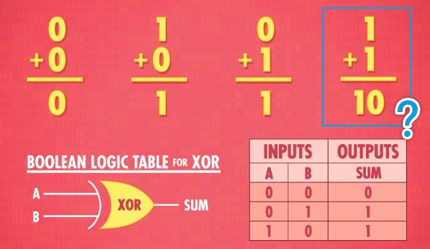
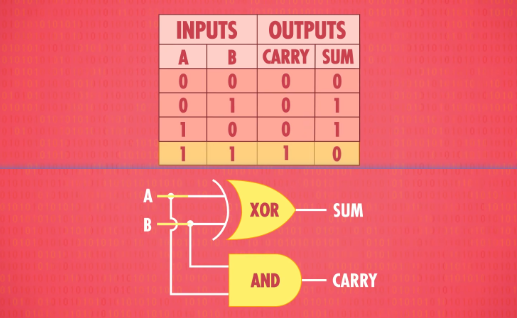
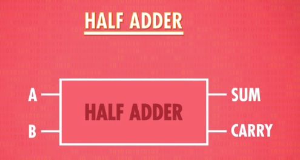
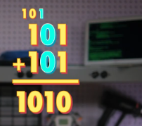
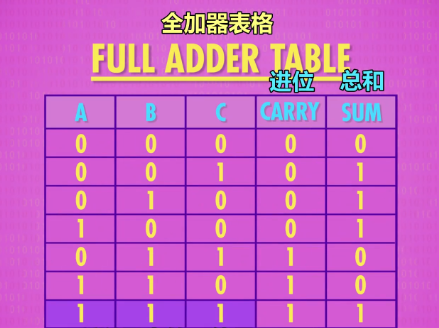
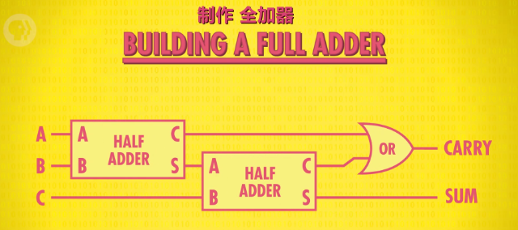
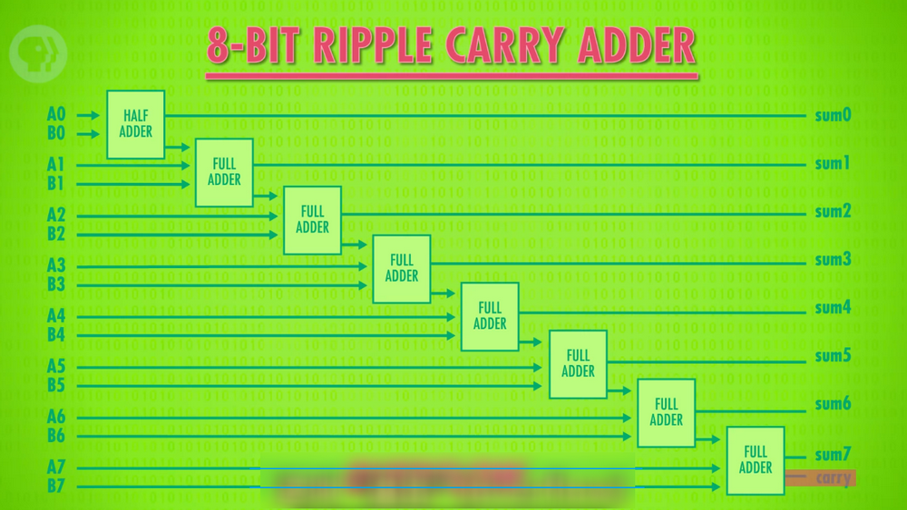
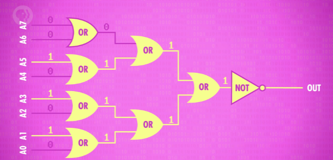

i.e. How Computers Calculate-the ALU

上集，我们谈了如何用二进制表示数字，比如二进制 `00101010` 是十进制的 42，表示和存储数字是计算机的重要功能。但**真正的目标是计算（computation）**，有意义的处理数字，比如把两个数字相加，这些操作由计算机的 "算术逻辑单元 （Arithmetic and Logic Unit）"处理，但大家会简称：ALU。

**ALU 是计算机的数学大脑，等你理解了 ALU 的设计和功能之后，你就理解了现代计算机的基石。**

ALU 就是计算机里负责运算的组件，基本其他所有部件都用到了它，先来看看这个美人。这可能是最著名的 ALU，英特尔 74181 。1970 年发布时，它是第一个封装在单个芯片内的完整 ALU ，这在当时是惊人的工程壮举。
 
  

`> 英特尔 74181`

今天我们用上周学的布尔逻辑门，做一个简单的 ALU 电路，功能和 74181 一样。然后接下来几集，用它从头做出一台电脑，所以会有点复杂，但我觉得你们搞的定。

<!--more-->

ALU 有 2 个单元，1 个算术单元和 1 个逻辑单元。

## 算术单元

我们先讲"算术单元"，它负责计算机里的所有数字操作。比如加减法，它还做很多其他事情，比如给某个数字+1，这叫增量运算，我们之后会说。

**今天的重点是一切的根本 - "把两个数字相加" 。**

我们可以用单个晶体管一个个拼，把这个电路做出来，但很快就会复杂的难以理解，所以与其用晶体管，我们会像第 3 集 - 用更高层的抽象，用逻辑门来做。我们会用到 AND，OR，NOT 和 XOR 逻辑门，最简单的加法电路， 是拿 2 个 bit 加在一起（bit 是 0 或 1），有 2 个输入：A 和 B， 1 个输出：就是两个数字的和。需要注意的是：`A, B, 输出` ，这 3 个都是单个 Bit （ 0 或 1 ）。

  

输入只有四种可能： 

前三个是 `0 + 0 = 0 、 1 + 0 = 1 、0 + 1 = 1` 。记住二进制里，1 与 true 相同，0 与 false 相同，这组输入和输出，和 XOR 门的逻辑完全一样，所以我们可以把 XOR 用作 1 位加法器（adder）。

但第四个输入组合，1+1 是个特例 `1 + 1 = 2`（显然），但二进制里没有 2，上集说过，二进制 1+1 的结果是 0，1 进到下一位，和是 10 （二进制）。

  

`> 1 + 1 = 10 呢 ？`

XOR 门的输出，只对了一部分， 1+1 输出 0 ，但我们需要一根额外的线代表 "进位"，只有输入是 1 和 1 时，进位才是 "true" ( 也就是 1 )。因为算出来的结果用 1 个 bit 存不下，方便的是，我们刚好有个逻辑门能做这个事！没那么复杂 - 就两个逻辑门而已。

  

`> 1 + 1 = 10 了（CARRY = 1, SUM = 0）`

让我们抽象化。

把 "半加器" 封装成一个单独组件 - 两个输入 A 和 B 都是 1 位 ，两个输出 "总和" 与 "进位"，这进入了另一层抽象。

  

`> 抽象出了‘半加器’`

如果想处理超过 1+1 的运算，我们需要"全加器"，半加器输出了进位，意味着，我们算下一列的时候，还有之后的每一列，我们得加 3 个位在一起，并不是 2 个。

  

全加器复杂了一点点。

全加器表格，有 3 个输入：A, B, C （都是 1 个 bit)，所以最大的可能是 1 + 1 + 1，"总和"1 "进位"1 ，所以要两条输出线： "总和"和"进位" 。

  

我们可以用 半加器 做 全加器，我们先用半加器将 A 和 B 相加，然后把 C 输入到第二个半加器，最后用一个 OR 门检查进位是不是 true，这样就做出了一个全加器！

  

`> Emm... ‘全加器’的诞生`

我们可以再提升一层抽象，把全加器作为独立组件。全加器会把 A，B，C 三个输入加起来，输出 "总和" 和 "进位"。

  

现在有了新组件，我们可以相加两个 8 位数字。叫两个数字叫 A 和 B 好了，我们从 A  和 B 的第一位开始，叫 A0 和 B0 好了，现在不用处理任何进位，因为是第一次加法，所以我们可以用半加器，来加这 2 个数字，输出叫 sum0 ；现在加 A1 和 B1，因为 A0 和 B0 的结果有可能进位，所以这次要用全加器，除了 A1 和 B1，还要连上进位，输出叫 sum1 ；然后，把这个全加器的进位连到下个全加器的输入，处理 A2 和 B2；以此类推，把 8 个 bit 都搞定…… 注意每个进位是怎么连到下一个全加器的，所以叫 **"8 位行波进位加法器"** ，注意最后一个全加器有 "进位" 的输出。如果第 9 位有进位，代表着 2 个数字的和太大了，超过了 8 位，这叫 **"溢出"** (overflow)。一般来说 "溢出" 的意思是，两个数字的和太大了，超过了用来表示的位数，这会导致错误和不可预期的结果。

  

`> 8 位行波进位加法器`

著名的例子是，吃豆人用 8 位存当前关卡数，如果你玩到了第 256 关（ 8 位 bit 最大表示 255），ALU 会溢出，造成一连串错误和乱码（glitches），使得该关卡无法进行，这个 bug 成了厉害吃豆人玩家的代表。如果想避免溢出，我们可以加更多全加器，可以操作 16 或 32 位数字，让溢出更难发生，但代价是更多逻辑门，另外一个缺点是，每次进位都要一点时间，当然时间不久，因为电子移动的很快，但如今的量级是每秒几十亿次运算，所以会造成影响。所以，现代计算机用的加法电路有点不同，叫 "超前进位加法器"。它更快，做的事情是一样的 - 把二进制数相加。

  

`> 牛‘爆’的吃豆人`

ALU 的算术单元，也能做一些其他数学运算，一般支持这 8 个操作 - 见下图。

*=哪 8 个 ❓*

  

就像加法器一样，这些操作也是由逻辑门构成的。有趣的是，你可能注意到没有乘法和除法。因为简单的 ALU 没有专门的电路来处理，而是把乘法用多次加法来实现。假设想算 `12 x 5` ，这和把 "12" 加 5 次是一样的，所以要 5 次 ALU 操作来实现这个乘法。很多简单处理器（processors）都是这样做的，比如恒温器，电视遥控器和微波炉，慢是慢，但是搞的定。然而笔记本和手机有更好的处理器，有专门做乘法的算术单元，你可能猜到了，乘法电路比加法复杂 - 没什么魔法，只是更多逻辑门，所以便宜的处理器没有。

*=是的，只是逻辑门而已 ✔️*

好了，我们现在讲 ALU 的另一半：逻辑单元。

## 逻辑单元

逻辑单元执行逻辑操作，比如之前讨论过的 AND，OR 和 NOT 操作，**它也能做简单的数值测试**，比如一个数字是不是负数。

例如，这是检查 ALU 输出是否为 0 的电路，它用一堆 OR 门检查其中一位是否为 1，哪怕只有一个 Bit （位） 是 1，我们就知道那个数字肯定不是 0，然后用一个 NOT 门取反，所以只有输入的数字是 0，输出才为 1 。

  

`> 检查 ALU 输出是否为 0 的电路`

以上就是 ALU 的一个高层次概括。

## ALU

我们甚至从零做了几个主要组件，比如行波进位加法器（ripple adder），**它们只是一大堆逻辑门巧妙的连在一起而已**。

让我们回到视频开始时的 ALU，英特尔 74181，和我们刚刚做的 8 位 ALU 不同，74181 只能处理 4 位输入。也就是说，你刚做了一个比英特尔 74181 还好的 ALU ！

其实 差不多啦。我们虽然没有全部造出来，但你理解了整体概念。

74181 用了大概 70 个逻辑门，但不能执行乘除。但它向小型化迈出了一大步，让计算机可以更强大更便宜。4 位 ALU 已经要很多逻辑门了，但我们的 8 位 ALU 会需要数百个逻辑门。工程师不想在用 ALU 时去想那些事情，所以想了一个特殊符号来代表它，看起来像一个大 "V" 。

又一层抽象！

我们的 8 位  ALU 有两个输入，A 和 B，都是 8 位 (bits)。

  

**我们还需要告诉 ALU 执行什么操作** ，例如加法或减法，所以我们用 4 位的操作代码。我们之后的视频会再细说。简言之，"1000"可能代表加法命令，"1100"代表减法命令，操作代码告诉 ALU 执行什么操作，输出结果是 8 位的。ALU 还会输出一堆标志（Flag），"标志"是 1 位的，代表特定状态。比如相减两个数字，结果为 0 ，我们的零测试电路（前面做的）会将 `零标志` 设为 True（1），如果想知道两个数字是否相等，这个非常有用。如果想知道： A 是否小于 B，可以用 ALU 来算 A 减 B，看 `负标志` 是否为 true 。如果是 true，我们就知道 A 小于 B 。最后，还有一条线连到加法器的进位，如果有溢出，我们就知道，这叫 `溢出标志` 。

高级 ALU 有更多标志，但这 3 个标志是 ALU 普遍用的。其实，我们之后的视频会用到它们。

现在你知道了，计算机是怎样在没有齿轮或杠杆的情况下进行运算。
 
接下来两集，我们会用 ALU 做 CPU ，但在此之前，计算机需要一些 "记忆" ！

我们下周会讲。
