i.e. Registers and RAM

上集，我们用逻辑门做了个简单 ALU，它能执行算术 (Arithmetic) 和逻辑 (Logic) 运算 ，ALU 里的 A 和 L 因此得名。当然，算出来之后如果扔掉就没什么意义了，得找个方法存起来，可能还要进行多个连续操作，这就用到计算机内存了。

*=算出来，存起来。* 

如果你在主机上打过一场长时间的对局，或玩困难模式的 "扫雷"（Minesweeper），然后狗跑过来，被电源线绊倒，把插头拔了出来，你知道失去进度的痛苦 😈 真同情你 :(

<!--more-->

你损失数据的原因是，电脑用的是"随机存取存储器"，简称"RAM"（Random Access Memory），它只能在有电的情况下存储东西，比如游戏状态，另一种存储 (memory) 叫持久存储，电源关闭时数据也不会丢失，它用来存其他东西，我们之后会讨论存储 (memory) 的持久性问题。

今天我们从简单开始 - 做只能存储 1 位的电路，之后再扩大，做出我们的内存模块，下次和 ALU 结合起来，做出 CPU ！

## 只能存储 0 和 1 的电路

我们至今说过的电路都是单向的 - 总是向前流动，比如上集的 8 位 "脉动进位加法器"。但也可以做回向电路，把输出连回输入。

我们拿一个 OR 门试试，把输出连回输入，看看会发生什么。

首先，两个输入都设为 0 ，"0 OR 0" 是 0，所以电路输出 0 ；如果将 A 变成 1 ，"1 OR 0" 为 1，所以输出 1 ；一转眼的功夫，输出回到 B ，OR 门看到两个输入都是 1 ，"1 OR 1" 仍然为 1，所以输出不变 。 如果将 A 变成 0，OR 门依然输出 1 ，现在我们有个电路能记录 "1" ，然而有个小问题：这是永久的 ！ 无论怎么试，都没法从 1 变回 0 。

我们换成 AND 门看看会怎样。

开始时，A 和 B 都设 1 ，"1 AND 1" 永远输出 1 ；如果之后 A 设为 0，由于是 AND 门，输出会变成 0 ，这个电路能记录 0，和之前那个相反。就像之前，无论 A 设什么值，电路始终输出 0 。

现在有了能存 0 和 1 的电路。

*=或门存 1 ，与门存 0*  

## 锁存器

为了做出有用的存储 (memory)，我们把两个电路结合起来，这叫 **"AND-OR 锁存器"** 。它有两个输入："设置"输入，把输出变成 1；"复位"输入，把输出变成 0 。如果"设置"和"复位"都是 0，电路会输出最后放入的内容，也就是说，它存住了 1 位的信息！

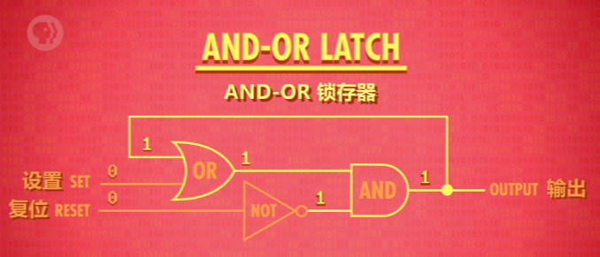  

`> AND-OR 锁存器`

存储！这叫"锁存"（latch）, 因为它"锁定"了一个值。放入数据的动作叫 "写入"，拿出数据的动作叫 "读取"。现在我们终于有办法存一个位了！超棒 ！

麻烦的是，用两条线 "设置"和"复位" 来输入，有点难理解。

⬇️ ⬇️ ⬇️ 

为了更容易用，我们希望只有一条输入线，将它设为 0 或 1 来存储值；还需要一根线来"启用"内存，启用时允许写入，没启用时就 "锁定" - 这条线叫 **"允许写入线"**。加一些额外逻辑门，可以做出这个电路，这叫 **"门锁"**，因为门可以打开和关上。

<div class="oh-essay">
1. 写什么 （0、1） <br>
2. 是否允许写入
</div>

现在有点复杂了，我们不想关心单独的逻辑门，所以我们提升一层抽象。

把 "门锁" 放到盒子里 - 这个盒子能存一个 bit 。

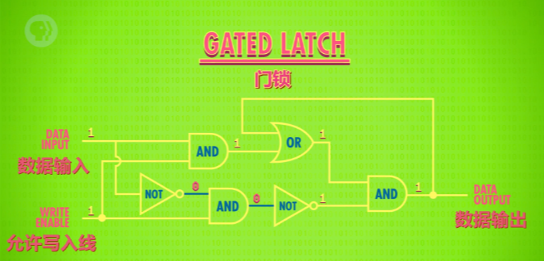  

`> 门锁`

我们来测一下新组件！一切从 0 开始，数据输入从 0 换到 1, 从 1 换到 0，什么也不会发生 - 输出依然是 0，因为 "允许写入线" 是关闭的，所以内容不会变化。所以要给 "允许写入线" 输入 1, "打开" 门，现在往 "数据线" 放 1，1 就能存起来了，注意输出现在是 1 了，成功！现在可以关掉 "允许写入线" ，输出会保持 1，现在不管给 "数据线" 什么值，输出都不会变。值存起来了！现在又打开 "允许写入线" "数据线" 设为 0，完成，"允许写入线" 关闭，输出 0，成功了！

*=不难发现，允许写入线关闭的时候，上面的 AND 门输出总为 0 。* 

## 寄存器

当然，只能存 1 bit 没什么大用，肯定玩不了游戏，或做其它事情，但我们没限制只能用一个锁存器。如果我们并排放 8 个锁存器，可以存 8 位信息，比如一个 8 bit 数字，一组这样的锁存器叫 **"寄存器"** 。寄存器能存一个数字，这个数字有多少位，叫 **"位宽"** 。

*=寄存器的‘位宽’就是你放了多少个‘锁存器’~~* 

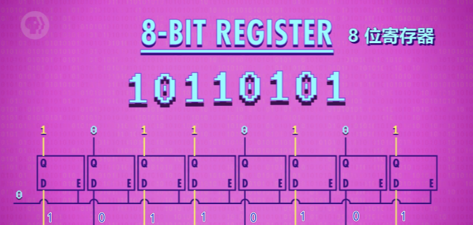  

`> 8 位寄存器 -> D 数据输入 Q 数据输出 E 允许写入线`

早期电脑用 8 位寄存器，然后是 16 位，32 位，如今许多计算机都有 64 位宽的寄存器。写入寄存器前，要先启用里面所有锁存器，我们可以用一根线连接所有 "允许写入线", 把它设为 1 ，然后用 8 条数据线发数据，然后将 "允许写入线" 设回 0 ，现在 8 位的值就存起来了。

如果只有很少的位 (bits)，把锁存器并排放置，也勉强够用了。

64 位寄存器要 64 根数据线，64 根连到输出端。幸运的是，我们只要 1 根线启用所有锁存器，但加起来也有 129 条线了。如果存 256 位要 513 条线！而这需要不少的钱 💵，怎么办？解决方法是矩阵！

*=哈，二维化！* 

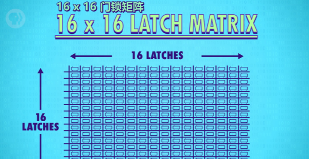  

`> 16*16 门锁矩阵`

在矩阵中，我们不并列排放锁存器，而是做成网格，存 256 位，我们用 16x16 网格的锁存器，有 16 行 16 列，要启用某个锁存器，就打开相应的 行线 和 列线。

放大看看怎么做的。

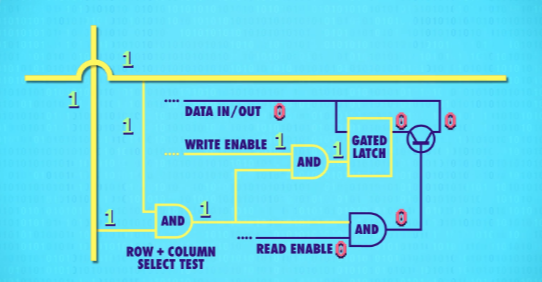  

`> 锁存器`

我们只想打开交叉处锁存器的 "允许写入线"，所有其他锁存器，保持关闭，我们可以用 AND 门！只有 行线和列线 均为 1 ，AND 门才输出 1，所以可以用选择单个锁存器。这种行/列排列法，用一根 "允许写入线" 连所有锁存器，为了让锁存器变成 "允许写入"， **行线，列线和 "允许写入线" 都必须是 1** ，每次只有 1 个锁存器会这样。代表我们可以只用一根 "数据线" 连所有锁存器来传数据。因为只有一个锁存器会启用，只有那个会存数据，其他锁存器会忽略数据线上的值，因为没有 "允许写入"。我们可以用类似的技巧，做"允许读取线"来读数据，从一个指定的锁存器，读取数据。所以对于 256 位的存储，只要 35 条线 - 1 条"数据线", 1 条"允许写入线", 1 条"允许读取线"，还有 16 行 16 列的线用于选择锁存器 （16+16=32, 32+3=35），这省了好多线！🤑

```
💡 看，只需要这些线 ：

> 1  条数据线
> 1  条允许写入线
> 1  条允许读取线
> 16 条行线
> 16 条列线
```

**但我们需要某种方法来唯一指定交叉路口。**

我们可以想成城市，你可能想和别人在第 12 大道和第 8 街的交界碰面 - 这是一个交叉点的地址，我们刚刚存了一位的地址是 "12 行 8 列"，由于最多 16 行，用 4 位就够了，12 用二进制表示为 `1100` ，列地址也可以这样： 8 用二进制表示为 `1000` ，刚才说的"12 行 8 列"可以写成 `11001000` 。

为了将地址转成行和列，我们需要 **"多路复用器"** - 这个名字起码比 ALU 酷一点，多路复用器有不同大小，因为有 16 行，我们需要 1 到 16 多路复用器。工作方式是：输入一个 4 位数字，它会把那根线，连到相应的输出线，如果输入 0000，它会选择第一列，如果输入 0001，会选择下一列，依此类推…… 

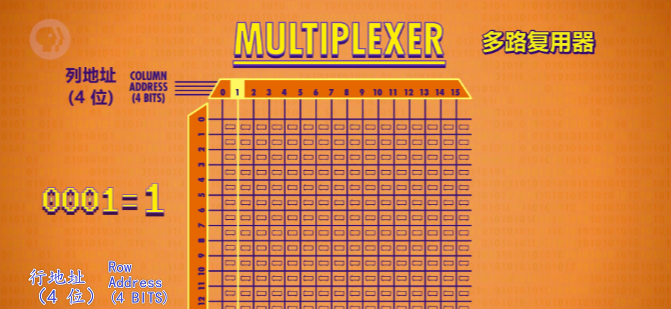  

`> 会‘寻址’的多路复用器`

一个多路复用器处理行 (row) ，另一个多路复用器处理列 (column)。

好吧，开始有点复杂了，那么把 256 位内存当成一个整体好了。 **又提升了一层抽象！** 它输入一个 **8 位地址** ：4 位代表列，4 位代表行（`纵横经纬，用来唯一确定启动的锁存器位置`）。我们还需要 "允许写入线" 和 "允许读取线"，最后，还需要一条数据线，用于读/写数据 。

*=💡 提示，这个 **‘8 位地址’** 的含义是 - 定位使用 256 个锁存器中的哪一个。也就是说，虽然我们的 256 位‘寄存器’包含 256 个锁存器，但是同一时间，我们只能使用其中地址相对应的那一个而已。即同一时间，只能存储 1bit 的数。*

*=~~❓ 这里可能会产生疑惑？既然只能存 1bit 的数，为什么不直接使用 1 个锁存器来存储？？？~~* 

  


*=**关于‘寄存器’和‘内存’的区别，需要留意一下。‘寄存器’一般是指 CPU 上的高速存储，造价不菲，一般不大（128M 都算很大的了），‘内存’你可以理解为内存条，即 RAM ，造价相对便宜，常见单条有 8G 、16G 了。*** 

## 可寻址内存

不幸的是，256 位的内存也没法做什么事，所以还要扩大规模，把它们并排放置，就像寄存器一样。一行 8 个，可以存一个 8 位数字，8 位也叫一个字节（byte）。为了存一个 8 位数字，我们同时给 8 个 256 位内存一样的地址，每个地址存 1 位，意味着这里总共能存 256 个字节 （byte）。

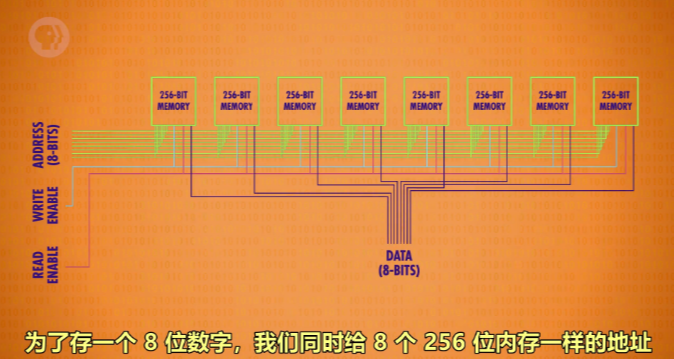  

`> 看，我们获得了一个 1 byte(8 bit) 大小的可寻址内存了`

*=这里，我们将 8 个 ‘256 位的寄存器’并排连接，就可以存储 8 bit 的数。这个数的每一位，分别存在 ‘8 位地址’对应的 8 个 256 位寄存器的相应的锁存器中。* 

*=❕ 也就是说，上图中的 ‘8 个并排寄存器’ ，共有 256 个 8 位地址，每个地址可以存储 1 byte(8 bit) 的数，最多可以存储 256 byte 的数。看，锁存器还是得到了充分利用的，这就解答了上面的疑问。* 

*=好的吧，其实这里我是有点震惊的！原来一个 8 位可寻址内存就需要用 8 个 256 内存，每个内存的相同行列处（相同地址）的锁存器启用 - 存储 1 bit 。*

再次，为了简单，我们不管内部，不看作是一堆独立的存储模块和电路，而是看成一个整体的 **可寻址内存** 。我们有 256 个地址，每个地址能读或写一个 8 位值。

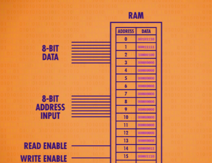  

`> 256 byte 大小的内存 - 又抽象了`

*=上图其实就是前面 8 个并排‘256 位寄存器’的抽象。* 

我们下集做 CPU 时会用到这个内存。

现代计算机的内存扩展到上兆字节（MB）和千兆字节（GB）的方式，和我们这里做的一样，不断把内存打包到更大规模。随着内存地址增多，内存地址也必须增长。**8 位最多能代表 256 个内存地址**（`1111 1111` 是 255，0~255 一共 256 个数字），只有这么多。要给千兆或十亿字节的内存寻址，需要 32 位的地址。

*=额，指数级增长，就离谱！指数 🐮 🍺 !*

内存的一个重要特性是：可以随时访问任何位置，因此叫 "随机存取存储器" ，简称 RAM 。

当你听到有人说 RAM 有多大，他的意思是内存有多大。RAM 就像人类的短期记忆，记录当前在做什么事。比如吃了午饭没，或有没有交电话费。

这是一条真的内存，上面焊了 8 个内存模块。

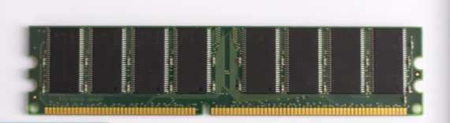  

如果打开其中一个，然后放大，会看到 32 个内存方块。

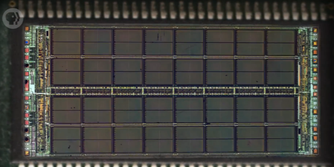  

`> 其中一个芯片`

放大其中一个方块，可以看到有 4 个小块。

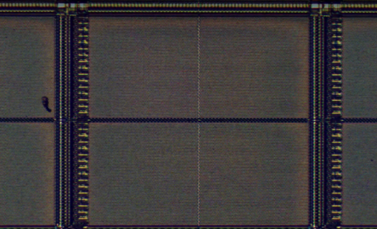  

如果再放大，可以看到存一个"位"的矩阵，这个矩阵是 128 位 x 64 位，总共 8192 位。

*=哈哈，这里很好的解答了阅览前方内容时产生的一个疑惑，是矩阵，而不一定是方阵。* 

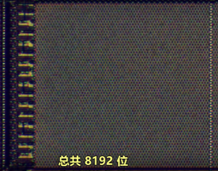  

每个方格 4 个矩阵，所以一个方格有 32768 个位 （8192 x 4 = 32768），而一共 32 个方格。总而言之，1 个芯片大约存 100 万位。RAM 有 8 个芯片，所以总共 800 万位，也就是 1 兆字节（1 MB）。

1 MB 如今不算大 - 这是 1980 年代的 RAM。

*=现在基本是 8G 、16G 大小的了，那么一个 16G 大小的内存就有 16 * 1024 * 1024 * 8 = 2^27 = 134,217,728 位。* 


*=目前最大为单条 64G，也就是 2^29 位，理论上目前电脑支持的最大运行内存为 128G （2^30）。*

如今你可以买到千兆字节（GB）的 RAM，那可是数十亿字节的内存。

今天，我们用锁存器做了一块 SRAM（静态随机存取存储器），还有其他类型的 RAM，如 DRAM，闪存和 NVRAM ，它们在功能上与 SRAM 相似，但用不同的电路存单个位 - 比如用不同的逻辑门，电容器，电荷捕获或忆阻器。但根本上，这些技术都是矩阵层层嵌套，来存储大量信息。 **就像计算机中的很多事情，底层其实都很简单，让人难以理解的，是一层层精妙的抽象。**

像一个越来越小的俄罗斯套娃。

下周见。

*=该部分的内存相对来说是有些抽象的，尤其是一些相关的概念可能会混淆 - 如‘寄存器’和‘内存’，它们的原理是一样的，只有‘寄存器’用的材料更好更贵，当然速度也更快。文章的后半部分，我们在纸上模拟出了一块可以存储 256 byte 的内存（8 个并排的 256 位寄存器组成 - 同样，这里用寄存器来描述好像是不太准确）。在真实的示例中，我们也看到了可以存储 1MB 的内存条组成。只能说，学无止境哦！不过基本原理相对来说是简单的，不得不说，现在的许多计算机课程跑偏的挺厉害的，基础原理和应用才是永远的神！* 
