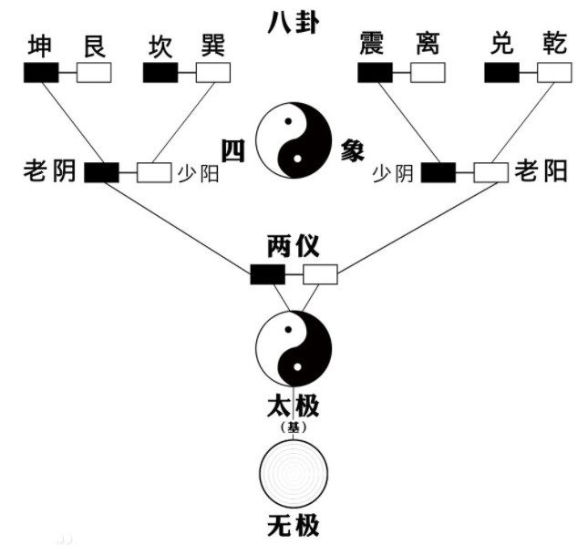
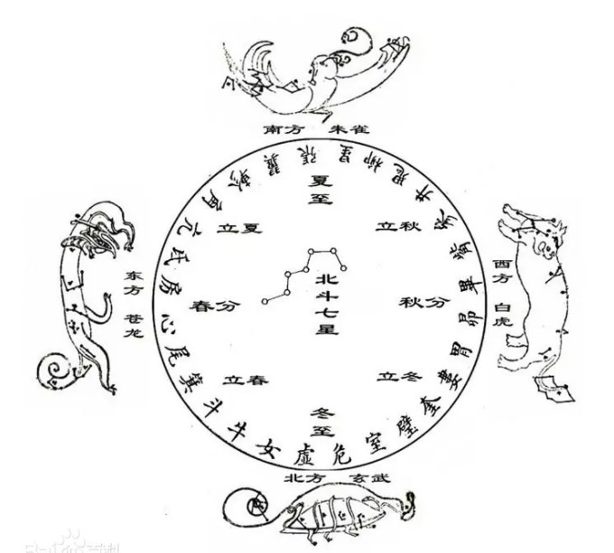
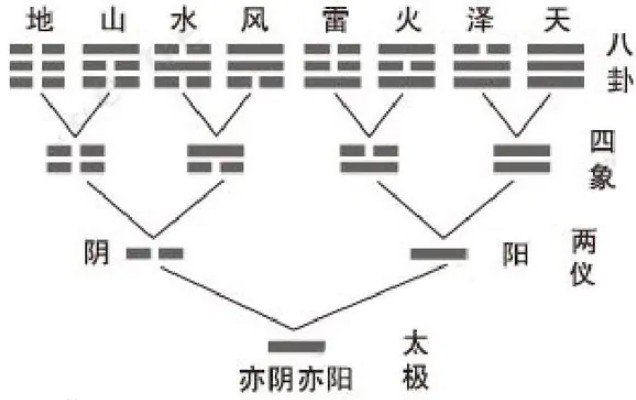
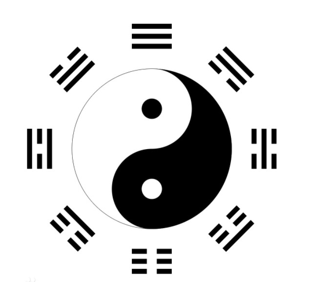
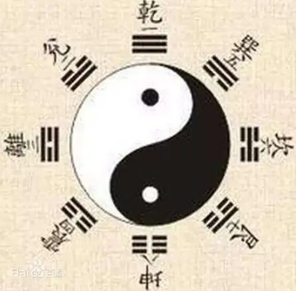
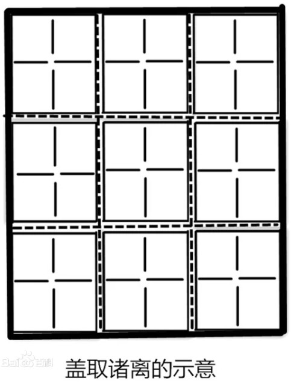
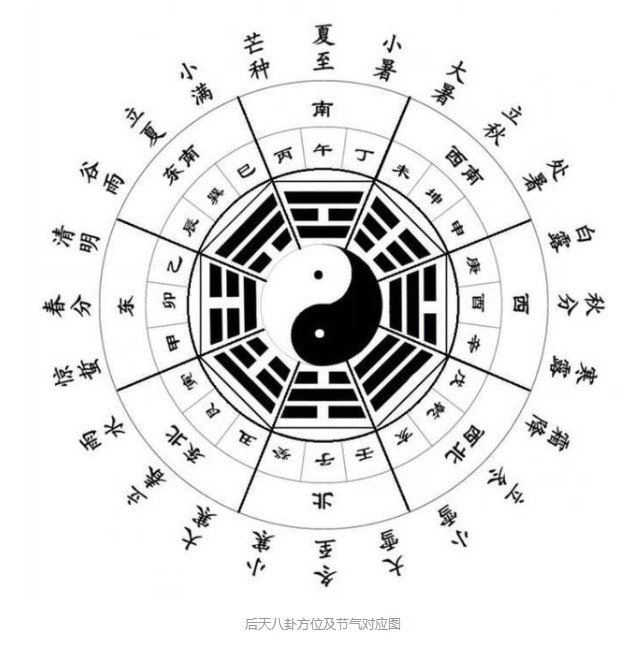
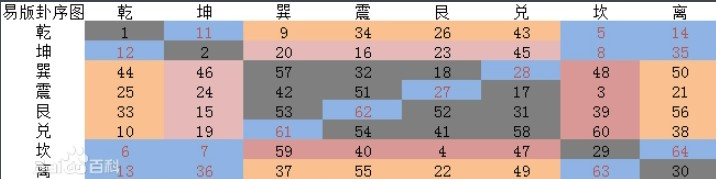

> “道可道，非常道。名可名，非常名。”
> 
<!--more-->

## 无极[1]

*_无极，是道家的概念，指无形无象的宇宙原始状态。* 由收敛自然而然彰显出发散的状态。

<div class="oh-essay">
时空穿梭的极大魅力所在 -- 你可以亲眼看到！宇宙之初，有时、空吗？时、空的源头是什么呢？
</div>

“无极”出自《道德经》，一种古代哲学思想，指称道的终极性的概念，代表着上古华人对事物产生之前状态的抽象理解。

数学的运算过程本质上就是收敛与发散的过程。古人称收敛与发散这对矛盾为“阴阳”。收敛与发散是宇宙间最本质的矛盾，其他一切的矛盾都是在收敛与发散的基础上通过组合与迭代形成的，比如善恶、有无、动静等等。收敛可以自然而然彰显出发散就是“无极”，所以有了老子给出的“知其白，守其黑，为天下式。为天下式，常德不忒，复归于无极”的定义。《道德经》本身就是以“无极”为核心思想建立辩证法的书，不知“无极”，那么对“有无”“无为”“道德”的解释就都是无根之谈。

<div class="oh-essay">
谁能想到，竟然对数学学习还有启发……
</div>

现代科学认为：宇宙还未诞生，虚无缥缈，宇宙还处于一种没有前后，没有左右，没有上下，没有中心，没有边界的混沌状态。这与上古华人对宇宙大爆炸之前的状态的抽象理解不谋而合。（古圣先贤把这种抽象理解的混沌状态称之为“无极”。）

---

发散和收敛是“阳”与“阴”的本质，也是宇宙间最基本的矛盾，有与无、善与恶、动与静、外与内、正与反、前与后、荣与辱、明与暗、直与曲、实与虚、突破与积累、张扬与谦虚、散发与收藏等矛盾都是在发散与收敛的基础上建立的。科学也是如此，作为自然科学基础的数学的运算过程本身就是一个发散和收敛的过程。

在“阴阳”的基础上可以给出“无极”的定义：阳代表的发散和阴代表的收敛是宇宙间最基本的矛盾，阴的收敛自然而然的便会彰显出阳的发散，从而使二者即对立又统一，处于一种由至阴而彰显至阳的“无极”状态。

“无极”的状态是收敛而来的，收敛会导致消失，所以代表“无”。

根据质量守恒定律和能量守恒定律可知，在一个系统内，守恒是一个重要的性质。那么，当代表阴的黑色不再保持其收敛的本性而开始发散从而彰显时，此消彼长，代表阳的白色也要相应的收敛来保持守恒，从而你中有我、我中有你，阴阳双方相互运动、相互作用、相互转换，形成了“太极”。

“太极”是由发散得到的，发散便会彰显，所以代表“有”。

道家认为单纯的白色就是“无极”（也被称为先天太极），而世人所熟知的太极阴阳鱼则被称为“太极”（也被称为后天太极），黑色从白色中显现并最终形成太极阴阳鱼的过程便是“无极生太极”。这也是“自无极而为太极”的道理。

本质规律是收敛于内的“无”（负阴），外在现象是发散于外的“有”（抱阳），本质规律决定外在现象，本来互相冲突、矛盾、对立的阴阳二气（冲气）因为各自遵从本性的行为反而能相合（以为和），收敛自然而然会彰显出发散，阴阳既对立又统一，这就是“万物负阴而抱阳，冲气以为和”的道理。

---

以“无极”为基本观得出了在哲学上普遍性达到极限程度的辩证法规律只有一个，即以“无极”为本质的对立统一规律。

量变质变规律和否定之否定规律是对立统一规律的表现形式：量变是一个积累的过程，积累是收敛的一种表现形式，质变是一个突破的过程，突破是发散的一种表现形式；为了达到质变的目的，需要通过长期的曲折方式在量变的过程中积累足够的条件，“曲折”的出现是因为质变的目标虽然是“直”的，但是积蓄力量、等待时机的量变过程具有隐藏、蛰伏、迂回、示弱、积累、浓缩等收敛性，是一个由收敛自然而然彰显出发散的过程，也是一个“累曲为直”的过程。

<div class="oh-essay">
教员的矛盾论也是对立统一的集大成者！
</div>

对立统一、量变质变和否定之否定规律之间的关系也可以看作是“天地人”的关系。

对立统一规律天生存在于万事万物之中，是“天”。对立统一规律在事物发展上的基本表现形式是量变质变规律，所以量变质变规律是“地”。“天”与“地”的存在都是不以人类意志而改变的，人类的主观能动性只能影响否定之否定的过程，即曲折的量变过程要持续多久、要如何进行曲折的量变、曲折的量变最终能不能达到质变这个“直”的要求，可以受到人类主观能动性的影响，所以否定之否定规律是“人”。

以“无极”为核心思想可以将对立统一、量变质变和否定之否定规律紧密的联系在一起，体现着联系的普遍性。

---

“无极”代表的是对立统一的本质，是收敛而来的，是对立统一静止的、绝对的、先天的状态，是“无”；“太极”代表的是对立统一的表现形式，是发散而来的，是对立统一运动的、相对的、后天的状态，是“有”。

<div class="oh-essay">
无极者，极限的收敛，以至于无。
</div>

了解了二者的辩证关系，《道德经》中 “无为”“有无相生”“天下万物生于有，有生于无”“有物混成，先天地生”“无，名天地之始；有，名万物之母。故常无，欲以观其妙；常有，欲以观其徼。此两者同出而异名，同谓之玄”“反者道之动”等理念就都很容易理解了。可见，《道德经》是一部以“无极”为核心思想组建辩证法的书。

<div class="oh-essay">
太极之图，也是为了便于人们理解的象，是理，真正的太极，阴阳浑然天成，并没有什么界限。
</div>

## 太极[2]

所谓太极即是阐明宇宙从无极而太极，以至万物化生的过程。其中的太极即为天地未开、混沌未分阴阳之前的状态。

易经系辞：“是故易有太极，是生两仪”。两仪即为太极的阴、阳二仪。“太极”是易学的基本概念，最初见于《上系》：“易有太极，是生两仪，两仪生四象，四象生八卦，八卦定吉凶，吉凶生大业。”同时与“大衍筮法”相关，即《上系》所载：“大衍之数五十，其用四十有九。分而为二以象两，挂一以象三，揲之以四，以象四时，归奇于扔以象闰。五岁再闰，故再扐而后挂……是故四营而成易，十有八变而成卦。”围绕大衍筮法，历代以不同侧重对太极的哲学涵义进行了探索。

<div class="oh-essay">
吉凶者，顺逆也。
</div>

---

太极是中国文化史上的一个重要概念、范畴，就迄今所见文献看，《易传》：“易有太极，是生两仪。两仪生四象，四象生八卦。“太极观念这种迷离恍惚地看待万事万物的现象和本质的人生态度，以及这种思维方式本身，实则包含着清醒睿智的哲思，其终极目的是希望人类活动顺应大道至德和自然规律，不为外物所拘，“无为而无不为”，最终到达一种无所不容的宁静和谐的精神领域。

《易系辞传》（西汉马王堆出土版本）记载有“古者伏羲氏之王天下也，仰则观象于天，俯则观法于地，观鸟兽之文与地之宜，近取诸身，远取诸物，于是始作八卦”的内容。意思是成卦的过程，先是有太极，尚未开始分开蓍草（易占卜用蓍草做工具），分蓍占后，便形成阴阳二爻，称做两仪。二爻相加，有四种可能的形象，称为四象。由它们各加一爻，便成八卦。这里讲的是八卦画出的过程。原与天文气象及地区远近方向相关，后来被宋代的理学家以哲理方式进一步阐释。

---

太极，中国古代哲学用以说明世界本原的范畴，“太极”一词出于《系辞上》。“太极”有多重意义：一为生生之源；生生之源的生产方式犹如细胞裂变：一分为二，二分为四，四分为八，八八六十四；生生之源的生生是一个自然过程。

关于太极的含义，有以下几种解释：

（1）指宇亩最初浑然一体的元气。唐颖达《周易正义》：“太极谓天地未分之前，元气混而为一。”《易纬·乾凿度》认为“有形生于无形”，提出“有太易，有太初，有太始，有太素”四阶段来解释“易有太极”。以未见气时为太易，气初为太初，形之始为太始，质之始为太素。气形质混然一体而未分离的状态，称之为浑沌。浑沌之物即是古人所说的元气。以元气未分状态为太极，斌以其原始物质的含义。这种观点在两汉较为普遍，如刘歆：“太极中央元气”；王充引易学家的话说：“元气未分，混沌为一”。郑玄则以“淳合未分之气”解释大极。

（2）以虚无本体为太极，如王弼解释“大衍之数，其一不用”说：“不用而用以之道，非数而数以之成，斯易之太极也。”以“一”为太极，认为此“一”不是数，而是“无”，“无”为四十九之策数形成的根据。韩康伯注释“易有太极，是生两仪”说：“夫有必始于无，故太极生两仪也。”

（3）大衍之数的四十九数未分为太极。崔憬说：“四十九数合而未分，是象太极也。今分而为二，以象两仪矣。分揲其蓍，皆以四为数。一策一时故四策以象四时也。”（李鼎祚《周易集解》引，据《黄氏逸书考》本）崔憬对大衍之数的论述及其太极说，不以不用之一为虚无实体，以四十九数未分为大极，并且认为八卦涵蕴在大衍之数中。此种观点，在易学哲学史上有其重要意义，为宋易将汉易的宇宙生成论转为本体论提供了方法。

（4）以阴阳混合未分为太极。周敦颐《太极图说》：“无极而太极，太极动而生阳，动极而静，静而生阴，静极复动，一动一静，互为其根，分阴分阳。两仪立焉。”周敦颐以后，对太极的解释分为三大流派。a、以邵雍为代表，以数说大极。指出“太极一也，不动生二，神也”；以一分而为奇偶解释太极生两仪。并认为在人则“心为大极”，在天地则“道为太极。”b、以朱熹为代表，以理说太极。“极是道理之极至，总天地万物之理便是太极。”（《朱子太极图说解》）“太极者，其理也。”（《周易本义·系辞上》）太极乃天地万事万物之理的总和，而在具体的事物中也有太极之理。故曰：“人人有一太极，物物有一太极。”（《朱子语类》）c、以张载“一物而两体，其大极之谓与？”为代表，认为无有阴阳，其合一则变化莫测，其对立则相互推移，以此说明太极乃天地万物运动变化的根源。王夫之阐发张载的学说，坚持以对立统一观说太极。断言太极和两仪是体用关系，非父子关系。并认为太极为阴阳二气合一的实体，此实体自身具有运动的本性和变化规律。且寓于天地万物之中，一切现象都是此阴阳统一体不同的表现形式，发挥了以“太和之气”为世界本原的思想。

<div class="oh-essay">
以对立统一观说太极。
</div>

（5）太极也指：“一阴一阳之谓道”也正是对太极的解释。那么何为道呢？指天道，地道，人道。万事、万物都有两面，并且不断的变化，也有一定的关联。天道、地道大家根据科学已经证明并且好理解。关键是人道，人道又主要就是指思想，思想决定了行为、态度。讲的也是大家在尊重自己的思想，尊重自然规律。学会控制情绪，如不生恶念，不怕恶念。探求正确的方法才是我们应该努力。

<div class="oh-essay">
天、地与人，自然与社会者也。天地人，混为社会，人处其中，得道则知顺逆。
</div>

---

一为无；二为阴阳两分而合和；三为生生之源；四为有序运动；五在时间表现为无时不在，在空间上表现为无处不在；六位于形而上却体现在形而下。

太极无形无体。无，不意味着绝对空虚，不意味着有无相对相应。太极之无，充满着无限生机；太极之无，实际之有无法与之相对相应。无中生有，生出了天地万物与最初的一男一女。无之广大，成千上万个太阳系都可以轻松地容纳其中。

太极阴阳两分而合和。太极，外表现为阴阳合和之大一，内表现为阴阳两分。一分为二又合二而一。两个元素之间相互矛盾又相互依存，须臾不可分离。合则生，散则死。

生生之源。太极的出现，意味着中华民族找到了形而上的造物主——生生之源。在造物功能上，太极相似于《圣经》中的上帝。太极之生生，《系辞》表述为“一生二，二生四，四生八，八八六十四”；《道德经》则表述为“道生一，一生二，二生三，三生万物。”

有序运动。绝对之动，相对之静，是太极的运动特征。太极之动，是有序的运动。运动的方式，《周易》界定为“反复”与“原始反终”，《道德经》界定为“反动”。太极之动，一是有序运动，二是整体运动。在有序运动之中，太极及其衍生物保持着整体性与系统性。八卦与六十四卦，独立之卦并不独立存在，牵一发而动全身。在八卦之中，一可以看到两两相互交合之动，二可以看到整体圆周循环之动。六十四卦之中，还可以看到一卦之中的穷上返下之动。八卦有序之动，展现出了春夏秋冬和东西南北。有序之动，不离时空。

太极在时间上表现为无始无终，在空间上表现为无处不在。眼睛看不到它，但它确实存在。
太极位于形而上，但在形而下的万事万物之中处处可以看到太极。由太极衍生出来的天地万物以及一男一女，不但不能脱离母体，而且处处反映出了母体的特征——一阴一阳。

---

何谓太极，先哲解释不一。虞翻说：“太极，太一也。”韩康伯说：“太极者，无称之称。”孔颖达说：“太极即是太初太一也。”苏子瞻说：“太极者，有物之先也。”朱熹说：“太极者，理也。”来知德说：“太极者，至极之理也。”焦循说：“太极犹言大中也。”各家注解虽不相同，其实都以太极为天地人物的本有之体，简称为本体，此体圆含无穷的形象与无尽的功用，本体形象功用不相分离。不学周易，不明易理，则不知吾人本有此体，不知万物皆备于我，以致凡事舍本逐末，向外驰求，造成一己与群众的种种灾祸。学易明理，则能趋吉避凶。凶之最大者为生死问题不能解决，吉之最大者即是学为圣人。欲学圣人，必须先求解决生死问题。《论语》记载，子路问死，孔子解答：“未知生，焉知死。”有生始有死，欲知如何解决死的问题，必须了解生的来源，生的来源就是太极。

太极生两仪者，太极寂然不动，本无形象，唯为清净光明之体，此为无生之理性。动则显象起用，乃名为生。所生之象，其数无穷，但始动之际，只有一明一暗两种形色，明色为阳，暗色为阴，因此称为阴阳两仪，仪如《孔氏正义》所释，作容仪讲，因其尚未成象，故不称为两象，只称两仪。但这两仪实为四象以至万象的基本结构，万象即由两仪细分而成，所以万象无不有阴阳两仪。万象之数虽然无穷，但基本之数则为阳奇阴偶。伏羲氏画卦时便发明极为简单的两画，以示无穷无尽的象数之源。

## 两仪[3]

两仪，是中国道教文化术语，在中国古典哲学中指的是“阴阳”，主要为黑白双色，乃大道之本。天地初开，一切皆为混沌，是为无极，无极生太极，太极生两仪，两仪为阴阳。《易经》：“易有太极，始生两仪，两仪生四象，四象生八卦。”

两仪在《易经》中指阴、阳。

关于“两仪”之说，综合历代易学家的理论，计有八说：一说为阴阳，一说为天地，一说为奇偶，一说为刚柔，一说为玄黄，一说为乾坤，一说为春秋，一说为不变与变。但通常都是指阴阳。天地万物，世间万事，古人概之为：阴阳。阴阳也是天地出分之时，清气向上为天。浊气向下为地。天为阳，地为阴。天地万物，世间万事，古人概之为：阴阳。

<div class="oh-essay">
两仪者，相对之表，交互之源也。
</div>

<div class="oh-essay">
阴、阳两字的古义是背日和向日，起初并无任何哲学内涵。阴，《说文解字》曰：“暗也，水之南、山之北也”，《说文系传》 曰：“山北水南，日所不及”。阳，《说文解字》曰：“高明也。”《说文解字义证》：“高明也，对阴言也。”
</div>



无极是空，太极是圆，两仪是黑白，四象是老阴少阳老阳少阴。至此，道生一，无极变太极；一生二，太极变两仪；二生三，两仪变四象；三生万物，四象旋转，世界诞生。八卦，正如其名，是对宇宙后续变化的推演。

---

阴阳是“对立统一或矛盾关系”的一种划分或细分，两者是种属关系。中国的传统学术中，有所谓“孤阴不生，独阳不长”及“无阳则阴无以生，无阴则阳无以化”的观念。老子在《道德经》中说：“道生一，一生二，二生三，三生万物。万物负阴而抱阳，冲气以为和”。

阴阳的特性如下：

两者互相对立：万物皆有其互相对立的特性。如热为阳，寒为阴；天为阳，地为阴，说明了宇宙间所有事物皆对立存在。然这种相对特性并非绝对，而是相对。如上为阳，下为阴，平地相对于山峰，山峰为阳，平地为阴；但平地若相对于地底，则平地属阳、地底属阴，可见阴阳的相对性关系。

两者相互依靠、转化、消长：阴阳存在着互根互依，互相转化的关系，阴中有阳，阳中有阴，任何一方都不可能离开另一方单独存在，因彼此的消长，阴阳可以变化出许多不同的现象分类。

## 四象[4]



四象，指《易传》中的老阳，少阴，少阳，老阴，易传四象与星宿四象相互融合，青龙表少阳主春，白虎表少阴主秋，玄武老阴主冬，朱雀老阳主夏。四象又衍生出来了八卦（乾、兑、离、震、巽、坎、艮、坤）。

---

《周易》，主要是讲阴阳、八卦、 64 卦变化的古书。《黄帝内经》（或说《素问》和《灵枢》）中的藏象学说，是阴阳五行学说在中医方面的应用。《周易》里面讲八卦、 64 卦的变化，没有涉及五行，这是因为，八卦系统与五行系统是两个各自独立的系统。

四象学说之后，出现五行学说与八卦学说两个发展方向。 _八卦系统与五行系统，根源都是太极、阴阳、四象学说。_

认识到这一点，有助于我们拨开迷障，深入探究这些古老学说的本质问题。四象学说的出现，有助于古人认识客观世界。“象”，就是以“象”类物，是古人的一种分类和分析事物的方法，是一种认识世界的手段和方法。

<div class="oh-essay">
古人的认识世界的方法论。
</div>

四象是指：少阳、太阳、少阴、太阴——分别可以代表春、夏、秋、冬；生、长、老、死等等四类事物和现象，将事物和现象分成四个阶段、四种相联系的情况。为了更便于理解，古人又用了四种常见的事物代替上述四象。

这四种常见的事物就是“木火金水”。具体代替方法就是：木——少阳；火——太阳；金——少阴；水——太阴。“木火金水”代替“少阳、太阳、少阴、太阴”以后，就不再是具体的生活中的这四种常见事物，它们变成了“四象”，被人为地赋予了概念，变成了哲学理论上的东西。以后，当古人认为其它事物和现象分别与“木、火、金、水”类似时，就可以分别被归类于“木火金水” 四象了。“木火金水”，就是后来五行学说中的“四行”。

<div class="oh-essay">
可以认为“木火金水”是一种指针，它指代四象，是一种表征。
</div>

如果用数字 1、2、3、4 表示四象，根据“奇数为阳，偶数为阴”，则太阳、少阳对应 1、3，太阴，少阴对应 2、4。然而 _“阴极阳生，阳极阴生”_ ，太阴为阴之所终阳之所始，太阳相反，而 1 为阳之始，2 为阴之始，因此应改为太阴为 1，太阳为 2，少阳为 3，少阴为 4，故水 1、火 2、木 3、金 4。

1、2、3、4 之和为 10，10 可分成 1、2、3、4，所以，10 可以看作太极。太极分阴阳，10 可分为 5、5，一个为阴气 5，一个为阳气 5。

木火相生为阳，“木、火”都是由“阳气 5”二分而来，所以归类为“两仪”中的“阳”。金水相生为阴，“金、水”都是由“阴气 5”二分而来，所以归类为“两仪”中的“阴”。

由水变化到木，是阴气渐少，阳气渐多的过程。由火变化到金，是阳气渐少，阴气渐多的过程。所以，四象（木、火、金、水）用于对应一年四季时，分别可以对应春、夏、秋、冬。由春季到夏季，阳气渐升；由秋季到冬季，阴气渐升。

用于四象对应生命时，“木、火、金、水” 分别可以代表生、长、老、死——表示生命从无到有（生），从有到强（长），从强到弱（老），从弱到无（死）的四个连续的过程。

<div class="oh-essay">
生长老死，成住坏空，皆为四象。
</div>

_根据阴阳理论，阴气与阳气是互根互生的。所谓“阴极阳生，阳极阴生”是也。_

以四象为例，阳气分为“木、火”，阴气分为“金、水”。“木、火、金、水”四象循环，就是一个阳气与阴气不断地互根互生的过程。“水”为阴气的极点，“阴极阳生”，所以“水”变化为“木”，即生“木”；“木”阳气继续上升，变化为“火”；“火”为阳气极点，“阳极阴生”，所以“火”变为“金”，即火生金；“金”阴气继续上升，变化为“水”，金生水。

<div class="oh-essay">
哎，原来如此，以前太执着于它们的字面意思，换成四象表征及阴阳互生，一下子就明了了。以事物本来的面目去认识事物，真理矣。
</div>

上述四象还可用另一种方式表示——就是根据阴阳互根互生理论，用其“所生”（即产生的原因）来表示。比如，“木——3，火——2”，都源于“阳气 5”一分为二。所以木为“阳 3”，火为“阴 2”。木是因为“阳 5”分出了“阴 2”才出现，所以“木”可以说成“阳 3 生木”；同理，火是因为“阳 5”分出了“阳 3” 才出现，所以“火”可以说成“阴 2 生火”。在古代，阳对应“天”，阴对应“地”，所以“阳 3 生木”“阴 2 生火”可以说成“天三生木，地二生火”。再比如，“金——4，水——1”都源于“阴气 5”一分为二。所以水为“阳 1”，金为“阴 4”。金是因为“阴 5” 分出了“阳 1”才出现，所以可以说成“阴 4 生金”；同理，水是因为“阴数 5”分出了“阴 4” 才出现，所以可以说成“阳 1 生水”。故“天一生水，地四生金”。

<div class="oh-essay">
Hmm……
</div>

如上所说，四象（木、火、金、水）的阴阳变化次序和规律就此确立了，事物变化的一般规律就此确立了。

四象已经具有明显的周而复始的性质了。四象对应一年四季，明显具有周期性变化规律。如果将植物的种子、动物的后代看作生命的特殊再生方式，那么，四象对应生命的生、长、老、死四个阶段，生命也是具有周期性的。四象变化，周而复始，是事物发展变化的一般规律。有一般，就有特殊。

以一年四季为例，其变化规律与日月有关。日月几十亿年运行不息，是相对永恒的东西。据说地球的气候变化，7500 万年是一个周期，在这个期间内，四季（春夏秋冬四象）变化规律是大致不变的。对动植物生命而言，情况就不一样了，因为偶然性因素大为增加。以动物为例，有胎死腹中的，有幼年夭折的，有壮年早逝的——生、长、老、死四个阶段未完成就结束了。有的动物未留下后代，那就谈不上生命的再生（周而复始）了。对动植物生命而言，偶然性因素确实存在，但我们不能因此否定生命的周期性变化规律。其他事物变化也一样，我们不能因为有特殊变化而否定其一般规律。

在把握事物一般规律的基础上，合理把握和解决偶然性因素导致的特殊变化，是我们研究事物规律的目的。导致四象一般变化的原因是什么呢？导致四象发生特殊变化的原因是什么呢？这里，需要谈到五行学说。

---

_是故易有太极，是生两仪，两仪生四象，四象生八卦。_



太极生两仪，是宇宙根本力量的第一变。在这一变完成以后，就产生了一个一级的“阴”和一级的“阳”。然而这两个一级的“阴”和“阳”内部仍然存在阴阳的力量的作用，还是会继续演变。这样的结果，一级的“阴”就产生了“阴中之阴”——老阴和“阴中之阳”——少阳；一级的“阳”就产生了“阳中之阴”——少阴和“阳中之阳”——老阳。老阴、少阳、少阴、老阳是第二级的阴阳组合，统称为“四象”。这个过程就叫做“两仪生四象”。

在四象的基础上，由于阴阳力量的继续作用，又生成了新的阴阳组合。太阳分解为太阳之阳——“乾”和太阳之阴——“兑”；少阴分解为少阴之阳——“离”和少阴之阴——“震”；少阳分解为少阳之阳——“巽”和少阳之阴——“坎”；太阴分解为太阴之阳——“艮”和太阴之阴——“坤”。

乾、兑、离、震、巽、坎、艮、坤是第三级的阴阳组合，统称为“八卦”。这个过程则称为“四象生八卦”。八卦不过是阴阳，四象不过是二物，太极动生阴阳，天地不过一阴一阳而已！

_四象与五行_

子平真诠：“天地之间，一气而已，惟有动静，遂分阴阳。有老少，遂分四象。老者极动极静之时，是为太阳太阴；少者初动初静之际，是为少阴少阳。有是四象，而五行具于其中矣。水者，太阴也；火者，太阳也；木者，少阳也，金者，少阴也；土者，阴阳老少，木火金水冲气所结也。”道出了四象与五行的关系：水火即太阴太阳，金木即少阴少阳，土者木金水火所冲结。说明五行由四象演化而来，而这四象又是从阴阳衍生出的。于是乎，五行说虽然不见诸《周易》经文，但也是本乎阴阳。

又有：“河图之数，以一二三四五配六七八九十，先天之道也。故始于太阴之水，而终于冲气之土，以气而语其生之序也。盖未有五行之先，必先有阴阳老少，而后冲气，故生以土。终之既有五行，则万物又生于土，而水火木金，亦寄质焉，故以土先之。”

_五行之土_

“土”位于四象中间，不包含在四象循环周期内，如何正确理解“土”的含义，是正确理解四象与五行的关键。《周易参同契》：“日月为易，刚柔相当，土旺四季，罗络始终，青赤黑白，各居一方，皆秉中宫，戊己之功。”

将五行对应时间和过程，《周易参同契》持“土旺四季”，持“土贯穿始终”之说。将五行对应地理四方，《周易参同契》持“土主中宫”之说。在这里，“土”是太极，是可以分出阴阳的太极。我赞同《周易参同契》的上述观点，持“土为太极”之说。“土旺四季，罗络始终”。正是因为有了贯穿始终的“土”，有了时间和过程的始终，一年才可以划分出“春夏秋冬”四象；生命才可以划分出“生长老死”四个阶段。

《周易参同契》“皆秉中宫，戊己之功”。“土”指中央，有了中央，人们才可以区分“东南西北”四方，“东南西北”四方才可以长久存在。《周易参同契》“土旺四季”，因为有“土”，四季才可以周而复始，运行不息。中医支持“土为太极”的说法。

中医藏象学说认为脾胃为土。人食五谷经过脾胃的运化而生成的水谷精微之气，即为后.天之气。传统中医认为，胃为后.天之本， 有“胃气”则生,无“胃气”则死。脾胃之气为后.天太极，是生命所必需的。中医有“补脾胃，养五脏”的治疗法则。

古代有土生万物、土养万物、土载万物、土纳万物之说。这万物自然是指可以归类于“木火金水”四象的万物。实质就是——土生木火金水，土养木火金水，土载木火金水，土纳木火金水。

将五行对应一年四季，“木火金水”分别对应“春夏秋冬”，土为阴阳——就是日月。日月分则为阴阳，合则为太极。有日月，才有春夏秋冬四季。将来，太阳月亮的寿命到了尽头，日月没有了，“春夏秋冬”自然就没有了——这是因为后.天太极变化了。

将五行对应四方，“木火金水”分别对应“东南西北”，土为中央。中央可以无限小，小到一个点；可以无限大，大到与天地相同。“土”，可以理解为就是“天地”——有天地才有四方，没有天地就没有四方。其实，即使简单的只将“土”理解为“中央”，四方也是由中央生发的，没有中央原点，根本无法划分东南西北四方。

在五行中，“土”为太极，太极分两仪，就是阴阳（也可说是阴土，阳土），阴阳分四象，就是“木火金水”。“土”不一分为二时，是“太极”。“土”一分为二时，是“阴，阳”，是“阴土”和“阳土”。“土”可四分为“木火金水”，是太极（阴阳）分为四象；“木火金水”可以合为“土”，是四象统一回归到太极。——这就是五行学说的实质、本质。

## 八卦[5]

八卦，见于《周易·系辞下》云：“古者包牺氏之王天下也，仰则观象于天，俯则观法于地；观鸟兽之文与地之宜；近取诸身，远取诸物，于是始作八卦，以通神明之德，以类万物之情。”八卦生自太极、两仪、四象中，“四象生八卦”。

它也是中国古老文化的深奥概念，是一套用三组阴阳组成的形而上的哲学 _符号_ 。其深邃的哲理解释自然、社会现象。八卦成列，象在其中矣；因而重之，爻在其中矣；刚柔相推，变在其中矣；系辞焉而命之，动在其中矣。八卦成列的基础是易象，重卦的基础则在于爻变，“爻在其中矣”便是易道周流的内在动因。 _八卦表示事物自身变化的阴阳系统_ ，用“一”代表阳，用“- -”代表阴，用这两种符号，按照大自然的阴阳变化平行组合，组成八种不同形式，叫做八卦。八卦其实是最早的文字表述符号。

它在中国文化中与“阴阳五行”一样用来推演世界空间时间各类事物关系的工具。每一卦形代表一定的事物。乾代表天，坤代表地，巽（xùn）代表风，震代表雷，坎代表水，离代表火，艮（gèn）代表山，兑代表泽。八卦就像八只无限无形的大口袋，把宇宙中万事万物都装进去了，八卦互相搭配又变成六十四卦，用来象征各种自然现象和人事现象，基于当今社会人事物繁多。

---

> 乾（☰）、坎（☵）、艮（☶）、震（☳）、巽（☴）、离（☲）、坤（☷）、兑（☱）

八卦有两种符号形式：一是三画卦的八经卦（三爻卦）；一是六画卦的八卦（六爻卦）。

八卦：乾 qián、坤 kūn、震 zhèn、巽 xùn、坎 kǎn、离 lí、艮 gèn、兑 duì。亦称经卦、单卦、三爻卦、小成之卦，由阳爻 yáo“——”、阴爻 yáo“- -”排列而成，是由三个爻 yáo 自下而上排列而成的记号。

八卦有先天八卦与后天八卦之分。

将两个单卦上下组合，即为六十四卦中的一卦，称重卦。

宋代朱熹的《周易本义》写了《八卦取象歌》帮人记卦形：乾三连，坤六断；震仰盂，艮覆碗；离中虚，坎中满；兑上缺，巽下断。

八卦的五行：只论后天五行：乾、兑为金，坤、艮为土，震、巽为木，坎为水，离为火。

---

卦象也称类象，是象征类型而非某个单体。易因象设辞，象数是义理的基础，《易经》、《易林》、梅花易断法，都是因象而断，易象广大，具体断法看问题项目而确定一个小范围。

《周易·说卦传》介绍了一些卦象，是基础卦象。

```
宇宙观上：乾为天，坤为地，震为雷，巽为风，坎为水，离为火，艮为山，兑为泽。
家庭观上：乾父也，坤母也，震长男，巽长女，坎中男，离中女，艮少男，兑少女。
动物观上：乾为马，坤为牛，震为龙，巽为鸡，坎为豕，离为雉，艮为狗，兑为羊。
身体观上：乾为首，坤为腹，震为足，巽为股，坎为耳，离为目，艮为手，兑为口。
运动观上：乾健也，坤顺也，震动也，巽入也，坎陷也，离丽也，艮止也，兑说也。
权力观上：乾为君，坤为众。
```

---

八卦有不同类型，宋代邵雍理论经朱熹传播以来，先天八卦、后天八卦为大众所知。

先天八卦的主要依据在《周易·说卦传》：“天地定位，山泽通气，雷风相薄，水火不相射。八卦相错，数往者顺，知来者逆，是故易逆数也”。



以乾配（代表）天，坤配地，兑配泽，离配火，震配雷，巽配风，坎配水，艮配山，依着阳自左边转，阴自右边转的原则，天尊而地卑，天居上，在南方，阳爻组成的四卦在左边，依次逆时针由乾到兑、兑到离、离到震排列出来；坤居下，在北方，阴爻产生的巽、坎、艮、坤四卦自右边顺时针方向，由乾到巽、巽到坎、坎到艮、艮到坤排列出来，由此产生了先天八卦图。

后天八卦的主要依据在《周易·说卦传》：“帝出乎震，齐乎巽，相见乎离，致役乎坤，说言乎兑，战乎乾，劳乎坎，成言乎艮……”。

后天八卦谈后天事象。以乾为父，坤为母，震为长男，巽为长女，坎为中男，离为中女，艮为少男，兑为少女。

后天八卦配洛书数：乾六、兑七、离九、震三、巽四、坎一、艮八、坤二。歌诀：一数坎来二数坤，三震四巽是中分，五数中宫六乾是，七兑八艮九离门。

---

八卦起源久远，夏商周时代就有连山，归藏，周易三种八卦体系，等到了北宋时，方确定了两种八卦，一个定名为先天八卦，另一个则定名为后天八卦。这两种八卦不仅名称不同，卦的方位也不相同。八卦乃是远古圣人，仰观天文，俯察地理所得，必然合乎天地规律，犹如道德经云：人法地，地法天，天法道，道法自然。现今人考察，果然如此：先天八卦顺应天时，后天八卦顺应地利，人和之而已！

先天八卦，在时间上，从坤始，到艮止，顺时针排一圈就是一个循环：

```
坤-震-离-兑-乾-巽-坎-艮
```

一天中，以坤乾离坎为子午卯酉，一年中，则为冬至、夏至、春分、秋分，余皆类推。一卦三爻，八卦共二十四爻，一爻一节气，一爻一小时。

`#+CAPTION: 先天八卦`

|     |     |     |
| --- | --- | --- |
| 兑  | 乾  | 巽  |
| 离  |     | 坎  |
| 震  | 坤  | 艮  |

八卦配九宫。九宫即洛书所指的九个方位，一般将后天八卦按方位装入洛书，中间空开，即形成所谓的“九宫八卦”。 后天八卦配洛书，其对应关系为“一宫坎（北），二宫坤（西南），三宫震（东），四宫巽（东南），五宫（中），六宫乾（西北），七宫兑（西），八宫艮（东北），九宫离（南）。”

`#+CAPTION: 后天八卦`

|     |     |     |
| --- | --- | --- |
| 巽  | 离  | 坤  |
| 震  |     | 兑  |
| 艮  | 坎  | 乾  |

---

所谓卦，其实是中国古代劳动人民通过测量太阳位置，从而知季节、记录劳作规律的手段。

卦字的右边“卜”字，是象形，表示在地上竖杆子，右边那一点是太阳的影子。“卦”字左边的“圭”字是尺子，用来测量影子的长度位置。

通过长期测量，古代劳动人民掌握了春耕秋收的各种季节规律。所谓八卦，应该是在地之八方测量结果的记录。

`八卦所属`

```
乾、兑（金）；震、巽（木）；坤、艮（土）；离（火）；坎（水）。
```

`八卦生克`

```
金生水，水生木，木生火，火生土，土生金
乾、兑（金）生坎（水），坎（水）生震、巽（木），震、巽（木）生离（火），
离（火）生坤、艮（土），坤、艮（土）生乾、兑（金）。

金克木，木克土，土克水，水克火，火克金
乾、兑（金）克震、巽（木），震、巽（木）克坤、艮（土），坤、艮（土）克坎（水），
坎（水）克离（火），离（火）克乾、兑（金）。
```

---

太极八卦图，以同圆内的圆心为界，画出相等的两个阴阳鱼表示万物相互关系。阴鱼用黑色，阳鱼用白色，这是白天与黑夜的表示法。阳鱼的头部有个阴眼，阴鱼的头部有个阳眼，表示万物都在相互转化，互相渗透，阴中有阳，阳中有阴，阴阳相合，相生相克，即现代哲学中和矛盾对立统一规律表示法。



以圆心可分为四份定为四象。四象为太阳、太阴、少阳、少阴。四象表述空间的东西南北，时间的春夏秋冬。任何一组矛盾加中心，就构成为三才。古代哲学认为天、地、人为三才，又在四象的学说基础上，更进一层，又增加了阳明、厥阴两面项，它与四象组成六合之说。

四象若加圆心就构成五行之说，南方为火，北方为水，东方为木，西方为金，中间为土。（也有用左青龙，即东方，为木；右白虎，即西方，为金；前朱雀，即南方，为火；后玄武，即北方，为水。）六合加圆心称为七星。四象通过“一分为二”的切分，又构成八卦图，先天八卦方位表示为：乾南、坤北、离东、坎西，兑东南，震东北，巽西南，艮西北。

八卦加轴心称之为九宫。配九宫数为乾九，坤一，巽二，兑四，艮六，震八，离三，坎七，中央为五。

---

“古者伏羲氏之王天下也，仰则观象于天，俯则观法于地，观鸟兽之文与地之宜，近取诸身，远取诸物，于是始作八卦。以通神明之德，以类万物之情。作结绳而为网罟，以佃以渔，盖取诸离。”伏羲因何而作八卦，这里说的很清楚-“作结绳而为网罟”，而不是为了什么虚无缥缈的事。

“易有太极，是生两仪，两仪生四象，四象生八卦，八卦定吉凶，吉凶生大业。”八卦之所以能生大业，在于它本身就是被创造来有用的。八卦是从四象中分离出来，以便于应用。

“上古结绳而治”就是依靠了八卦。用打结绳子来记事与传递信息有个基本条件：结绳的方式与含义，需要有一个软系统支持它，即依照什么规律来打结才能让人能看得懂。结绳需要八卦的支持配合，其实结绳是八卦的载体，否则就类似有电脑而无软件了。八卦在初期及很长的时段里是一个记事系统，而非作筮占用，上世纪已有学者意识到了这个事，但未见与结绳联系起来作深入探索。

<div class="oh-essay">
以事物本来的面目去认识事物，不可不深思之。
</div>

在这个记事系统里，八八六十四卦的每个卦都被赋予了特定的含义，《周易》中的《说卦》、《序卦》、《杂卦》中大致保留了这类原始遗存。基础的八个卦中，如乾卦：“乾为天，为圆，为君，为父，为玉，为金，为寒，为冰，为大赤，为良马，为老马，为瘠马，为驳马，为木果”这些看似杂乱不相干的东西同在一个卦里的记载，恰恰证明了在未有文字之前，每个原卦都包含着古老的多种含义。这些含义被有文字后记录下来之前，应附加有口口相传的内容，在多卦编组下，相应于每一组结绳的示意，就可以表达和记录一个完整的意思。

网罟就是渔网一类的网状物，用来“以佃以渔”。直观四象就明显看到三三线组合的网状格子，田字形是网的最小单元。网格状在龟甲上很常见，但要利用网状“为网罟”则需要易，要引入刚柔的概念，即“盖取诸离”。



离卦是两个阳爻的中间为阴爻，中虚，为阴为柔。“盖取诸离”就是用多个离卦组合的形，创造了最早的编织物-网罟。大概就是交替用树枝与绳做编织，及用树枝捆成方形的硬边，用绳编织中间的软网。要网得住鱼，网的中部需要柔软扩展才可以。“盖取诸离”的重点是-网要大，中间要柔软。这就是“以制器者尚其象”取象的形产生的；最早的完全可于实用的器。

伏羲之所以能在中华大地上第一个“王天下”，正是依靠了结绳记事和大量的渔获。这与史前的鸟崇拜鱼崇拜相一致。

## 先天八卦[6]

先天八卦，起源于远古时代，其辩证思想是矛盾对立统一。

先天八卦，相传来自于河图。它是乾坤定南北，坎离定东西，是天南地北为序，上为天为乾，下为地为坤，左为东为离，右为西为坎。故先天八卦数是：乾一、兑二、离三、震四、巽五、坎六、艮七、坤八。它的中间数为 0，以代表五或十。0 象征着宇宙的元气。它的序数对宫相加之和为九数。先天八卦演变过程中，首先是太极，其次是两仪，接着是四象，最后是八卦，它们是宇宙形成的过程。

后天八卦，相传来自于洛书。它是离坎定南北，震兑定东西。故后天八卦数是：坎一、坤二、震三、巽四、中五、乾六、兑七、艮八、离九。它的中间数为五，与对宫纵横相加之和为十五数。

---

太极就是一，是道，是天地未分时物质性的浑沌元气。太极动而生阳，静而生阴，是生两仪，一阴一阳就是两仪，故《易·系辞说》说：“一阴一阳之谓道”，古人观天下万物之变化，不外乎由太极而生阴阳，故画一奇以象阳，画一偶以象阴。阳就是阳爻，用"—"表示，单为阳之数；阴就是阴爻，用"--"表示，双为阴之数。这就是构成八卦的基本符号，是（阴阳）矛盾的形态和万物演变过程中的最基本的阴阳二气的基本符号。

一阴一阳这个两仪又各生一阴一阳之象，也就是一分为二，生出四象，四象即少阳、老阳、少阴、老阴，是谓"两仪生四象"。四象再各自生阴生阳（一分为二），生出八卦。即四象生八卦，也就是说在少阳、老阳、少阴、老阴这四象上，分别各加一阳爻或阴爻，“叠之为三”，即产生八种新的符号，如在少阴上加一阳爻，生成叫做离卦；在其上加一阴爻，生成叫做震卦，依次类推，生成乾一、兑二、离三、震四、巽五、坎六、艮七、坤八，这种八卦排列次序及其卦数，就是先天八卦之数，由左至右，称做先天八卦横图。先天数的产生，是由浑沌太极，无形无象也无定位，只是一气相生，阴阳次第相加，而自然造化一至八数，故谓“先天”。

应用： _原则上很简单：先天八卦取数，后天八卦取向。_ 先天八卦数：乾一、兑二、离三、震四、巽五、坎六、艮七、坤八。后天八卦方向：震卦，正东；巽卦，东南；离卦，正南；坤卦，西南；兑卦，正西；乾卦，西北；坎卦，正北；艮卦，东北。实际应用时最多就是后天八卦，先天卦用得很少。

---

卦序是：一乾、二兑、三离、四震、五巽、六坎、七艮、八坤。《周易·说卦传》说：“天地定位，山泽通气，雷风相薄，水火不相射。八卦相错，数往者顺，知来者逆，是故易逆数也”。“薄”字通假于“搏”。这是先天八卦方位的理论依据之一，是讲八卦自身匹配对待之体的，依据之二是《周易·系辞传》说："易有太极，是生两仪，两仪生四象，四象生八卦。"

按其所代表的东西的性质两两相对，分成四时，每对都是二个性质相反的东西，相对立的站在各一端，即阴阳相对，这四对东西交错起来，就构成了先天八卦方位图。我们从图中分析出阴阳相对的关系。

天地定位：乾南坤北，天居上，地居下，南北对峙，上下相对。从两卦爻象来看，乾是三阳爻组成，为纯阳之卦；坤是三阴爻组成，为纯阴之卦，两卦完全相反。

山泽通气：艮为山居西北，兑为泽居东南，泽气于山，为山为雨；山气通于泽，降雨为水为泉。从两卦爻象来看，艮是一阳爻在上，二阴爻在下；兑是一阴爻在上，二阳爻在下，两卦成对待之体。

雷风相搏：震为雷居东北，巽为风居西南，相搏者，其势相迫，雷迅风益烈，风激而雷益迅。从两卦爻象来看，震是二阴爻在上，一阳爻在下；巽是二阳爻在上，一阴爻在下，八卦成反对之象。

水火不相射：离为日居东，坎为月居西，不相射者，离为火，坎为水，得火以济其寒，火则得水以其热，不相熄灭。从八卦爻象来看，离是上下为阳爻，中间为阴爻；坎是上下为阴爻，中间为阳爻，两卦亦成对待之体。

从八卦卦爻明显看出，乾坤两卦为纯阳纯阴卦外，震、坎、艮卦都是由一阳爻两阴爻组成，而且爻画均为五，为奇数，为阳数，故此三卦为阳卦。巽、离、兑三卦都是出一阴爻两阳爻组成，而且爻画均为四，为偶数，为阴数，故此三卦为阴卦。

先天八卦方位与先天卦数的排列形式，由乾一至震四，系由上而下，再由下而上旋至巽五，由巽五至坤八又由上而下，其路线形成 S 形的曲线，这种运动方式称为"逆行"，从 S 的迹形运动中，由乾至坤是按先天卦数乾一、兑二、离三、震四、巽五、坎六、艮七、坤八排列的，这种从上而下，先左后右，由少至多的数字排列方式，称作“逆数”，反之，由坤至乾，从下面的开始，由下而上，先右后左，由多至少的数字形成倒行的方式，称作"顺数"。

按先天八卦乾坤、艮兑、震巽、坎离两两对待之本，每一对中都含有顺逆、奇偶、阴阳，即阴中含阳，阳中含阴，阴阳错综交变，这就是先天八卦方位图中的矛盾对立统一的辩证思想，是八卦本着阴阳消长，顺逆交错，相反相成的宇宙生成自然之理，来预测推断世间一切事物，数不离理，理不离数。

## 后天八卦[7]

后天八卦图也叫后天八卦，因为它是图文并茂的一个古代术语。 后天八卦讲流行， _周期循环，如水流行_ ，用以表示阴阳的依存与互根，五行的母子相生。后天图是从四时的推移，万物的生长收藏得出的规律。 后天八卦图从《周易.说卦传》中可以看出，万物的春生，夏长，秋收，冬藏，每周天 360 日有奇，八卦用事各主 45 日，其转换点就表现在四正四隅的八节上，这就构成了按顺时针方向运转的后天八卦图。每卦有三爻，三而八之，即指一年二十四个节气，于此可见这些卦图的实质了。

---

八卦分为先天与后天。后天八卦图，也有人将其与周文王联系起来，称为文王八卦图。后天八卦即震卦为起始点，位列正东。按顺时针方向，依次为巽卦，东南；离卦，正南；坤卦，西南；兑卦，正西；乾卦，西北；坎卦，正北；艮卦，东北；震卦，正东。如象征节气，则震为春分，巽为立夏，离为夏至，坤为立秋，兑为秋分，乾为立冬，坎为冬至，艮为立春。 即是序数为：坎一、坤二、震三、巽四、五为中宫，乾六、兑七、艮八、离九。

后天八卦是由先天八卦演变出来。后天八卦图与先天八卦图不同，后天事象的八卦，以乾为父，坤为母，震为长男，巽为长女，坎为中男，离为中女，艮为少男，兑为少女。

《说卦传》曰：“帝出乎震，齐乎巽，相见乎离，致役乎坤，说言乎兑，战乎乾，劳乎坎，成言乎艮”。邵子曰：“乾统三男于东北，坤统三女于西南，乾、坎、艮、震为阳，巽、离、坤、兑为阴”。

至于八卦之五行顺序，前人已经言及，宋项安世曰：“后天之序，据太极既分之后，播五行于四时也。震巽二木主春,故震在东方，巽东南次之；离火主夏，故为南方之卦；兑乾二金主秋，故兑为正秋，乾西北次之；坎水主冬，故为北方之卦；土王四季，故坤土在夏秋之交，为西南方之卦。艮土在冬春之交，为东北方之卦。”

坤为湿土，其性属阴，故介于金火之间，既可晦火又能生金；艮为燥土，其性属阳，故介于水木之间，即可制水又能养木。此正所以合天地自然之理而成造化。

---

> 帝出乎震[9]，齐乎巽，相见乎离，致役乎坤，说言乎兑，战乎乾，劳乎坎，成言乎艮。万物出乎震，震，东方也。齐乎巽，巽，东南也，齐也者，言万物之洁齐也。离也者，明也，万物皆相见，南方之卦也，圣人南面而听天下，向明而治，盖取诸此也。坤也者，地也，万物皆致养焉，故曰致役乎坤。兑正秋也，万物之所说也，故曰说言乎兑。战乎乾，乾，西北之卦也，言阴阳相薄也。坎者水也，正北方之卦也，劳卦也，万物之所归也，故曰劳乎坎。艮，东北之卦也，万物之所成终而所成始也，故曰成言乎艮。



如上图所示，阐述的其实是八卦所对应的八方和八节。有何详解？

_万物始生之卦_

《说卦》的原文后面进一下解释说：“万物出乎震，震，东方也。”

一边说“帝出乎震”，一边又说“万物出乎震”，可见这个“帝”与“万物”有关。巧的是，《周易》中也有一个与万物有关的卦，就是“三生万物”的第三卦： 屯卦。

> “有天地然后万物生焉。盈天地之间者唯万物，故受之以屯；屯者盈也，屯者物之始生也。” -- 《序卦》

屯的下卦，正是震卦，也就是“帝出乎震”的震卦。

<div class="oh-essay">
古人之思妙，若不细揣之，岂不若持金行乞否？
</div>

---

八卦的最基本的单位是爻， 多是记述日影变化的专门符号。爻有阴阳两类，阳爻表示阳光，阴爻表示月光。每卦又有三爻， 代表天地人三才。三才的天部，包括整个天体运行和气象变化，这些星象之学，古称天文。地部指观测日影来计算年周期的方法，用地之理了解生长化收藏的全过程。人部指把天文、地理和人事结合，以便按照这些规律进行生产和生活。每卦的次序是自下而上的，最下一横叫初爻，中一横叫二爻，上一横叫三爻。

八卦代表八种基本物象：乾为天，坤为地，震为雷，巽为风，艮为山，兑为泽，坎为水，离为火，总称为经卦，由八个经卦中的两个为一组的排列组合，则构成六十四卦。

也有学者说是：测日影不可能有阴阳互包的卦，出不了八卦，八卦之前是六卦体系，八卦是六卦的产物，六象筮法论考证远古数千年的易卦史是六卦生八卦。

后天八讲流行，形容周期循环，如水流行，用以表示阴阳的依存与互根，五行的母子相生。后天图是从四时的推移，万物的生长收藏得出的规律。

从《周易。说卦传》中可以看出，万物的春生，夏长，秋收，冬藏，每周天 360 日有奇，八卦用事各主 45 日，其转换点就表现在四正四隅的八节上，这就构成了按顺时针方向运转的后天八卦图。每卦有三爻，三而八之，即指一年二十四个节气，于此可见这些卦图的实质了。

---

以离南坎北，震东兑西，后天八卦是讲流行。“对待者数”指先天八卦而言。“流行者气”指后天八卦而言。 　后天八卦问世后，人们进行了预测，按后天的卦数预测则准确。然而，用先天的卦数则不准确。对此有人认为，先天八卦为体，后天八卦为用。这样一来就出现了先后天八卦两者缺一不可的局面。从坎离两卦的定位来看，后天八卦没有脱离开先天的老框框。理由是，先天把天阳（火）在上，地阴（水）在下，这里的火与水指乾纯阳，和坤纯阴而言。后天离火在上，坎水在下，和先天乾上坤下并没有实质上的区别。也表明后天八卦火在上，水在下。自然中是阳升阴降，所谓“阳升”，只有在“下”才有“升”字可言，若把阳（火）在最上，也就没有阳向上升的空间了，只是死火。

先看看先天八卦，“天地者万物之上下也”，即天在上，地在下。“天动地静”即动为阳静为阴。卦爻以“－”为阳爻，“--”为阴爻，乾是三个阳爻所组成，坤是三个阴爻所组成，所以先天八卦把乾为天在上，坤为地在下。先天八卦即天地对待（天和地对、男和女对）。以“气终而象变”的说法而言，即事物走到终点（极端）则变向反面，所以夏至一阴生，冬至一阳生又显得格外有哲理性。

## 六十四卦[8]

`#+CAPTION: 分宫卦象次序歌`
| | | | | | | | |
|--------|----------|----------|----------|----------|----------|----------|----------|
| 乾为天 | 天风姤 | 天山遁 | 天地否 | 风地观 | 山地剥 | 火地晋 | 火天大有 |
| 坎为水 | 水泽节 | 水雷屯 | 水火既济 | 泽火革 | 雷火丰 | 地火明夷 | 地水师 |
| 艮为山 | 山火贲 | 山天大畜 | 山泽损 | 火泽睽 | 天泽履 | 风泽中孚 | 风山渐 |
| 震为雷 | 雷地豫 | 雷水解 | 雷风恒 | 地风升 | 水风井 | 泽风大过 | 泽雷随 |
| 巽为风 | 风天小畜 | 风火家人 | 风雷益 | 天雷无妄 | 火雷噬嗑 | 山雷颐 | 山风蛊 |
| 离为火 | 火山旅 | 火风鼎 | 火水未济 | 山水蒙 | 风水涣 | 天水讼 | 天火同人 |
| 坤为地 | 地雷复 | 地泽临 | 地天泰 | 雷天大壮 | 泽天夬 | 水天需 | 水地比 |
| 兑为泽 | 泽水困 | 泽地萃 | 泽山咸 | 水山蹇 | 地山谦 | 雷山小过 | 雷泽归妹 |

上下经卦名次序歌:

```
乾坤屯蒙需讼师， 比小畜兮履泰否，
同人大有谦豫随， 蛊临观兮噬嗑贲，
剥复无妄大畜颐， 大过坎离三十备。
咸恒遁兮及大壮， 晋与明夷家人睽，
蹇解损益夬姤萃， 升困井革鼎震继，
艮渐归妹丰旅巽， 兑涣节兮中孚至，
小过既济兼未济， 是为下经三十四。
```

---

_卦序规律_

《易经》64 卦的卦序是建立在 8 卦的基础之上的，前人的主要认识有“先天八卦说”，“后天八卦说”，各有特点，但它们与 64 卦的联系却显得附会。后来，有人对 64 卦提出了“两两相偶，非反即覆”的概念，可谓是一个大的进步，它指出了 64 卦的一些内在联系。但这一概念也有缺陷，就在于它的提法“只见树木，不见森林”，没能系统地解决《易经》的卦序问题。

易松云先生站在前人的基础上，对 64 卦的卦序提出了全新的认识，下面的这张图表即完全反映了《易经》64 卦的内在规律性：



易经六十四卦是透过六十四卦的组合，去反应六十四种不同的事务、情境、现象、特定环境下的人生哲理、以及大自然的运作法则。每一卦都会有六爻和爻辞，以及三百八十四种对应的状态，透过这些变化可以知道世间万物的运作以及人生的哲理。


[9]: https://baijiahao.baidu.com/s?id=1667826457118219558&wfr=spider&for=pc

[8]: https://baike.baidu.com/item/%E6%98%93%E7%BB%8F%E5%85%AD%E5%8D%81%E5%9B%9B%E5%8D%A6?fromtitle=%E5%85%AD%E5%8D%81%E5%9B%9B%E5%8D%A6&fromid=2958124

[7]: https://baike.baidu.com/item/%E5%90%8E%E5%A4%A9%E5%85%AB%E5%8D%A6%E5%9B%BE?fromtitle=%E5%90%8E%E5%A4%A9%E5%85%AB%E5%8D%A6&fromid=10322834

[6]: https://baike.baidu.com/item/%E5%85%88%E5%A4%A9%E5%85%AB%E5%8D%A6

[5]: https://baike.baidu.com/item/%E5%85%AB%E5%8D%A6/166475?fr=aladdin

[4]: https://baike.baidu.com/item/%E5%9B%9B%E8%B1%A1/324462?fr=aladdin#1

[3]: https://baike.baidu.com/item/%E4%B8%A4%E4%BB%AA/3518?fr=aladdin

[2]: https://baike.baidu.com/item/%E5%A4%AA%E6%9E%81/194?fr=aladdin

[1]: https://baike.baidu.com/item/%E6%97%A0%E6%9E%81/16775?fr=aladdin
