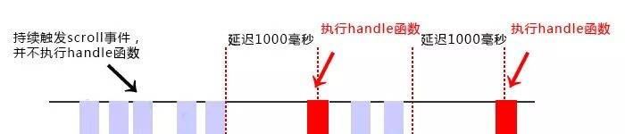
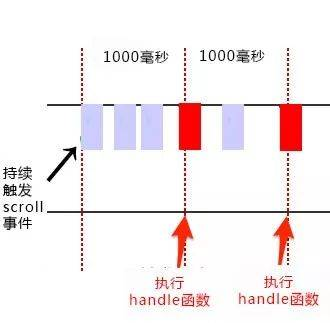

为什么需要防抖和节流？它们是什么？有什么区别？适用场景是什么？

<!--more-->

## 简介

防抖与节流，主要用来控制事件处理函数的调用频率 ❗ 

在进行窗口的缩放（resize）、滚动（scroll），输入框内容校验等操作时，如果事件处理函数调用的频率无限制，会加重浏览器负担，导致用户体验糟糕。

试想，你的事件处理函数是异步的，每次调用都会进行大量的数据检索……

如何控制调用频率呢？防抖和节流就是做这个的。

## 防抖

什么是防抖（debounce）？当持续触发事件时，在设定时间段🕐内没有再触发事件，事件处理函数才会执行一次；若在设定的时间段🕜内，又一次触发事件，就重新开始延时。

如下图，持续触发 scroll 事件时，并不执行 `handle` 函数，当 1000 毫秒内没有触发 scroll 事件时，才会延时触发 scroll 事件。

  

……

## 节流

什么是节流（throttle）?当持续触发事件时，保证一定时间段内只调用一次事件处理函数。如下图，持续触发 scroll 事件时，并不立即执行 `handle` 函数，每隔 1000 毫秒才会执行一次 `handle` 函数。

  

……

## 区别

不能看出，防抖的控频原理在于持续触发事件时，在设定的时间段内不再触发事件，才会调用一次执行函数；而节流的控频原理在于持续触发事件时，每隔设定的时间段才会调用一次执行函数。

当然，实际操作中，我们会对二者做一些相应的优化处理，但是从本质上来说，它们就是如此。

## 参考链接

- https://www.cnblogs.com/momo798/p/9177767.html
- https://www.cnblogs.com/youma/p/10559331.html
- https://segmentfault.com/a/1190000012066399
- https://segmentfault.com/a/1190000018428170
- https://zhuanlan.zhihu.com/p/38313717
- https://juejin.cn/post/6844903669389885453
- https://redd.one/blog/debounce-vs-throttle
- https://webdesign.tutsplus.com/tutorials/javascript-debounce-and-throttle--cms-36783