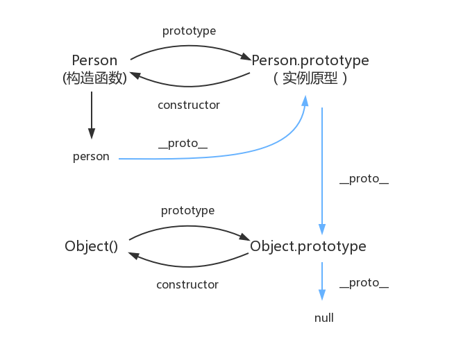
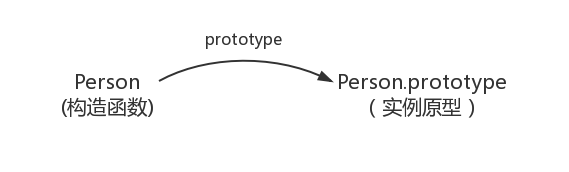
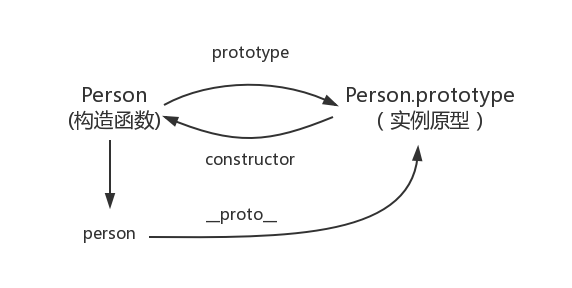
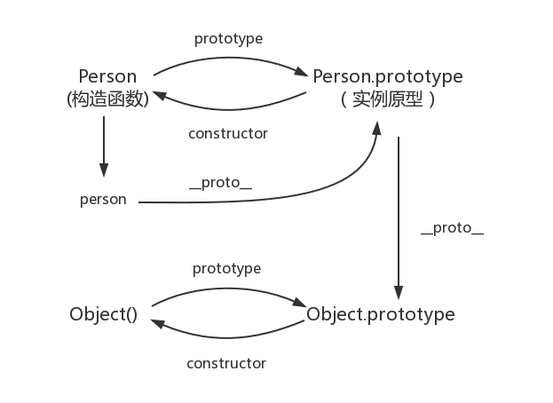
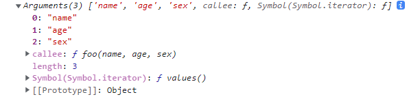

🔔 摘录自 [冴羽写博客之深入系列](https://github.com/mqyqingfeng/Blog) ，写的很不错。

<!--more-->

## 深入系列

### 从原型到到原型链

先来一张“震山总图”，后续我们会慢慢讲解它是什么得到的。

  

#### prototype

每个函数都有一个 `prototype` 属性。那么这个函数到底指向的是什么？是这个函数的原型吗？

先来看个简单的示例：

```js
function Person() {

}
// 虽然写在注释里，但是你要注意：
// prototype 是函数才会有的属性
Person.prototype.name = 'Kevin';
var person1 = new Person();
var person2 = new Person();
console.log(person1.name)	// Kevin
console.log(person2.name)	// Kevin
```

其实，函数的 `prototype` 属性指向了一个对象，这个对象正是调用构造函数面创建的实例的原型，也就是上述示例中 `person1` 和 `person2` 的原型。 

说了这么多， **什么是原型呢？** 你可以这样理解：每一个 JavaScript 对象（ `null` 除外）在创建的时候就会与之关联另一个对象，这个对象就是我们所说的原型，每一个对象都会从原型“继承”属性。

> “继承” ❓ 继承意味着复制操作，然而 JavaScript 默认并不会复制对象的属性，相反，它只是在两个对象之间创建一个关联，如此一个对象就可能通过委托访问另一个对象的属性和函数，所以，与其叫继承，委托的说法反而更准确些。

  

上图表示构造函数和实例原型（此处我们用 `Object.prototype` 表示实例原型）之间的关系。那么，我们该怎么表示实例与实例原型，即 `person` 和 `Person.prototype` 之间的关系呢？`__proto__` ❗

#### `__proto__`

每一个 JavaScript 对象（除了 `null`）都具有一个属性 -- `__proto__` ，这个属性会指向该对象的原型。

> 关于 `__proto__` ，绝大部分浏览器都支持这个非标准的方法访问原型，然而它并不存在于 `Person.prototype` 中，实际上，它是来自于 `Object.prototype` ，与其说是一个属性，不如说是一个 `getter/setter` ，当使用 `obj.__proto__` 可以理解成返回了 `Object.getPrototypeOf(obj)` 。

为了证明这一点，我们可以在 Firefox 或 Chrome 浏览器中输入：

```js
function Person() {

}
var person = new Person();
console.log(person.__proto__ === Person.prototype);	// true
```

<div class="oh-essay">
Chrome 的开发工具，真是一个神器 🎉
</div>

Ok，现在让我们更新一下关系图，如下：

  

既然实例对象和构造函数都可以指向原型，那么原型是否有属性指向构造函数呢？

<div class="oh-essay">
原型：是啊，凭什么只能你指我，不服 👺
</div>

#### constructor

指向实例的倒是没有，因为一个构造函数可以生成多个实例。

<div class="oh-essay">
物以稀为贵，多了就是“原罪”……
</div>

但是原型指构造函数倒是有的 -- `constructor` ，每个原型都有一个 `constructor` 属性指向关联的构造函数。如图：

  

综上我们已经得出：

```js
function Person() {

}

var person = new Person();

console.log(person.__proto__ == Person.prototype) 				// true
console.log(Person.prototype.constructor == Person) 			// true
// 顺便学习一个 ES5 的方法，可以获得对象的原型
console.log(Object.getPrototypeOf(person) === Person.prototype) // true
```

#### 实例与原型

当读取实例的属性时，如果找不到，就会查找与对象关联的原型中的属性，如果还查不到，就去找原型的原型，一直找到最顶层为止。

```js
function Person() {

}

Person.prototype.name = 'Kevin';

var person = new Person();

person.name = 'Daisy';
console.log(person.name) // Daisy

delete person.name;
console.log(person.name) // Kevin
```

原型的原型是什么呢 ❓ 最顶层也没查到怎么办？

在前面，我们已经讲了原型也是一个对象，即然是对象，我们就可以用最原始的方式创建它。如下：

```js
var obj = new Object();
obj.name = 'Kevin'
console.log(obj.name) // Kevin
```

上述示例中的 `obj` 就是 `Person.prototype` 。其实原型对象就是通过 `Object` 构造函数生成的。

  

#### 原型链

这样，就又产生了一个问题， `Ojbect.prototype` 的原型是什么呢？ `null` ❗ 不妨打印一下：

```js
console.log(Object.prototype.__proto__ === null)	// true
```

然而 `null` 到底是个什么东东？

`null` 表示“没有对象”，即该处不应该有值。所以 `Object.prototype.__proto__` 的值为 `null` 跟 `Object.prototype` 没有原型，其实表达了一个意思。

所以，查找属性的时候查到的 `Object.prototype` 就可以停止查找了。

然后，我们就得到了最初的这张图：


<div class="oh-essay">
其实，这些都是规定好了的，以上各项都是产生这种规定的可能的过程。
</div>

### 词法作用域和动态作用域

什么是作用域？作用域是指程序源代码中定义变量的区域。作用域规定了如何查找变量，也就是确定当前执行代码对变量的访问权限。

JavaScript 采用词法作用域（lexical scoping），即静态作用域。

<div class="oh-essay">
其实，这个概念并没有那么多弯弯绕，它是 JavaScript 这门语言的运行机制和实现所自然而然会出现的结果。
</div>

所谓“词法作用域”，就是函数的作用域在函数定义的时候就决定了；而与之相对对应的“动态作用域”，函数的作用域则是在函数调用的时候才决定的。

我们先来看一个示例：

```js
var value = 1;

function foo() {
    console.log(value);
}

function bar() {
    var value = 2;
    foo();
}

bar();
// 结果是 ???
```

结果是 `1` ！你答对了吗？ 让我们分析一下具体的执行过程。

执行 `bar` 函数，其在内部调用了 `foo` 函数，`foo` 函数执行输出 `value` 。输出哪个 `value` ？（上面说过，所谓“词法作用域”，就是函数的作用域在函数定义的时候就决定了）在 `foo` 定义的时候，其内部并没有局部变量 `value` ，就根据书写的位置查找上一层的代码，（在这里也就是 `var value = 1`）即 `value` 等于 `1` ，所以结果会打印 `1` 。

> 试想，如果  JavaScript 采用的是动态作用域，会输出什么？

明白了吗？😏

好的，我们再来看一下示例，如下：

```js
var value = 10;
foo();
var value = 20;
function foo() {
	console.log(value);
}
```

思考一下，上面的代码会输出什么？为什么？

```_对下答案吧！
❗️ 10

为什么会是 10 呢？不应该是 20 吗？

是这样的！在 JavaScript 中，函数声明和变量声明都会被提升，且函数声明会被先提升。
提升之后，上述代码的实际执行顺序就如下面这样了（伪代码）：

---------
var value;
function foo;

value = 10;

foo = function() {
	console.log(value);
}
foo();

value = 20;
---------

看，现在很容易就可能看出输出 10 了，对吧。

💡 注意：提升的只是声明，并不是初始定义哦
```

有不清楚的地方，继续阅读后续章节。😸

### 执行上下文栈

> 思考一下：JavaScript 中的程序是怎么执行的呢？顺序执行吗？

实际上，JavaScript 引擎并非一行一行地分析和执行程序，而是一段一段地分析执行。当执行一段代码的时候，会进行一个“准备工作”，如变量提升、函数提升等。

那么，这个“段”究竟是如何划分的呢？JavaScript 引擎遇到一段怎样的代码时才会做“准备工作” ？

#### 可执行代码

这就要说到 JavaScript 的可执行代码（executable code）的类型有哪些了？

其实很简单，就有三种：全局代码、函数代码、eval 代码。

举个 🌰 ，当执行到一个函数的时候，就会进行准备工作，这里的“准备工作”专业一点的说法就是“执行上下文（execution context）” 。

#### 执行上下文栈

接下来问题来了，我们写的函数多了去了，如何管理创建的那么多执行上下文呢？？？

JavaScript 引擎🎙：“我”创建了执行上下文栈（Execution Context Stack, ECS）来管理执行上下文。

为了模拟执行上下文，我们不妨定义执行上下文栈为一个数组，如下 ：

```js
ECStack = [];
```

试想，当 JavaScript 开始要执行代码的时候，最先遇到的就是全局代码，所以初始化的时候首先就会向执行上下文栈压入一个全局执行上下文，我们用 `globalContext` 表示它，并且只有当整个应用程序结束的时候，`ECStack` 才会被清空。也就是说，在程序结束之前，ECStack 最底部永远有个 `globalContext` ：

```js
ECStack = [
    globalContext
];
```

<div class="oh-essay">
可见，环境是很重要的，是程序设计语言所必须实现的。
</div>

我们来看一下示例，现在 JavaScript 引擎遇到下面的这段代码了：

```js
function fun3() {
    console.log('fun3')
}

function fun2() {
    fun3();
}

function fun1() {
    fun2();
}

fun1();
```

当执行一个函数的时候，就会创建一个执行上下文，并且压入 ECS（执行上下文栈），当函数执行完毕的时候，就会将函数的执行上下文从栈中弹出。知道了工作原理，让我们来看看如何处理上面这段代码：

```
// 伪代码

// fun1()
ECStack.push(<fun1> functionContext);

// fun1 中竟然调用了 fun2 ，还要创建 fun2 的执行上下文
ECStack.push(<fun2> functionContext);

// F**K， fun2 还调用了 fun3 ...
ECStack.push(<fun3> functionContext);

// fun3 执行完毕
ECStack.pop();

// fun2 执行完毕
ECStack.pop();

// fun1 执行完毕
ECStack.pop();

// JavaScript 接着执行后续的代码，但是 ECStack 底层永远有个 globalContext ，直到程序结束
```

Okay ，趁热打铁，让我们来看一段《JavaScript 高级程序设计》中的示例：

```js
var scope = "global scope";
function checkscope(){
    var scope = "local scope";
    function f(){
        return scope;
    }
    return f();
}
checkscope();
```

```_点击查看其运行
ECStack.push(<checkscope> functionContext);
ECStack.push(<f> functionContext);
ECStack.pop();
```

再来看另一段示例：

```js
var scope = "global scope";
function checkscope(){
    var scope = "local scope";
    function f(){
        return scope;
    }
    return f;
}
checkscope()();
```

```_点击查看其运行
ECStack.push(<checkscope> functionContext);
ECStack.pop();
ECStack.push(<f> functionContext);
ECStack.pop();
```

上述两个示例的输出是一样的，都是 `'local scope'` （若不明白，回顾一下上个章节），但是他们的执行的过程却是有区别的。请好好体会一下其中的不同。

是不是意犹未尽呢？为了更详细了解两个函数执行上的区别，我们在后续章节继续探究一下执行上下文到底包含了哪些内容。

### 变量对象

在上个章节中讲到，当 JavaScript 代码执行一段可执行代码（excutable code）时，会创建对应的执行上下文（execution context）。

对于每个执行上下文，都有三个重要属性：
- 变量对象（Variable object，VO）；
- 作用域链（Scope chain）；
- this

这里，我们重点讲讲创建变量对象的过程。

变量对象，是与执行上下文相关的数据作用域，存储了在上下文中定义的变量和函数声明。因为不同执行上下文下的变量对象稍有不同，所以我们来聊聊全局上下文下的变量对象和函数上下文下的变量对象。

#### 全局上下文

我们先了解一个概念 -- **全局对象**。以下是 [W3School](http://www.w3school.com.cn/jsref/jsref_obj_global.asp) 中的介绍：

> 全局对象是预定义的对象，作为 JavaScript 的全局函数和全局属性的占位符。通过使用全局对象，可以访问所有其他所有预定义的对象、函数和属性。

> 在顶层 JavaScript 代码中，可以用关键字 `this` 引用全局对象。因为全局对象是作用域链的头，这意味着所有非限定的变量和函数名都会作为该对象的属性来查询。

> 例如，当 JavaScript 代码引用 `parseInt()` 函数时，它引用的是全局对象的 `parseInt` 属性。全局对象是作用域链的头，还意味着在顶层 JavaScript 代码中声明的所有变量都将成为全局对象的属性。

下面让我们来看一些关于全局对象的具体示例吧。

1、可能通过 `this` 引用，在客户端 JavaScript 中，全局对象就是 `Window` 对象。

```
console.log(this);
```

2、全局对象是由 `Object` 构造函数实体化的一个对象。

```
console.log(this instanceof Object);
```

3、预定义了一堆，嗯，一大堆函数和属性。

```
// 都能生效
console.log(Math.random());
console.log(this.Math.random());
```

4、作为全局变量的宿主。

```
var a = 1;
console.log(this.a);
```

5、客户端 JavaScript 中，全局对象有 `window` 对象指向自身。

```
var a = 1;
console.log(window.a);

this.window.b = 2;
console.log(this.b);
```

看，全局上下文中的变量对象就是全局对象呐！

<div class="oh-essay">
可以认为全局对象就是一级掌控者，凡是游离在全局上下文的变量也好、函数也好，都归它管。🔱
</div>

#### 函数上下文

在函数上下文中，我们用**活动对象**（activation object，AO）来表示变量对象。

> ❓ 活动对象和变量对象其实是一个东西，只是变量对象是规范上的或者说是引擎上实现的，不可在 JavaScript 环境中访问，只有当进行一个执行上下文中，这个执行上下文的变量对象才会被激活，而只有被激活的变量对象（即活动对象）上的各种属性才能被访问。

> ❗ 未进入执行阶段之前，变量对象（VO）中的属性都不能访问 ！但是进入执行阶段之后，变量对象（VO）转变为了活动对象（AO），里面的属性都能被访问了，然后开始进行执行阶段的操作。它们其实都是同一个对象，只是处于执行上下文的不同生命周期。

<div class="oh-essay">
静则 V ，动则 A 
</div>

活动对象是在进入函数上下文时被创建的，它通过函数的 `arguments` 属性初始化。 `arguments` 属性值是 `Arguments` 对象。

#### 执行过程

执行上下文的代码会分成两个阶段进行处理 -- 分析和执行：
1. 进入执行上下文；
2. 代码执行。

**进入执行上下文**

当进入执行上下文时，这时候还没有执行代码。

变量对象会包括：
1. 函数的所有形参（如果是函数上下文）
    - 由名称和对应值组成的一个变量对象的属性被创建
    - 没有实参，属性值设为 `undefined` 
2. 函数声明
    - 由名称和对应值（函数对象 function-object）组成一个变量对象属性被创建
    - 如果变量对象已经存在相同名称的属性，则完全替换这个属性
3. 变量声明
    - 由名称和对应值（`undefined`）组成一个变量对象的属性被创建
    - 如果变量对象跟已经声明的形式参数或函数相同，则变量声明不会干扰已经存在的这类属性

好吧，还是来看例子 🍩。

```js
function foo(a) {
    var b = 2;
    function c() {}
    var d = function() {};

    b = 3;
}

foo(1);
```

在进入执行上下文后，这时候的 `AO` 如下：

```
AO = {                                       // 进入上下文，活动对象创建
    arguments: {
        0: 1,
        length: 1
    },
    a: 1,                                        // 形参函数的 `arguments` 属性初始化，
    b: undefined,                           // 没有对应实参的属性值设为 `undefined`
    c: reference to function c() {},    // 函数声明
    d: undefined                            // 变量声明。..
}
```

**代码执行**

在代码执行阶段，会顺序执行代码，根据代码，修改变量对象的值。

依然使用上面的例子，当代码执行完后，这时候的 `AO` 是：

```
AO = {
    auguments: {
        0: 1,
        length: 1
    },
    a: 1,
    b: 3,
    c: reference to function c(){},
    d: reference to FunctionsExpression "d"
}
```

到这里，变量对象的创建过程就介绍完了，来个小结吧：
1. 全局上下文的变量对象初始化是全局对象；
2. 函数上下文的变量对象初始化只包括 `Arguments` 对象；
3. 在进入执行上下文时会给变量对象添加形参、函数声明、变量声明等初始化的属性值；
4. 在代码执行阶段，会再次修改变量对象的属性值。

### 作用域链

当 JavaScript 代码执行一段可执行代码（excutable code）时，会创建对应的执行上下文（execution context）。

对于每个执行上下文，都有三个重要属性：
```
- 变量对象（Variable object，VO）；
- 作用域链（Scope chain）；
- this
```

是的，我们将在这个章节来看一下什么是作用域链。

在上个章节中，我们知道，当查找变量的时候，会先从当前上下文的变量对象中查找，如果没有找到，就会从父级（词法层面上的父级）执行上下文的变量对象中查找，一直找到全局上下文的变量对象，也就是全局对象。这样由多个执行上下文的变量对象构成的链表就叫做 **作用域链**。

下面，让我们以一个函数的创建和激活两个时期来讲解作用域链是如何创建和变化的。

#### 函数创建

我们知道，在 JavaScript 中，函数的作用域在函数定义的时候就决定了。

这是因为函数有一个内部属性 `[[scope]]`，当函数创建的时候，就会保存所有父变量对象到其中，你可以理解 `[[scope]]` 就是所有父变量对象的层级链，但是注意， `[[scope]]` 并不代表完整的作用域链。

举个例子：

```js
function foo() {
    function bar() {
        // ...
    }
}
```

函数创建时，各自的 `[[scope]]` 为：

```
foo.[[scope]] = [
    globalContext.VO
];

bar.[[scope]] = [
    fooContext.AO,
    globalContext.VO
]
```

#### 函数激活

当函数激活时，进入函数上下文 ，创建 VO/AO 后，就会将活动对象添加到作用域链的前端 。

这时候执行正文的作用域链，我们命名为 `Scope` ：

```
Scope = [AO].concat([[scope]]);

// 引自的 AO 为当前执行函数的变量对象，
// [[scope]] 为其所有父变量对象的层级链
// 如：上例中 bar 的完整作用域链为 [AO, fooContext.AO, globalContext.VO]
```

至此，作用域链创建完毕。

#### 🌰

我们来看一个示例，结合之前讲的变量对象和执行上下文栈，来总结一下函数执行上下文中作用域链和变量对象的创建过程：

```js
var scope = "global scope";
function checkscope() {
    var scope2 = 'local scope';
    return scope2;
}
checkscope();
```

执行过程如下：

1、 `checkscope` 函数被创建，保存作用域链到内部属性 `[[scope]]` 

```
checkscope.[[scope]] = [
    globalContext.VO
];
```

2、执行 `checkscope` 函数，创建 `checkscope` 函数执行上下文，`checkscope` 函数执行上下文被压入执行上下文栈

```
ECStack = [
    checkscopeContext,
    globalContext
];
```

3、`checkscope` 函数并不立刻执行，开始做准备工作，第一步：复制函数 `[[scope]]` 属性创建作用域链

```
checkscopeContext = {
    Scope: checkscope.[[scope]],
}
```

4、第二步：用 `arguments` 创建活动对象，随后初始化活动对象，加入形参、函数声明、变量声明

```
checkscopeContext = {
    AO: {
        arguments: {
            length： 0
        }，
        scope2: undefined
    },
    Scope: checkscope.[[scope]]
}
```

5、第三步：将活动对象压入 `checkscope` 作用域链顶端

```
checkscopeContext = {
    AO: {
        arguments: {
            length: 0
        },
        scope2: undefined
    },
    Scope: [AO, [[Scope]]]
}
```

6、准备工作做完，开始执行函数，随着函数的执行，修改 `AO` 的属性值

```
checkscopeContext = {
    AO = {
        arguments: {
            length: 0
        },
        scope2: 'local scope'
    },
    Scope: [AO, [[Scope]]]
}
```

7、查找到  `scope2` 的值 ，返回函数执行完毕，函数上下文从执行上下文栈中弹出

```
ECStack = [
    globalContext
];
```

### 从 ECMAScript 规范解读 this

<div class="oh-essay">
好吧，这个 CD 的 this 😂
</div>

当 JavaScript 代码执行一段可执行代码（excutable code）时，会创建对应的执行上下文（execution context）。

对于每个执行上下文，都有三个重要属性：
```
- 变量对象（Variable object，VO）；
- 作用域链（Scope chain）；
- this
```

是的，我们将在这个章节来看一下什么是 `this` 。让我们从 ECMAScript5 规范开始讲起，附上 ECMAScript 5.1 规范地址：[英文版](http://es5.github.io/#x15.1)、[中文版](http://yanhaijing.com/es5/#115) 。Okay，让我们开始了解规范吧。

ES（ECMAScript）的类型分为语言类型和规范类型。

ES 语言类型是开发者直接使用 ES 可以操作的，其实就是我们常说的 `Undefined, Null, Boolean, String, Number` 和 `Object` 。

ES 规范类型相当于 `meta-values` （元类型），是用来用算法描述 ES 语言结构和 ES 语言类型的。规范类型包括：`Reference, List, Completion, Property Descriptor, Property Identifier, Lexical Environment` 和 `Environment Record` 。

<div class="oh-essay">
这都是什么东东 ❓
</div>

没懂？没关系，我们只要知道在 ES 规范中还有一种只存在于规范中的类型，它们的作用是用来描述语言底层行为逻辑。今天我们要讲的重点便是其中的 `Reference` 类型，它与 `this` 的指向有着密切的关联。

#### Reference

什么是 `Reference` 呢？

`Reference` 类型就是用来解释诸如 `delete、typeof` 以及赋值等操作行为的。它是一个 Specification Type ，也就是“只存在于规范里的抽象类型”。它们是为了更好地描述语言的底层行为逻辑才存在的，但并不存在于实际的 js 代码中。

`Reference` 由三个部分组成：
- base value ，属性所在的对象或者就是 `EnvironmentRecord` ，其值只可能是 `undefined, Object, Boolean, String, Number` 或 `EnvironmentRecord` 中的一种；
- referenced name ，属性的名称；
- strict reference ，……

来看个例子：

```js
var foo = 1;

// 对应的 Reference 是：
var fooReference = {
    base: EnvironmentRecord,
    name: 'foo',
    strict: false
}
```

又如：

```js
var foo = {
    bar: function() {
        return this;
    }
};

foo.bar();  // foo

// bar 对应的 Reference 是：
var BarReference = {
    base: foo,
    propertyName: 'bar',
    strict: false
};
```

而且规范中还提供了获取 `Reference` 组成部分的方法，比如：
- `GetBase` ，返回 `reference` 的 `base value` ；
- `IsPropertyReference` ，如果 `base value` 是一个对象，就返回 `true` ；
- `GetValue` ，用于从 `Reference` 类型获取对应值。

我们来简单模拟 `GetValue` 的使用：

```js
var foo = 1;

var fooReference = {
    base: EnvironmentRecord,
    name: 'foo',
    strict: false
};

GetValue(fooRefence);    // 1
```

可以看到， `GetValue` 返回对象属性真正的值，而不再是一个 `Reference` ，切记切记。

#### 如何确定 this 的值

我们说了那么多关于 `Reference` 的事情，它跟本文的主题 `this` 有哪些关联呢？

看规范 11.2.3 Function Calls：这里讲了当函数调用的时候，如何确定 `this` 的取值。让我们简单描述一下：
1. 计算 `MemberExpression` 的结果赋值给 `ref` ；
2. 判断 `ref` 是不是一个 `Reference` 类型：
    - 2.1 如果 `ref` 是 `Reference` ，并且 `IsPropertyReference(ref)` 是 `true` ，那么 `this` 的值为 `GetBase(ref)` ；
    - 2.2 如果 `ref` 是 `Reference` ，并且 `base value` 的值是 `EnvironmentRecord`，那么 `this` 的值为 `ImplicitThisValue(ref)` ；
    - 2.3 如果 `ref` 不是 `Reference` ，那么 `this` 的值为 `undefined` 。

下面，让我们一步一步来具体分析一下。

**1、计算 `MemberExpression` 的结果赋值给 `ref`**

什么是 `MemberExpression` ？规范 11.2 Left-Hand-Side Expressions 说明如下：

MemberExpression ：
- PrimaryExpression ，原始表达式
- FunctionExpression ，函数定义表达式
- MemberExpression[Expression] ，属性访问表达式
- MemberExpression.IndentifierName ，属性访问表达式
- new MemberExpression Arguments ，对象创建表达式

来看一个例子：

```js
function foo() {
    console.log(this)
}
foo();  // MemberExpression 是 foo

function foo() {
    return function() {
        console.log(this)
    }
}
foo()();    // MemberExpression 是 foo()

var foo = {
    bar: function() {
        return this;
    }
}
foo.bar();  // MemberExpression 是 foo.bar
```

所以简单理解 `MemberExpression` 其实就是 `()` 左边的部分。

**2、判断 `ref` 是不是一个 `Reference` 类型**

关键就在于看规范是如何处理各种 `MemberExpression` ，返回的结果是不是一个 `Reference` 类型。来看一个示例：

```js
var value = 1;

var foo = {
    value: 2,
    bar: function() {
        return this.value;
    }
}

// e.g.1
console.log(foo.bar()); // 2
// e.g.2
console.log((foo.bar)());   // 2
// e.g.3
console.log((foo.bar = foo.bar)()); // 1
// e.g.4
console.log((false || foo.bar)());  // 1
// e.g.5
console.log((foo.bar, foo.bar)());  // 1
```

**foo.bar()**

在 e.g.1 中，MemberExpression 计算的结果是 `foo.bar` ，那么 `foo.bar` 是不是一个 `Reference` 呢？

查看规范 11.2.1 Property Accessors 得知该表达式返回了一个 `Reference` 类型，其值为：

```
var Reference = {
    base: foo,
    name: 'bar',
    strict: false
};
```

> 2.1 如果 `ref` 是 `Reference` ，并且 `IsPropertyReference(ref)` 是 `true` ，那么 `this` 的值为 `GetBase(ref)`

该值是 `Reference` 类型，那么 `IsPropertyReference(ref)` 的结果是多少呢？ `base value` 为 `foo` ，是一个对象，所以 `IsPropertyReference(ref)` 返回 `true` 。

此时，我们可以确定 `this` 的值了：

```
this = GetBase(ref)     // GetBase 返回 reference 的 `base value` ，即 foo
```

所以，在这个例子中， `this` 的值就是 foo ，e.g.1 的结果就是 `2` ！

<div class="oh-essay">
好吧，依然云里雾里，看来真的有必要系统去阅读一遍规范……
</div>

**(foo.bar)()**

实际上， `()` 并没有对 `MemberExpression` 进行计算，所以其实跟 e.g.1 的结果是一样的。

**(foo.bar = foo.bar)()**

看 e.g.3 ，有赋值操作符，返回的值不是 `Reference` 类型。

> 2.3 如果 `ref` 不是 `Reference` ，那么 `this` 的值为 `undefined`

`this` 为 `undefined` ，非严格模式下， `this` 的值为 `undefined` 的时候，其值会被隐式转换为全局对象。

**(false || foo.bar)()**

看 e.g.4 ，逻辑与算法，返回的值不是 `Reference` 类型， `this` 为 `undefined` 。

**（foo.bar, foo.bar)()**

看 e.g.5 ，逗号操作符，返回的值不是 `Reference` 类型， `this` 为 `undefined` 。

> 注意，以上 是在非严格模式下的结果，严格模式下因为 `this` 返回 `undefined` ， e.g.3 会报错。

<div class="oh-essay">
………………
</div>

最后，我们来看一种最普通的情况：

```js
function foo() {
    console.log(this);
}

foo();
```

`MemberExpression` 是 `foo` ，解析标识符，查看规范 10.3.1 Identifier Resolution，会返回一个 `Reference` 类型的值：

```
var fooReference = {
    base: EnvironmentRecord,
    name: 'foo',
    strict: false
}
```

> 2.1 如果 `ref` 是 `Reference` ，并且 `IsPropertyReference(ref)` 是 `true` ，那么 `this` 的值为 `GetBase(ref)`

因为 `base value` 是 `EnvironmentRecord` ，并不是一个 `Object` 类型， `IsPropertyReference(ref)` 的结果为 `false` ，继续判断 

> 2.2 如果 `ref` 是 `Reference` ，并且 `base value` 的值是 `EnvironmentRecord`，那么 `this` 的值为 `ImplicitThisValue(ref)`

`base value` 正是 `EnvironmentRecord` ，调用 `ImplicitThisValue(ref)` ，查看规范 10.2.1.1.6，`ImplicitThisValue` 方法的介绍：该函数**始终返回** `undefined` 。

所以最后 `this` 的值就是 `undefined` 。

#### 🍨 最后

尽管我们可以简单地理解 `this` 为调用函数的对象，如果是这样的话，如何解释下面这个例子呢？

```js
var value = 1;

var foo = {
  value: 2,
  bar: function () {
    return this.value;
  }
}
console.log((false || foo.bar)());  // 1
```

此外，又如何确定调用函数的对象是谁呢？

在写这个章节之初，我（冴羽）就面临着这些问题，最后还是放弃从多个情形下给大家讲解 `this` 指向的思路，而是追根溯源地从 ES 规范讲解 `this` 的指向。尽管从这个角度写起来和读起来都比较吃力，但是一旦多读几遍，明白原理，绝对会给你一个全新的视角看待 `this` 。而你也就能明白，尽管  `foo()` 和 `(foo.bar = foo.bar)()` 最后结果都指向了 `undefined` ，但是两者从规范的角度上却有着本质的区别。

此篇讲解执行上下文的 `this` ，即便不是很理解此篇的内容，依然不影响大家了解执行上下文这个主题下其他的内容。所以，依然可以安心的看下一篇文章。

<div class="oh-essay">
好吧，其实在实际应用中，你大概率不会遇到太多关于 `this` 的刁难，常见的应用场景就那几个。一切的一切都要为了解决实际问题而服务。

我们必须明白，规范或参考书之类的东西，晦涩繁琐几乎是它们的特定属性，也就是说，时间多就通读一下学习，后续逐点参考即可。
</div>

### 执行上下文

当 JavaScript 代码执行一段可执行代码（excutable code）时，会创建对应的执行上下文（execution context）。

对于每个执行上下文，都有三个重要属性：
```
- 变量对象（Variable object，VO）；
- 作用域链（Scope chain）；
- this
```

让我们来看一段《JavaScript 高级程序设计》中的示例：

```js
// e.g.1

var scope = "global scope";
function checkscope(){
    var scope = "local scope";
    function f(){
        return scope;
    }
    return f();
}
checkscope();
```

```_点击查看其运行
ECStack.push(<checkscope> functionContext);
ECStack.push(<f> functionContext);
ECStack.pop();
```

再来看另一段示例：

```js
// e.g.2 

var scope = "global scope";
function checkscope(){
    var scope = "local scope";
    function f(){
        return scope;
    }
    return f;
}
checkscope()();
```

```_点击查看其运行
ECStack.push(<checkscope> functionContext);
ECStack.pop();
ECStack.push(<f> functionContext);
ECStack.pop();
```

上述两段代码都会打印 `'local scope'` ，虽然执行结果一样，但执行过程却有区别（其执行上下文栈的变化不一样），我们在这个章节就详细的解析执行上下文栈和执行上下文的具体变化过程。

以 `e.g.1` 的示例来说，其执行过程如下 ：

1、执行全局代码，创建全局执行上下文，全局上下文被存款利率执行上下文栈

```
ECStack = [
    globalContext
];
```

2、全局上下文初始化

```
globalContext = {
    VO: [global],
    Scope: [globalContext.VO],
    this: globalContext.VO
}
```

初始化的同时，`checkscope` 函数被创建，保存作用域链到函数的内部属性 `[[scope]]` 

```
checkscope.[[scope]] = [
    globalContext.VO
];
```

3、执行 `checkscope` 函数，创建 `checkscope` 函数执行上下文， `checkscope` 函数执行上下文被存款利率执行上下文栈

```
ECStack = [
    checkscopeContext,
    globalContext
];
```

4、 `checkscope` 函数执行上下文初始化

1. 复制函数 `[[scope]]` 属性创建作用域链；
2. 用 `arguments` 创建活动对象；
3. 初始化活动对象，即加入形参、函数声明、变量声明；
4. 将活动对象压入 `checkscope` 作用域链顶端。

同时 `f` 函数被创建，保存作用域到 `f` 函数的内部属性`[[scope]]` 

```
checkscopeContext = {
    AO: {
        arguments: {
            length: 0
        },
        scope: undefined,
        f: reference to function f(){}
    },
    Scope: [AO, globalContext.VO],
    this: undefined
}
```

5、执行 `f` 函数，创建 `f` 函数执行上下文， `f` 函数执行上下文被压入上下文栈

```
ECStack = [
    fContext,
    checkscopeContext,
    globalContext
];
```

6、 `f` 函数执行上下文初始化，以下跟第 4 步相同

1. 复制函数 `[[scope]]` 属性创建作用域链；
2. 用 `arguments` 创建活动对象；
3. 初始化活动对象，即加入形参、函数声明、变量声明；
4. 将活动对象压入 `f` 作用域链顶端。

```
fContext = {
    AO: {
        arguments: {
            length: 0
        }
    },
    Scope: [AO, checkscopeContext.AO, globalContext.VO],
    this: undefined
}
```

7、 `f` 函数执行，沿着作用域链查找 `scope` 值，返回 `scope` 值

8、 `f` 函数执行完毕， `f` 函数上下文从执行上下文栈中弹出

```
ECStack = [
    checkscopeContext,
    globalContext
];
```

9、 `checkscope` 函数执行完毕， `checkscope` 执行上下文从执行上下文栈中弹出

```
ECStack = [
    globalContext
];
```

Okay，就这样。

对于 `e.g.2` ，大家自己尝试模拟它的执行过程吧。

<div class="oh-essay">
好的吧，要返工了 😂
</div>

### 深入闭包

什么是闭包？

> This combination of a function object and a scope (a set of variable bindings) in which the function's variables are resolved is called a closure in the computer science literature.

ES 中，闭包指的是：

1. 从理论角度：所有的函数。因为它们都在创建的时候就将上下文的数据保存起来了，哪怕是简单的全局变量也是如此，因为函数中访问全局变量就相当于在访问自由变量，这个时候使用最外层的作用域。
2. 从实践角度：以下函数才算是闭包：
   - 即使创建它的上下文已经销毁，它仍然存在（比如，内部函数从父函数中返回），
   - 在代码中引用了自由变量

`> 闭包是指那些能够访问自由变量的函数；自由变量是指在函数中使用的，但既不是函数参数也不是函数的局部变量的变量。`

`> 闭包 = 函数 + 函数能够访问的自由变量`

我们在实际应用中，基本上只关注实践角度的闭包 🤗

来看看我们的老朋友：

```js
var scope = "global scope";
function checkscope(){
    var scope = "local scope";
    function f(){
        return scope;
    }
    return f;
}

var foo = checkscope();
foo();
```

让我们再次分析一下这段代码中执行上下文栈和执行上下文的变化情况，其简要的执行过程如下：
1. 进入全局代码，创建全局执行上下文，全局执行上下文压入执行上下文栈；
2. 全局执行上下文初始化；
3. 执行 `checkscope` 函数，创建 `checkscope` 函数执行上下文，`checkscope` 执行上下文被压入执行上下文栈；
4. `checkscope` 执行上下文初始化，创建变量对象、作用域链、`this` 等；
5. `checkscope` 函数执行完毕，`checkscope` 执行上下文从执行上下文栈中弹出；
6. 执行 `f` 函数，创建 `f` 函数执行上下文，`f` 执行上下文被压入执行上下文栈；
7. `f` 执行上下文初始化，创建变量对象、作用域链、`this` 等；
8. `f` 函数执行完毕，`f` 函数上下文从执行上下文栈中弹出。

你可能会有一个疑问 - 当 `f` 函数执行的时候， `checkscope` 函数上下文已经被销毁了啊（即从执行上下文栈中被弹出），怎么还会读取到 `checkscope` 作用域下的 `scope` 值呢 ❓

当我们了解了具体的执行过程后，我们知道 `f` 执行上下文维护了一个作用域链：

```
fContext = {
    Scope: [AO, checkscopeContext.AO, globalContext.VO],
}
```

对的，就是因为这个作用域链，`f` 函数依然可以读取到 `checkscopeContext.AO` 的值，说明当 `f` 函数引用了 `checkscopeContext.AO` 中的值的时候，即使 `checkscopeContext` 被销毁了，但是 JavaScript 依然会让 `checkscopeContext.AO` 活在内存中，`f` 函数依然可以通过 `f` 函数的作用域链找到它，正是因为 JavaScript 做到了这一点，从而实现了闭包这个概念。

所以，让我们再看一遍实践角度上闭包的定义：
- 即使创建它的上下文已经销毁，它仍然存在（比如，内部函数从父函数中返回），
- 在代码中引用了自由变量。

> 看，没什么太多玄妙的东西，只是 JS 底层做了某些实现。同样的代码，在 PHP 中，就会报错，因为在 PHP 中，`f` 函数只能读取到自己作用域和全局作用域里的值，所以读不到 `checkscope` 下的 `scope` 值。

接下来，看这道刷题必刷，面试必考的闭包题 💯

```js
var data = [];

for (var i = 0; i < 3; i++) {
  data[i] = function () {
    console.log(i);
  };
}

data[0]();
data[1]();
data[2]();
```

答案是都是 `3`，让我们分析一下原因。

当执行到 `data[0]` 函数之前，此时全局上下文的 `VO` 为：

```
globalContext = {
    VO: {
        data: [...],
        i: 3
    }
}
```

当执行 `data[0]` 函数的时候，`data[0]` 函数的作用域链为：

```
data[0]Context = {
    Scope: [AO, globalContext.VO]
}
```

`data[0]Context` 的 `AO` 并没有 `i` 值，所以会从 `globalContext.VO` 中查找，`i` 为 `3`，所以打印的结果就是 `3`。

`data[1]` 和 `data[2]` 是一样的道理。

所以让我们改成闭包看看：😈

```js
var data = [];

for (var i = 0; i < 3; i++) {
  data[i] = (function (i) {
        return function(){
            console.log(i);
        }
  })(i);
}

data[0]();
data[1]();
data[2]();
```

当执行到 `data[0]` 函数之前，此时全局上下文的 `VO` 为：

```
globalContext = {
    VO: {
        data: [...],
        i: 3
    }
}
```

跟没改之前一模一样 ❓ 不然 ❗️

当执行 `data[0]` 函数的时候，`data[0]` 函数的作用域链发生了改变：

```
data[0]Context = {
    Scope: [AO, 匿名函数 Context.AO, globalContext.VO]
}
```

匿名函数执行上下文的 `AO` 为：

```
匿名函数 Context = {
    AO: {
        arguments: {
            0: 0,
            length: 1
        },
        i: 0
    }
}
```

`data[0]Context` 的 `AO` 并没有 `i` 值，所以会沿着作用域链从匿名函数 `Context.AO` 中查找，这时候就会找 `i` 为 `0`，找到了就不会往 `globalContext.VO` 中查找了，即使 `globalContext.VO` 也有 `i` 的值（值为 `3`)，所以打印的结果就是 `0`。

`data[1]` 和 `data[2]` 是一样的道理。

### 参数按值传递 

ECMAScript 中所有函数的参数都是按值传递的。

`> 按值传递，就是说，把函数外部的值复制给函数内部的参数，就和把值从一个变量复制到另一个变量一样。`

什么是引用传递 ❓

当值是一个复杂的数据结构的时候，就按引用传递，即传递对象的引用，函数内部对参数的任何改变都会影响该对象的值，因为两者引用的是同一个对象。

<div class="oh-essay">
其实，就是一个是变量值，一个是地址值（引用内存地址），都是值啦 👻
</div>

### call、apply、bind 的应用

`> 该章节为附加章节，旨在说明其使用场景` ，可以参考 [JS 中的 call、apply、bind 方法详解](https://www.cnblogs.com/moqiutao/p/7371988.html) 和 [JavaScript 中 call、apply、bind 的区别](https://blog.csdn.net/u010176097/article/details/80348447) 。

`bind` 是返回对应函数，便于稍后调用；`apply` 、`call` 则是立即调用 。

#### apply & call

在 JavaScript 中， `call` 和 `apply` 都是为了改变某个函数运行时的上下文（context）而存在的，换句话说，就是为了改变函数体内部 `this` 的指向。

JavaScript 的一大特点是，函数存在 *-定义时上下文* 和 *-运行时上下文* 以及 *-上下文是可以改变的* 这样的概念。

```js
function fruits() {}

fruits.prototype = {
    color: 'red',
    say: function() {
        console.log('My color is ' + this.color);
    }
}

var apple = new fruits;
apple.say(); // My color is red
```

如果我们有一个对象 `banana = { color: 'yellow' }` ，但我们不想对它重新定义 `say` 方法，那么我们就可以通过 `call` 或 `apply` 来调用 `apple` 的 `say` 方法，如下：

```js
banana = {
    color: 'yellow'
}

apple.say.call(banana);  // My color is yellow
apple.say.apply(banana); // My color is yellow
```

*=这里 apply 的语义就更符合人们的直觉，表示把一个对象的方法应用在另一个对象上；相对来说， call 就比较反直觉（用 called 都比 call 强）！好的吧，js 就是个坑货 😅* 

**那么，`apply` 和 `call` 有什么区别呢？**

它们的作用完全一样，只是接受参数的方式不太一样。老规矩，上例子 🌰

```js
var func = function(arg1, arg2) {
    // ...
};
```

就可以通过如下方式来调用：

```js
func.call(this, arg1, arg2);
func.apply(this, [arg1, arg2]);
```

其中， `this` 就是想指定的上下文对象（可以是任何一个 JavaScript 对象）， `call` 需要把参数按顺序传递进去，而 `apply` 则是把参数放在数组里面。

*=其实这个很好记忆，只需要知道 apply 和 array 都是 5 个字母，所以其参数要放在数组中，就可以了。* 

一个相对常遇到的场景 - 类（伪）数组使用数组的方法。

我们来几个面试中可能遇到的问题：

eg.1 定义一个 `log` 方法，让它可以代理 `console.log` 方法，常见的解决方法是：

```js
function log(msg) {
    console.log(msg);
}

log(1);    // 1
log(1, 2); // 1 2
```

接下来的要求是给每一个 `log` 消息添加一个 `'(app)'` 的前缀，比如：

```
log("hello world"); // (app)hello world
```

如何做比较优雅呢？我们知道 `arguments` 参数是个伪数组，通过 `Array.prototype.slice.call` 转化为标准数组，即可使用数组的方法 `unshift` ，如下：

```js
function log() {
    var args = Array.protype.slice.call(arguments);
    args.unshift('(app)');

    console.log.apply(console, args);
}
```

*=哎，怎么说呢，原理的理解是非常重要的，但学以致用，了解怎么用原理的具体应用才能真正的落地！* 

#### bind

在讨论 `bind()` 方法之前，我们先来看一道题目，如下：

```js
var altwrite = document.write;
altwrite('hello');
```

```_思考一下结果是什么？
结果： Uncaught TypeError: Illegal invocation
```

怎么样，你答对了吗？为什么会是这样的结果呢？

原来 `altwrite()` 函数改变 `this` 的指向 `global` 或 `window` 对象，导致执行时提示非法调用异常，正确的方案就是使用 `bind()` 方法，使其重新指向 `document` ，如下：

```js
altwrite.bind(document)('hello');
// 或者
altwrite.call(document, 'hello')
```

*=在 React 中，你会经常碰到 bind ...* 

**bind() 都有什么用呢？？？**

*_1. 绑定函数* 

`bind()` 最简单的用法是创建一个函数，使这个函数不论怎么调用都有同样的 `this` 值。

常见的错误就像上面的例子一样，将方法从对象中拿出来，然后调用，并且希望 `this` 指向原来的对象。如果不做特殊处理，一般会丢失原来的对象。使用 `bind()` 方法能够很漂亮的解决这个问题。

```js
this.num = 9; 
var mymodule = {
    num: 81,
    getNum: function() { 
        console.log(this.num);
    }
};

mymodule.getNum(); // 81

var getNum = mymodule.getNum;
getNum(); // 9, 因为在这个例子中，"this"指向全局对象

var boundGetNum = getNum.bind(mymodule);
boundGetNum(); // 81
```

**MDN 的解释是：** `bind()` 方法会创建一个新函数，称为绑定函数，当调用这个绑定函数时，绑定函数会以创建它时传入 `bind()` 方法的第一个参数作为 `this` ，传入 `bind()` 方法的第二个以及以后的参数加上绑定函数运行时本身的参数按照顺序作为原函数的能数来调用原函数。

*=是不是也是一种代理 proxy 呢 ❓* 

**具体是个什么东东呢？？？**

在常见的单体模式中，通常我们会使用 `_this , that , self` 等保存 `this` ，这样我们可以在改变了上下文之后继续引用到它。 像这样：

```js
var foo = {
    bar : 1,
    eventBind: function(){
        var _this = this;
        $('.someClass').on('click',function(event) {
            /* Act on the event */
            console.log(_this.bar);     //1
        });
    }
}
```

由于 Javascript 特有的机制，上下文环境在 `eventBind:function(){ }` 过渡到 `$('.someClass').on('click',function(event) { })` 发生了改变，上述使用变量保存 `this` 这些方式都是有用的，也没有什么问题。当然使用 `bind()` 可以更加优雅的解决这个问题：

```js
var foo = {
    bar : 1,
    eventBind: function(){
        $('.someClass').on('click',function(event) {
            /* Act on the event */
            console.log(this.bar);      //1
        }.bind(this));
    }
}
```

在上述代码里，`bind()` 创建了一个函数，当这个 `click` 事件绑定在被调用的时候，它的 `this` 关键词会被设置成被传入的值（这里指调用 `bind() `时传入的参数）。因此，这里我们传入想要的上下文 `this`（其实就是 `foo` )，到 `bind()` 函数中。然后，当回调函数被执行的时候， `this` 便指向 `foo` 对象。再来一个简单的栗子：

```js
var bar = function(){
    console.log(this.x);
}

var foo = {
    x:3
}

bar(); // undefined

var func = bar.bind(foo);
func(); // 3
```

这里我们创建了一个新的函数 `func`，当使用 `bind()` 创建一个绑定函数之后，它被执行的时候，它的 `this` 会被设置成 `foo` ， 而不是像我们调用 `bar()` 时的全局作用域。

*_2. 偏函数（Partial Functions）* 

`bind()` 的另一个最简单的用法是使一个函数拥有预设的初始参数。只要将这些参数（如果有的话）作为 `bind()` 的参数写在 `this` 后面。当绑定函数被调用时，这些参数会被插入到目标函数的参数列表的开始位置，传递给绑定函数的参数会跟在它们后面。

```js
function list() {
    return Array.prototype.slice.call(arguments);
}

var list1 = list(1, 2, 3); // [1, 2, 3]

// 预定义参数 37
var leadingThirtysevenList = list.bind(undefined, 37);

var list2 = leadingThirtysevenList(); // [37]
var list3 = leadingThirtysevenList(1, 2, 3); // [37, 1, 2, 3]
```

*=知道这些就行了，其他的不常用……* 

#### apply call bind 的比较

 `apply、call、bind` 三者相比较，之间又有什么异同呢？何时使用 `apply`、`call`，何时使用 `bind` 呢。简单的一个栗子：

 ```js
 var obj = {
    x: 81,
};
 
var foo = {
    getX: function() {
        return this.x;
    }
}
 
console.log(foo.getX.bind(obj)());  //81
console.log(foo.getX.call(obj));    //81
console.log(foo.getX.apply(obj));   //81
```

三个输出的都是 `81`，但是注意看使用 `bind()` 方法的，他后面多了对括号。

也就是说，区别是，当你希望改变上下文环境之后并非立即执行，而是回调执行的时候，使用 `bind()` 方法。而 `apply/call` 则会立即执行函数。

最后，来个小结吧:

- `apply` 、 `call` 、`bind` 三者都是用来改变函数的this对象的指向的；
- `apply` 、 `call` 、`bind` 三者第一个参数都是this要指向的对象，也就是想指定的上下文；
- `apply` 、 `call` 、`bind` 三者都可以利用后续参数传参；
- `bind` 是返回对应函数，便于稍后调用；`apply` 、`call` 则是立即调用 。

### call 和 apply 的模拟实现

`call()` 方法在使用一个指定的 `this` 值和若干个指定的参数值的前提下调用某个函数或方法。

举个例子：

```js
var foo = {
    value: 1
};

function bar() {
    console.log(this.value);
}

bar.call(foo);  // 1
```

注意两点：
- `call` 改变了 `this` 的指向，指向到 `foo`
- `bar` 函数执行了

如何实现模拟一下 `call` 呢？？？思考一下 😎

……

### bind 的模拟实现

`bind()` 方法会创建一个新函数。当这个新函数被调用时，`bind()` 的第一个参数将作为它运行时的 `this`，之后的一序列参数将会在传递的实参前传入作为它的参数。（来自于 MDN )

由此我们可以首先得出 `bind` 函数的两个特点：
- 返回一个函数
- 可以传入参数

如何实现模拟一下 `bind` 呢？？？思考一下 😎

……

### new 的模拟实现

……

### 类数组对象与 arguments

#### 类数组对象

什么是类数组对象呢？-- 拥有一个 `length` 属性和若干索引属性的对象。像这样：

```js
var array = ['name', 'age', 'sex'];

var arrayLike = {
    0: 'name',
    1: 'age',
    2: 'sex',
    length: 3
}
```

类数组对象在读写、获取长度、遍历三个方基本是相同的，但类数组对象可以使用数组的一些方法会报错，如：

```
arrayLike.push('4');    // ❌  arrayLike.push is not a function
```

所以终归还是类数组呐…… 错付了呀 😭

#### 调用数组方法

如果类数组就是任性的想用数组的方法怎么办呢？可以用 `Function.call` 间接调用，如下：

```js
var arrayLike = {0: 'name', 1: 'age', 2: 'sex', length: 3 }

Array.prototype.join.call(arrayLike, '&'); // name&age&sex

// 类数组转数组
// 1. slice
Array.prototype.slice.call(arrayLike); // ["name", "age", "sex"] 
// 2. splice
Array.prototype.splice.call(arrayLike, 0); // ["name", "age", "sex"] 
// 3. ES6 Array.from
Array.from(arrayLike); // ["name", "age", "sex"] 
// 4. apply
Array.prototype.concat.apply([], arrayLike)

Array.prototype.map.call(arrayLike, function(item){
    return item.toUpperCase();
}); 
// ["NAME", "AGE", "SEX"]
```

看， `call` 改变了当前函数调用者的 `this` 指向到了 `arrayLike` 。

#### Arguments 对象

Arguments 对象就是一个类数组对象！

Arguments 对象只定义在函数体中，包括了函数的参数和其他属性。在函数体中，`arguments` 指代该函数的 Arguments 对象。

翠花，上 🌰

```js
function foo(name, age, sex) {
    console.log(arguments);
}

foo('name', 'age', 'sex')
```

打印结果如下：

  

**length 属性**

其中，Arguments 对象的 `length` 属性，表示 `实参的长度` 

```js
function foo(b, c, d){
    console.log("实参的长度为：" + arguments.length)
}

console.log("形参的长度为：" + foo.length)

foo(1)

// 形参的长度为：3
// 实参的长度为：1
```

**callee 属性**

Arguments 对象的 `callee` 属性，通过它可以调用函数自身。

讲个闭包经典面试题使用 `callee` 的解决方法：

```js
var data = [];

for (var i = 0; i < 3; i++) {
    (data[i] = function () {
       console.log(arguments.callee.i) 
    }).i = i;
}

data[0](); // 0
data[1](); // 1
data[2](); // 2
```

**arguments 和对应参数的绑定**

传入的参数，实参和 `arguments` 的值会共享，当没有传入时，实参与 `arguments` 值不会共享。

`* 如果是在严格模式下，实参和 arguments 是不会共享的。`

```js
function foo(name, age, sex, hobbit) {

    console.log(name, arguments[0]); // name name

    // 改变形参
    name = 'new name';

    console.log(name, arguments[0]); // new name new name

    // 改变 arguments
    arguments[1] = 'new age';

    console.log(age, arguments[1]); // new age new age

    // 测试未传入的是否会绑定
    console.log(sex); // undefined

    sex = 'new sex';

    console.log(sex, arguments[2]); // new sex undefined

    arguments[3] = 'new hobbit';

    console.log(hobbit, arguments[3]); // undefined new hobbit

}

foo('name', 'age')
```

**传递参数**

将参数从一个函数传递到另一个函数，如下：

```js
// 使用 apply 将 foo 的参数传递给 bar
function foo() {
    bar.apply(this, arguments);
}
function bar(a, b, c) {
   console.log(a, b, c);
}

foo(1, 2, 3)    // 1 2 3
```

使用 ES6 的 `...` 运算符，我们可以把 `arguments` 轻松转成数组。

## 结语

好的吧，好像学到了一些东西，又好像什么都没学到 🤪 ，后续还有一些篇章，但对我来说已经没有多大吸引力，有兴趣的小伙伴可以参阅 [冴羽写博客 JavaScript 深入系列](https://github.com/mqyqingfeng/Blog) 。