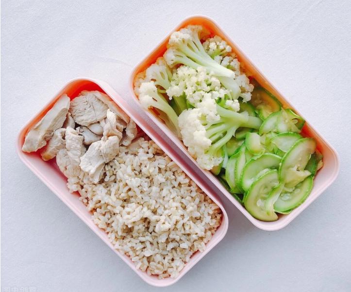
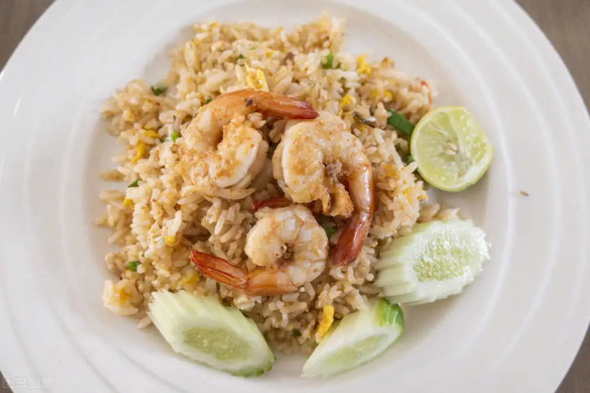

饮食调整，贵在平衡。保证必需营养吸收，减少不必要的食物摄入。

<!--more-->

## 七分饱

**什么是七分饱呢？**

**如何把握七分饱呢？**

七成饱，大部分人找不到这个点，经常把胃里感觉满的八成饱当成最低标准，甚至到了多吃一口就觉得胀的九成饱。

因为大多数人都边吃边说笑，边吃边谈生意，边吃边上网看电视，分散注意力后，就很难感受到饱感的变化，不知不觉地饮食过量。

**怎么能感觉这么细致的差异呢？**

专心致志细嚼慢咽，放慢速度是关键。

从第一口开始，感受自己对食物的急迫感，每吃一口后感受饥饿感的逐渐消退，胃里面逐渐的充实，体会这些不同饱感程度的区别。

然后，找到七成饱的点，把它作为自己的日常食量，就能预防饮食过量。

## 早餐

早餐是一天所有能量之源，一定要吃好早餐才能有充足的力量来进行一天的工作和生活。

### 鸡蛋猪排三明治

简单的早餐也会有大营养，简易三明治加一杯热牛奶一份水果，这样食材很普遍却是可以满足人体内需求的重要营养。早餐一定要吃，而且要吃的丰富，别再用没时间找借口伤害你的身体。

## 午餐

午餐吃个 5 ~ 7 分饱。

## 晚餐

晚餐，少吃或不吃（以果蔬代之）。

## 减肥不等于饿肚子

为了瘦下来，你还是节食挨饿吗？减肥不是节食。相信我，饿不了几顿的……

**减肥的关键是提升身体的热量缺口**，也就是提升热量输出，降低热量摄入，以此来促进脂肪的分解。而挨饿只会让身体感到饥荒，从而导致身体基础代谢值下降，正确地饮食方法要牢记以下几个方面。

**1、用低热量的食物代替各种高热量的食物**

这样不用减少食物分量，也能控制卡路里摄入，还能避免饥饿感的出现。

我们要**选择清蒸、水煮**的方法代替各种红烧、煎炸的做法，比如水煮土豆代替红烧土豆，可以避免食物热量大大飙升，**选择饱腹感强、体积大的食物**代替饱腹感差，体积小的食物，比如生菜、西蓝花代替各种加工零食。

  

**2、学会多喝水**

水是没有热量的，不会让你发胖。多喝水可以减缓饥饿感的出现，控制进食量，还能促进身体代谢循环，加速废物的排出，有助于脂肪的代谢。

建议，每天的喝水量在 2L 左右，多个时间段补充，尽量在**饭前喝，饭后跟睡前要少喝水**。喝水要**喝热水、温水，不要喝冷水**，拒绝各种冷饮跟加工果汁，避免多余热量的摄入。

**3、三餐要规律，不要路过任何一餐。**

不吃早餐，跳过晚餐，平时饥一餐饱一餐的行为，容易诱发肠胃疾病，还容易在下一餐进行报复性进食，胃容量也会被撑大，不利于减肥。而规律的饮食习惯，有助于肠胃健康，让肠胃运转更加高效，从而减少脂肪的堆积。我们要三餐定时，保持饭吃八分饱，可以有效控制胃容量，健康地瘦下来。

**4、不要拒绝主食**

主食可以给身体补充碳水化合物，提供代谢动力。正常人每天的碳水主食摄入量在 250-300g 左右，减肥期间，我们可以降为 180-200g 左右，补充身体所需的碳水能力。

此外，主食的选择方面，我们可以**粗细粮结合**，少吃一些面食跟米饭，适当吃一些糙米、燕麦、全麦包等粗粮，以此来控制升糖系数，**延长饱腹时间**，这样可以有效降低暴食几率，提升减肥成功率。

  

至于量呢？七分饱 ❗️❗️❗️

## 参考链接

- https://new.qq.com/omn/20220507/20220507A0D3N900.html
- https://baijiahao.baidu.com/s?id=1626245545642571828&wfr=spider&for=pc
- https://mini.eastday.com/mobile/171210000039438.html
- https://jingyan.baidu.com/article/fcb5aff7c2e094adaa4a71b1.html
