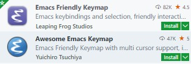
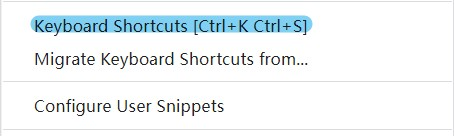

Vim 的键位不错，无论是移动光标还是进行编辑操作，但是如果是使用中文输入的话，就很尬 -- 中文状态下命令模式不能用，虽然通过一些方式可以使得在切换为非插入模式时自动切换为英文状态，但总是不那么尽如人意。

Emacs 的键位模式，就很适应中英文的混合输入，唯一的缺点就是有点费小手指。在 Emacs 中，我一般会启用 Evil 插件，如此，可以实现如果是只读文件和做一些删减工作的时候，就直接使用 Vim 的键位模式，而在插入模式下，就使用 Emacs 的键位模式，很不错，附上一份个人的 Evil 插件的配置 [init-evil.el](https://github.com/loveminimal/emacs.d/blob/master/lisp/init-evil.el) 。唯一不足的是，这种方式只有在 Emacs 中才是可用的，如果你使用其他编辑器时，就没有这份待遇了。不过，单纯的 Emacs 键位也足够好用了。

<!--more-->

在 IDE 中，基本上都可以配置键位映射，如 Jetbrains 家的系列产品中的 Emacs 键位映射都很好用，映射的也比较完整。

但是在 Visual Studio 中，就不那么喜人了，VS 恪守着在 Windows 系列下的那一套操作模式，不是说不好，而是你好歹让人定制一下。和 VS 比起来，vscode 就良心的多了，丰富的插件仓库，美观的主题，流畅度也很好。因为 Vim 存在中英文混输时候的不便，我之前一直使用 Emacs 的键位映射，通过下面这两个插件的一种。



让人遗憾的是，这两个插件，无论哪一个都不能带来完美的体验。在通常的编辑区还可以，但是在诸如搜索、替换等操作时让人很不爽。只能说有实现方式，但实现的比较曲线。

正如在[主题之旅](../a-theme-making-journey/)中描述的那样，Window 下的 Emacs 也或多或少的有一些问题，小问题，但让人很强迫。出于此种原因，我当下只在 Linux 中使用它。

目前的文字编辑工作主力是 vscode ，它有一个非常靠谱的功能，就是你可以自定义键位映射。你完全可以在原版键位的基础上进行个性化的定制，使之变为你想要的样子。



由于原版按键的兼容性最好，所以这里尽量避免了与原有按键的冲突，充分发挥了 `ALT` 键的使用。它像是一个 Emacs 和 Vim 的混合体，😄 如下：


上图对应的 `keybindings.json` 如下：

```json
// Place your key bindings in this file to override the defaults
[
    {
        "key": "alt+p",
        "command": "workbench.action.quickOpen"
    },
    {
        "key": "alt+n",
        "command": "workbench.action.terminal.toggleTerminal",
        "when": "terminal.active"
    },
    {
        "key": "alt+x",
        "command": "workbench.action.showCommands"
    },
    {
        "key": "alt+x",
        "command": "workbench.action.quickOpenNavigatePreviousInFilePicker",
        "when": "inFilesPicker && inQuickOpen"
    },
    {
        "key": "alt+i",
        "command": "editor.action.insertSnippet"
    },
    {
        "key": "ctrl+j ctrl+b",
        "command": "workbench.action.toggleActivityBarVisibility"
    },
    {
        "key": "alt+h",
        "command": "cursorLeft",
        "when": "textInputFocus"
    },
    {
        "key": "alt+l",
        "command": "cursorRight",
        "when": "textInputFocus"
    },
    {
        "key": "alt+k",
        "command": "cursorUp",
        "when": "textInputFocus"
    },
    {
        "key": "alt+j",
        "command": "cursorDown",
        "when": "textInputFocus"
    },
    {
        "key": "alt+g",
        "command": "cursorHome",
        "when": "textInputFocus"
    },
    {
        "key": "alt+oem_1",
        "command": "cursorEnd",
        "when": "textInputFocus"
    },
    {
        "key": "ctrl+oem_1",
        "command": "editor.action.commentLine",
        "when": "editorTextFocus && !editorReadonly"
    },
    {
        "key": "ctrl+oem_2",
        "command": "undo"
    },
    {
        "key": "ctrl+j ctrl+z",
        "command": "workbench.action.toggleZenMode"
    },
    {
        "key": "ctrl+j ctrl+e",
        "command": "workbench.view.explorer",
        "when": "viewContainer.workbench.view.explorer.enabled"
    },
    {
        "key": "ctrl+j ctrl+g",
        "command": "workbench.view.scm",
        "when": "workbench.scm.active"
    },
    {
        "key": "ctrl+j ctrl+f",
        "command": "workbench.action.replaceInFiles"
    },
    {
        "key": "alt+s",
        "command": "workbench.action.replaceInFiles"
    },
    {
        "key": "alt+oem_7",
        "command": "editor.action.triggerSuggest",
        "when": "editorHasCompletionItemProvider && textInputFocus && !editorReadonly"
    },
    {
        "key": "alt+oem_7",
        "command": "toggleSuggestionDetails",
        "when": "suggestWidgetVisible && textInputFocus"
    },
    {
        "key": "ctrl+oem_7",
        "command": "editor.action.triggerSuggest",
        "when": "editorHasCompletionItemProvider && textInputFocus && !editorReadonly"
    },
    {
        "key": "ctrl+oem_7",
        "command": "toggleSuggestionDetails",
        "when": "suggestWidgetVisible && textInputFocus"
    },
    {
        "key": "alt+j",
        "command": "workbench.action.quickOpenSelectNext"
    },
    {
        "key": "alt+k",
        "command": "workbench.action.quickOpenSelectPrevious"
    },
    {
        "key": "alt+j",
        "command": "selectNextSuggestion",
        "when": "suggestWidgetMultipleSuggestions && suggestWidgetVisible && textInputFocus"
    },
    {
        "key": "alt+k",
        "command": "selectPrevSuggestion",
        "when": "suggestWidgetMultipleSuggestions && suggestWidgetVisible && textInputFocus"
    },
]
```

体验非常之不错，如果，你也使用 vscode ，快些动手开始定制你自己的键位映射吧！🌟