> 转载自 https://www.jb51.net/hardware/cpu/610350.html

2018 年 4 月 3 日，Intel 在北京举办了第八代酷睿移动处理器全球发布会，正式发布了全新的第八代酷睿移动处理器。很多小伙伴其实对 intel 的芯片很感兴趣，但是一但深入了解，很快就会被扑面而来的晶体管，微架构，纳米，CPI，睿频，超频，缓存等概念搞疯………

<!--more-->

  

为何 CPU 工作如此迅速，为何主频变化多端，纳米级别的工艺到底是外星文明的帮助还是人类智慧的结晶，一片薄薄硅圆晶上到底隐藏着怎样的秘密，就让我们大家一起走一走“芯”吧……

先说说，芯片到底是个什么东西。

芯片，就是我们说的 CPU，又名中央处理器，常说芯片是一个机器的大脑，重要性可见一斑，它负责计算机多项工作的完成，快速处理数据，并把工作分类并传输指令给计算机的其它部件，这有点像一个物流中心，要把源源不断又种类繁多的数据“包裹”分析，分类，处理，传送……

所以，要不我们就把它比作一个物流中心好了，为方便理解，我们就从甄老板要开一个物流厂说起吧……

  

## 从沙子到芯片

甄老板要开一个物流厂，首先第一件事，当然是要选一块地，芯片物流厂的用地要求比较奇怪，它是需要建在沙子上的，因为工厂要顺利运行，需要一种沙子里面含有的特殊元素，si（硅），这也就是我们熟知的 CPU 是由沙子造的。

但是我们知道沙子上是不能直接建厂的，所以沙子需要特殊处理，这个处理就是通过一系列的提纯及切割，获得芯片基座-圆晶的过程。

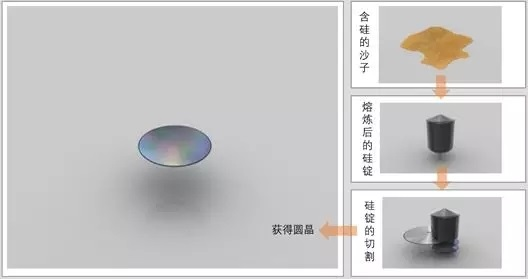  

圆晶（Wafer）是芯片的基础，是由硅纯度 99.9999％ 的硅锭切割成的薄片。在这个基础上，芯片制造商们将展开体现人类制造智慧的顶级工艺。当然，为了好理解，我们还是回到工厂的建造上来吧。

## 纳米技术及微架构

好了，现在工厂有了地，但是怎么建造流水线设施，让工人好好干活呢？

  

当然得找个牛一点的设计师先设计一下厂房的构造， 越牛的设计师，设计得越精巧，就是我们说的“工艺”，随着时代的进步，设计师们的精细度也从 45nm 级的设计，逐步精细化到 32，22，甚至现在的第八代 14nm，工艺越好，能容纳的工作单位（晶体管）就越多，一个针尖就有高达 5k 晶体管，当然也就意味着可以在工厂干活的人也越来越多，干活的速度也就能越来快啦……

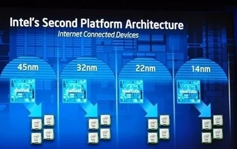  

设计师们还得去设计厂房的具体布局，比如这条流水线应该从左往右，还是从上到下呢？这种布局就叫微架构，当然布局过程非常复杂，介于我们都不是学建筑的，具体的工序也没必要特别了解，通俗点讲可以看作是一个在晶圆上做微雕，雕出众多晶体管的过程……这个东东的技术性和复杂性都已经登峰造极了，下方的部分工艺大家随意感受下就行……

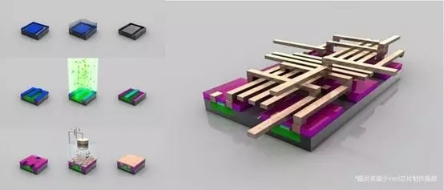  

架构决定了芯片的性能和功能，设计师们为了工人们能更快，更好的干活，并且能处理更多新出现的任务，在架构上简直绞尽脑汁，尽善尽美，所以在工艺进步的同时，也经常在架构上推陈出新，比如第八代 Intel 就是“coffee lake-H”设计代替了前一代的“kabylake-H”的设计。

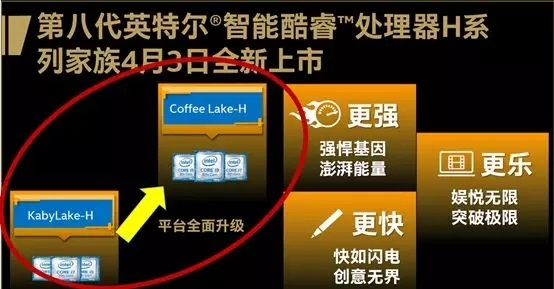  

不过微微吐槽一句，Intel 的架构命名还真是好喜欢用地名啊，不是这个湖就是那个桥，可能是想表明他们就是个跟土建沙石有关的公司吧（……大误）。

晶体管做完之后，后续还有一系列的测试，切割，封装等工序，圆晶就变成了一块块芯片，我们的工厂也就建好啦。

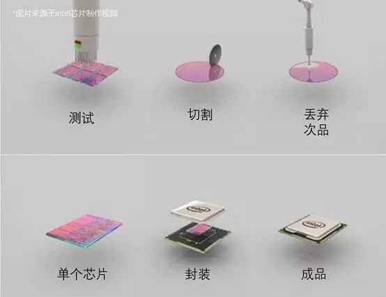  

虽然讲的很简单，但其实背后有很多的尖端工艺，Intel 作为金字塔的顶端，也只有 70% 的成功率，所以芯片行业真是汇集了精英资本和精英智慧的一个产业啊，不是高帅富的大佬还真的玩不起，当然这也是为什么，世界上的芯片制造商屈指可数的原因。

  

工厂总算建好啦，工人们各就各位，开始干活吧……

## 时钟频率与核心

人和厂都准备好了，但是人实在太多了，如果不好好管理的话，也会乱套，所以甄老板找了个大喇叭统一喊“1，2，1，2”，让工人们有节奏地干活，这个“1，2，1，2”就是时钟频率。

通常意义上我们把它认为是 CPU 的主频，主频越高，说明工人们干活越快，CPU 的速度也就越快，一般我们能看到就是 xxGHz 这样的显示，数值越高，说明速度越快。

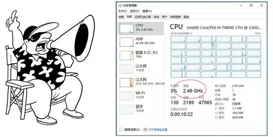  

当然甄老板为了效率能更高点，可能会同时建 2 个或者 4 个厂房，就我们熟知的双核 CPU，4 核 CPU，这样通过协同，工人们的效率就更高，单位时间能处理的活也就越多。

而这样根据不同的等级，CPU 也就有了 i3，i5，i7 之分（现在还出现了 i9 级 CPU），等级越高，主频表现越好，工厂越有效率，而在第八代的 intel 芯片中，又有了划时代的产品：首次出现了 6 核的移动平台 CPU。

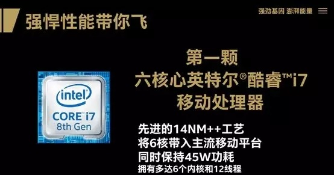  

这颗芯将主流移动计算提身高了 6 核的时代（需要说明的是服务器及商用领域其实早就已经出现 6 核，但是移动平台是首次），当然，我们在这一张图中除了看到熟悉的 14 纳米制程工艺，核心数之外，还看到了另外的参数，一是功耗，一是线程，功耗我们放后面说，先说说线程。

## 线程、睿频、超频

还是举工厂的例子，甄老板在厂房布局（微架构）及工人数量（晶体管）的布置上已经到了极限，还想提高效率怎么办呢？就要说到我们下面的概念了线程和超线程。

线程其实是个虚拟概念，类似于工厂外面排好等待处理的包裹队列，一般每个核心对应着一个线程，包裹按顺序进入工厂，这样 CPU 就可以有条不稳地工作了

而超线程相当于一个核心对应了两条队列，两条队列上的包裹按工厂的处理能力依次进入厂房，道路宽了，也让整个进程更有效率。

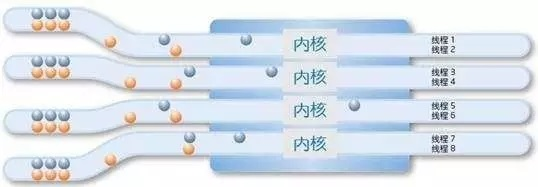  

然后工厂这边，任务突然多了起来，处理速度也要相应的提高，甄老板想到了一个办法，号召想多干活的工人们去拿加班奖励，一部分工人当然积极响应，多出来的任务很快完成了，这个自主接收激励的动作，就叫睿频。

睿频：是指当启动一个运行程序后，CPU 会自动加速到合适的频率，而原来的运行速度会提升 10%~20% 以保证程序流畅运行的一种技术。睿频是 intel 的一个重要技术，也是智能 CPU 的基础，这项技术被运用到了 intel 的全系列，包括第八代 CPU。

下图就是最新的睿频技术，可以提升至 4.8Ghz，完成峰值任务 so easy！

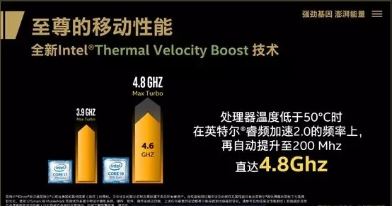  

当然，有时候工厂的活特别多，自愿去加班的工人都完成不了了。这时候甄老板不得不放出了“全体人必须加班“的大招，将工厂的速度强制提升到某一个值上，这个动作叫做超频。

超频：用户强制将处理器的所有内核运行在规格限定频率范围之外，以求更好的速度。这个动作通过给 CPU 加压实现的，虽然可以提升效率，但有时候也会损伤元件，各位少侠，请慎重使用哦。

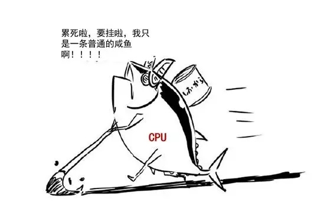  

## 缓存与傲腾

经过一系列的处理，工厂的生意越来越好，但是甄老板渐渐发现，这个厂，有！问！题！

因为他发现，每次包裹传送带都要从很远的“内存仓库“甚至更远的“硬盘仓库”传送，路途遥远，耗费时常不说，还经常丢失包裹。

  

痛定思痛，甄老板决定在厂房的周围自建仓库以临时存储待处理的包裹，离厂房最近且最快的叫一级仓库，但因为地价比较贵，所以一级仓库的面积最小，以此类推，又建了二级仓库，三级仓库，三个仓库配合无间，让包裹能不间断地运送到工厂。

这就是 CPU 一，二，三级缓存的概念（下图中其实只能看到三级，因为一二级太小了）。

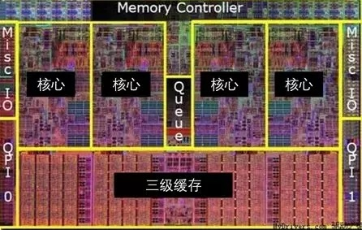  

后来 Intel 认为，3 级缓存已经跟不上现在的时代，所以在最近的第八代 CPU 中，直接在芯片上建了了内存仓库大小的超级缓存，就是“傲腾”。

这个可选配的“傲腾”内存，这大大提高了用户的峰值速度，也让电脑在大任务面前，终于可以轻松起飞。

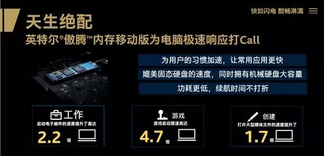  

## 能耗

刚刚借着 intel 第八代 CPU 普及了很多芯片上的参数，最后说说能耗一般效率越高的工厂，当然能耗就越多，放在 CPU 上，意味着更废电，以及发热更大，所以保证运行的稳定，CPU 主频往往到一定阶段就不再上升了，能耗性能如何平衡？也是考验 CPU 厂商的一个关键。

不过 Intel 在这方面处理得还是相当不错的，可以说是极大的兼顾了速度与稳定在第八代的 Intel i9 CPU 中还首次实现了移动智能不锁频的技术，可以说是很艺高人胆大了。

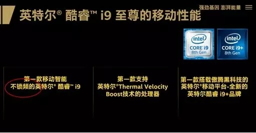  

## 结语

熟悉 intel 的人对这个发布会还是有所意料，因为毕竟我们都已经知道，Intel 遵循 tick-tock 开发模式，两年更新一个工艺，隔年更新微架构，不过这两年 intel 在工艺上已经遥遥领先于对手，所以新 CPU 在工艺上的更新并没有太大，但转而在架构上进行调整，以适应现阶段如 4K、VR、娱乐、游戏、无线技术等更应用化也更新的多任务的处理。

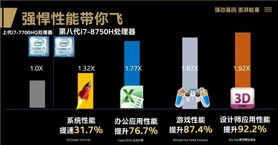  

不管怎么说，一代确实比一代好了，而随着时代的发展，Intel 也逐渐由原来单纯的芯片厂商，逐渐开始在自家的处理器上集成显卡、内存（四级缓存），不满足做个快递大厂，开始做店面，还包了飞机火车轮船，直接开始打开了地图打野模式……

当然乐见的是，技术的革新为新硬件的诞生也提供了坚实的基础。

未来已来，我们拭目以待！