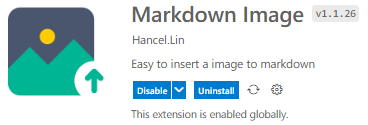
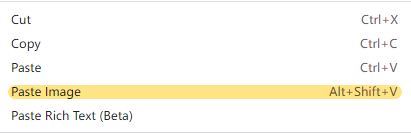

在 [《一场“疲惫”的主题制作之旅》](../a-theme-making-journey) 中，已经有了不少博客相关的碎碎念。这里，主要用来浅谈一下当前站点博客系统的 *-搭建、编辑及部署* 相关的系列流程。

  

当前站点，使用 [Hugo 静态博客生成系统](https://gohugo.io/) 驱动，部署在个人服务器上。事实上，你可以把生成的站点项目部署在任何可以被访问的地方（比如 `Github Page`），它本质上是一个包含了若干 `.html` 文件及相关静态资源的文件夹。

<!--more-->

## 准备篇

……

## 搭建篇

……

## 编辑篇

这里，我们以当前文章的创建及编辑过程为例。

### 创建文章

我们可以使用以下命令来创建文章：

```sh
hugo new posts/how-do-i-blog/index.md	# 推荐
# 或
hugo new posts/how-do-i-blog.md			# 不推荐
```

这里我们使用第一条命令，该命令会自动生成如下目录层级下 `.md` 文件。

```
content
├── posts
│   ├── how-do-i-blog
│   │   ├── imgs
│   │   │   └── 1aa09c580e674b09e82c722a3689d280012f2ae6e1700e924deeef558347d91a.png
│   │   └── index.md
```

**为什么不直接使用 `how-do-i-blog.md` ，而使用 `how-do-i-blog/index.md` ？**

正如上述目录层级中所反映的，如此方便我们把当前文件所需要的资源（如图片 imgs ）都放在当前文章的层级下，方便管理。

这样做还有额外的好处，我们将在后面 [插入图片](#插入图片) 的部分进一步说明。

**为什么我们直接手动创建 `.md` 文件呢？**

事实上，你完全可以手动创建它，但手动创建出的 `index.md` 文件是空白的，而通过上述命令创建出的 `index.md` 文件则会包含类似以下内容文件头：

```
---
title: "How Do I Blog"
date: 2023-03-06T09:40:02+08:00
draft: false
categories: [_Misc]
tags: []
card: false
weight: 0
---
```

它们包含了一些 Hugo 生成文章时要使用到的信息，我们可以把 `title` 修改为自己喜欢的文章标题，并为其设置分类和标签等。以下，是我们修改之后的文章头信息：

```
---
title: "我是怎么写博客的"
date: 2023-03-06T09:40:02+08:00
draft: false
categories: [关于]
tags: []
card: false
weight: 0
---
```

我们这里把文章名称改为了 `我是怎么写博客的` ，并把它分类到 `关于` 类别中。

**这些头信息是怎么生成的？在哪里配置它们？**

它位于站点根目录下的 `/archetypes/default.md` 中，该文件默不存在。一般会启用你所使用主题下的 `themes/virgo/archetypes/default.md` 文件。

```
.
├── archetypes
│   ├── default.md

```

以下是 [loveminimal/hugo-theme-virgo](https://github.com/loveminimal/hugo-theme-virgo) 主题中的 `default.md` 内容：

```
---
title: "{{ replace .Name "-" " " | title }}"
date: {{ .Date }}
draft: false
categories: [_Misc]
tags: []
card: false
weight: 0
---
```

你可以修改它，或者在站点根目录下，创建新的 `default.md` 文件，并修改为自己喜欢的初始配置。

### 插入图片

在文章中插入图片是一个相对高频的操作。在第三方的博客平台中，一般来说直接复制图片并粘贴到要插入的位置就可以了，很方便。而编辑 `.md` 文件，插入图片就稍微麻烦一些。

我们通过 `` 在文章中插入图片，默认情况下，你需要经过：

```
1. 搜索图片
2. 另存图片到本地
3. 编辑 `` 引用
……
```

**很繁琐！**

而且还不能控制图片的‘显示’尺寸，需要插入图片数量过多的时候，简直就是一种折磨了。

**有没有一种更好的方式来插入图片呢？**

很幸运，有！

我平时是使用 VSCode 来管理站点内容和编辑 `.md` 文件的，其中有一款插件很好地解决了这个问题。

  

它提供了丰富的自定义设置选项，这里主要用到以下几种：

- Markdown-image › Base: File Name Format ，设置为 `${hash}` ，当然有其它各种格式可选组合；
- Markdown-image › Base: Image Width ，设置为 `400` ，默认宽度设为 `400px` ；
- Markdown-image › Local: Path ，设置为 `./imgs` ，生成的图片放在当前文章同级目录下的 `imgs` 文件夹中。

> 这也是上文中我们推荐使用 `hugo new posts/how-do-i-blog/index.md` 命令来生成文章的原因之一。

使用该插件，你只需要复制所需要图片（本地或网络图片），并通过其提供的粘贴方式（右键选择）插入到位置即可。如此，你的 `.md` 文件中，就会插如下内容：

```
  
```

它会被渲染成下面这张图片，是不是很方便！

  

**它的原理是什么？**

它会读取你剪切板中刚刚复制的图片数据，在你粘贴的时候，重新生成一份拷贝，并在 `.md` 文件中，插入对应的图片格式，并引用。真的很方便！🎉

### 语法增强

我们在 [hugo-theme-virgo](https://github.com/loveminimal/hugo-theme-virgo) 主题中，对 Markdown 的语法提供了一些增强功能 - **下划线、文字高亮、标注、折叠板** ，你要以在 [《关于 Virgo 需要知道的一些事》：标记语法增强](../about-virgo/#%E6%A0%87%E8%AE%B0%E8%AF%AD%E6%B3%95%E5%A2%9E%E5%BC%BA) 文章中了解它。

当然，如果你使用其它主题，这些增强的样式是无法生效的，幸运的是，它在其他主题中依然得到渲染 - 使用斜体显示，你并不会丢失你想表达的内容。

## 部署篇

当你想部署你的站点内容到托管平台时，你可能会经过以下步骤：

```
1. 执行 `hugo` 命令，生成站点内容，默认放在站点根目录的 `public` 文件夹中；
2. 复制内容包，上传到托管平台；
……
```

如果，只操作一次的话，不是很复杂，但如果，你的内容更新比较频繁，那就有些烦扰了。内容包的部署方式有很多，各有优缺。

### 脚本部署

我们这里，使用脚本部署，一次性配置之后，每次部署只需要执行一条简单的命令即可。分享出来，供大家参考使用。

我们的站点目录如下所示：

```
.
├── config.toml
├── content
│   ├── about
│   ├── archive.md
│   ├── _index.md
│   ├── nav
│   ├── posts
│   └── search.md
├── package.json
├── README.md
├── resources
│   └── _gen
├── scripts
│   ├── deploy.sh
│   └── gitee.sh
```

其中， `scripts/deploy.sh` 便是我们定义的部署脚本，其内容如下：

```sh
#!/bin/sh
# -------------------
# Deploy posts to `loveminimal.github.io`
# -------------------

if [ -d "public" ]
then
	# 如果你是部署到 GitHub ，并绑定了域名，那你可能需要启用该行，以
	# 保证其正确的指向
    # rm -rf "public/CNAME" && cp -r "CNAME" "public/"

	# 拷贝内容包 public 到一个临时文件夹 .temp ，并
	# 用 git 初始化管理该它
    cp -r "public" "../.temp"
    cd "../.temp"
    pwd
    git init
    git add .
    git commit -m "Posts update."

	# 添加远程库，引得我们使用的是个人服务器的仓库地址，如果
	# 你是托管在 GitHub 上，那么连接的对应的远程库即可 - <YOUR_USERNAME>.github.io
	# 如果你是在 GitHub ‘政治正确’后创建的库，其默认分支为 main, 那你
	# 需要 master:main 而不是 master
    git remote add origin jack@ovirgo.com:/home/jack/.repo/site.git
    git push -f origin master
    # git remote add origin https://github.com/loveminimal/loveminimal.github.io.git
    # git push -f origin master:main

	# 清除临时文件夹
    cd ..
    rm -rf ".temp"

	# 返回站点目录
    cd "site"
fi
```

如上所示，只需要在站点根目录下，运行 `source scripts/deploy.sh` 就可以静待站点部署完成了。

初看，上述脚本初看可能有些混乱，尤其是对初学者来说。但其实，如果你愿意，理论上你需要：
- 更改远程仓库地址；
- 更改站点目录，即可。

也许你会遇到各种各样的问题，但你也会从中收获到不少的乐趣，不是嘛~~

### 命令简化

使用 `source scripts/deploy.sh` 还是有点太复杂了？有如下限制：
- 需要进行到站点根目录才可以运行它；
- 部署后，站点内的内容包并没得到清理。

哈，你只需要多加几条命令即可，如下：

```
cd ~/AppData/Roaming/site && rm -rf public && hugo && source scripts/deploy.sh && rm -rf public
```

如此，无论当前你在那一种路径，都会：
1. 自动进入站点根目录（此处是 `site`）；
2. 删除站点下旧的 `public` （如果有的话）；
3. 根据当前内容生成新的 `public` 内容包；
4. 执行部署脚本，发布到对应托管平台；
5. 清理掉生成的 `public` 内容包。


Emm... 还是长啊，每次都要键入这么长，太麻烦了，怎么办？

那么你就需要了解一些关于 bash alias 方面的知识了，如下所示，在当前用户家目录下，创建 `.bash_aliases` 文件（若无），并添加如下内容：

```
alias ssd="cd ~/AppData/Roaming/site && rm -rf public && hugo && source scripts/deploy.sh && rm -rf public"
```

保存后，在用户家目录下，运行 `source .bashrc` 命令使 `.bash_aliases` 中的别名生效。

OK，现在，当你想部署站点的时候，你只需要运行键入 `ssd` ，回车即可完成部署。

**‘用户家目录’是什么？**

在 Windows 下，有两个家目录： 
- 用户家目录，如 `C:\Users\jack` ，一些软件的默认配置会放在该目录下；
- 用户漫游家目录，如 `C:\Users\jack\AppData\Roaming` ，另一些软件的配置又会放在这个目录下。

😅 微软的东西真的有点混乱哈。

如果，你使用的是 GNU/Linux 系统，那么家目录就只有一个喽，如 `/home/jack` 。