好吧，试了，但真的没找到 “佚名” 是谁 😂 ，希望原作者能感受到我的原力感谢吧…… 不少网站都有转载该篇文章，以下是图片较清晰的几个页面链接。

- https://www.sohu.com/a/255397866_468626
- https://www.jb51.net/hardware/cpu/611229.html
- https://www.jb51.net/hardware/cpu/610350.html

`1 寸 = 33.3333 mm`
`集成电路 ic (integrated circuit )`

<!--more-->

## 引言

CPU 是现代计算机的核心部件，又称为“微处理器”。对于 PC 而言，CPU 的规格与频率常常被用来作为衡量一台电脑性能强弱重要指标。

许多对电脑知识略知一二的朋友大多会知道 CPU 里面最重要的东西就是晶体管了，提高 CPU 的速度，最重要的一点说白了就是如何在相同的 CPU 面积里面放进去更加多的晶体管，由于 CPU 实在太小，太精密，里面组成了数目相当多的晶体管，所以人手是绝对不可能完成的，只能够通过光刻工艺来进行加工的。

这就是为什么一块 CPU 里面为什么可以数量如此之多的晶体管。晶体管其实就是一个双位的开关：即开和关。如果您回忆起基本计算的时代，那就是一台计算机需要进行工作的全部。两种选择，开和关，对于机器来说即 0 和 1。

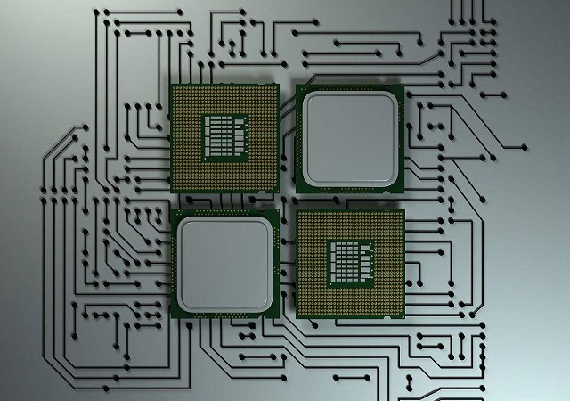

那么如何制作一个 CPU 呢？

大家可能只知道制作 IC 芯片的硅来源于沙子，但是为什么沙子做的 CPU 却卖那么贵？下面本文以 intel 电脑 CPU 作为例子，讲述沙子到 CPU 简要的生产工序流程，希望大家对 CPU 制作的过程有一个大体认识，其它 CPU 或者手机 CPU 制造原理也大抵相同。

## 一、硅圆片的制作

### 1. 硅的重要来源：沙子

作为半导体材料，使用得最多的就是硅元素，其在地球表面的元素中储量仅次于氧，含硅量在 27.72%，其主要表现形式就是沙子（主要成分为二氧化硅），沙子里面就含有相当量的硅。因此硅作为 IC 制作的原材料最合适不过，想想看地球上有几个浩瀚无垠的沙漠，来源既便宜又方便。

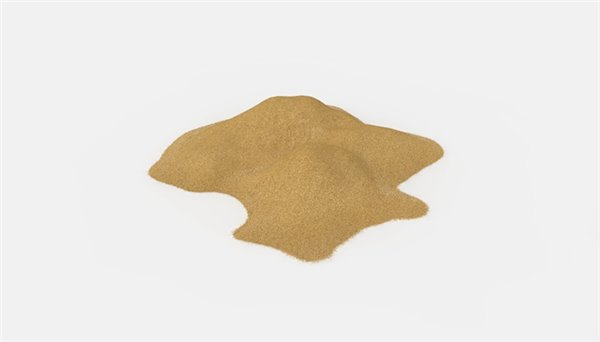  

### 2. 硅熔炼、提纯

不过实际在 IC 产业中使用的硅纯度要求必须高达 99.999999999%。目前主要通过将二氧化硅与焦煤在 1600-1800℃中，将二氧化硅还原成纯度为 98% 的冶金级单质硅，紧接着使用氯化氢提纯出 99.99% 的多晶硅。虽然此时的硅纯度已经很高，但是其内部混乱的晶体结构并不适合半导体的制作，还需要经过进一步提纯、形成固定一致形态的单晶硅。

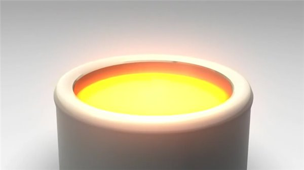  

### 3. 制备单晶硅锭

单晶的意思是指原子在三维空间中呈现规则有序的排列结构，而单晶硅拥有“金刚石结构”，每个晶胞含有 8 个原子，其晶体结构十分稳定。

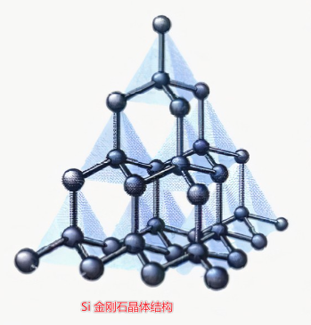  
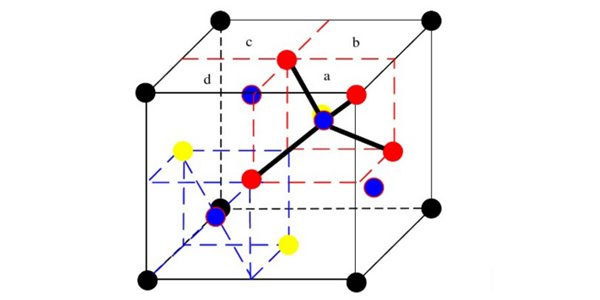  

通常单晶硅锭都是采用直拉法制备，在仍是液体状态的硅中加入一个籽晶，提供晶体生长的中心，通过适当的温度控制，就开始慢慢将晶体向上提升并且逐渐增大拉速，上升同时以一定速度绕提升轴旋转，以便将硅锭控制在所需直径内。结束时，只要提升单晶硅炉温度，硅锭就会自动形成一个锥形尾部，制备就完成了，一次性产出的 IC 芯片更多。

`> 籽晶是具有和所需晶体相同晶向的小晶体，是生长单晶的种子，也叫晶种。`

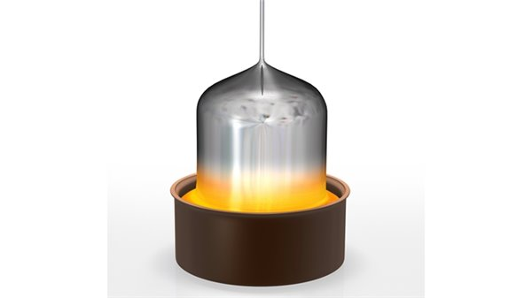  

制备好的单晶硅锭直径约在 300mm 左右，重约 100kg。而目前全球范围内都在生产直径 12 寸的硅圆片，硅圆片尺寸越大，效益越高。

### 4. 硅锭切片

将制备好的单晶硅锭一头一尾切削掉，并且对其直径修整至目标直径，同时使用金刚石锯把硅锭切割成一片片厚薄均匀的晶圆（1mm）。有时候为了定出硅圆片的晶体学取向，并适应 IC 制作过程中的装卸需要，会在硅锭边缘切割出“取向平面”或“缺口”标记。

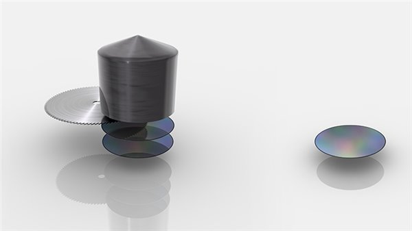  

### 5. 研磨硅圆片

切割后的晶圆其表面依然是不光滑的，需要经过仔细的研磨，减少切割时造成的表面凹凸不平，期间会用到特殊的化学液体清洗晶圆表面，最后进行抛光研磨处理，还可以在进行热处理，在硅圆片表面成为“无缺陷层”。一块块亮晶晶的硅圆片就这样被制作出来，装入特制固定盒中密封包装。

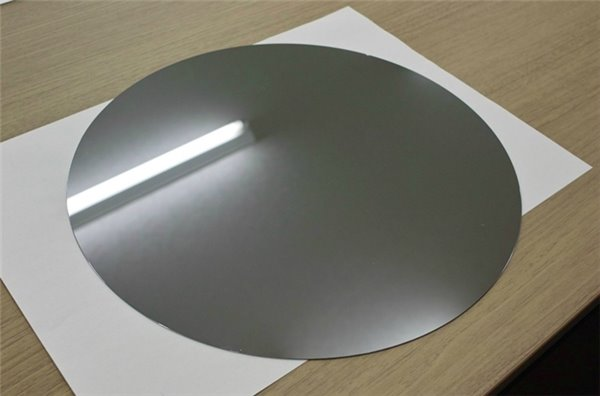    

`> 制作完成的硅圆片`

通常半导体 IC 厂商是不会自行生产这种晶圆，通常都是直接从硅圆片厂中直接采购回来进行后续生产。

## 二、前工程 -- 制作带有电路的芯片

### 6. 涂抹光刻胶

买回来的硅圆片经过检查无破损后即可投入生产线上，前期可能还有各种成膜工艺，然后就进入到涂抹光刻胶环节。微影光刻工艺是一种图形影印技术，也是集成电路制造工艺中一项关键工艺。首先将光刻胶（感光性树脂）滴在硅晶圆片上，通过高速旋转均匀涂抹成光刻胶薄膜，并施加以适当的温度固化光刻胶薄膜。

`> 光刻胶是一种对光线、温度、湿度十分敏感的材料，可以在光照后发生化学性质的改变，这是整个工艺的基础。`

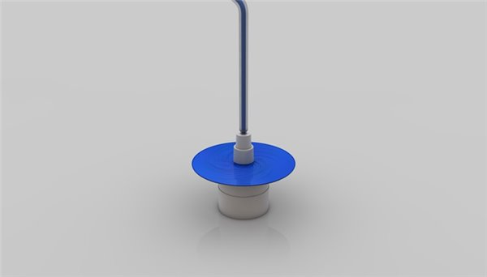  

### 7. 紫外线曝光

就单项技术工艺来说，光刻工艺环节是最为复杂的，成本最为高昂的。因为光刻模板、透镜、光源共同决定了“印”在光刻胶上晶体管的尺寸大小。

将涂好光刻胶的晶圆放入步进重复曝光机的曝光装置中进行掩模图形的“复制”。掩模中有预先设计好的电路图案，紫外线透过掩模经过特制透镜折射后，在光刻胶层上形成掩模中的电路图案。一般来说在晶圆上得到的电路图案是掩模上的图案 1/10、1/5、1/4，因此步进重复曝光机也称为“缩小投影曝光装置”。

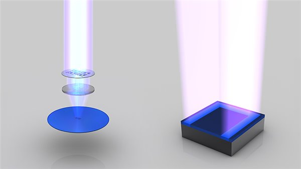  

一般来说，决定步进重复曝光机性能有两大要素：一个是光的波长，另一个是透镜的数值孔径。如果想要缩小晶圆上的晶体管尺寸，就需要寻找能合理使用的波长更短的光（EUV，极紫外线）和数值孔径更大的透镜（受透镜材质影响，有极限值）。

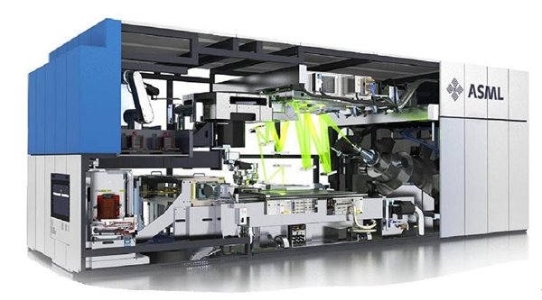  

`> ASML 公司 TWINSCAN NXE:3300B`

### 8. 溶解部分光刻胶

对曝光后的晶圆进行显影处理。以正光刻胶为例，喷射强碱性显影液后，经紫外光照射的光刻胶会发生化学反应，在碱溶液作用下发生化学反应，溶解于显影液中，而未被照射到的光刻胶图形则会完整保留。显影完毕后，要对晶圆表面的进行冲洗，送入烘箱进行热处理，蒸发水分以及固化光刻胶。

`> 将光刻胶分为两类，一类是负性光刻胶，一类是正性光刻胶。在显影后，正性光刻胶未曝光的部分将被保留下来，而负性光刻胶则在显影后保留下来。也就是说，在曝光结束后，用显影液显影的是正性光刻胶的感光区、负性光刻胶的非感光区，将溶解在显影液中，此步骤完成后，光刻胶涂层上的图象便可显示出来。为提高分辨率，几乎每种光刻胶都配备了专用显影液，以保证显影效果。`

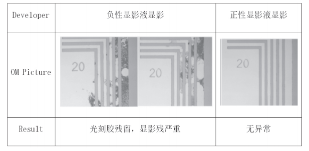  

`> 负性光刻胶一般采用负性显影液。在无界面活性剂的情况下，正性光刻胶采用正性显影液显影。正性和负性显影液都是碱性溶剂，其主要区别是负性显影液中含有表面活性剂，而正性显影液中没有这种成分。`

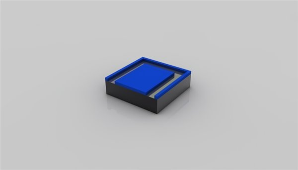  

### 9. 蚀刻

将晶圆浸入内含蚀刻药剂的特制刻蚀槽内，可以溶解掉暴露出来的晶圆部分，而剩下的光刻胶保护着不需要蚀刻的部分。期间施加超声振动，加速去除晶圆表面附着的杂质，防止刻蚀产物在晶圆表面停留造成刻蚀不均匀。

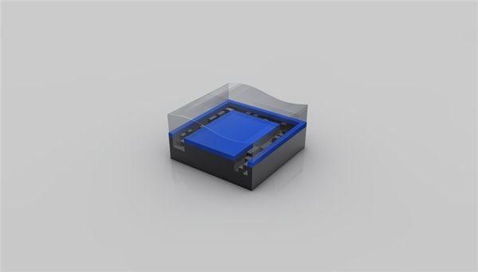  

### 10. 清除光刻胶

通过氧等离子体对光刻胶进行灰化处理，去除所有光刻胶。此时就可以完成第一层设计好的电路图案。

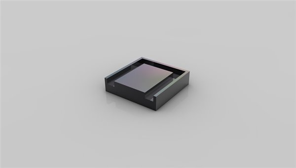  

### 11. 重复第 6-8 步

由于现在的晶体管已经 3D FinFET [FinFET 的原理与工艺] 设计，不可能一次性就能制作出所需的图形，需要重复第 6-8 步进行处理，中间还会有各种成膜工艺（绝缘膜、金属膜）参与到其中，以获得最终的 3D 晶体管。

[FinFET 的原理与工艺]: https://zhuanlan.zhihu.com/p/161907975

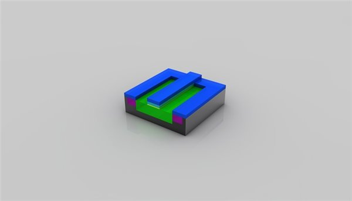  

### 12. 离子注入

在特定的区域，有意识地导入特定杂质的过程称为“杂质扩散”。通过杂质扩散可以控制导电类型（P 结、N 结）[PN 结原理简述]之外，还可以用来控制杂质浓度以及分布。

[PN 结原理简述]: https://blog.csdn.net/qq_44728587/article/details/123717696

现在一般采用离子注入法进行杂质扩散，在离子注入机中，将需要掺杂的导电性杂质导入电弧室，通过放电使其离子化，经过电场加速后，将数十到数千 keV 能量的离子束由晶圆表面注入。离子注入完毕后的晶圆还需要经过热处理，一方面利用热扩散原理进一步将杂质“压入”硅中，另一方面恢复晶格完整性，活化杂质电气特性。

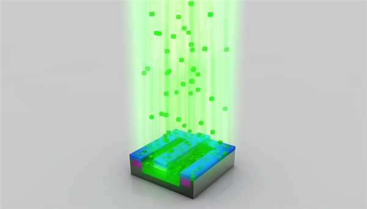  

离子注入法具有加工温度低，可均匀、大面积注入杂质，易于控制等优点，因此成为超大规模集成电路中不可缺少的工艺。

### 10. 再次清除光刻胶

完成离子注入后，可以清除掉选择性掺杂残留下来的光刻胶掩模。此时，单晶硅内部一小部分硅原子已经被替换成“杂质”元素，从而产生可自由电子或空穴。

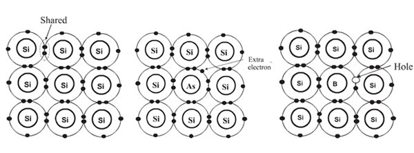  

`> 左：硅原子结构； 中：掺杂砷，多出自由电子； 右：掺杂硼，形成电子空穴`

真的是复杂……

### 11. 绝缘层处理

此时晶体管雏形已经基本完成，利用气相沉积法，在硅晶圆表面全面地沉积一层氧化硅膜，形成绝缘层。同样利用光刻掩模技术在层间绝缘膜上开孔，以便引出导体电极。

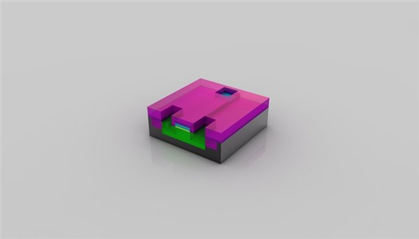  

### 12. 沉淀铜层

利用溅射沉积法，在晶圆整个表面上沉积布线用的铜层，继续使用光刻掩模技术对铜层进行雕刻，形成场效应管的源极、漏极、栅极。最后在整个晶圆表面沉积一层绝缘层以保护晶体管。

  

Okay ，现在我们有晶体管了……

### 13. 构建晶体管之间连接电路

经过漫长的工艺，数以十亿计的晶体管已经制作完成。剩下的就是如何将这些晶体管连接起来的问题了。同样是先形成一层铜层，然后光刻掩模、蚀刻开孔等精细操作，再沉积下一层铜层。.....，这样的工序反复进行多次，这要视乎芯片的晶体管规模、复制程度而定。最终形成极其复杂的多层连接电路网络。

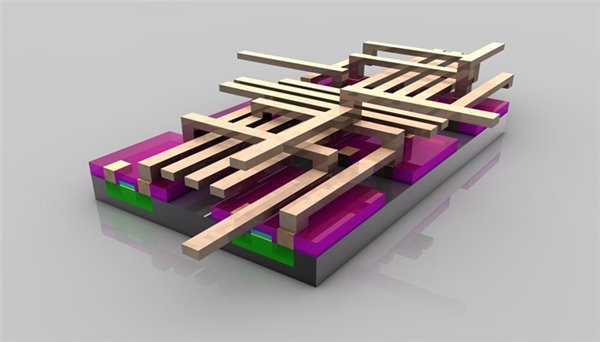  

由于现在 IC 包含各种精细化的元件以及庞大的互联电路，结构非常复杂，实际电路层数已经高达 30 层，表面各种凹凸不平越来越多，高低差异很大，因此开发出 CMP 化学机械抛光技术。每完成一层电路就进行 CMP 磨平。

另外为了顺利完成多层 Cu 立体化布线，开发出大马士革法新的布线方式，镀上阻挡金属层后，整体溅镀 Cu 膜，再利用 CMP 将布线之外的 Cu 和阻挡金属层去除干净，形成所需布线。

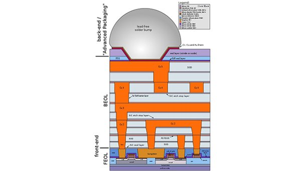  

`> 大马士革法多层布线`

芯片电路到此已经基本完成，其中经历几百道不同工艺加工，而且全部都是基于精细化操作，任何一个地方出错都会导致整片晶圆报废，在 100 多平方毫米的晶圆上制造出数十亿个晶体管，是人类有文明以来的所有智慧的结晶。

## 三、后工程 -- 从划片到成品销售

### 14. 晶圆级测试

前工程与后工程之间，夹着一个 Good-Chip/Wafer 检测工程，简称 G/W 检测。目的在于检测每一块晶圆上制造的一个个芯片是否合格。通常会使用探针与 IC 的电极焊盘接触进行检测，传输预先编订的输入信号，检测 IC 输出端的信号是否正常，以此确认芯片是否合格。

由于目前 IC 制造广泛采用冗余度设计，即便是“不合格”芯片，也可以采用冗余单元置换成合格品，只需要使用激光切断预先设计好的熔断器即可。当然，芯片有着无法挽回的严重问题，将会被标记上丢弃标签。

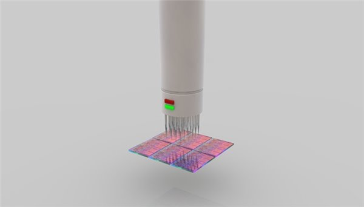  

### 15. 晶圆切片、外观检查

IC 内核在晶圆上制作完成并通过检测后后，就进入了划片阶段。划片使用的划刀是粘附有金刚石颗粒的极薄的圆片刀，其厚度仅为人类头发的 1/3。将晶圆上的每一个 IC 芯片切划下来，形成一个内核 Die。

裂片完成后还会对芯片进行外观检查，一旦有破损和伤痕就会抛弃，前期 G/W 检查时发现的瑕疵品也将一并去除。

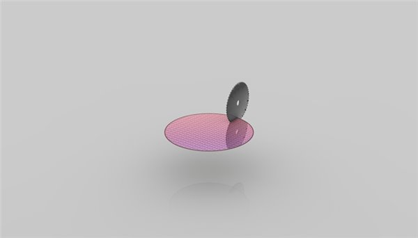  

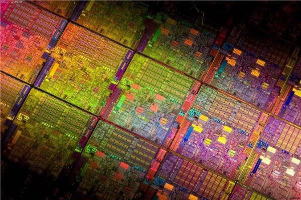  

`> 未裂片的一个个 CPU 内核`

### 16. 装片

芯片进行检测完成后只能算是一个半成品，因为不能被消费者直接使用。还需要经过装片作业，将内核装配固定到基片电路上。装片作业全程由于计算机控制的自动固晶机进行精细化操作。

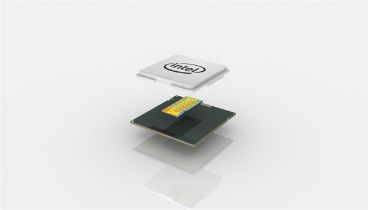  

### 17. 封装

装片作业仅仅是完成了芯片的固定，还未实现电气的连接，因此还需要与封装基板上的触点结合。现在通常使用倒装片形式，即有触点的正面朝下，并预先用焊料形成凸点，使得凸点与相应的焊盘对准，通过热回流焊或超声压焊进行连接。

封装也可以说是指安装半导体集成电路芯片用的外壳，它不仅起着安放、固定、密封、保护芯片，还可以增强导热性能的作用。目前像 Intel 近些年都采用 LGA 封装，在核心与封装基板上的触点连接后，在核心涂抹散热硅脂或者填充钎焊材料，最后封装上金属外壳，增大核心散热面积，保护芯片免受散热器直接挤压。

至此，一颗完整的 CPU 处理器就诞生了。

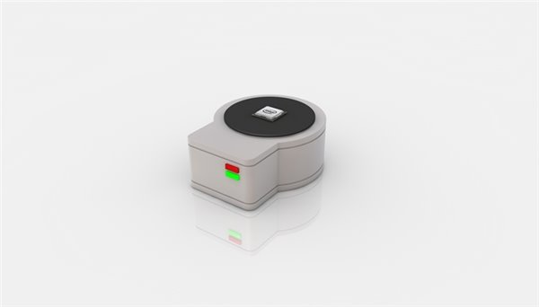  

### 18. 等级测试

CPU 制造完成后，还会进行一次全面的测试。测试出每一颗芯片的稳定频率、功耗、发热，如果发现芯片内部有硬件性缺陷，将会做硬件屏蔽措施，因此划分出不同等级类型 CPU，例如 Core i7、i5、i3。

### 19. 装箱零售

CPU 完成最终的等级划测试后，就会分箱进行包装，进入 OEM、零售等渠道。

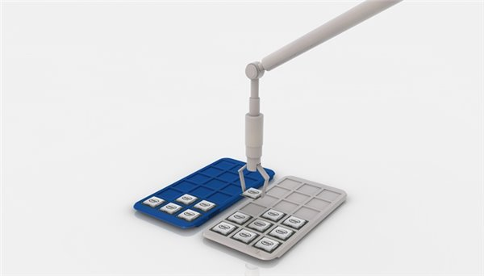  

## 结语

现在进入了科技时代，极度依赖计算机科学与技术，其中的 CPU 又是各种计算机必不可少重要部件。暂且不论架构上的设计，仅仅在 CPU 的制作上就凝聚了全人类的智慧，基本上当今世界上最先进的工艺、生产技术、尖端机械全部都投入到了该产业中。因此半导体产业集知识密集型、资本密集型于一身的高端工业。

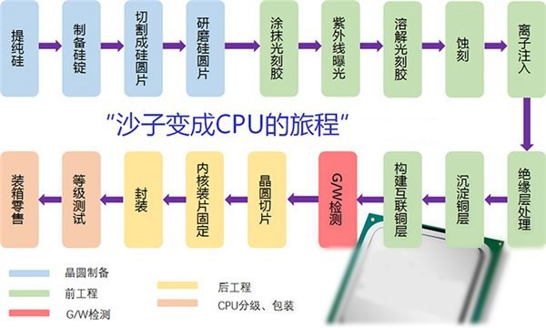  

`> CPU 制造全过程图解`

一条完整而最先进 CPU 生产线投资起码要数十亿人民币，而且其中占大头的是前工程里面的光刻机、掩膜板、成膜机器、扩散设备，占到总投资的 70%，这些都是世界上最精密的仪器，每一台都价值不菲。作为参照，CPU 工厂建设、辅助设备、超净间建设费用才占到 20%。

不知道大家看到这里，觉得最低几百块就可以买到一颗汇聚人类智慧结晶的 CPU，还值不值呢？