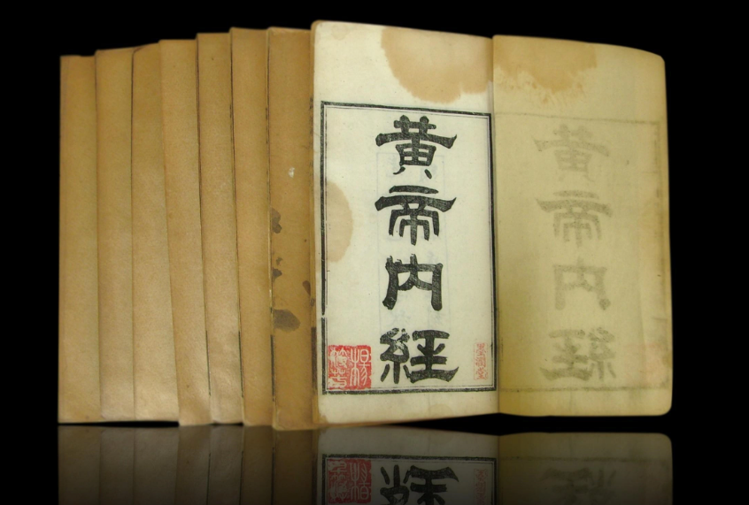
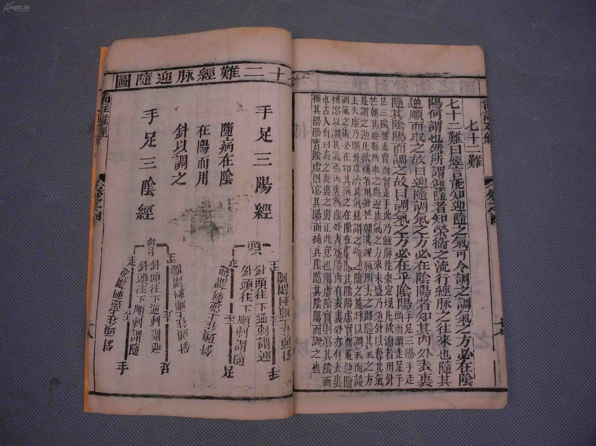
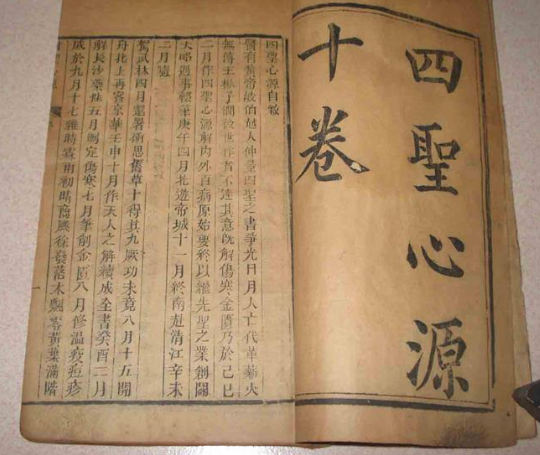
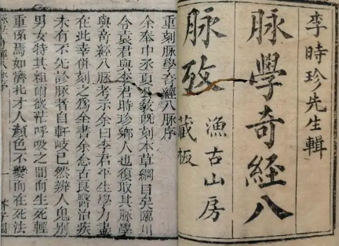

> “圣人不治已病，治未病；不治已乱，治未乱。”  
>`-- 《黄帝内经·素问·四气调神大论》`

生老病死，成住坏空，古往皆如是。生命的前几十年，身体是在上升期，经得起小风小浪小消耗。然岁月不饶人，专治各种不服 …… 😅

<!--more-->

我们要爱护自己的身体，守护好自己的健康。养生之道，任重道远，却是千里之行，始于足下。生活中的每一点有益的改变，都会让我们身体受用。现代医学多是西方那一套，不是说不好，心中却总是有一种其“治标不治本”的“偏见”。西医的“头痛医头，脚痛医脚”，着实有其局限，它把人体的大系统割裂式的看待，感觉还是太局部了。之前也没有看过什么医学著作，主要是感觉看了也看不懂，不知为何心血来潮，突然就想了解一二（也就只能学一点皮毛常识）。就想着从我国传统医学著作着手，毕竟几千年的实践检验了，至少不会给自己带坑里去，而且感觉上中医侧重养生，比较符合目前的状态。再不济，全当强化一下古文学习了，当成一种休闲消遣也不错。

百科一下，传统医学四大经典著作：《黄帝内经》、《难经》、《伤寒杂病论》、《神农本草经》，让我们择其一二先一窥究竟。

## 一二经典

  

`> 黄帝内经`

《黄帝内经》分《灵枢》、《素问》两部分，是一本综合性的医书，在黄老道家理论上建立了中医学上的“阴阳五行学说”、“脉象学说”、“藏象学说”、“经络学说”、“病因学说”、“病机学说”、“病症”、“诊法”、“论治”及“养生学”、“运气学”等学说。 其基本素材来源于中国古人对生命现象的长期观察、大量的临床实践以及简单的解剖学知识。《黄帝内经》奠定了人体生理、病理、诊断以及治疗的认识基础，是中国影响极大的一部医学著作，被称为医之始祖。

  

`> 难经`

《难经》是战国时期成书，作者是扁鹊 ，原名《黄帝八十一难经》，古代中医学著作之一，传说为战国时期秦越人（扁鹊）所作。本书以问答解释疑难的形式编撰而成，共讨论了81个问题，故又称《八十一难》，全书所述以基础理论为主，还分析了一些病证。其中一至二十二难为脉学，二十三至二十九难为经络，三十至四十七难为脏腑，四十八至六十一难为疾病，六十二至六十八为腧穴，六十九至八十一难为针法。

  

`> 四圣心源`

《四圣心源》是清·黄元御撰写于1753年的医书，又名《医圣心源》。作者将黄帝、岐伯、秦越人、张仲景视为医中四圣。本书阐发《内经》、《难经》、《伤寒论》、《金匮要略》诸书蕴义，卷一天人解；卷二六气解；卷三脉法解；卷四劳伤解；卷五至卷七杂病解；卷八七窍解；卷九疮疡解；卷十妇人解。是一部包括中医基本理论和部分临床医学的综合性著作。

  

`> 奇经八脉考`

奇经八脉是指十二经脉之外的八条经脉，包括任脉、督脉、冲脉、带脉、阴跷脉、阳跷脉、阴维脉、阳维脉。奇者，异也。因其异于十二正经，故称“奇经”。它们既不直属脏腑，又无表里配合。其生理功能，主要是对十二经脉的气血运行起着溢蓄、调节作用。（看小说的都爱这个，长长见识 🧐）

其他如《金匮要略》、《温病条辨》、《伤寒杂病论》和《神农本草经》太过专项了，概览了一下，实在是看不懂，暂且不去管它，后续有一定基础后再啃。

## 结语

无论做什么事情，思而后行，行而方有所得。看，你其实有很多事情值得去做，总可以变得更好。