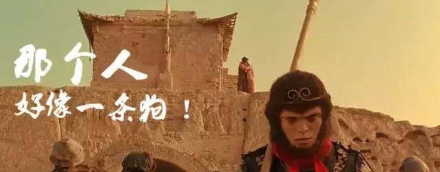

### “他好像条狗啊”
- 昨天下班的回家路上
- 骑着共享单车拐弯去四厂采购晚餐
- 在右拐进四厂街口的时候和一骑电车的女士撞了
- 看着她劈里啪啦说了一通，又是指责，又是卖惨
- 我沉默了有半天说了句，你想怎么解决？
- 她要我修车，去原装售后修恢复如新
- 又说自己腿都要流血了
- 一阵阵的厌恶更是涌上心头
- 只说了句：你也有事儿我也回家，200元，你自己修车去如何？
- 听到这儿她开心的说行，事情就算暂时了了
- 
- 回到家没有和家里人说
- 但心里却不是滋味
- 准确来讲她算是逆行的
- 自己却赔钱道歉甚是郁闷
- 当时路口的一个卖瓜的车阻挡了我的视线
- 而且不私了等交警之类的估计要折腾个把小时
- 如果警察来了也和稀泥的话则更是让人气闷
- 加上自己骑个共享单车毫发未损
- 对方电子车却是皮开肉绽
- 算了，花钱消灾得了。
- 
- 人到中年
- 懒得去计较
- 懒得去争吵 
- 不是因为没理
- 只是不想把一丝的精力
- 放在无关的人无关的事身上
- 对于我来讲除了以城的事
- 其它都不算大事
- 
- 这篇文章算是网站建好后的第一篇文章
- 网站用了星爷大话里的经典的两幅图
- 其实现在自己的状态
- 更像是夕阳武士片尾时说远去的悟空的那句
- “他好像条狗啊”
- 我戴上金箍化身悟空
- 只为城宝的人生之路保驾护航
- 哪怕在别人眼中的确怂得像条狗一样

### 汪！汪！！汪！！！

-   
