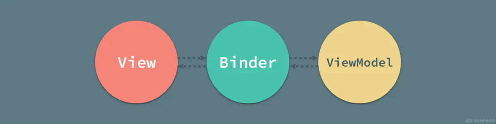

MVVM ? MVC ? MVP ?

<!--more-->

## MVVM[1]


MVVM 也被称为 model-view-binder ，其中 VM 是 ViewModel。View 和 ViewModel 之间采用数据绑定（双向的），避免了开发人员写一些同步 ViewModel 和 View 的重复逻辑。通过数据绑定，View 发生变化会自动反映到 ViewModel，ViewModel 产生的变化也会自动更新 View。

**ViewModel 创建了一个视图的抽象，将视图中的状态和行为抽离出来。**

在 MVVM 的实现中，还引入了隐式的一个 Binder 层，声明式的数据和命令的绑定在 MVVM 模式中就是通过它完成的。



前端比较流行的 VueJS 就是一个提供了 MVVM 风格的双向数据绑定的框架，它的核心是 MVVM 中的 VM（ViewModel），VM 负责连接 View 和 Model，保证视图和数据的一致性。

在 Vue 中，Model 和 VM，VM 和 View 之间都是双向数据绑定，实现方式是 *_数据劫持* （实现“数据支持”的基础是 ES5.1 中标准化的 `Object.defineProperty()` 方法）。

## Object.defineProperty()[2]

`Object.defineProperty()` 方法会直接在一个对象上定义一个新属性，或者修改一个对象的现有属性，并返回此对象。

先来看一个简单的示例：

```js
const obj = {};

Object.defineProperty(obj, 'prop', {
    value: 42,
    writable: false,
});

obj.prop = 76; // 在 strict mode 下会抛出错误

console.log(obj.prop); // → 42
```

*_语法格式* :

```
Object.defineProperty(obj, prop, descriptor)
// obj - 要定义属性的对象
// prop - 要定义或修改的属性的名称或 Symbol
// descriptor - 要定义或修改的属性描述符

// 返回被传递给函数的对象
```

我们主要来看一下 `descriptor` 是什么？有什么？怎么用？

|            | configurable | enumerable | value | writable | get | set |
|------------|--------------|------------|-------|----------|-----|-----|
| 数据描述符 | ✔            | ✔          | ✔     | ✔        | ✘   | ✘   |
| 存取描述符 | ✔            | ✔          | ✘     | ✘        | ✔   | ✔   |

对象里目前存在的属性描述符有两种形式：数据描述符和存取描述符。

其中， `configurable、enumerable` 是共享的，但 *_数据描述符* 是一个具有值的属性（ `value` ），其值可以是可写的/不可写的（ `writable` ）； *_存取描述符* 则是由 getter 函数和 setter 函数所描述的属性。

-   拥有布尔值的键 `configurable、enumerable` 和 `writable` 的默认值都是 `false` ；
-   属性值和函数的键 `value、get` 和 `set` 字段的默认值为 `undefined` 。

如果一个描述符不具有 `value、writable、get` 和 `set` 中的任意一个键，那么它将被认为是一个数据描述符。如果一个描述符同时拥有 `value` 或 `writable` 和 `get` 或 `set` 键，则会产生一个异常。

<div class="oh-essay">
其实，很简单，就是 `value、writable` 和 `get、set` 不能共存。
</div>

Vue 中的“数据劫持”就是通过这里的存取描述符 `get/set` 的 getter/setter 函数实现的。

下面我们来看一个简单的自定义 Setters 和 Getters ：

```js
// 下例展示了如何实现一个自存档对象
// 当设置 temperature 属性时，archive 数组会收到日志条目

function Archiver() {
    var temperature = null;
    var archive = [];

    Object.defineProperty(this, 'temperature', {
        get: function () {
            console.log('get!');
            return temperature;
        },
        set: function (value) {
            temperature = value;
            archive.push({ val: temperature });
        },
    });

    this.getArchive = function () {
        return archive;
    };
}

var arc = new Archiver();
arc.temperature; // → 'get!'
arc.temperature = 11;
arc.temperature = 13;
arc.getArchive(); // → [{ val: 11 }, { val: 13 }]
```

在对象的属性被访问或者修改时，它的 `get/set` 方法就会被调用。

`get` - 属性的 getter 函数，如果没有 getter，则为 `undefined` 。当访问该属性时，会调用此函数。执行时不传入任何参数，但是会传入 `this` 对象（由于继承关系，这里的 `this` 并不一定是定义该属性的对象）。该函数的返回值会被用作属性的值。

`set` - 属性的 setter 函数，如果没有 setter，则为 `undefined` 。当属性值被修改时，会调用此函数。该方法接受一个参数（也就是被赋予的新值），会传入赋值时的 `this` 对象。

## 深入 Vue 响应式原理[3]

Vue 最独特的特性之一，是其非侵入性（即对原来的代码 Vue 的加入是无感知的）的响应式系统。数据模型仅仅是普通的 JavaScript 对象，当你修改它们时，视图就会更新。

**Vue 是如何追踪变化的呢？**

当你把一个普通的 JavaScript 对象传入 Vue 实例作为 `data` 选项，Vue 将遍历此对象所有的 property，并使用 `Object.defineProperty` 把这些 property 全部转为 getter/setter 。

这些 getter/setter 对用户来说是不可见的，但是在内部它们让 Vue 能够追踪依赖，在 property 被访问和修改时通知变更。

每个组件都对应一个 watcher 实例，它会在组件渲染的过程中把“接触”过的数据 property 记录为依赖。之后当依赖项的 setter 触发时，会通知 watcher，从而使它关联的组件重新渲染。


由于 Vue 不允许动态添加响应式 property，所以你必须在初始化实例前声明所有要组响应式 property，哪怕只是一个空值。

Vue 在更新 DOM 时是异步执行的，只要侦听到数据变化，Vue 将开启一个队列，并缓冲在同一事件中发生的所有数据变更。如果同一个 watcher 被多次触发，只会被推入到队列中一次。这种中缓冲时去除重复数据对于避免不必要的计算和 DOM 操作是非常重要的。然后，在下一个的事件循环 tick 中，Vue 刷新队列并执行实际（已去重的）工作。

Vue 在内部对异步队列尝试使用原生的 `Promise.then、MutationObserver` 和 `setImmediate` ，如果执行环境不支持，则会采用 `setTimeout(fn, 0)` 代替。


[3]: https://cn.vuejs.org/v2/guide/reactivity.html

[2]: https://developer.mozilla.org/zh-CN/docs/Web/JavaScript/Reference/Global_Objects/Object/defineProperty

[1]: https://www.jianshu.com/p/9037026513a2
