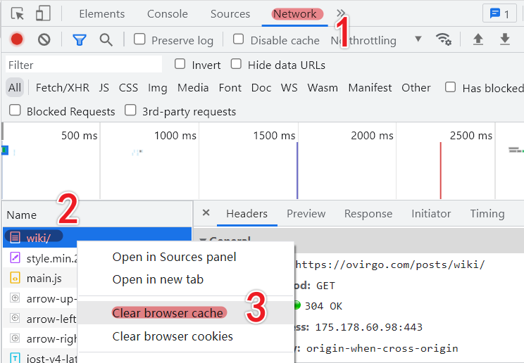

博客系统迁移好多次了，多少次？详见 [一场“疲惫”的主题制作之旅](../a-theme-making-journey) 。域名啊、博客文章的层级结构啊，都难免存在差异。这就导致了一个问题，之前在别的网站发布的一些页面链接就成了“死链”。虽然，可以简单地重写向到 404 ，体验却不好，最好是可以重定向到变化后的页面。

周末无聊，简单实现了一下，做个记录。

<!--more-->

## 如何重定向

之前的链接都是 `https://ovirgo.com/xxx-yyy-zzz.html` 格式的链接，现在要使之重定向到 `https://ovirgo.com/posts/xxx-yyy-zzz` 到这样的链接地址。

修改服务器端 Nginx 的相关配置，比如 `/etc/nginx/conf.d/xxx.conf` （当前主机为 Ubuntu Server ，其他发型版可能有区别）。

```
location / {
	# ...
	if (!-e $request_filename) {
		rewrite ((\w*-)*\w*)\.html /posts/$1 last;
		break;
	}
	# ...
}
```

> `$1` 是什么？就是前面正则表达式的匹配的第一个捕获分组。

当请求资源不存在时，重定向到新的路径。对，就是 `rewrite` 了。

如果，你还不了解，或是很长时间没有使用正则表达式了，可以阅读一下另一篇博文 -- [正则表达式](../regexp/)，附一个很不错的 [正则表达式测试网站](https://regexr-cn.com/) 。

## Nginx Rewrite

访问重写 rewrite 是 Nginx HTTP 请求处理过程中的一个重要功能，它是以模块的形式存在于代码中的，其功能是对用户请求的 URI 进行 PCRE 正则重写，然后返回 `30X` 重定向跳转或按条件执行相关配置。

rewrite 模块内置了类似脚本语言的 `set、if、break、return` 配置指令，通过这些指令，用户可以在 HTTP 请求处理过程中对 URI 进行更灵活的操作控制。rewrite 模块提供的指令可以分为两类：
- 标准配置指令（只是对指定的操作进行相应的操作控制）；
- 脚本指令（可以在 HTTP 指令域内以类似脚本编程的形式进行编写）。


### 标准配置指令

> 这里我们只介绍与本次修改相关的配置指令。

|名称| rewrite 指令|
|-|-|
|指令|`rewrite`|
|作用域| server, location|
|指令说明|对用户的 URI 用正则表达式的方式进行重写，并跳转到新的 URI |


其语法格式如下：

```
rewrite regex replacement [flag];

# - regex 是 PCRE 语法格式的正则表达式
# - replacement 是重写 URI 的改写规则
# - flag 是执行该条重写指令后的操作控制符
```

其中，对于 `replacement` 来说，当改写规则以 `http://、https://` 或 `$scheme` 开头时，Nginx 重写该语句后将停止执行后续任务，并将改写后的 URI 跳转返回客户端。

对于，`flag` ，作为操作符有如下 4 种：
- `last` 执行完当前重写规则跳转到新的 URI 后继续执行后续操作；
- `break` 执行完当前重写规则跳转到新的 URI 后不再执行后续操作，不影响用户浏览器 URI 显示；
- `redirect` 返回响应码 `302` 的临时重定向，返回内容是重定向 URI 的内容，但浏览器网址仍为请求时的 URI ；
- `permanent` 返回响应状态码 `301` 的永久重定向，返回内容是重写向 URI 的内容，浏览器网址变为重定向的 URI 。


### 脚本指令

这一块目前没有涉及，用的到的时候再说吧。（但取所需 😂）

……

## FAQ

如果，你要实验重写规则，你可能会遇到和我一样的问题，比如说，当你把 `flag` 为 `permanent` 时，你可能重定向了某个 URI，当你实验一次之后，发现后续再修改也不起作用了，咦，困扰。

  


设置了 `permanent` ，被永久重定向了，你需要先清理浏览器缓存，再进行后续的操作。


## 参考链接

- https://www.w3schools.cn/nginx/nginx_command_rewrite.asp