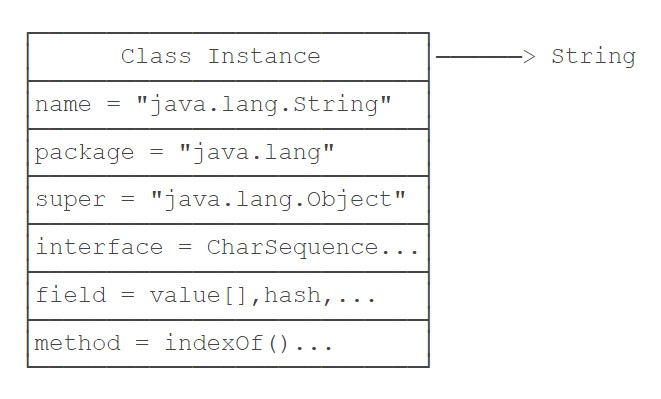

i.e.Reflection And Generic

<!--more-->

## 反射[1]  

[1]: https://www.liaoxuefeng.com/wiki/1252599548343744/1255945147512512

反射，i.e.Reflection，Java 的反射是指程序在运行期可以拿到一个对象（实例）的所有信息。

正常情况下，如果我们要调用一个对象的方法，或者访问一个对象的字段，通常会传入对象实例。反射是为了解决在运行期，对某个实例一无所知的情况下，如何调用其方法。

除了 `int` 等基本类型外，Java 的其他类型全部都是 `class` （包括 `interface` ）， `class` 的本质是数据类型。

**`class` 在由 JVM 在执行过程中动态加载的。**

JVM 在第一次读取到一种 `class` 类型时，将其加载进内存。每加载一种 `class` ，JVM 就为其创建一个 `Class` 类型的实例，并关联起来。

\*注意：这里的 `Class` 类型是一个类名为 `Class` 的 `class` （即 `Class.class` ） ，它长这样：

```java
public final class Class {
	private Class() {}
}
```

以 `String` 类为例，当 JVM 加载 `String` 类时，它首先读取 `String.class` 文件到内存，然后，为 `String` 类创建一个 `Class` 实例并关联起来：

```java
Class cls = new Class(String);
```

这个 `Class` 实例是由 JVM 内部创建的，其构造方法是 `private` ，只有 JVM 能创建 `Class` 实例，我们自己的 Java 程序是无法创建 `Class` 实例的。

所以，JVM 持有的每个 `Class` 实例都指向一个数据类型（ `class` 或 `interface` ），一个 `Class` 实例包含了该 `class` 的所有完整信息：



由于 JVM 为每个加载的 `class` 创建了对应的 `Class` 实例，并在实例中保存了该 `class` 的所有信息，包括类名、包名、父类、实现的接口、所有方法、字段等。因此，如果获取了某个 `Class` 实例，我们就可以通过这个 `Class` 实例获取到该实例对应的 `class` 的所有信息。

**这种通过 `Class` 实例获取 `class` 信息的方法称为反射（Reflection）。**

如何获取一个 `class` 的 `Class` 实例呢？

```java
// 方法一
// 直接通过一个 class 的静态变量 class 获取
Class cls = String.class;

// 方法二
// 通过该实例变量（如果有一个实例变量）提供的 getClass() 方法获取
String s = "Hello";
Class cls = s.getClass();

// 方法三
// 通过静态方法（如果知道一个 class 的完整类名） Class.forName() 获取
Class cls = Class.forName("java.lang.String");
```

JVM 在执行 Java 程序的时候，并不是一次性把所有用到的 `class` 全部加载到内存，而是第一次需要用到 `class` 时才加载。

## 泛型[2]

[2]: https://www.liaoxuefeng.com/wiki/1252599548343744/1255945193293888


泛型是一种“代码模板”，可以用一套代码套用各种类型。

在讲解什么是泛型之前，我们先观察 Java 标准提供的 `ArrayList` ，可以看作“可变长度”的数组，实际上它内部就是一个 `Object[]` 数组，配合存储一个当前分配的长度。

```java
public class ArrayList {
	private Object[] array;
	private int size;
	public void add(Object e) { ... }
	public void remove(int index) { ... }
	public Object get(int index) { ... }
}
```

如上所示，ArrayList 的 `get` 方法返回的是一个 `Object` 类型的数据。如此，当你用它存储 `String` 类型的时候，获取的结果其实需要强制转型（由 `Object` 转型为 `String` ）。如下：

```java
ArrayList list = new ArrayList();
list.add("Hello");
// 获取到 Object ，必须强制转型为 String
String first = (String) list.get(0);

list.add(new Interger(123));
// ERROR: ClassCastException
String second = (String) list.get(1);
```

并且很容易出现误转型 `ClassCastException` 。

要解决上述问题，我们可以为 `String` 单独编写一种 ArrayList ：

```java
public class StringArrayList {
	private String[] array;
	private int size;
	public void add(String e) { ... }     // 存 String
	public void remove(int index) { ... }
	public String get(int index) { ... }  // 取 String
}
```

存取 `String` 的问题暂时解决了，然而存取 `Integer` 、 `Person` 等其他类型呢？当然，我们可以用上述方式为其创建对应的类，然而实际上这实际上是不科学的，太多了。

为了解决这个新的问题，我们必须把 `ArrayList` 变成一种模板： `ArrayList<T>` ，代码如下：

```java
public class ArrayList<T> {
	private T[] array;
	private int size;
	public void add(T e) { ... }
	public void remove(int index) { ... }
	public T get(int index) { ... }
}
```

如此，我们在存取 `String` 类型的时候，就可以用 `ArrayList<String>` 了，如下：

```java
ArrayList<String> strList = new ArrayList<String>();

strList.add("hello");           // ✔
String s = strList.get(0);      // ✔
strList.add(new Integer(123));  // ✘ compile error
Integer n = strList.get(0);     // ✘ compile error
```

<div class="oh-essay">
看，泛型，其实是一种更高层次上的抽象。
</div>
