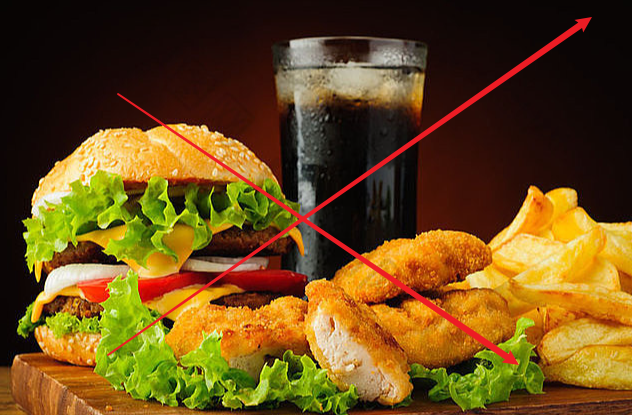

健身训练的项目有很多，而有一些运动是大多数人所热爱的。跑步 🏃 就是一项大众所熟悉的，门槛比较低的运动项目，无论男女老少都可以跑起来。

那么，每天坚持跑步，身材可以瘦下来吗？可以 ❗ 跑步的可以实现的目标很多，想要达到减肥的目的，需要注意以下一些方面。

<!--more-->

## 跑步速度

跑步可以分为快跑跟慢跑，快跑属于无氧运动，是无法持续坚持的运动，容易力竭并且出现小粗腿，这并不是你跑步的初衷。

而慢跑属于可持续进行的训练，可以达到瘦腿塑形的效果。因此，跑步的时候你的速度控制为 `6-9km/h` 的速度即可。

如果你的体重基数太大，很难坚持下来，建议你可以慢跑结合快走，坚持一段时间后心肺功能会加强，运动能力会提升，这个时候尝试慢跑训练，你会发现持久力有所提升。

  

## 跑步时长

慢跑一小时大概可以消耗 500 大卡 的热量，而一斤脂肪的热量是 3900 大卡，如果你想要减掉 1 斤脂肪，那么要跑步将近 8 小时，如果你想要减掉 5 斤脂肪，那么你需要跑 40 小时左右。

任重而道远！！！

如果你每天跑步 1 小时，那么要坚持 40 天左右才能减脂 5 斤。所以，跑步减肥是一项需要坚持才能有所成效的事情。

## 拉伸训练

跑步后肌肉会出现充血问题，很多人误以为是肌肉腿，其实，跑步后进行充分的拉伸放松腿部肌群，这样双腿也会越来越细长好看，跑步后肌肉酸疼问题也会减轻。

所以，跑步后不要马上坐着，一定要针对腿部肌群进行拉伸，这样还能提升双腿的灵活性跟柔软度。

  

## 饮食管理

跑步的时候，如果你能结合饮食管理，那么减肥效果也会翻倍。如果你胡吃海喝没有管理好饮食，那么你每天多摄入的热量可能比你跑步消耗的热量更高，比如：一份薯条的热量有 320 大卡，一杯可乐的热量是 180 大卡，一个炸鸡汉堡的热量达到了 400 大卡以上。

  

只有管理好饮食，远离各种高热量、过度加工的食物，多吃一些低热量、天然的食物，才能控制卡路里摄入，提升减肥效率。

## 参考链接

- https://new.qq.com/omn/20220718/20220718A09W9900.html