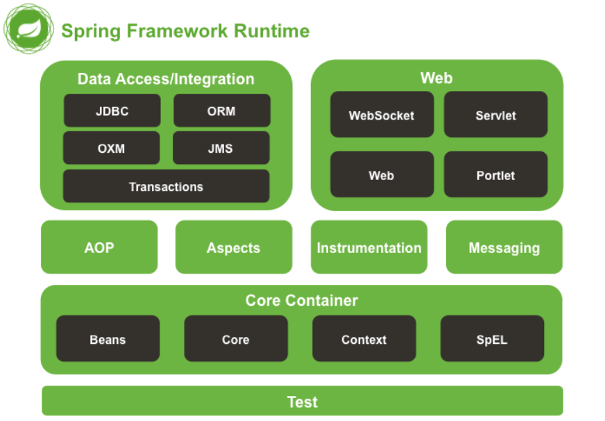

🔔 摘录自 http://c.biancheng.net/spring/

> 虽然我们在生产环境中基本上使用 [Spring Boot](../spring-boot/) 了，但是深入了解 Spring 是非常必要的，因为它是“地基”。

<!--more-->

## Spring 是什么

Spring 由 [Rod Johnson](https://baijiahao.baidu.com/s?id=1620099105315862154&wfr=spider&for=pc) 创立，2004 年发布了 Spring 框架的第一版，其目的是用于简化企业级应用程序开发的难度和周期。

Spring 自诞生以来一直备受青睐，它包括许多框架，例如 Spring framework、SpringMVC、SpringBoot、Spring Cloud、Spring Data、Spring Security 等，所以有人将它们亲切的称之为：Spring 全家桶。

Spring framework 就是我们平时说的 Spring 框架，Spring 框架是全家桶内其它框架的基础和核心。

Spring 是分层的 Java SE/EE 一站式轻量级开源框架， **以 IoC（Inverse of Control，控制反转）和 AOP（Aspect Oriented Programming，面向切面编程）为内核。**

IoC 指的是将对象的创建权交给 Spring 去创建。使用 Spring 之前，对象的创建都是由我们使用 `new` 创建，而使用 Spring 之后，对象的创建都交给了 Spring 框架。AOP 用来封装多个类的公共行为，将那些与业务无关，却为业务模块所共同调用的逻辑封装起来，减少系统的重复代码，降低模块间的耦合度。另外，AOP 还解决一些系统层面上的问题，比如日志、事务、权限等。

共享、解耦、去冗。

在 Spring 中，认为一切 Java 类都是资源，而资源都是类的实例对象（Bean），容纳并管理这些 Bean 的是 Spring 所提供的 IoC 容器，所以 **Spring 是一种基于 Bean 的编程** ，它深刻地改变着 Java 开发世界，迅速地取代 EJB 成为了实际的开发标准。

在实际开发中，服务器端通常采用三层体系架构，分别为表现层（web）、业务逻辑层（service）、持久层（dao）。

Spring 致力于 Java EE 应用各层的解决方案，对每一层都提供了技术支持。在表现层提供了与 Spring MVC、Struts2 框架的整合，在业务逻辑层可以管理事务和记录日志等，在持久层可以整合 MyBatis、Hibernate 和 JdbcTemplate 等技术。这就充分体现出 Spring 是一个全面的解决方案，对于已经有较好解决方案的领域，Spring 绝不做重复的事情。

## Spring 体系结构

Spring 框架采用分层的理念，根据功能的不同划分成了多个模块，这些模块大体可分为：

-   Data Access/Integration（数据访问与集成） --> JDBC、ORM、OXM、JMS、Transactions
-   Web --> WebSocket、Servlet、Web、Portlet
-   AOP、Aspects、Instrumentation（检测）、Messaging（消息处理）
-   Core Container（核心容器） --> Beans、Core、Context、SpEL
-   Test

如下图所示，Spring Framework 4.x 版本后的系统框架图：

上图中包含了 Spring 框架的所有模块，这些模块可以满足一切企业级应用开发的需求，在开发过程中可以根据需求有选择性地使用所需要的模块。

**1. Data Access/Integration（数据访问/集成）**

数据访问/集成层包括 JDBC、ORM、OXM、JMS 和 Transactions 模块，具体介绍如下:

-   JDBC 模块：提供了一个 JDBC 的样例模板，使用这些模板能消除传统冗长的 JDBC 编码，还有必须的事务控制，而且能享受到 Spring 管理事务的好处；
-   ORM 模块：提供与流行的“对象-关系”映射框架无缝集成的 API，包括 JPA、JDO、Hibernate 和 MyBatis 等，而且还可以使用 Spring 事务管理，无需额外控制事务；
-   OXM 模块：提供了一个支持 Object/XML 映射的抽象层实现，如 JAXB、Castor、XMLBeans、JiBX 和 XStream 。将 Java 对象映射成 XML 数据，或者将 XML 数据映射成 Java 对象；
-   JMS 模块：指 Java 消息服务，提供一套“消息生产者、消息消费者”模板用于更加简单的使用 JMS，JMS 用于在两个应用程序之间，或分布式系统中发送消息，进行异步通信；
-   Transactions 事务模块：支持编程和声明式事务管理。

**2. Web 模块**

Spring 的 Web 层包括 Web、Servlet、WebSocket 和 Portlet 组件，具体介绍如下：

-   Web 模块：提供了基本的 Web 开发集成特性，例如多文件上传功能、使用的 Servlet 监听器的 Ioc 容器初始化以及 Web 应用上下文；
-   Servlet 模块：提供了一个 Spring MVC Web 框架实现。Spring MVC 框架提供了基于注解的请求资源注入、更简单的数据绑定、数据验证等及一套非常易用的 JSP 标签，完全无缝与 Spring 其他技术协作；
-   WebSocket 模块：提供了简单的接口，用户只要实现响应的接口就可以快速的搭建 WebSocket Server ，从而实现双向通讯；
-   Portlet 模块：提供了在 Portlet 环境中使用 MVC 实现，类似于 Web-Servlet 模块的功能。

**3. Core Container（Spring 的核心容器）**

Spring 的核心容器是其他模块建立的基础，由 Beans 模块、Core 核心模块、Context 上下文模块和 SpEL 表达式语言模块组成，没有这些核心容器，也不可能有 AOP、Web 等上层的功能。具体介绍如下：

-   Beans 模块：提供了框架的基础部分，包括控制反转和依赖注入；
-   Core 核心模块：封装了 Spring 框架的底层部分，包括资源访问、类型转换及一些常用的工具类；
-   Context 上下文模块：建立在 Core 和 Beans 模块的基础之上，集成 Beans 模块功能并添加资源绑定、数据验证、国际化、Java EE 支持、容器生命周期、事件传播等。ApplicationContext 接口是上下文模块的焦点；
-   SpEL 模块：提供了强大的表达式语言支持，支持访问和修改属性值，方法调用，支持访问及修改数组、容器和索引器，命名变量，支持算数和逻辑运算，支持从 Spring 容器获取 Bean，它也支持列表投影、选择和一般的列表聚合等。

**4. AOP、Aspects、Instrumentation 和 Messaing**

在 Core Container 之上是 AOP、Aspects 等模块，具体介绍如下：

-   AOP 模块：提供了面向切面编程实现，提供比如日志记录、权限控制、性能统计等通用功能和业务逻辑分离的技术，并且能动态地把这些功能添加到需要的代码中，如此，降低业务逻辑和通用功能的耦合；
-   Aspects 模块：提供与 AspectJ 的集成，是一个功能强大且成熟的面向切面编程（AOP）框架；
-   Instrumentation 模块：提供了类工具的支持和类的加载器的实现，可以在特定的应用服务器中使用；
-   Messaging 模块：Spring 4.0 以后新增了消息（Spring-messaging）模块，该模块提供了对消息传递体系结构和协议的支持。

**5. Test 模块**

Test 模块：Spring 支持 Junit 和 TestNG 测试框架，而且还额外提供了一些基于 Spring 的测试功能，比如在测试 Web 框架时，模拟 Http 请求的功能。

Hmm... 先有个感性了解即可，有利于后续引入相应的包及源码阅读。

