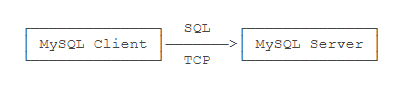
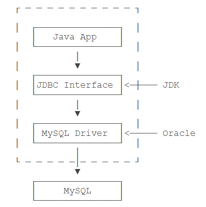
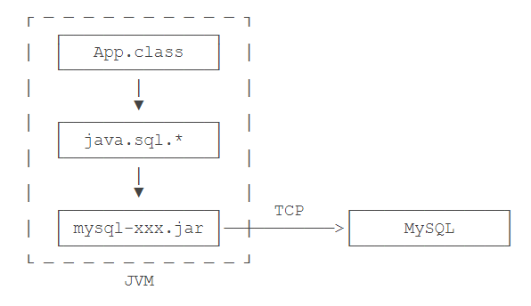

🔔 摘录自 [廖雪峰老师的 SQL 教程](https://www.liaoxuefeng.com/wiki/1177760294764384)


SQL，结构化查询语言（Structured Query Language ），是一种数据库查询和程序设计语言，用于访问和操作数据库系统。SQL 语句既可以查询数据库中的数据，也可以插入、更新和删除数据库中的数据，还可以对数据库进行管理和维护操作。

*=数据库能听懂的语言 -- SQL* 

<!--more-->

## SQL

### 关系数据库概述

为什么需要数据库？ **为了优化数据的读写及管理。** 应用程序不需要自己管理数据，而是通过数据库软件提供的接口来读写数据。至于数据本身如何存储到文件，那就是数据库软件的事情了。

数据库按照数据结构来组织、存储和管理数据，有三种模型：层次模型、网关模型和关系模型。

关系数据库的关系模型是基于数学理论建立的（有兴趣的可以深入下）。其支持的标准数据类型包括数值、字符串、时间等，如下表：

| 名称           | 类型           | 说明                                                              |
| -------------- | -------------- | ----------------------------------------------------------------- |
| INT            | 整型           | 4 字节，约 +/-21 亿                                               |
| BIGINT         | 长整型         | 8 字节，约 +/-922 亿                                              |
| REAL/FLOAT(24) | 浮点型         | 4 字节                                                            |
| DOUBLE         | 浮点型         | 8 字节                                                            |
| DECIMAL(M,N)   | 高精度小数     | `DECIMAL(20,10)` 表示一共 20 位，其中小数 10 位，通常用于财务计算 |
| CHAR(N)        | 定长字符串     | `CHAR(100)` 总是存储 100 个字符的字符串                           |
| VARCHAR(N)     | 变长字符串     | `VARCHAR(100)` 可以存储 0~100 个字符的字符串                      |
| BOOLEAN        | 布尔类型       | 存储 `True` 或者 `False`                                          |
| DATE           | 日期类型       | `2018-06-22`                                                      |
| TIME           | 时间类型       | `12:20:59`                                                        |
| DATETIME       | 日期和时间类型 | `2018-06-22 12:20:59`                                             |

通常来说， `BIGINT` 能满足整数存储的需求， `VARCHAR(N)` 能满足字符串存储的需求。其他，还有一些不常用的数据类型，如 `TINYINT` （范围在 0~255）。各数据库厂商还会支持特定的数据类型，如 `JSON` 。

**SQL 语言关键字不区分大小写！**

 <div class="oh-essay">
 一般约定 SQL 关键字总是大写，以示突出，表名和列名均使用小写。
 </div>

### 安装 MySQL[1]

选择国内镜像下载（如 [华为的 MySQL 镜像](https://repo.huaweicloud.com/mysql/Downloads/)），官网太慢了……

如果，你要也要下载 mysql-8.0.26 ，可以直接 [点此下载](https://repo.huaweicloud.com/mysql/Downloads/MySQL-8.0/mysql-8.0.26-winx64.msi) 。

安装完成之后，将执行路径，如 `C:\Program Files\MySQL\MySQL Server 8.0\bin` 加入到电脑环境变量中（具体方法自行百度），以管理员权限打开 cmd 或 Powershell：

-   输入 `mysqld --initialize --console` ，进行初始化，该步可以得到 mysql 的初始密码；
-   输入 `mysqld --install` ，如果需要安装多个 mysql 服务，这步输入 `mysql --install [服务名]`；
-   输入 `net start mysql` ，启动 MySQL 服务；
-   输入 `mysql -u root -p` ，使用初始密码登录 mysql ；
-   登录后，把初始密码改掉，输入 `ALTER USER 'root'@'localhost' IDENTIFIED WITH mysql_native_password BY '你自己的密码';` （注意带分号）；
-   输入 `show databases;` ，可以查看包含哪些数据库了。

WIN10 具体安装 mysql 8.0.26 如下：

```sh
# 1. 初始化
PS C:\Windows\system32> mysqld --initialize --console
2022-01-17T12:32:47.721393Z 0 [System] [MY-013169] [Server] C:\Program Files\MySQL\MySQL Server 8.0\bin\mysqld.exe (mysqld 8.0.26) initializing of server in progress as process 16088
2022-01-17T12:32:47.739476Z 1 [System] [MY-013576] [InnoDB] InnoDB initialization has started.
2022-01-17T12:32:48.147715Z 1 [System] [MY-013577] [InnoDB] InnoDB initialization has ended.
2022-01-17T12:32:49.184664Z 0 [Warning] [MY-013746] [Server] A deprecated TLS version TLSv1 is enabled for channel mysql_main
2022-01-17T12:32:49.187008Z 0 [Warning] [MY-013746] [Server] A deprecated TLS version TLSv1.1 is enabled for channel mysql_main
2022-01-17T12:32:49.384847Z 6 [Note] [MY-010454] [Server] A temporary password is generated for root@localhost: gMlai+AXi2rn

# 2. 安装服务
PS C:\Windows\system32> mysqld --install
Service successfully installed.

# 3. 启动服务
PS C:\Windows\system32> net start mysql
MySQL 服务正在启动 .
MySQL 服务已经启动成功。

# 4. 使用初始化密码登录
PS C:\Windows\system32> mysql -u root -p
Enter password: ************
Welcome to the MySQL monitor.  Commands end with ; or \g.
Your MySQL connection id is 8
Server version: 8.0.26

Copyright (c) 2000, 2021, Oracle and/or its affiliates.

Oracle is a registered trademark of Oracle Corporation and/or its
affiliates. Other names may be trademarks of their respective
owners.

Type 'help;' or '\h' for help. Type '\c' to clear the current input statement.

mysql> show databases;
ERROR 1820 (HY000): You must reset your password using ALTER USER statement before executing this statement.

# 5. 为 root 设置自己的密码，方便下次登录
mysql> ALTER USER 'root'@'localhost' IDENTIFIED WITH mysql_native_password BY 'your_password';
Query OK, 0 rows affected (0.00 sec)

mysql> show databases;
+--------------------+
| Database           |
+--------------------+
| information_schema |
| mysql              |
| performance_schema |
| sys                |
+--------------------+
4 rows in set (0.01 sec)

# 使用 exit 退出
mysql> exit
Bye

# 下次使用新设置的密码 'your_password' 登录即可
PS C:\Windows\system32> mysql -u root -p
Enter password: *************
Welcome to the MySQL monitor.  Commands end with ; or \g.
Your MySQL connection id is 10
Server version: 8.0.26 MySQL Community Server - GPL

Copyright (c) 2000, 2021, Oracle and/or its affiliates.

Oracle is a registered trademark of Oracle Corporation and/or its
affiliates. Other names may be trademarks of their respective
owners.

Type 'help;' or '\h' for help. Type '\c' to clear the current input statement.

mysql>
```

其他版本的安装过程，大同小异，出现的问题可能是形形色色，直接百度就 OK 了。

**Ubuntu20 安装相关**[3]

```sh
sudo apt update && sudo apt install mysql-server # 安装
sudo service mysql status                        # 查看服务状态
# OR systemctl status mysql

sudo mysql                      # Ubuntu 默认 root@localhost 是无密码的
mysql> exit;
```

如何为 =root@localhost= 设置密码呢？[4]

```sql
mysql> alert user 'root'@'localhost' identified with mysql_native_password by '你自己的mysql密码';
mysql> flush privileges;
```

如何当前 Mysql 服务可能远程登录呢？[5]

```sql
mysql> create user 'root'@'%' identified by '你自己的mysql密码';
mysql> grant all privileges on *.* to 'root'@'%';
mysql> flush privileges;
```

然后：

1. `cd /etc/mysql/mysql.conf.d` ;
2. 修改相应的配置文件 `mysqld.cnf` ;
3. 将 `bind-address ` 127.0.0.1`修改为`bind-address ` 0.0.0.0` ;
4. `service mysql restart` 重启 mysql 服务；
5. `netstat -lntp` 查看状态。

### 关系模型

关系数据库是建立在关系模型上，关系模型本质上就是若干存储数据的二维表。表的每一行称为记录（Record），每一列称为字段（Column）。

字段定义了数据类型，以及是否允许为 `NULL` （ 表示字段不存在）。

 <div class="oh-essay"> 
 通常情况下，字段应该避免允许为NULL。不允许为NULL可以简化查询条件，加快查询速度，也利于应用程序读取数据后无需判断是否为NULL。
 </div>

关系数据库的表和表之间需要建立“一对多”，“多对一”和“一对一”的关系，关系是通过主键和外键来维护的。

<u>__1. 主键__</u>


主键是关系表中记录的唯一标识，其选取非常重要，注意不要带有业务含义，而应该使用 BIGINT 自增或者 GUID 类型，主键也不应该允许 `NULL` 。

<u>__2. 外键__</u>


在一张表中，通过某个字段，可以把数据与另一张表关联起来，这种列称为外键。关系数据库通过外键可以实现一对多、多对多（需要通过中间表）和一对一的关系。外键既可以通过数据库来约束，也可以不设置约束，仅依靠应用程序的逻辑来保证。

下面来看一个外键约束：

```sql
-- 定义一个外键约束
ALTER TABLE students
ADD CONSTRAINT fk_class_id      -- 外键约束名称 fk_class_id，任意
FOREIGN KEY (class_id)          -- 指定了 class_id 作为外键
REFERENCES classes (id);        -- 指定了这个关键将关联到 classes 表的 id 列

-- 删除一个外键约束
ALERT TABLE students
DROP FOREIGN KEY fk_class_id;
```

<u>__3. 索引__</u>

在查找记录的时候，想要获得非常快的速度，就需要使用索引。索引是关系数据库中对某一列或多个列的值进行预排序的数据结构。通过使用索引，可以让数据库系统不必扫描整个表，而是直接定位到符合条件的记录，这样就大大加快了查询速度。无论是否创建索引，对于用户和应用程序来说，使用关系数据库不会有任何区别。

### 查询数据

在关系数据库中，最常用的操作就是查询。

__1. 基本查询__

使用 SELECT 查询的基本语句 `SELECT * FROM <表名>` 可以查询一个表的所有行和所有列的数据，查询结果是一个二维表。

```sql
-- 语法：
-- SELECT * FROM <表名>
-- 如
SELECT * FROM students; -- 所有的学生记录
```

__2. 条件查询__

SELECT 语句可以通过 `WHERE` 条件来设定查询条件，查询结果是满足查询条件的记录，而不是整个表的所有记录。

```sql
-- 语法：
-- SELECT * FROM <表名> WHERE <条件表达式>
-- 如
SELECT * FROM students WHERE score >= 80; -- 分数大于 80 的学生记录
```

条件表达式可以包含逻辑运算，优先级由高到低为 `NOT > AND > OR` ，当然还有括号。

 <div class="oh-essay">
 此处可以用谐音记忆， not（NOT） at(AND) all(OR) - 一点也不，别客气。
 </div>

__3. 投影查询__

如果我们只希望返回某些列的数据，而不是所有列的数据，可以使用投影查询。

```sql
-- 语法：
-- SELECT 列1 [别名1], 列2, 列3 FROM <表名> [...]
-- 如
SELECT id, score, name FROM students;        -- 没设置别名
SELECT id, score points, name FROM students; -- 设置别名
SELECT id, score points, name FROM students WHERE gender = 'M'; -- 可接 WHERE条件
```

__4. 排序__

使用 `ORDER BY` 可以对结果集进行排序，可以对多列进行升序、倒序排序。

```sql
SELECT id, name, gender, score FROM students ORDER BY score; -- 默认 ASC 升序，可以省略
SELECT id, name, gender, score FROM students ORDER BY score DESC; -- 降序
-- 多列，先按 score ，有相同分数的再按 gender
SELECT id, name, gender, score FROM students ORDER BY score DESC, gender;

-- 如果有 WHERE 子句，那么 ORDER BY 子句要放到 WHERE 子句后面（因为是对结果集排序嘛）
SELECT id, name, gender, score
FROM students
WHERE class_id = 1
ORDER BY score DESC;
```

__5. 分页查询__

分页实际上就是从结果集中“截取”出第 M~N 条记录。

```sql
-- 语法：
-- LIMIT <N-M> OFFSET <M>
-- 如
SELECT * FROM students LIMIT 3 OFFSET 0; -- 查询第 1 页
SELECT * FROM students LIMIT 3 OFFSET 3; -- 查询第 2 页
SELECT * FROM students LIMIT 3 OFFSET 6; -- 查询第 3 页
-- ...
```

可见，分页查询的关键在于，首先要确定每页需要显示的结果数量 `pageSize` （这里为 3），然后根据当前页的索引 `pageIndex` （从 1 开始，页码啦），确定 `LIMIT` 和 `OFFSET` 应该设定的值：

-   `LIMIT` 总是设定为 `pageSize` ；
-   `OFFSET` 计算公式为 `pageSize * (pageIndex - 1)` 。

另外：

-   `OFFSET` 是可选的，如果只写 `LIMIT 15` ，那么相当于 `LIMIT 15 OFFSET 0` ；
-   在 MySQL 中， `LIMIT 15 OFFSET 30` 还可以简写成 `LIMIT 30, 15` ；
-   使用 `LIMIT <M> OFFSET <N>` 分页时，随着 N 越来越大，查询效率也会越来越低。

__6. 聚合查询__

对于统计总数、平均数这类计算，SQL 提供了专门的聚合函数，使用聚合函数进行查询，就是聚合查询。

| 函数    | 说明                              |
| ------- | --------------------------------- |
| COUNT   | 查询所有列的行数                  |
| SUM/AVG | 计算某一数值类型列的合计值/平均值 |
| MAX/MIN | 计算某一列的最大值/最小值         |

```sql
SELECT COUNT(*) FROM students;
SELECT AVG(score) average FROM students WHERE gender = 'M';
```

注意：

-   如果 WHERE 条件没有匹配到任何行， `COUNT()` 会返回 0 ，而其他会返回 `NULL` ；
-   聚合的计算结果虽然是一个数字，但查询的结果仍然是一个二维表，只是这个二维表只有一行一列；
-   通常，使用聚合查询时，我们应该给列名设置一个别名，便于处理结果。

**对于聚合查询，SQL 还提供了“分组聚合”的功能。**

```sql
SELECT class_id, COUNT(*) num FROM students GROUP BY class_id;
-- COUNT() 的结果不再是一个，因为 GROUP BY 子句指定了按 class_id 分组
```

执行上述 `SELECT` 语句时，会把 `class_id` 相同的列先分组，再分别计算，因些会得到不止一行结果（当然，我们此处假设 `class_id` 有几个不同的值）。

__7. 多表查询__

使用多表查询可以获取 M x N 行记录，查询的结果也是一个二维表。

```sql
-- 语法：
-- SELECT * FROM <表1> [表1别名], <表2> [表2别名];
-- 如
SELECT * FROM students, classes;
-- 可以利用投影查询设置别名
SELECT
	students.id sid,
	students.name,
	students.gender,
	students.score,
	classes.id cid,
	classes.name cname
FROM students, classes;
-- SQL还允许给表设置一个别名，以在投影查询中引用起来稍微简洁一点
SELECT
	s.id sid,
	s.name,
	s.gender,
	s.score,
	c.id cid,
	c.name cname
FROM students s, classes c;
```

__8. 连接查询__

连接查询是另一种类型的多表查询，对多个表进行 JOIN 运算，简单地说，就是先确定一个主表作为结果集，然后，把其他表的行有选择地“连接”在主表结果集上。

```sql
-- 语法：
-- SELECT ... FROM <表1> INNER JOIN <表2> ON <条件...>;
-- 如
SELECT
	s.id, s.name, s.class_id,
	c.name class_name,          --
	s.gender, s.score
FROM students s                 -- 先确定主表，仍然使用 FROM <表1>
INNER JOIN classes c            -- 再确定需要连接的表，使用 INNER JOIN <表2>
ON s.class_id = c.id;           -- 然后确定连接条件，使用 ON <条件……>
-- 可选，加上 WHERE 子句、 ORDER BY 等子句
```

INNER JOIN 是最常用的一种 JOIN 查询，除此之外还有 LEFT/RIGHT/FULL OUTER JOIN 。

### 修改数据

关系数据库的基本操作就是 CRUD（Create 增、Retrieve 查、Update 改、Delete 删）。对于增、删、改，对应的 SQL 语句分别是：

-   INSERT 插入新记录；
-   UPDATE 更新已有记录；
-   DELETE 删除已有记录。

__1. INSERT__

```sql
-- 语法：
-- INSERT INTO <表名> (字段1, 字段2, ...) VALUES (值1, 值2, ...)
-- 如
INSERT INTO students (class_id, name, gender, score) VALUES
	(1, '大宝', 'M', 87),
	(2, '二宝', 'M', 81);       -- 可以一次性添加多条记录

```

注意，字段顺序不必和数据库表的字段顺序一致，但值的顺序必须和字段顺序一致。

__2. UPDATE__

```sql
-- 语法：
-- UPDATE <表名> SET 字段1=值1, 字段2=值2, ... WHERE ...;
-- 如
UPDATE students
SET name='大牛', score=score+10 -- 可以一次性更新多条记录，且可以使用表达式
WHERE id=1;
```

__3. DELETE__

使用 `DELETE` ，我们就可以一次删除表中的一条或多条记录。

```sql
-- 语法：
-- DELETE FROM <表名> WHERE ...;
-- 如
DELETE FROM students where id=1;
```

### MySQL

安装完 MySQL 后，除了 MySQL Server，即真正的 MySQL 服务器外，还附赠一个 MySQL Client 程序。MySQL Client 是一个命令行客户端，可以通过 MySQL Client 登录 MySQL，然后，输入 SQL 语句并执行。

MySQL Client 的可执行程序是 `mysql` ，MySQL Server 的可执行程序是 `mysqld` （后台运行）。

 

在 MySQL Client 中输入的 SQL 语句通过 TCP 连接发送到 MySQL Server。默认端口号是 3306，即如果发送到本机 MySQL Server，地址就是 `127.0.0.1:3306` 。

也可以只安装 MySQL Client，然后连接到远程 MySQL Server。

```sh
# mysql -h <mysql-server-ip> -u root -p
mysql -h 10.0.1.99 -u root -p
```

除了命令行客户端外，也有 GUI 客户端可供使用，如 MySQL Workbench、 Navicat 等。

__1. 数据库__

在一个运行的 MySQL 服务器上，实际上可以创建多个数据库（Database）。相关操作如下：

| 操作                            | 说明                     |
| ------------------------------- | ------------------------ |
| `SHOW DATABASES;`               | 列出所有数据库           |
| `CREATE DATABASE test;`         | 创建一个新数据库         |
| `DROP DATABASE test;`           | 删除一个数据库           |
| `USE test;`                     | 切换到数据库 test        |
| ------------------------------- | ------------------------ |
| 表                              |                          |
| `SHOW TABLES;`                  | 列出当前数据库的所有表   |
| `DESC students;`                | 查看一个表的结构         |
| `SHOW CREATE TABLE students;`   | 查看创建表的 SQL 语句    |
| `DROP TABLE students;`          | 删除表                   |

修改表就比较复杂。

```sql
-- 给 students 表新增一列 birth
ALERT TABLE students ADD COLUMN birth VARCHAR(10) NOT NULL;
-- 修改 birth 列名为 birthday，类型改为 VARCHAR(20)
ALERT TABLE students CHANGE COLUMN birth birthday VARCHAR(20) NOT　NULL;
-- 删除列
ALERT TABLE students DROP COLUMN birthday;
```

**TODO 2. 实用的 SQL 语句**

……

### 事务

这种把多条语句作为一个整体进行操作的功能，被称为数据库事务。数据库事务可以确保该事务范围内的所有操作都可以全部成功或者全部失败。如果事务失败，那么效果就和没有执行这些 SQL 一样，不会对数据库数据有任何改动。

对于单条 SQL 语句，数据库系统自动将其作为一个事务执行，这种事务被称为隐式事务。

要手动把多条 SQL 语句作为一个事务执行，使用 `BEGIN` 开启一个事务，使用 `COMMIT` 提交一个事务，这种事务被称为显式事务。如：

```sql
BEGIN;
UPDATE accounts SET balance = balance - 100 WHERE id = 1;
UPDATE accounts SET balance = balance + 100 WHERE id = 2;
COMMIT;                         -- 试图把事务内的所有SQL所做的修改永久保存
-- ROLLBACK;                    -- 可以主动用 ROLLBACK 回滚事务
```

数据库事务具有 ACID 共 4 个特性：

-   Atomic 原子性（要么全部执行，要么全部不执行）、
-   Consistent 一致性（事务完成后，所有数据的状态都是一致的）、
-   Isolation 隔离性（多个事务并发执行，每个事务作出的修改必须与其他事务隔离）、
-   Duration 持久性（即事务完成后，对数据库的修改被持久化存储）。

对于两个并发执行的事务，如果涉及到操作同一条记录的时候，可能会发生问题。SQL 标准定义了 4 种隔离级别：

| Isolation Level  | 脏读（Dirty Read） | 不可重复读（Non Repeatable Read） | 幻读（Phantom Read） |
| ---------------- | ------------------ | --------------------------------- | -------------------- |
| Read Uncommitted | Yes                | Yes                               | Yes                  |
| Read Committed   | -                  | Yes                               | Yes                  |
| Repeatable Read  | -                  | -                                 | Yes                  |
| Serializable     | -                  | -                                 | -                    |

## JDBC[2]

### JDBC 是什么

JDBC（Java DataBase Connectivity），是 Java 程序访问数据库的标准接口。

使用 Java 程序访问数据库时，Java 代码并不是直接通过 TCP 连接去访问数据库，而是通过 JDBC 接口（Java 标准库自带）来访问，而 JDBC 接口则通过 JDBC 驱动（数据库厂商提供，里面是接口的具体实现类）来实现真正对数据库的访问。如下：



实际上，一个 MySQL 的驱动就是一个 jar 包，它本身也是纯 Java 编写的。我们自己编写的代码只需要引用 Java 标准库提供的 java.sql 包下面的相关接口，由此再间接地通过 MySQL 驱动的 jar 包通过网络访问 MySQL 服务器，所有复杂的网络通讯都被封装到 JDBC 驱动中，因此，Java 程序本身只需要引入一个 MySQL 驱动的 jar 包就可以正常访问 MySQL 服务器，如下：



\*注意：Java 程序编译期仅依赖 java.sql 包，不依赖具体数据库的 jar 包，可随时替换底层数据库，访问数据库管理员的 Java 代码基本不变。

前面已经说过，所谓的 JDBC 驱动，其实就是一个第三方的 jar 包，我们可能通过添加一个 Maven 依赖引入它：

```xml
<dependency>
	<groupId>mysql</groupId>
	<artifactId>mysql-connector-java</artifactId>
	<version>5.1.47</version>   <!-- 与安装的 MySQL 版本对应 -->
	<scope>runtime</scope>      <!-- 注意是 runtime -->
</dependency>
```

其中，添加依赖的 `scope` 是 `runtime` ，因为编译 Java 程序并不需要 MySQL 的这个 jar 包，只有在运行期才需要使用。如果改为 `compile` ，虽然也能正常编译，但是在 IDE 里写程序的时候，会多出一大堆类似 `com.mysql.jdbc.Connection` 这样的类，非常容易与 Java 标准库的 JDBC 接口混淆，所以坚决不要设置为 `compile` 。

### JDBC 连接

Connection 代表一个 JDBC 连接，它相当于 Java 程序到数据库的连接（通常是 TCP 连接）。打开一个 Connection 时，需要准备 URL、用户名和口令，才能成功连接到数据库。

URL 是由数据库厂商指定的格式，例如，MySQL 的 URL 是：

```
jdbc:mysql://<hostname>:<port>/<db>?key1=value1&key2=value2
```

假设数据库运行在本机 `localhost` ，端口使用标准的 `3306` ，数据库名称是 `learnjdbc` ，那么 URL 如下：

```
jdbc:mysql://localhost:3306/learnjdbc?useSSL=false&characterEncoding=utf8
```

其中，后面的两个参数表示不使用 SSL 加密，使用 UTF-8 作为字符编码。

要获取数据库连接，使用如下代码：

```java
// JDBC 连接的 URL, 不同数据库有不同的格式:
String JDBC_URL = "jdbc:mysql://localhost:3306/test";
String JDBC_USER = "root";
String JDBC_PASSWORD = "password";
// 获取连接:
Connection conn = DriverManager.getConnection(JDBC_URL, JDBC_USER, JDBC_PASSWORD);
// TODO: 访问数据库...
// 关闭连接:
conn.close();
```

核心代码是 `DriverManager` 提供的静态方法 `getConnection()` ， `DriverManager` 会自动扫描 classpath，找到所有的 JDBC 驱动，然后根据我们传入的 URL 自动挑选一个合适的驱动。

因为 JDBC 连接是一种昂贵的资源，所以使用后要及时释放。使用 `try (resource)` 来自动释放 JDBC 连接是一个好方法：

```java
try (Connection conn = DriverManager.getConnection(JDBC_URL, JDBC_USER, JDBC_PASSWORD)) {
	// ...
}
```

### JDBC 查询

获取到 JDBC 连接后，下一步就可以查询数据库了。查询数据库分以下几步：

1. 通过 `Connection` 提供的 `createStatemetn()` 方法创建一个 `Statement` 对象，用于执行一个查询；
2. 执行 `Statement` 对象提供的 `executeQuery("SELECT * FROM students")` 并传入 SQL 语句，执行查询返回的结果集，使用 `ResultSet` 来引用这个结果集；
3. 反复调用 `ResultSet` 的 `next()` 方法来读取每一行结果。如下：

```java
try (Connection conn = DriverManager.getConnection(JDBC_URL, JDBC_USER, JDBC_PASSWORD)) {
	try (Statement stmt = conn.createStatement()) {
		try (ResultSet rs = stmt.executeQuery("SELECT id, grade, name, gender FROM students WHERE gender=1")) {
			while (rs.next()) {
				long id = rs.getLong(1); // 注意：索引从1开始
				long grade = rs.getLong(2);
				String name = rs.getString(3);
				int gender = rs.getInt(4);
			}
		}
	}
}
```

需要注意以下几点：

-   `Statement` 和 `ResultSet` 都是需要关闭的资源，因此嵌套使用 `try (resource)` 确保及时关闭；
-   `rs.next()` 用于判断是否有下一行记录，如果有，将自动把当前行移动到下一行（一开始获得 `ResultSet` 时当前行不是第一行）；
-   `ResultSet` 获取列时，索引从 `1` 开始而不是 `0` ；（思考一下，这是为什么？😏）
-   必须根据 `SELECT` 的列对应的位置来调用 `getLong(1)，getString(2)` 这些方法，否则对应位置的数据类型不对，将报错。

__关于 SQL 注入攻击__

使用 `Statement` 拼字符串非常容易引发 SQL 注入的问题，因为 SQL 参数往往是从方法参数传入的。

如何避免 SQL 注入攻击呢？一个办法是对所有字符串进行转义（很麻烦，推荐），另一个办法就是使用 `PreparedStatement` （比 `Statement` 更快更安全）。

使用 `PreparedStatement` 可以完全避免 SQL 注入的问题，因为 `PreparedStatement` 始终使用 `?` 作为占位符，并且把数据连同 SQL 本身传给数据库，这样可以保证每次传给数据库的 SQL 语句是相同的，只是占位符的数据不同，还能高效利用数据库本身对查询的缓存。

如此，上面使用 `Statement` 的代码改为使用 `PreparedStatement` ，如下：

```java
try (Connection conn = DriverManager.getConnection(JDBC_URL, JDBC_USER, JDBC_PASSWORD)) {
	try (PreparedStatement ps = conn.prepareStatement("SELECT id, grade, name, gender FROM students WHERE gender=? AND grade=?")) {
		// 必须首先调用setObject() 设置每个占位符 ? 的值
		ps.setObject(1, "M"); // 注意：索引从1开始
		ps.setObject(2, 3);
		try (ResultSet rs = ps.executeQuery()) {
			while (rs.next()) {
				long id = rs.getLong("id");
				long grade = rs.getLong("grade");
				String name = rs.getString("name");
				String gender = rs.getString("gender");
			}
		}
	}
}
```

<div class="oh-essay">
在 ResultSet 获取列时，索引从 1 开始而不是 0 ，在 PrepareStatement 的设置占位符时索引也是从 1 开始。
</div>

注意到 JDBC 查询的返回值总是 `ResultSet` ，即使我们写这样的聚合查询 `SELECT SUM(score) FROM ...` ，也需要按结果集读取：

```java
ResultSet rs = ...
if (rs.next()) {
	double sum = rs.getDouble(1);
}
```

### JDBC 更新

数据库操作总结起来就四个字：增查改删，CRUD（Create，Retrieve，Update 和 Delete）。

查询，就是使用 `PreparedStatement` 进行各种 `SELECT` ，然后处理结果集。

__插入__

插入操作是 `INSERT` ，即插入一条新记录。通过 JDBC 进行插入，本质上了也是用 `PreparedStatement` 执行一条 SQL 语句，不过最后执行的不是 `execteQuery()` ，而是 `execteUpdate()` 。示例代码如下：

```java
try (Connection conn = DriverManager.getConnection(JDBC_URL, JDBC_USER, JDBC_PASSWORD)) {
	try (PreparedStatement ps = conn.prepareStatement("INSERT INTO students (id, grade, name, gendar) VALUES (?,?,?,?)")) {
		ps.setObject(1, 999);   // 注意：索引从1开始
		ps.setObject(2, 1);     // grade
		ps.setObject(3, "Bob"); // name
		ps.setObject(4, "M");   // gender

		int n = ps.executeUpdate(); // 1 返回 int，表示插入的记录数量
	}
}
```

**插入并获取主键**

如果数据库的表设置了自增主键，那么在执行 `INSERT` 语句时，并不需要指定主键，数据库会自动分配主键。

对于使用自增主键的程序，有个额外的步骤，就是如何获取插入后的自增主键的值？要获取自增主键，不能先插入，再查询。因为两条 SQL 执行期间可能有别的程序也插入了同一个表。获取自增主键的正确写法是在创建 `PreparedStatement` 的时候，指定一个 `RETURN_GENERATED_KEYS` 标志位，表示 JDBC 驱动必须返回插入的自增主键。示例代码如下：

```java
try (Connection conn = DriverManager.getConnection(JDBC_URL, JDBC_USER, JDBC_PASSWORD)) {
	try (Preparestatement ps = conn.prepareStatement(
													"INSERT INTO students (grade, name, gender) VALUES (?,?,?)",
													Statement.RETURN_GENERATED_KEYS)) {
		ps.setObject(1, 1);     // grade
		ps.setObject(2, "Bob"); // name
		ps.setObject(3, "M");   // gender

		int n = ps.executeUpdate(); // 1

		try (ResultSet rs = ps.getGeneratedKeys()) {
			if (rs.next()) {
				long id = rs.getLong(1); // 注意：索引从1开始
			}
		}
	}
}
```

观察上述代码，有两点注意事项：

-   调用 `prepareStatement()` 时，第二个参数必须传入常量 `Statement.RETURN_GENERATED_KEYS` ，否则 JDBC 驱动不会返回自增主键；
-   执行 `execteUpdate()` 方法后，必须调用 `getGeneratedkeys()` 获取一个 `ResultSet` 对象，这个对象包含了数据库自动生成的主键的值，读取该对象的每一行来获取自增主键的值。注意，如果一次插多条记录，那么这个 `ResultSet` 对象就会有多行返回值。如果插入时有多列自增，那么 `ResultSet` 对象的每一行都会对应多个自增值（自增列不一定必须是主键）。

**更新**

更新操作是 `UPDATE` 语句，它可以一次更新若干列的记录。更新操作和插入操作在 JDBC 代码的层面上实际上没有区别，除了 SQL 语句不同：

```java
try (Connection conn = DriverManager.getConnection(JDBC_URL, JDBC_USER, JDBC_PASSWORD)) {
	try (PreparedStatement ps = conn.prepareStatement("UPDATE students SET name=? WHERE id=?")) {
		ps.setObject(1, "Bob"); // 注意：索引从1开始
		ps.setObject(2, 999);
		int n = ps.executeUpdate(); // 返回更新的行数
	}
}
```

\*注意， `execteUpdate()` 返回数据库实际更新的行数。返回结果可能是正数，也可能是 0 （表示没有任何记录更新）。

__删除__

删除操作是 `DELETE` 语句，它可以一次删除若干列。和更新一样，除了 SQL 语句不同外，JDBC 代码都是相同的：

```java
try (Connection conn = DriverManager.getConnection(JDBC_URL, JDBC_USER, JDBC_PASSWORD)) {
	try (PreparedStatement ps = conn.prepareStatement("DELETE FROM students WHERE id=?")) {
		ps.setObject(1, 999); // 注意：索引从1开始
		int n = ps.executeUpdate(); // 删除的行数
	}
}
```

### JDBC 事务

要在 JDBC 中执行事务，本质上就是如何把多条 SQL 包裹在一个数据库事务中执行。如下：

```java
Connection conn = openConnection();
try {
	// 关闭自动提交
	conn.setAutoCommit(false);
	// 执行多条 SQL 语句
	insert(); update(); delete();
	// 提交事务
	conn.commit();
} catch (SQLException e) {
	// 回滚事务
	conn.rollback();
} finally {
	conn.setAutoCommit(true);
	conn.close();
}
```

实际上，默认情况下，我们获取到 `Connection` 连接后，总是处于“自动提交”模式（一条 SQL 语句其实就是一个“隐式事务”）。只要关闭了 `Connection` 的 `autoCommit` ，那么就可以在一个事务中执行多条语句，事务以 `commit()` 方法结束。

如果要设定事务的隔离级别，可以使用如下代码：

```java
// 设定隔离级别为READ COMMITTED:
conn.setTransactionIsolation(Connection.TRANSACTION_READ_COMMITTED);
```

如果没有调用上述方法，那么会使用数据库的默认隔离级别。MySQL 的默认隔离级别是`REPEATABLE READ`。

### JDBC Batch

通过一个循环来执行每个 `PreparedStatement` 虽然可靠，但是性能很低。SQL 数据库对 SQL 语句相同但参数不同的若干语句可以作为 batch 执行（批量执行），这种操作有特别优化，速度远远快于循环执行每个 SQL。示例代码如下：

```java
try (PreparedStatement ps = conn.PreparedStatement("INSERT INTO students (name, gender, grade, score) VALUES (?,?,?,?)")) {
	// 对同一个 PreparedStatement 反复设置参数并调用 addBatch():
	for (Student s : students) {
		ps.setString(1, s.name);
		ps.setBoolean(2, s.gender);
		ps.setInt(3, s.grade);
		ps.setInt(4.s.score);

		ps.addBatch();          // 添加到 batch
	}
	// 执行 batch
	int[] ns = ps.executeBatch();
	for(int n : ns) {
		System.out.println(n + " insert."); // batch 中每个 SQL 执行的结果数量
	}
}
```

执行 batch 和执行一个 SQL 不同点在于，需要对同一个 `PreparedStatement` 反复设置参数并调用 `addBatch()` ，这样就相当于给一个 SQL 加上了多组参数，相当于变成了“多行”SQL。

第二个不同点是调用的不是 `executeUpdate()` ，而是 `executeBatch()` ，因为我们设置了多组参数，相应地，返回结果也是多个 `int` 值，因此返回类型是 `int[]` ，循环 `int[]` 数组即可获取每组参数执行后影响的结果数量。

### JDBC 连接池

在执行 JDBC 的增删改查的操作时，如果每一次操作都来一次“打开连接，操作，关闭连接”，那么创建和销毁 JDBC 连接的开销就太大了。

为了避免频繁地创建和销毁 JDBC 连接，我们可能通过连接池（Connection Pool）复用已经创建好的连接。JDBC 连接池有一个标准的接口 `javax.sql.DataSource` 。要使用 JDBC 连接池，我们必须选择一个 JDBC 连接池的实现。常用的 JDBC 连接池有：

-   HikariCP（使用最广泛）
-   C3P0
-   BoneCP
-   Druid（阿里的，国内使用最多）

此处，我们以 HikariCP 为例，要使用 JDBC 连接池，先添加 HikariCP 的依赖：

```xml
<dependency>
	<groupId>com.zaxxer</groupId>
	<artifactId>HikariCP</artifactId>
	<version>2.7.1</version>
</dependency>
```

紧接着，创建一个 `DataSource` 实例，这个实例就是连接池：

```java
HikariConfig config = new HikariConfig();

config.setJdbcUrl("jdbc:mysql://localhost:3306/test");
config.setUsername("root");
config.setPassword("password");
config.addDataSourceProperty("connectionTimeout", "1000"); // 连接超时：1秒
config.addDataSourceProperty("idleTimeout", "60000");      // 空闲超时：60秒
config.addDataSourceProperty("maximumPoolSize", "10");     // 最大连接数：10

DataSource ds = new HikariDataSource(config);
```

有了连接池以后，我们通过 `ds.getConnection()` 来代替 `DriverManager.getConnection()` 获取一个连接，如下：

```java
try (Connection conn = ds.getConnection()) { // 在此处获取连接
	// ...
}   // 在此处“关闭”连接（不是真正的关闭，只是释放到连接池中，以便下次获取连接时直接返回）
```

连接池内部维护了若干个 `Connection` 实例，如果调用 `ds.getConnection()` ，就选择一个空闲连接，并标记它为“正在使用”然后返回，如果对 `Connection` 调用 `close()` ，那么就把连接再次标记为“空闲”从而等待下次调用。这样一来，我们就通过连接池维护了少量连接，但可以频繁地执行大量的 SQL 语句。

通常连接池提供了大量的参数可以配置，例如，维护的最小、最大活动连接数，指定一个连接在空闲一段时间后自动关闭等，需要根据应用程序的负载合理地配置这些参数。此外，大多数连接池都提供了详细的实时状态以便进行监控。


[5]: https://blog.csdn.net/sunrj_niu/article/details/113350063

[4]: https://www.cnblogs.com/Noturns/p/13385481.html

[3]: https://devanswers.co/install-secure-mysql-server-ubuntu-20-04/

[2]: https://www.liaoxuefeng.com/wiki/1252599548343744/1255943820274272

[1]: https://blog.csdn.net/LB_AUTO/article/details/106041858
