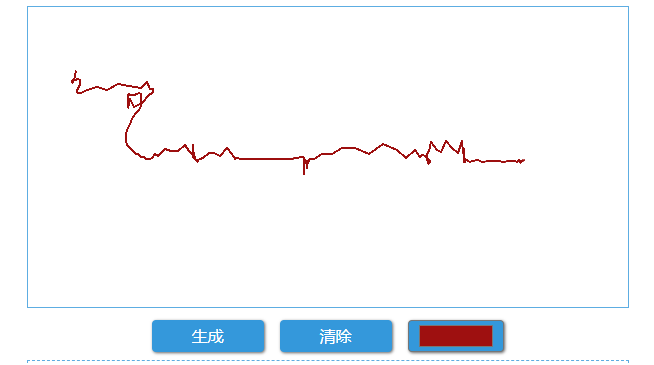

在 [Canvas](../canvas/) 中，我们介绍了画布的基本概念和使用方式，现在，我们来用它实现一个基本的手写板 - 你可以在 [Tablet](https://github.com/loveminimal/tablet) 查看源码 。

`> 原生 JS 实现一下喽 ~`

<!--more-->

```html
<!-- 画布 -->
<canvas 
	id="cvs" 
	width="600" height="300" 
	ontouchstart="touchstart(event)" 
	ontouchmove="touchmove(event)"
	ontouchend="touchend(event)" 
	onmousedown="mousedown(event)" 
	onmousemove="mousemove(event)"
	onmouseup="mouseup(event)"
	>
</canvas>
```

一般来说，手写板什么的多在移动设备（触摸）上使用，只涉及 `touch***` 相关事件，当然，如上所示，PC 端使用 `mouse***` 事件模拟即可。

下面，让我们看一下具体实现吧（以 `mouse***` 事件为例）。

## 基本思路

手写板应用的核心，就是使用 Canvas 实时绘制路径（path），我们先来简单回顾一下这方面的知识，如下：

```
beginPath()
- 新建一条路径，路径一旦创建成功，图形绘制命令被指向到路径上生成路径

moveTo(x, y)
- 把画笔移动到指定的坐标 (x, y)，相当于设置路径的起始点坐标

lineTo(x, y)
- 添加一个新点，然后创建从该点到画面中最后指定点的线条

closePath()
- 闭合路径之后，图形绘制命令又重新指向到上下文中

stroke()
- 通过线条来绘制图形轮廓
```

通过以上绘制路径的方法，我们使用 `mousestart` 结合 `beginPath()` 和 `moveTo(x, y)` 方法，开始绘制路径，并在 `mousemove` 事件触发的过程中结合 `lineTo(x, y)` 和 `stroke()` 实时绘制路径。 

## 核心解析

**1. 先准备一下吧**

```js
let cvs = document.querySelector('#cvs');	// 获取画布
let ctx = cvs.getContext('2d'); 			// 上下文
```

**2. 看看相关的事件**

```js
function mousedown(e) {
    drawstart(e.pageX - cvs.offsetLeft, e.pageY - cvs.offsetTop);
}

// function drawstart(x, y) {
//     document.body.classList.add('body-fix');	// 书写时禁止页面滚动

//     ctx.beginPath();
//     ctx.moveTo(x, y);
// }
```

`mousedown` 和 `mousemove` 事件中，我们可以方便获取鼠标指针相对于其第一个父级元素（带有 `position` 属性）的相对位置 `(x, y)`，如果没有，就是相对于 `body` 了（本例中即是如此）。

  

```js
function mousemove(e) {
    if (e.buttons === 1) {	// 鼠标左键按下时
        drawmove(e.pageX - cvs.offsetLeft, e.pageY - cvs.offsetTop);
    }
}

// function drawmove(x, y) {
//     ctx.lineTo(x, y);
//     ctx.stroke();
// }
```

实时坐标的获取同上，此外需要注意的是，这里我们限制了 *-仅当鼠标左键按下时* 才会绘制路径，否则，绘制出来的路径只会是个鬼画符。当然，如果你是在触摸设备中使用 `touch***` 事件，则不存在这个问题。

不同浏览器对于鼠标事件的监听指示可能有所不同，Chrome 中，当 `e.buttons` 为 `1` 时，表示左键是按下状态，如果你想做兼容，请查看相关文档。

```js

function mouseup(e) {
    drawend();
}

// function drawend() {
//     // ctx.closePath()
//     document.body.classList.remove('body-fix');	// 书写完成恢复页面滚动
// }
```

你可能已经注意到了，在 `mousedown` 和 `mouseup` 中，我们针对  `body` 元素做了一些类别修改 - 添加/删除 `body-fix` ，它有什么作用呢？

```css
.body-fix {
	overflow: hidden;
}
```

  

很简单，就是为了防止在书写签名时页面滚动，导致你写不成字 ~ 当然，别忘记在 `mouseup` 时，移除该类，否则，你就滚动不了页面喽。

## 辅助功能

**1. 生成签名**

```js
// 生成签名
function expCvs() {
    let src = cvs.toDataURL('image/png', 1);
    /*
     * canvas.toDataURL(type, encoderOptions)
	 * 返回：
	 * - 该方法返回一串 URI 字符串（canvas 中图像数据的 base64 编码）
	 * 
	 * 参数：
     * - type：图像格式，默认为"image/png"
     * - encoderOptions：数值为 0 ~ 1，表示图片质量，仅在 type 为 "image/jpeg" 或 "image/webp" 时有效
     *
	 * 其他：
     * png 默认生成图片无背景，jpeg 默认生成图片为黑色背景
     * 如果需要白色背景，可以在绘制前先绘制背景：
     * ctx.fillStyle = '#fff';
     * ctx.fillRect(0, 0, canvas.width, canvas.height);
     */
    console.log(src);
    img.src = src;
}
```

Canvas 可以方便地生成图片格式（base64）文件 - 通过 `toDataURL` 方法，如此，我们就可以方便的传递数据或将其作为图片标签的 `src` 属性使用。

这里注意，做为签名来说，我们通常需要生成背景透明的图像，所以默认即为 `png` 格式的。

**2. 清除签名**

```js
// 清除签名
function clrCvs() {
    ctx.clearRect(0, 0, 600, 300);
    img.src = '';
}
```

很简单，直接使用 `clearRect` 清空一个画布就可以了。

**3. 选择颜色**

```js
// 选择签名颜色
function selectColor(e) {
    console.log(e.target.value);
    ctx.strokeStyle = e.target.value;
}
```

可选功能，用来设置画笔颜色，当然，还有其他设置项，你完全可以按需添加。

## 结语

Emm... 基本原理，就是讲的这些，具体项目中实现可能会稍有改变，但难不到你的，对吧 🥳

# 参考链接
- [canvas 生成一张图片在后，图片背景颜色默认是黑色 怎么改成其他颜色呢？ - 知乎 - www.zhihu.com](https://www.zhihu.com/question/48766229)
- [解决 canvas 转 base64/jpeg 时透明区域变成黑色背景的方法_html5_网页制作_脚本之家 - www.jb51.net](https://www.jb51.net/html5/503985.html)
- [szimek/signature_pad: HTML5 canvas based smooth signature drawing - github.com](https://github.com/szimek/signature_pad)
- [H5 前端实现移动端手写 Canvas 签名（支持横竖屏，自定义图片旋转角度）_canvas 手写签名横屏](https://blog.csdn.net/Jone_hui/article/details/121445846)
- [H5 Canvas 签名板 - 简书 - www.jianshu.com](https://www.jianshu.com/p/1efe3d169441)