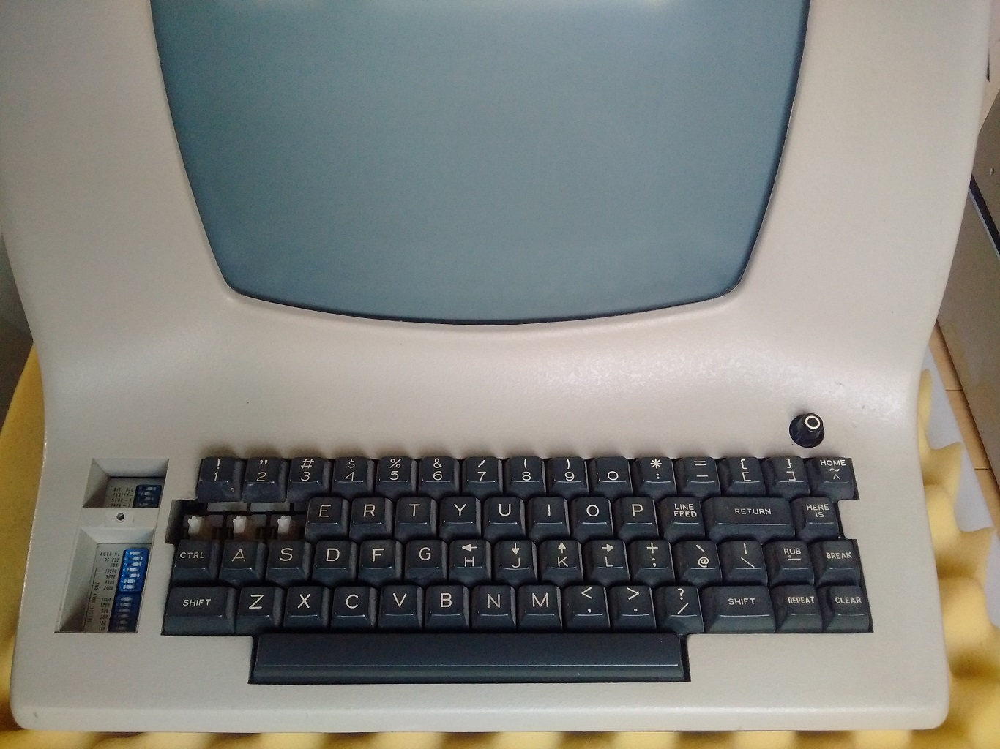
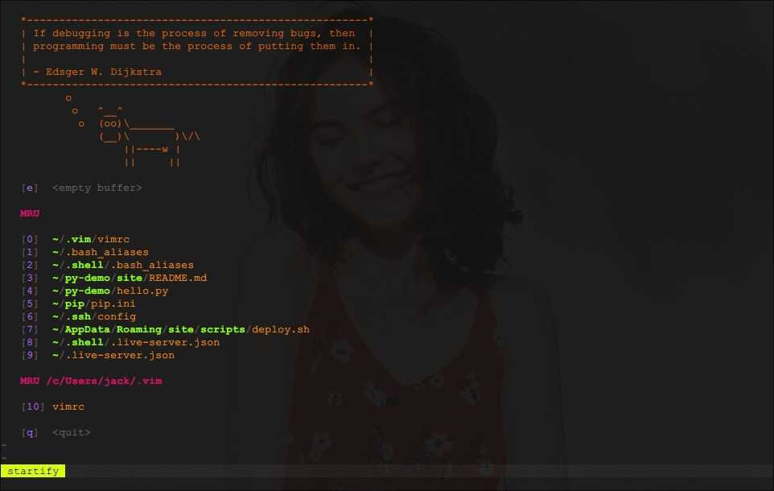
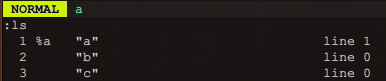
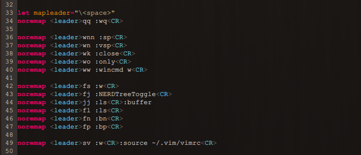

Vim 是 Vi 的升级版，一款功能强大、高度可定制的文本编辑器，它只有一个对手 -- Emacs 。那么，它来自哪里？

<!--more-->

## Vim 123

说起 Vi ，就不得不提起这们大佬 -- Bill Joy。除了 Vi ，他还创建了 BSD 和 Sun ，Ok，大佬就是大佬。


> 2003年9月9日，乔伊离开Sun公司，Sun发言人除了宣布Joy辞职的消息外，不愿意发表其他评论。从一些迹象看来，他很关注机器人、纳米、基因工程等可能会改变全人类未来生存发展的技术；更加关注科技带来的道德问题: 如何不让科技成为一个国家、政府、集体、甚至个人做恶的工具？

## 基础

Vim 好学吗？好学，先来个速成 [Y 分钟学习 Vim](https://learnxinyminutes.com/docs/zh-cn/vim-cn/) 。另外，附上关注的一挺有趣的视频 [VIM 使用技巧系列](https://space.bilibili.com/2087983603/channel/seriesdetail?sid=437100) 。其实，一张图足矣，重要的是使用和练习。

<div class="oh-essay">
下图虽好，但可以先忽略，它是用来做查询用的，还是先了解下一些基础的概念。
</div>


如果，以前没有接触过 Vim/Vi ，初次使用的时候大概率会很迷惑，这再正常不过了。

### 安装

~~去[官网](https://www.vim.org/)下载对应版本安装即可，乌干达 forever ……~~ ⁉️

  

我们这里只针对 CLI ，Vim 谁用 GUI ？那玩意没有灵魂... 如果，你是在 Windows 下（常用工作环境），建议使用 `git-bash` ，安装了 Git 之后自带，内置已经安装好了 Vim。


### 模式

Vim 编辑器基于 **模式** 这个概念。它有以下 4 种模式：
- 命令模式：启动后处于这个模式，用于导航和操作命令；
- 插入模式：用于在文件中进行修改和编辑（同常规文本编辑器，如 NotePad 😺）；
- 可视模式：用于高亮文本并对它们进行操作（就是选择文字内容，进行复制粘贴之类的）；
- Ex 模式（底线命令模式）：用于跳到底部的 `:` 提示行上输入命令。

在命令模式下，我们使用 `HJKL` 进行光标移动，为什么不直接使用 `←↓↑→` 方向键呢？原来，当前 Bill Joy 在开发 Vi 编辑器时所使用的计算机是一个被称为 ADM-3A 的终端，该终端附带的 `HJKL` 键本就和方向键同位一体，根本就没有独立的方向键。



<div class="oh-essay">
从历史中寻找答案，而不是主观臆断。
</div>


### 配置

Vim 是高度可定制的，而你只需要一个配置文件 `.vimrc` ，它位于家目录下面，GNU/Linux 上就是 `~` ，Windows 上为 `/c/Users/<用户名>`。为了便于管理，我们一般会把 `.vimrc` 命名为 `vimrc` 放于文件夹 `.vim` 中，然后把该文件夹置于家目录。如下：

```
.vim
├── autoload
│   └── plug.vim
├── plugged
│   ├── delimitmate
│   ├── molokai
│   ├── vim-airline
│   ├── vim-markdown
│   ├── vim-startify
│   └── vim-surround
├── README.md
└── vimrc
```

> 上边这个目录图是在 Linux 下，由 `tree` 命令生成的，确切的说是 `tree -L 2` ，其中 `2` 是指定的展开的目录层级。不是手画的，不是手画的，曾经手画过……

我自己的 [Vim 配置](https://github.com/loveminimal/vim)是很简单的，因为平时使用 Emacs 😅 。Vim 有多种不同的插件管理工具，如 Vundle、NeoBundle、VimPlug 和 Pathogen 等，我使用的是 `VimPlug` ，小巧、稳定而强大。这里，我们推荐一个神奇的插件库 [VimAwesome](https://vimawesome.com/) ，速度快、视图怡人。

最后，再放一张简单配置后的图片吧。



预祝大家使用愉快，最后欢迎加入 Vim 和 Emacs 之间旷日持久的圣战，虽然没什么用 😏 。

## 更多

<div class="oh-essay">
着实是平时使用 vim 不是很多，就只说一些基本的使用理念和一些基础的配置情况。相对来说，这种理念性的东西，对所有编辑器都是通用的，只是实现方式有差异而已。
</div>

所有类 Unix 的系统中的工具，基本上都配备了一个不错的帮助系统，Vim 自然也不例外。安装完成之后，可以在终端执行 `vimtutor` 打开一个内置的入门教程，默认是英文，当然你可以通过执行 `vimtutor zh` 打开对应的中文教程。

*记住，你总是可以通过 `vim --help` 来获取更多的帮助。

### 文件

编辑器是用来编辑文件的，自然最先接触的就是如何新建、打开、更新及保存文件。

**1.打开、新建**

不妨假设，我们在文件夹 `~/demo` 中，想要打开该文件夹中的文件 `a` ，只需要执行 `vim a` 即可。也可以同时打开多个文件，如  `vim a b c` 同时打开文件 `a、b、c` 。（若有，则打开文件，若没有，则创建一个新的文件。）

```
.
├── a
└── b

0 directories, 2 files
```

同时打开多文件时，默认只会显示第一个文件的 buffer ，可以使用以下命令，多窗展示，如下：

```
vim -o a b c	# 窗口在一行
vim -O a b c	# 窗口在一列
```


**2. 更新、保存**

打开文件后，进入插入模式，就可以编辑文本了，完成之后使用 ：

- `:w` 保存当前文件；
- `:wq` 或是 `<S-z S-z>` 保存并退出。

> 我们使用 `<C、S、M/A->`表示  `Ctrl`、`Shift` 和 `Meta/Alt` 键。

**3. 展示、切换**

当我们编辑多文件时，很多时候避免不了在文件之间进行切换，当然也免不了需要打印出当前所有打开文件的列表。该如何做呢？（其实，这些常规操作才是 Vim 的魅力所在）

在 Vim 中，我们可以通过 `:ls` 来展示当前所有打开的文件列表，如下：

  

其中 `%a` 表示当前激活的 buffer ，可以通过 `:bn` （buffer next）切换到下一个 buffer ，通过 `:bp` （buffer previous）切换到上一个 buffer 。

文件过多了，也是繁琐，怎么办？

可以通过 `:e xxx` 打开你想要的文件，但如果文件名 `xxx` 太长了，也很困扰。有一种更好的文件，如上图中所示，所有打开的文件都会被分配一个 `id` 号，我们可以通过 `:buffer id` 来进行直接切换到相应 buffer 。

### 窗口

多窗口编辑是很常见的，窗口的新建、切换、关闭也是最常用到的操作之一。

|命令|描述|
|-|-|
|`:sp`|横向分屏（即窗口横向排列）|
|`:vsp`|纵向分屏（即窗口纵向排列）|
|`:wincmd w`|窗口切换|
|`:close` | 关闭当前窗口|
|`:only` |关闭所有其他窗口|
|`:q`|退出当前窗口|

当然，还有一些快捷键可以用，也很方便。这个请自行了解，因为我平时也不怎么用这些快捷键，也不大记的住。

## 快捷键

关于快捷键，我们这里来单开一个章节来说明一下，之前也写过这方面的一些东西，如 [VSCode 插件 CVE Keymap 的开发记录](../cve-keymap/) 和 [键位映射那些事儿](../editor-keybindings/) 。这里，我们着重说明一下，在 Vim 中如何方便的设计自己的键位映射。

在 Vim 中有个神奇的好东西，就是 `<leader>` ，强烈建议使用它来自定义你的键位。使用 Emacs 的过程中，离不开 `Evil` 插件的原因，很大程度上也是为了这个 `<leader>` 。


Vim 中在各种模式间进行切换的时候，会频繁使用到 `<Esc>` 这个按键，它一般分布在键盘的左上角，很容易找到。也可以使用 `<C-[>` ，它与 `<Esc>` 是等效的。很多朋友，也会把 `,,` 映射成 `<Esc>` ，看你爱好。

我个人是使用 `SharpKeys` 软件（Windows 系统），直接把键盘上的右 `Shift` 键映射成了 `Esc` ，如此全局通用。

  

如果，你使用的是 GNU/Linux ，可以方便地使用 `Xmodmap` 进行全局的键位映射，更多可以阅读 [如何使用 Xmodmap 工具进行映射](https://ovirgo.com/posts/manjaro-linux/#%E4%BD%BF%E7%94%A8-xmodmap-%E5%B7%A5%E5%85%B7-2-3) 。

OK，让我们转回 `<leader>` ，以下是我的一些键位映射配置：

  

我把 `<space>` 空格键设置成了 `<leader>` 键，默认是 `\` 。如上图所示，我们用它实现了，上个章节中常用的文件及窗口操作。它有很多好处，方便记忆（毕竟是你自己设置的），还可以组合命令。如，我们使用 `<Space> jj` 就可以先展示打开的文件列表，然后再供你输入想要跳转的 buffer 。

更多配置，可以阅读我的 [Vim 配置](https://github.com/loveminimal/vim) 。

## 结语

我自用的 Vim ，配置的是很简单的，使用的功能也远不及 Vim 所拥有功能的千分之一。如果感兴趣的话，不妨自己去亲自折腾一下。Come on 🏃‍♂️ ！