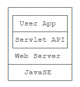
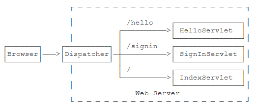
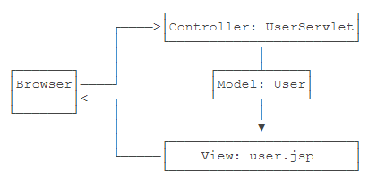
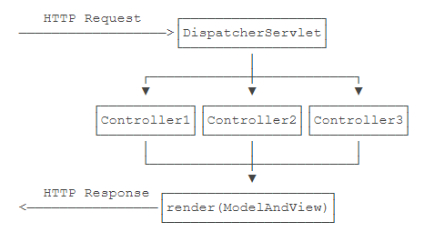
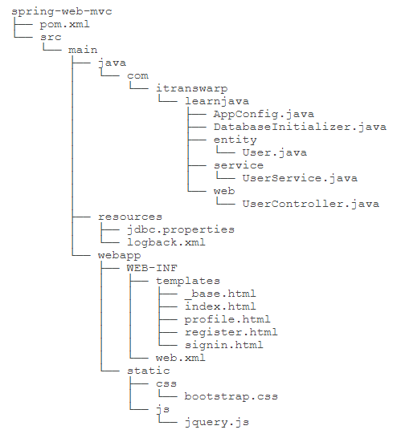

开个坑，大点的……

🔔 摘录自 [廖雪峰老师的 Java 教程](https://www.liaoxuefeng.com/wiki/1252599548343744/1255945497738400)

<!--more-->

## JavaEE



JavaEE 并不是一个软件产品，它更多的是一种软件架构和设计思想，是在 JavaSE 的基础上，开发的一系列基于服务器的组件、API 标准和通用架构。

**JavaEE 最核心的组件就是基于 Servlet 标准的 Web 服务器** ，开发者编写的应用程序是基于 Servlet API 并运行在 Web 服务器内部的。

目前流行的基于 Spring 的轻量级 JavaEE 开发架构，使用最广泛的是 Servlet 和 JMS（Java Message Service），以及一系列开源组件。

## HTTP Server

Web 应用是 BS（Browser/Server）架构的，浏览器和服务器之间的传输协议是 HTTP。HTTP 协议是一个基于 TCP 协议之上的“请求-响应”协议。

**一个 HTTP Server 本质上是一个 TCP 服务器。** 具体实现可以参考 [编写一个简单的 HTTP 服务器](https://gitee.com/liaoxuefeng/learn-java/blob/master/practices/Java%25E6%2595%2599%25E7%25A8%258B/200.Web%25E5%25BC%2580%25E5%258F%2591.1255945497738400/10.Web%25E5%259F%25BA%25E7%25A1%2580.1304265903570978/web-http-server.zip?utm_source=blog_lxf) 。

## Servlet


在 JavaEE 平台上，处理 TCP 连接，解析 HTTP 协议这些底层工作统统扔给现成的 Web 服务器去做，我们只需要把自己的应用程序跑在 Web 服务器上。为了实现这一目的，JavaEE 提供了 Servlet API， **我们只需要使用 Servlet API 编写自己的 Servlet 来处理 HTTP 请求** ，Web 服务器实现 Servlet API 接口，实现底层功能。

我们来实现一个最简单的 Servlet，如下：

```java
// WebServlet 注解表示这是一个 Servlet，并映射到地址 /
@WebServlet(urlPatterns = "/")
public class HelloServlet extends HttpServlet {
	@Override
	protected void doGet(HttpServletRequest req, HttpServletResponse resp)
		throws ServletException, IOException {
		// 设置响应类型
		resp.setContentType("text/html");
		// 获取输出流
		PrintWriter ps = resp.getWriter();
		// 写入响应
		pw.writer("<h1>Hello, Servlet!</h1>");
		// 最后不要忘记 flush 强制输出
		pw.flush();
	}
}
```

一个 Servlet 总是继承自 `HttpServlet` ，然后覆写 `doGet()` 或 `doPost()` 方法。

思考一下：Servlet API 是谁提供？

---

普通的 Java 程序是通过启动 JVM，然后执行 `main()` 方法开始运行。但是 Web 应用程序有所不同，我们无法直接运行 `war` 文件，必须先启动 Web 服务器，再由 Web 服务器加载我们编写的 `HelloServlet` ，这样就可以让 `HelloServlet` 处理浏览器发送的请求。

如此，一个完整的 Web 应用程序的开发流程如下：

```
1. 编写 Servlet；
2. 打包为 war 文件；
3. 复制到 Tomcat 的 webapps 目录下；
4. 启动 Tomcat。
```

这很繁琐！！！

Tomcat 实际上也是一个 Java 程序，我们看看 Tomcat 的启动流程：

```
1. 启动 JVM 并执行 Tomcat 的 main() 方法；
2. 加载 war 并初始化 Servlet；
3. 正常服务。
```

启动 Tomcat 无非就是设置好 classpath 并执行 Tomcat 某个 jar 包的 `main()` 方法， __我们完全可以把 Tomcat 的 jar 包全部引入进来，然后自己编写一个 `main()` 方法__ ，先启动 Tomcat，然后让它加载我们的 webapp 就行。如下：

```java
public class Main {
	public static void main(String[] args) throws Exception {
		// 启动 Tomcat
		Tomcat tomcat = new Tomcat();
		tomcat.setPort(Integer.getInteger("port", 8080));
		tomcat.getConnector();
		// 创建 webapp
		Context ctx = tomcat.addWebapp("", new File("src/main/webapp").getAbsolutePath());
		WebResourceRoot resources = new StandardRoot(ctx);
		resources.addPreResources(new DirResourceSet(
			resources,
			"/WEB-INF/classes",
			new File("target/classes").getAbsolutePath(),
			"/")
		);
		ctx.setResource(resources);
		tomcat.start();
		tomcat.getServer().await();
	}
}
```

如此，我们直接运行 `main()` 方法，即可启动嵌入式 Tomcat 服务器，然后，通过预设的 `tomcat.addWebapp("", new File("src/main/webapp")`，Tomcat 会自动加载当前工程作为根 webapp，可直接在浏览器访问 `http://localhost:8080/` 。

思考一下：如何引入 Tomcat 的 jar 包呢？

---

__一个 Web App 就是由一个或多个 Servlet 组成的，每个 Servlet 通过注解说明自己能处理的路径。__ 浏览器发出的 HTTP 请求总是由 Web Server 先接收，然后，根据 Servlet 配置的映射，不同的路径转发到不同的 Servlet 。



*_重定向* 是指当浏览器请求一个 URL 时，服务器返回一个重定向指令（如 `resp.sendRedirect(Your_Redirect_To_Url);` ），告诉浏览器地址已经变了，麻烦使用新的 URL 再重新发送新请求（浏览器地址会显示新的 `Your_Redirect_To_Url` ）。

Forward 是指内部 *_转发* （地址栏不会变）。当一个 Servlet 处理请求的时候，它可以决定自己不继续处理，而是转发给另一个 Servlet 处理（如 `req.getRequestDispatcher(Your_Forward_To_Url).forward(req, resp);` ）。

---

在 Web 应用程序中，如何跟踪用户身份？

HTTP 协议是一个无状态协议，即 Web 应用程序无法区分收到的两个 HTTP 请求是否是同一个浏览器发出的。为了跟踪用户状态，服务器可以向浏览器分配一个唯一 ID，并以 Cookie 的形式发送到浏览器，浏览器在后续访问时总是附带此 Cookie，这样，服务器就可以识别用户身份。

我们把这种基于唯一 ID 识别用户身份的机制称为 *_Session*，JavaEE 的 Servlet 机制内建了对 Session 的支持。如：

```java
HttpSession session = req.getSession();
// 存储信息到 HttpSession
session.setAttribute("user", name);

// 读取信息从 HttpSession
String user = (String) req.getSession().getAttribute("user");
```

服务器识别 Session 的关键就是依靠一个名为 `JSESSIONID` 的 Cookie。在 Servlet 中第一次调用 `req.getSession()` 时，Servlet 容器自动创建一个 Session ID，然后通过一个名为 `JSESSIONID` 的 Cookie 发送给浏览器。

综上可知，Servlet 提供的 `HttpSession` 本质上就是通过一个名为 `JSESSIONID` 的 Cookie 来跟踪用户会话的。下面我们来看看 Cookie 的设置与读取：

```java
// 创建一个新的 Cookie
Cookie cookie = new Cookie("lang", lang);
cookie.setPath("/");            // 设置 Cookie 生产的路径范围
cookie.setMaxAge(8640000);      // 设置 Cookie 有效期
// 将该 Cookie 添加到响应
resp.addCookie(cookie);

// ....
// 读取请求附带的所有 Cookie
Cookie[] cookies = req.getCookies();
if (cookies != null) {
	for (Cookie cookie : cookies) {
		if (cookie.getName().equals("lang")) {
			// 返回 Cookie 的值
			return cookie.getValue();
		}
	}
}
```

## JSP

JSP 是 Java Server Pages 的缩写，它的文件必须放到 `/src/main/webapp` 下，文件名必须以 `.jsp` 结尾，整个文件与 HTML 并无太大区别，但需要插入变量，或者动态输出的地方，使用特殊指令 `<% ... %>` 。

整个 JSP 的内容实际上是一个 HTML，但是稍有不同：

-   包含在 `<%-- 和 --%>` 之间的是 JSP 的注释，它们会被完全忽略；
-   包含在 `<% 和 %>` 之间的是 Java 代码，可以编写任意 Java 代码；
-   如果使用 `<%= xxx %>` 则可以快捷输出一个变量的值。

JSP 页面内置了几个变量（可以直接使用）：

-   `out`：表示 HttpServletResponse 的 `PrintWriter`；
-   `session`：表示当前 HttpSession 对象；
-   `request`：表示 HttpServletRequest 对象。

JSP 和 Servlet 有什么区别？其实它们没有任何区别，因为 JSP 在执行前首先被编译成一个 Servlet。

访问 JSP 页面时，直接指定完整路径（而无需手动配置映射路径）。例如， `http://localhost:8080/hello.jsp` 。

*=JSP 早已是明日黄花了……*

## MVC

通过前面的章节可以看到：

-   Servlet 适合编写 Java 代码，实现各种复杂的业务逻辑，但不适合输出复杂的 HTML；
-   JSP 适合编写 HTML，并在其中插入动态内容，但不适合编写复杂的 Java 代码。

能否将两者结合起来，发挥各自的优点，避免各自的缺点？ -- __MVC__ !!!



使用 MVC 模式的好处是，Controller 专注于业务处理，它的处理结果就是 Model。 __Model 可以是一个 JavaBean，也可以是一个包含多个对象的 Map__ ，Controller 只负责把 Model 传递给 View，View 只负责把 Model 给“渲染”出来，这样，三者职责明确，且开发更简单，因为开发 Controller 时无需关注页面，开发 View 时无需关心如何创建 Model。

*=Controller 和 View 的纽带就是 Model 喽（处理完之后转发即可）。🤨 Emm... 这就是前后端分离的起点？*

通过结合 Servlet 和 JSP 的 MVC 模式，我们可以发挥二者各自的优点：

-   Servlet 实现业务逻辑；
-   JSP 实现展示逻辑。

但是，直接把 MVC 搭在 Servlet 和 JSP 之上还是不太好，原因如下：

-   Servlet 提供的接口仍然偏底层，需要实现 Servlet 调用相关接口；
-   JSP 对页面开发不友好，更好的替代品是模板引擎；
-   业务逻辑最好由纯粹的 Java 类实现，而不是强迫继承自 Servlet。

思考一下：能不能通过普通的 Java 类实现 MVC 的 Controller？ -- __当然能__ ！

__如何设计一个 MVC 框架呢？__



上图中， `DispatcherServlet` 以及 `render(ModelAndView)` （如何渲染）均由 MVC 框架实现，有了 MVC 框架，我们只需要编写 `Controller` 就可以了。

具体如何呢？且往下看。

在 MVC 框架中创建一个 __接收所有请求__ 的 Servlet -- `DispatcherServlet` ，它总是映射到 `/` ，然后根据不同的 Controller 的方法定义的 `@GetMapping` 或 `@PostMapping` 的 Path 决定调用哪个方法，最后获得方法返回的 `ModelAndView` 后，渲染模板，写入 `HttpServletResponse` ，即完成了整个 MVC 的处理。

我们的 `DispatcherServlet` 持有哪些信息呢？如下：

```java
@WebServlet(urlPatterns = "/")
public class DispatcherServlet extends HttpServlet {
	// 持有存储请求路径到某个具体方法的映射
	private Map<String, GetDispatcher> getMappings = new HashMap();
	private Map<String, PostDispatcher> postMappings = new HashMap();
	// 持有模板引擎
	private ViewEngine viewEngine;

	// ...

	@Override
	public void init() throws ServletException {
		// DispatcherServlet 初始化时，扫描所有的 Controller 中
		// 带有 @GetMappings 和 @PostMappings 标记的方法
		this.getMappings = scanGetInControllers();
		this.postMappings = scanPostInControllers();

		this.viewEngine = new ViewEngine(getServletContext());
	}

	// ...
}
```

__思考一下：如何扫描并获取？ -- 反射！__

是的，关于 `DispatcherServlet` ，其持有信息就是上面这些。

下面，我们再深入一下，看看其中 `GetDispatcher` 、 `PostDispatcher` 、 `ViewEngine` 都是什么结构。

处理一个 GET 请求是通过 `GetDispatcher` 对象完成的，它需要如下信息：

```java
class GetDispatcher {
	Object instance;             // Controller 实例
	Method method;               // Controller 方法
	String[] parameterNames;     // 方法参数名称
	Class<?>[] parameterClasses; // 方法参数类型
}
```

类似的， `PostDispatcher` 需要如下信息：

```java
class PostDispatcher {
	Object instance;             // Controller 实例
	Method method;               // Controller 方法
	Class<?>[] parameterClasses; // 方法参数映射
	ObjectMapper objectMapper;   // JSON 映射
}
```

`ViewEngine` 其实非常简单，只需要实现一个简单的 `render()` 方法，如下：

```java
public class ViewEngine {
	public void render(ModelAndView mv, Writer writer) throws IOException {
		String view = mv.view;
		Map<String, Object> model = mv.model;
		// 根据 view 找到模板文件
		Template template = getTemplateByPath(view);
		// 渲染并写入 Wrinter
		template.write(writer, model);
	}
}
```

其中 `ModelAndView` 定义也比较简单，如下：

```java
public class ModelAndView {
	Map<String, Object> model;  // 一个 JavaBean 或一个包含多个对象的 map
	String view;                // 模板的路径
}
```

看，只要有了 MVC 框架，我们只需要编写包含返回 `ModelAndView` 对象方法的 Controller 类就可以了。

详细代码参考 - [实现一个 MVC 框架](https://gitee.com/liaoxuefeng/learn-java/blob/master/practices/Java%25E6%2595%2599%25E7%25A8%258B/200.Web%25E5%25BC%2580%25E5%258F%2591.1255945497738400/70.MVC%25E9%25AB%2598%25E7%25BA%25A7%25E5%25BC%2580%25E5%258F%2591.1337408645759009/web-mvc.zip?utm_source=blog_lxf) 。

这个 MVC 框架主要参考就是 Spring MVC，通过实现一个“简化版”MVC，可以掌握 Java Web MVC 开发的核心思想与原理。

<div class="oh-essay">
当然，在实际工作中，已经有像 Spring MVC 这种比较成熟的框架了，但是了解原理是重要的，比只会简单的运用要重要的多。
</div>

## Spring MVC

首先，来看一个标准的 Maven Web 工程目录结构示例，如下：



其中， `src/main/webapp` 是标准 web 目录， `WEB-INF` 存放 `web.xml` ，编译的 class，第三方 jar，以及不允许浏览器直接访问的 View 模版， `static` 目录存放所有静态文件。

在 `src/main/resources` 目录中存放的是 Java 程序读取的 classpath 资源文件，除了 JDBC 的配置文件 `jdbc.properties` 外，我们又新增了一个 `logback.xml` ，这是 Logback 的默认查找的配置文件。

在 `src/main/java` 中就是我们编写的 Java 代码了。

---

在前面已经讲过了 Java Web 的基础：Servlet 容器，以及标准的 Servlet 组件：

-   Servlet：能处理 HTTP 请求并将 HTTP 响应返回；
-   JSP：一种嵌套 Java 代码的 HTML，将被编译为 Servlet；
-   Filter：能过滤指定的 URL 以实现拦截功能；
-   Listener：监听指定的事件，如 ServletContext、HttpSession 的创建和销毁。

Servlet 容器为每个 Web 应用程序自动创建一个唯一的 `ServletContext` 实例，这个实例就代表了 Web 应用程序本身。

我们知道 Spring 提供的是一个 IoC 容器，所有的 Bean ，包括 Controller，都在 Spring IoC 容器中初始化，而 Servlet 容器由 JavaEE 服务器（如 Tomcat）提供，它对 Spring 一无所知。

__Web 应用程序总是由 Servlet 容器创建，那么，Spring 容器应该由谁创建？在什么时候创建？Spring 容器中的 Controller 又是如何通过 Servlet 调用的？__

在 Web 应用中启动 Spring 容器有很多种方法，可以通过 Lister 启动，可以通过 Servlet 启动，可以使用 XML 配置，也可以使用注解配置。这里，我们介绍一种最简单的启动 Spring 容器的方式。

第一步，在 `web.xml` 中配置 Spring MVC 提供的 `DispatcherServlet` ：

```xml
<!DOCTYPE web-app PUBLIC
"-//Sun Microsystems, Inc.//DTD Web Application 2.3//EN"
"http://java.sun.com/dtd/web-app_2_3.dtd" >

<web-app>
	<servlet>
		<servlet-name>dispatcher</servlet-name>
		<servlet-class>org.springframework.web.servlet.DispatcherServlet</servlet-class>
		<!-- 1.初始化参数 contextClass 指定使用注解配置的 AnnotationConfigWebApplicationContext  -->
		<init-param>
			<param-name>contextClass</param-name>
			<param-value>org.springframework.web.context.support.AnnotationConfigWebApplicationContext</param-value>
		</init-param>
		<!-- 2.配置文件的位置参数 contextConfigLocation 指向 AppConfig 的完整类名 -->
		<init-param>
			<param-name>contextConfigLocation</param-name>
			<param-value>com.itranswarp.learnjava.AppConfig</param-value>
		</init-param>
		<load-on-startup>0</load-on-startup>
	</servlet>
	<!-- 3.把这个 Servlet 映射到 /*，即处理所有 URL -->
	<servlet-mapping>
		<servlet-name>dispatcher</servlet-name>
		<url-pattern>/*</url-pattern>
	</servlet-mapping>
</web-app>
```

上述配置可以看作一个样板配置，有了这个配置，Servlet 容器会首先初始化 Spring MVC 的 `DispatcherServlet` ，在 `DispatcherServlet` 启动时，它根据配置 `AppConfig` 创建一个类型是 `WebApplicationContext` 的 IoC 容器，完成所有 Bean 的初始化，并将容器绑到 `ServletContext` 上。

因为 `DispatcherServlet` 持有 IoC 容器，能从 IoC 容器中获取所有 `@Controller` 的 Bean，因此， `DispatcherServlet` 接收到所有 HTTP 请求后，根据 Controller 方法配置的路径，就可以正确把请求转发到指定方法，并根据返回的 `ModelAndView` 决定如何渲染页面。

---

我们已经知道了如何结合 Servlet 容器和 Spring 容器，那么，如何配置一个可用的 Spring MVC 呢？

和普通 Spring 配置一样，我们编写正常的 `AppConfig` 后，只需要加上 `@EnableWebMvc` 注解，就“激活”了 Spring MVC，如下：

```java
@Configuration
@ComponentScan
@EnableWebMvc                   // 启用 Spring MVC
@EnableTransactionManagement
@PropertySource("classpath:/jdbc.properties")
public class AppConfig {
	// ...
}
```

当然，还需要创建 `DataSource` 、 `JdbcTemplate` 、 `PlatformTransactionManager` 等 Bean 。

其中，有一个必须要创建的 Bean 是 `ViewResolver` ，因为 Spring MVC 允许集成任何模板引擎，使用哪个引擎，就实例化一个对应的 `ViewResolver` ：

```java
@Bean
ViewResolver createViewResolver(@Autowired ServletContext servletContext) {
	PebbleEngine engine = new PebbleEngine.Builder().autoEscaping(true)
		.cacheActive(flase)
		.loader(new ServletLoader(servletContext))
		.extension(new SpringExtension())
		.build();

	PebbleViewResolver viewResolver = new PebbleViewResolver();
	// viewResolver 通过指定 prefix 和 suffix 来确定如何查找 View
	viewResolver.setPrefix("/WEB-INF/templates/");
	viewResolver.setSuffix("");
	viewResolver.setPebbleEngine(engine);

	return viewResolver;
}
```

---

一切完备之后，就可以编写我们自己的 Controller 了，如下：

```java
@Controller                     // 注意是 @Controller ，不是 @Component
@RequestMapping("/user")        // 对 URL 分组（推荐）
public class UserController {

	@GetMapping("/profile")     // 实际 URL 映射是 /user/profile
	public ModelAndView profile() {
		// ...
	}
}
```

实际方法的 URL 映射总是前缀+路径，这种形式还可以有效避免不小心导致的重复的 URL 映射。

注意，返回的 `ModelAndView` 通常包含一个 View 的路径和一个 Map 作为 Model，但也可以没有 Model ，如 `return new ModelAndView("signin.html")` 。返回重定向时既可以写 `new ModelAndView("redirect:/signin")` ，也可以直接返回 String ，如 `return "redirect:/signin"` 。

如果在 Controller 方法内部直接操作 `HttpServletresponse` 发送响应，返回 `null` 表示无需进一步处理。如下：

```java
public ModelAndView download(HttpServletResponse response) {
	byte[] data = ...;
	response.setContentType("application/octet-stream");
	OutputStream output = response.getOutputStream();
	output.write(data);
	output.flush();
	return null;
}
```

详细源码参考 [使用 Spring MVC](https://gitee.com/liaoxuefeng/learn-java/blob/master/practices/Java%25E6%2595%2599%25E7%25A8%258B/210.Spring%25E5%25BC%2580%25E5%258F%2591.1266263217140032/40.%25E5%25BC%2580%25E5%258F%2591Web%25E5%25BA%2594%25E7%2594%25A8.1282383877767201/10.%25E4%25BD%25BF%25E7%2594%25A8Spring%2520MVC.1282383921807393/spring-web-mvc.zip?utm_source=blog_lxf) 。

## REST

使用 Spring MVC 开发 Web 应用程序的主要工作就是编写 Controller 逻辑。

在 Web 应用中，除了需要使用 MVC 给用户显示页面外，还有一类 API 接口，我们称之为 REST，通常输入输出都是 JSON，便于第三方调用或者使用页面 JavaScript 与之交互。

直接在 Controller 中处理 JSON 是可以的，因为 Spring MVC 的 `@GetMapping` 和 `@PostMapping` 都支持指定输入和输出的格式。然而 __直接用 Spring 的 Controller 配合一大堆注解写 REST 太麻烦了__ ，如下：

```java
@PostMapping(value = "/rest",                             // 路径
			consumes = "application/json;charset=UTF-8", // 声明能接收的类型
			produces = "application/json;charset=UTF-8") // 声明输出的类型
@ResponseBody                                             // !!!
public String rest(@RequestBody User user) {              // !!!
	return "{\"restSupport\":true}";                      // 返回 JSON
}
```

其中， `@Responsebody` 表示返回的 String 无需额外处理，直接作为输出内容写入 `HttpServletresponse` ，输入的 JSON 则根据注解 `@Requestbody` 直接被 Spring 反序列化为 `User` 这个 JavaBean 。

*_太麻烦了，怎么办呢？*

Spring 还额外提供了一个 `@RestController ` 注解，使用 `@RestController` 替代 `@Controller` 后，每个方法自动变成 API 接口方法。如下：

```java
@RestController
@RequestMapping("/api")
public class ApiController {
	@Autowired
	UserService userService;

	@GetMapping("/users")
	public List<User> users() {
		return userService.getUsers();
	}

	@GetMapping("/users/{id}")
	public User user(@PathVariable("id") long id) {
		return userService.getUserById(id);
	}

	@PostMapping("/signin")
	public Map<String, Object> signin(@RequestBody SignInRequest signinRequest) {
		try {
			User user = userService.signin(signinRequest.email, signinRequest.password);
			return Map.of("user", user);
		} catch (Exception e) {
			return Map.of("error", "SIGNIN_FAILED", "message", e.getMessage());
		}
	}

	public static class SignInRequest {
		public String email;
		public String password;
	}
}
```

编写 REST 接口只需要定义 `@RestController` ，然后，每个方法都是一个 API 接口，输入和输出只要能被 Jackson 序列化或反序列化为 JSON 就没有问题。

另外，还有 `@JsonIgnore` 和 `@JsonProperty(access = Access.WRITE_ONLY)` 等有意思的注解，它们有什么作用呢？

```java
public class User {

	// 避免 User 序列化为 JSON 时，暴露 password 属性， 但是
	// 这会导致想写入 password 时也找不到了
	@JsonIgnore
	public String getPassword() {
		return password;
	}

	// 这种就比较好了，只需写入，禁用读取（如， 注册账号时）
	@JsonProperty(access = Access.WRITE_ONLY)
	public String getPassword() {
		return password;
	}
}
```

详细代码参考 [使用 REST 实现 API](https://gitee.com/liaoxuefeng/learn-java/blob/master/practices/Java%25E6%2595%2599%25E7%25A8%258B/210.Spring%25E5%25BC%2580%25E5%258F%2591.1266263217140032/40.%25E5%25BC%2580%25E5%258F%2591Web%25E5%25BA%2594%25E7%2594%25A8.1282383877767201/20.%25E4%25BD%25BF%25E7%2594%25A8REST.1282384941023266/spring-web-mvc-rest.zip?utm_source=blog_lxf) 。

<div class="oh-essay">
虽然，后续 Spring-boot 为我们的开发带来了革命性的变化，但 Spring、MVC 这些基本的思想，才是根本，前者只是把一些东西自动化了，计算机帮你做了你可以不做的。
</div>
