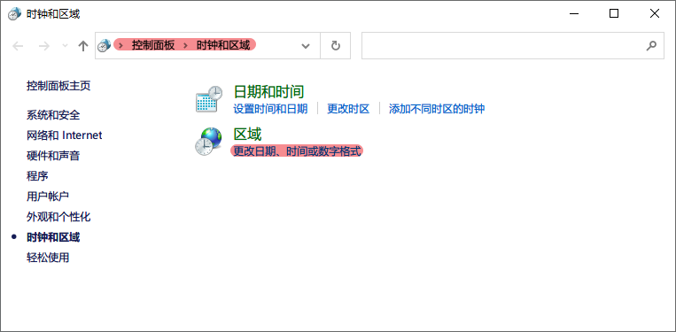
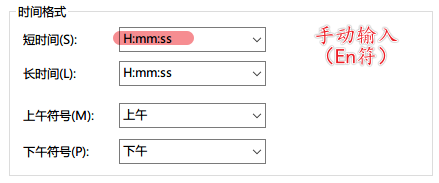
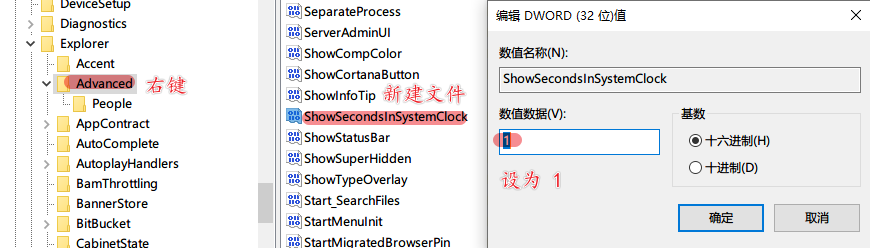

  

<!--more-->

## WIKI

### VSCode 折叠策略

VSCode 默认的折叠策略（Wrapping Strategy）为 `simple` ，如下：

  

偶尔更换了下 Editor 的字体，以同一编辑器字体和网页字体，出现了自动换行不能正确截断的问题。如图所示，总有一部分会显示不完全。

  

经过测试，只需要把折叠策略，修改为 `advanced` 即可。

*=不得不说，VSCode 是真的好用哦，处理文本真的很方便。* 

### DNS 设置

| 公司                 | DNS            | 备注      |
|:-------------------|:---------------|-----------|
| 安印                 | 192.168.51.168 |           |
| 中国互联网络信息中心 | 1.2.4.8        | 210.2.4.8 |
| 百度                 | 180.76.76.76   |           |
| 阿里                 | 223.5.5.5      | 223.6.6.6 |
| 腾讯                 | 119.29.29.29   |           |

### Win10 设置右下角显示秒钟

打开‘控制面板’，在地址栏输入 `控制面板、时钟和区域` ，如下：

  

*-其他设置* 后 *-时间* 选项卡，如下：

  

打开‘运行’（`Win-R`），输入 `regedit` ，打开‘注册表编辑器’后，在地址栏输入 `计算机、HKEY_CURRENT_USER\SOFTWARE\Microsoft\Windows\CurrentVersion\Explorer\Advanced` 后，右键 `Advanced` ，新建一个‘DWORD(32 位）’值，命名为 `ShowSecondsInSystemClock` ，并赋值为 `1` ，然后重启或注销电脑即可。

  

### 关于 Iframe 

好吧，老掉牙的技术了，当前许多浏览器已经限制了该功能，了解可能参考：
- https://www.cnblogs.com/bester-ace/articles/9292779.html
- https://www.cnblogs.com/hq233/p/9849939.html

### 奶头乐理论 [1]

> 刺激他们的欲望，降低他们的工资，借钱给他们花，让他们忙的停不下来，同时开放大量的娱乐项目，使他们又不至于崩溃。
>   
> 当娱乐大量占用人们的时间，让人们丧失思考的能力，这一社会麻醉剂将会带来“马太效应”，沉迷的人继续沉迷，清醒的人保持清醒，人与人的差距，甚至阶层间的差距也就拉大了。  
> 
> 从而消磨他们的斗志，抹平阶级跃迁的愿望。

### v30 pro

您可以在华为官网查询您设备的相关备件价格。点击后方的链接选择您设备型号和颜色即可，点击链接 https://consumer.huawei.com/cn/support/sparepart-price/

亲亲，为您提供一个便捷的查询服务店方法，点击下方官网链接您可直接查询服务店具体信息，您可根据自己的实际情况选择距离您比较近的服务店前往哦~查询链接（建议收藏哦~）： https://consumer.huawei.com/cn/support/service-center/ 


```__华为授权服务中心
华为授权服务中心（濮阳县红旗路）
4.96 分 5.6km

屏幕外层玻璃维修

电脑维修

服务日
河南省-濮阳市-濮阳县红旗路与建新路交叉口向东 100 米路南
0393-3339678
营业时间：9:00-18:00（周一周三至周日）
特别提醒： 门店每周二休息，营业时间为每周一、周三-周日 09:00-18:00，此期间可通过华为服务 APP 选择就近授权服务门店或官方寄修服务，如需帮助请拨打电话 16639328222；针对屏幕外层玻璃维修，本店支持直面手机屏幕外层玻璃维修；针对笔记本业务本店仅提供检测、软件问题处理服务，暂不提供硬件维修服务，给您带来不便敬请谅解
```

### Git 解决每次拉取、提交代码时都需要输入用户名和密码

在家目录运行 `git config --global credential.helper store` ，然后在拉取时输入正确的用户名和密码，就可以成功记录下来。

### 解决 git bash 不能登录 mysql[4]

在使用 git bash 登录 mysql 时会卡死，怎么办呢？加上 winpty 就好了，如下：

```
winpty mysql -u root -p
```

### 厚墨书源

下面每一条链接都是一个书源，一个一个复制到厚墨里用网络导入，粘贴版是导入单个书源的，无法导入链接

```
- https://cdn.jsdelivr.net/gh/chuner821/deepink/repository.json
- https://cdn.jsdelivr.net/gh/Wenmoux/sources@latest/Wen.json
- https://cdn.jsdelivr.net/gh/jiyiv5/xhm_sy/repository.json
- https://cdn.jsdelivr.net/gh/Jackiu1997/JackiuDeepInkSource/repository.json
- https://cdn.jsdelivr.net/gh/XD-MaxSouls/deepink/repository.json
- https://cdn.jsdelivr.net/gh/Mellovo/novel-bookSource@vv2/repository.json
- https://cdn.jsdelivr.net/gh/kaitl/BookSource/repository.json
- https://cdn.jsdelivr.net/gh/17303772831/BookSourceRepository/repository.json
- https://cdn.jsdelivr.net/gh/qingy1/deeplink-booksource/qingy1.json
- https://cdn.jsdelivr.net/gh/258a/Akoasm/repository.json
- https://gitee.com/diskrubbish/diskrubbish_deepink_sources/raw/master/repository.json
```

### element-ui 单元格点击事件，行点击+单元格点击，获取某一行的 index

```html
<el-table :data="tableData" stripe  @cell-click="addSubAccount" :row-class-name="tableRowClassName">
     <el-table-column prop="installer" label="主子账号">
     </el-table-column>
 </el-table>
```

相应逻辑：

```js
//下面是利用给表格添加 className, 添加 index
tableRowClassName ({row, rowIndex}) {
	//把每一行的索引放进 row
	// console.log(row,rowIndex)
	row.index = rowIndex;  //拿到的索引赋值给 row 的 index, 在这个表格中能拿到 row 的里面都会包含 index
	return 'row-remarks'  //className（类名）
},
addSubAccount(row){ //获取焦点弹出关联多个子账号
	console.log(row.index)
},
//如果需要区分那一数列的才能触发需要判断下 prop 的值
addSubAccount(row,column){ //获取焦点弹出关联多个子账号
	console.log(row.index)  //获取下标
	console.log(column.property ) //获取判断条件
	if(column.property == 'prop 的值'){  //prop 的值是自己设置的，注意别重复设置同一个值

	}
},
//如果表格既有行点击，又有单元格点击，在行点击事件里判断 prop, 等不等于你行点击的 prop, 如果等于直接 return false  跳出
```

### Vue 文件的命名规范

→ 详见 https://juejin.cn/post/6844903840626507784#heading-9

#+BEGIN_QUOTE
其实刚开始我写 vue 文件的时候也不注意，各种驼峰啊、大写开头 (PascalCase) 还是横线连接 (kebab-case) 混着来，谁叫 vue 都可以，在 风格指南 中也没有定论。不过基于本项目我还是整理了一套文件的命名规则。
#+END_QUOTE

*1.Components*

所有的 Component 文件都是以大写开关（Pascalcase），这也是官方所推荐的，但除了 `index.vue` ，如：

- `@/src/components/BackToTop/index.vue`
- `@/src/components/Charts/Line.vue`
- `@/src/views/example/components/Button.vue`

*2.JS 文件*

所有的 `.js` 文件都遵循横线连接 (kebab-case)，如：

- `@/src/utils/open-window.js`
- `@/src/views/svg-icons/require-icons.js`
- `@/src/components/MarkdownEditor/default-options.js`

*3.Views*

在 views 文件下，代表路由的 `.vue` 文件都使用横线连接 (kebab-case)，代表路由的文件夹也是使用同样的规则，如：

- `@/src/views/svg-icons/index.vue`
- `@/src/views/svg-icons/require-icons.js`

使用横线连接 (kebab-case) 来命名 views 主要是出于以下几个考虑。

- 横线连接 (kebab-case) 也是官方推荐的命名规范之一；
- views 下的。vue 文件代表的是一个路由，所以它需要和 component 进行区分 (component 都是大写开头）；
- 页面的 url 也都是横线连接的，比如 `https://www.xxx.admin/export-excel` ，所以路由对应的 view 应该要保持统一 ；
- 没有大小写敏感问题。

### 设置 git-bash 为 Emacs 默认 shell

→ https://blog.csdn.net/csfreebird/article/details/9719221

```elisp
(setq explicit-shell-file-name
	"C:/Program Files/Git/bin/bash.exe")
(setq shell-file-name explicit-shell-file-name)
(add-to-list 'exec-path "C:/Program Files/Git/bin")
```
### IDE Active

→ [Jetbrains 系列产品重置试用方法](https://zhile.io/2020/11/18/jetbrains-eval-reset-da33a93d.html)

https://plugins.zhile.io

https://gitee.com/loveminimal/ide.git

### Ubuntu 下清空 DNS 缓存

为什么要清空 DNS 缓存呢？

大多数的 DNS 客户端会把域名解析的结果缓存到本地，这样可以提升对于同一个地址的访问速度。当您打开一个单页面的时候，通常会有多次对同一个域名的访问请求。基本上每个文件、图片、样式表……这些都是在同一个页面内部的对同一个域名的 DNS 解析请求。

所以如果您已经在本地缓存了不正确的 DNS 条目，那么您需要清空您的缓存来使 DNS 客户端提出新的 DNS 请求并更新解析结果。当然，您也可以等缓存的 DNS 条目过期以后让系统自动冲掉该条目……这通常需要 24 个小时。

在 Ubuntu 中冲掉 DNS 缓存的方式是重新启动 nscd 守护程序

```sh
# 安装 nscd （如果没有）
sudo aptitude install nscd

# 清除 DNS
sudo /etc/init.d/nscd restart
```

### GitHub 图片不加载问题

修改 `C:\Windows\System32\drivers\etc\hosts` 文件，尾部添加如下内容：

```
# GitHub Start
192.30.253.112    Build software better, together
192.30.253.119    gist.github.com
151.101.184.133    assets-cdn.github.com
151.101.184.133    raw.githubusercontent.com
151.101.184.133    gist.githubusercontent.com
151.101.184.133    cloud.githubusercontent.com
151.101.184.133    camo.githubusercontent.com
151.101.184.133	   avatars.githubusercontent.com
# GitHub End
```

### vue/cli 3 切换为 dart-sass

首先，安装包 ：
```sh
npm i sass sass-loader -D
# or
yarn add sass sass-loader -DE
```

然后，修改 `vue.config.js` ，增加如下配置：

```js
module.exports = {
css: {
	loaderOptions: {
	sass: {
		implementation: require('sass'), // This line must in sass option
	},
}
//...
};
```

### glob

glob 最早是出现在 Unix 系统的命令中，是用来匹配文件路径的。除了在命令行中，我们在程序中也会有匹配文件路径的需求。于是，很多编程语言有了对 glob 的实现，如 Python 中的 `glob` 模块，php 中的 `glob` 方法。

下面是 node-glob 的匹配规则：
| glob                               | Desc                         |
|------------------------------------|------------------------------|
| `*`                                | 匹配任意 0 或多个字符        |
| `?`                                | 匹配任意一个字符             |
| ---------------------------------- | ---------------------------- |
| `[...]`                            | 匹配中括号中的字符           |
| `![...]`                           | 匹配不在中括号中的字符       |
| `^[...]`                           | 匹配不在中括号中的字符       |
| ---------------------------------- | ---------------------------- |
| `!(pattern I pattern I pattern)`   | 不满足括号的所有模式         |
| `?(pattern I pattern I pattern)`   | 满足 0 或 1 个括号中的模式   |
| `+(pattern I pattern I pattern)`   | 满足 1 或多个括号中的模式    |
| `@(pattern I pat* I pat?ern)`      | 满足 1 个括号中的模式        |
| ---------------------------------- | ---------------------------- |
| `**`                               | 跨路径匹配任意字符           |

来看几个最简单常用的例子吧。

它将匹配类似 `scripts/index.js、scripts/nested/index.js` 和 `scripts/nested/twice/index.js` 的文件。

```
'scripts/**/*.js'
```

取反。

```
'script/**/*.js', '!scripts/vendor/', 'scripts/vendor/react.js'

'**/*.js', '!node_modules/'
```

### 设计模式准则

我以前给一些公司讲一些设计模式的培训课，我一再提到，那 23 个经典的设计模式和 OO 半毛钱关系没有，只不过人家用 OO 来实现罢了。

设计模式就三个准则：
- 中意于组合而不是继承，
- 依赖于接口而不是实现，
- 高内聚，低耦合。

你看，这完全就是 Unix 的设计准则。

### 文件的描述符和重定向

_文件描述符_ 是和文件的输入、输出相关联的非负整数，Linux 内核（kernel）利用文件描述符来访问文件。打开现存文件或新建文件时，内核会返回一个文件描述符。读写文件也需要使用文件描述符来指定待读写的文件。

系统预留文件描述符：
- 0 - =stdin= 标准输入；
- 1 - =stdout= 标准输出；
- 2 - =stderr= 标准错误。

实例：
```sh
# 输出重定向
# 1. 截取模式保存到文件 - 写入到文件之前，文件内容首先会被清空
echo "this is a text line one" > test.txt
# 2. 追加模式保存到文件 - 写入到文件之后，会追加到文件结尾
echo "this is a text line one" >> test.txt

# 标准错误输出的重定向方法
cat linuxde.net                 # → cat: linuxde.net: No such file or directory
# 1. 没有任何错误提示，正常运行
cat linuxde.net 2> out.txt
# 2. 错误信息被保存到了 out.txt 文件中
cat linuxde.net &> out.txt
# 3. 将错误输出丢弃到 /dev/null 中，特殊的设备文件 - 黑洞
cat linuxde.net 2> /dev/null

# 输入重定向
echo < test.txt
```

### 数据归档和解压缩

首先要弄清两个概念：打包和压缩。 _打包_ 是指将一大堆文件或目录变成一个总的文件； _压缩_ 则是将一个大的文件通过一些压缩算法变成一个小文件。

_1. tar 命令_

利用 tar 命令，可以把一大堆的文件和目录全部打包成一个文件，这对于备份文件或将几个文件组合成为一个文件以便于网络传输是非常有用的。

```
# 语法
tar （选项） （参数）
```

实例：

```sh
# 打包、压缩
tar -cvf log.tar log2012.log      # 仅打包，不压缩！
tar -zcvf log.tar.gz log2012.log  # 打包后，以 gzip 压缩
tar -jcvf log.tar.bz2 log2012.log # 打包后，以 bzip2 压缩

# 查询
tar -tvf log.tar                # 直接查询
tar -ztvf log.tar.gz            # 查询以 gzip 压缩的文件
tar -jtvf log.tar.bz2           # 查询以 bzip2 压缩的文件

# 解压缩
tar -zxvf log.tar.gz            # 以 gzip 解压缩
tar -jxvf log.tar.bz2           # 以 bzip2 解压缩

tar -zxvf log.tar.gz -C log     # 以 gzip 解压缩在目录 log
```

其中：

| 选项                        | 说明                       |
|-----------------------------|----------------------------|
| `-v`                        | 显示操作过程               |
| `-f <FILE> --file=<FIEL>`   | 指定备份文件               |
| --------------------------- | -------------------------- |
| `-c --create`               | 建立新的备份文件           |
| `-t --list`                 | 列出备份文件的内容         |
| `-x --extract --get`        | 从备份文件中还原文件       |
| --------------------------- | -------------------------- |
| `-z --gzip --ungzip`        | 通过 gzip 指令处理备份文件 |
| `-j`                        | 支持 bzip2 解压文件        |
| `-C <DIR>`                  | 在特定目录解压缩           |

小结：

```
压　缩：tar -jcv -f filename.tar.bz2 要被压缩的文件或目录名称
查　询：tar -jtv -f filename.tar.bz2
解压缩：tar -jxv -f filename.tar.bz2 -C 欲解压缩的目录
```

### 关于 CSS 中设置 height 为 100% 不起作用

*W3C 的规范，百分比的高度在设定时需要根据这个元素的父元素的高度。*

Web 浏览器有计算有效宽度时会考虑浏览器窗口的打开宽度，缼省为页面整个横向宽度。

事实上，浏览器根本就不计算内容的高度，除非内容超出了视窗范围（导致滚动条出现），缺省为 `height: auto` 。或者你给整个页面设置一个绝对高度，否则浏览器就会简单的让内容往下堆砌，页面的高度根本就无需考虑。

> ！！！个人实践，在给 `html、body` 设置 `background` 相关属性的时候情况会很奇特，给其内的元素设置背景的时候就不存在这些奇葩问题。

所以，当我们想要设置竖直高度的百分比，需要对 `html、body` 进行一些初始化设置，如：

```css
html {
	/* 设置根元素高度 */
	height: 100%;
}

body {
	/* 设置 body 高度 */
	height: 100%;
}

/* body 内元素 .container */
.container {
	height: 60%;
	background: #f66;
}
```

其实试一下，你就会发现，如果直接对 `body` 设置 `background` 的背景图片或是背景色，都会占满整个容口。

### JavaScript 对 url 的编码和解码

有时候，你会发现一些 url 链接是编码过的，如这样： `http%3A%2F%2Fw3cschool.cn%2Fmy%20test.asp%3Fname%3Dst%C3%A5le%26car%3Dsaab` 。

JavaScript 中使用 `encodeURIComponent()` 方法可以对 URI 进行编码；使用 `decodeURIComponent()` 方法可以对 URI 进行解码。

W3C 提供了简单的实现，如下：

```js
var uri="http://w3cschool.cn/my test.php?name=ståle&car=saab";
var uri_encode=encodeURIComponent(uri);
document.write(uri_encode);
document.write("<br>");
document.write(decodeURIComponent(uri_encode));
```

↓↓↓

```
http%3A%2F%2Fw3cschool.cc%2Fmy%20test.php%3Fname%3Dst%C3%A5le%26car%3Dsaab
http://w3cschools.com/my test.asp?name=ståle&car=saab
```

### Emacs 宏操作

 https://www.jianshu.com/p/6ad946eb8ebc

| Key/Command               | Description                  |
|---------------------------|------------------------------|
| `C-x (`                   | 开启宏记录                   |
| `C-x )`                   | 关闭宏记录                   |
| `C-x e`                   | 执行刚录制的宏               |
| `C-u n C-x e`             | 执行 n 次刚录制的宏          |
| `M-x name-last-kbd-marco` | 给刚记录的宏命名             |
| `M-x insert-kbd-marco`    | 把刚命名的宏记录写入到文件中 |

可以设置一个专门的文件（如 `~/.emacs.d/macro.el` ）来记录宏，然后在 `init.el` 中加载改文件（ `(load-file "~/.emacs.d/macro.el")` ）， 如此便可以实现持久化。

如这个例子：用宏定义了下翻 15 行和上翻 15 行的快捷键。

```elisp
;; macro.el
(fset 'next-lines
	"\C-u15\C-n")
(fset 'previous-lines
	"\C-u15\C-p")
```

```elisp
;; init.el

;; ...
;; 加载 macro.el
(load-file "~/.emacs.d/macro.el")
;; 绑定快捷键
(global-set-key (kbd "C-x n RET") 'next-lines)
(global-set-key (kbd "C-x p RET") 'previous-lines)
```

### 如何设置终端 256 色

 https://stackoverflow.com/questions/63950/how-to-make-emacs-terminal-colors-the-same-as-emacs-gui-colors?r=SearchResults

设置 `TERM` 在 `.bashrc` 文件中，如下：

```sh
export TERM=xterm-256color
```

如此，便设置好了。

加入我们使用在终端中使用 Emacs ，执行 `M-x list-colors-display` ，便可以看到 256 色已经全部激活，如此，终端下使用 Emacs 和 Emacs GUI 的颜色便相差无几了。

### input 中 placeholder、disabled 状态样式修改

问题场景：
- 有时按业务需求更改 `input` 中 `placeholder` 样式和 `disabled` 状态下的样式；
- IOS 和安卓移动端样式兼容性问题，样式不一致。

处理如下：

```css
input::-webkit-input-placeholder {
	color: #ccc;
	-webkit-text-fill-color: #ccc;
	opacity: 1;
	-webkit-opacity: 1;
}

input:disabled {
	background: none;
	color: #333;
	-webkit-text-fill-color: #333;
	opacity: 1;
	-webkit-opacity: 1;
}

input:disabled::-webkit-input-placeholder {
	color: #ccc;
	-webkit-text-fill-color: #ccc;
	opacity: 1;
	-webkit-opacity: 1;
}
```

相关延伸：
- `::-webkit-input-placeholder {}` 使用 webkit 内核的浏览器
- `:moz-placeholder {}` Firefox 版本 4-18
- `::moz-placeholder {}` Firefox 版本 19+
- `-ms-input-placeholder {}` IE 浏览器

### CSS 换行

[[https://www.cnblogs.com/nangezi/p/9230062.html][→ 参考链接]]

文本换行有很多方式：
- `<br/>` 标签元素，能够强制使得所在位置文本换行；
- `<p>` 元素， `<div>` 设定宽度，都可以对文本内容实现自适应换行；
- 对于长单词或链接，默认不会断开换行，方式 2 就不能够在这些文本内部进行换行，此时需要 `word-wrap: break-word;` 或 `word-break: break-all;` 实现强制断行。

_1. 强制不换行_

```css
div {
	white-space: nowrap;
}
/*
white-space:
- normal  默认
- pre     换行和其他空白字符都将受到保护
- nowrap  强制在同一行内显示所有文本，直到文本结束或者遭遇 <br> 对象
,*/
```

_2. 控制文本换行_

```css
div {
	word-break: normal;
	word-break: break-all;
	word-break: keep-all;
}
/*
word-break:
- normal        依据亚洲语言与非亚洲语言的文本规则，允许在字内换行
- break-all     该行为与亚洲语言的 normal 相同，也允许非亚洲语言文本行的任意字内断开，该值适合包含一些非亚洲文本的亚洲文本
- keep-all      与所有非亚洲语言的 normal 相同，对于中文、韩文、日文，不允许字断开，适合包含少量亚洲文本的非亚洲文本
,*/
```

_3. 强制单词内或链接内断行_

```css
div {
	word-wrap: break-word;
}
/*
word-wrap:      属性用来表明是否允许浏览器在长单词和链接内进行断句
- normal        只在允许的断字点换行
- break-word    在长单词或 URL 地址内部进行换行
,*/
```

### JS 获取 DPI

```js
//获取 DPI
function js_getDPI() {
	var arrDPI = new Array();
	if ( window.screen.deviceXDPI != undefined ) {
		arrDPI[0] = window.screen.deviceXDPI;
		arrDPI[1] = window.screen.deviceYDPI;
	}
	else {
		var tmpNode = document.createElement( "DIV" );
		tmpNode.style.cssText = "width:1in;height:1in;position:absolute;left:0px;top:0px;z-index:99;visibility:hidden";
		document.body.appendChild( tmpNode );
		arrDPI[0] = parseInt( tmpNode.offsetWidth );
		arrDPI[1] = parseInt( tmpNode.offsetHeight );
		tmpNode.parentNode.removeChild( tmpNode );
	}
	return arrDPI;
}

// 将 px 转成 mm
let mm = pxValue/dpi*2.54*10;   // dpi 是上面获取的，注意对应 XY 轴
```

### 小程序跳转 H5 时 url 参数截断

[→ 参考链接](https://my.oschina.net/pingheyongfeng/blog/1634522)

先来看一个例子，原来的 url 为 `https://ultimavip.cn/m/mposter.html?source=gxw_001_t_mposter` ，跳转后变为 `https://ultimavip.cn/m/mposter.html` ，参数 `?source=gxw_001_t_mposter` 丢失了，为什么呢？编码问题。

```js
// 跳转到 H5 页面的小程序代码
targetUrl: function() {
	console.log(this.data.mod_textUrl);
	wx.navigateTo({
		url: '../webview/webview?url=' + encodeURIComponent(this.data.mod_textUrl) // 此处需要编码，因为有 '?' ，可能浏览器不认
	})
}

// 跳转到的 H5 页面进行解码
onLoad: function(options) {
	this.setData({
		targetUrl: decodeURIComponent(options.url); // 用 decodeURIComponent 进行解码
	})
	console.log(options.url);
}
```

### 滚动懒加载的实现

[→ 参考链接](https://www.jb51.net/article/159033.htm)

什么时候需要懒加载呢？数据量大，一页显示不完，网页渲染事件长，影响体验。如何解决？分页，或数据懒加载。

> 先设定了基础前提，假设视窗可以显示 30 数据，总共有 56 条数据要展示。

如何实现数据懒加载呢？先来看三个属性：
- scrollHeight ，元素总高度，包含滚动条中的内容，只读；
- scrollTop ，当元素出现滚动条时，向下拖动滚动条时，内容向上滚动的距离，可读写；
- clientHeight ，元素内容及其边框所占的空间大小，即可视区域大小高度。

如何判断滚动条到底部了呢？很显然，当 `scrollHeight - scrollTop - clientHeight = 0` 时，滚动条就到底部了。

来看代码，在第一次请求数据的时候，先设置一个变量来记录请求次数（其实后台也是做分页的处理）：

```js
// 初始化首页页码
let currentPage = 1;            // this.currentPage = 1

// 获取首页数据，apiGetTableData 为定义的获取数据的接口
// data 为请求参数
this.apiGetTableData(data).then(res => {
	$this.totalPage = res.totalPage; // 这里需要知道总页数
	$this.tableData = res.data;      // 表格数据
})
```

监听表格 DOM 对象的滚动事件：

```js
let DOM = document.querySelector(targetDom);

DOM.addEventListener('scroll', function() {
	let scrollDistance = DOM.scrollHeight - DOM.scrollTop - DOM.clientHeight;

	if(scrollDistance <= 0) {                     // 为 0 证明滚动条已经到底，可以请求接口
		if(this.currentPage < this.totalPage) {   // 当前页数小于总页数继续请求
			this.currentPage++;                   // 当前页数自增

			// 请求接口代码
			// data 为请求参数
			this.apiGetTableData(data).then(res => {
				this.tableData = $this.tableData.concat(res.data); // 将请求回来的数据和当前展示的数据合并
			})
		}
	}
})
```

如此，就实现表格滚动下拉时的数据懒加载。

### 刷新 DNS

windows 下 _刷新 DNS_ 的方法：打开 cmd → 输入 `ipconfig /flushdns` 。 Github 有时候，连接很慢，甚至有打不开的状况，此时，可以尝试刷新一下 DNS ，会有意象不到的效果哦。

[1]: https://baike.baidu.com/item/%E5%A5%B6%E5%A4%B4%E4%B9%90%E7%90%86%E8%AE%BA/24573214

[4]: https://blog.csdn.net/logicr/article/details/98169946

[2]: https://www.cnblogs.com/Shd-Study/p/6560808.html
